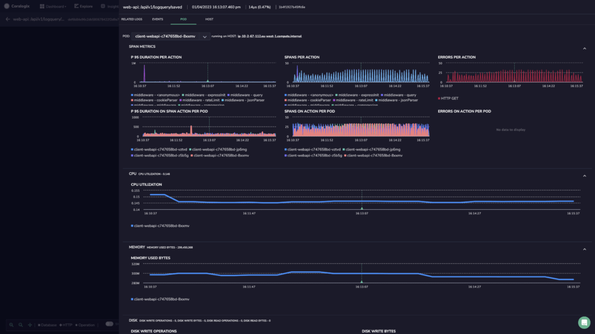

# Overview

Coralogix offers application performance monitoring (APM) for modern, cloud-native environments. Our new features decorate all pillars of observability with additional information that extends beyond system availability, service performance, and response times.

With this expanded visibility into service performance, you can effectively monitor latency and rapidly find the component responsible for issues like performance degradation or an increase in errors. APM allows you to contextualize and pinpoint the root cause of a problem and respond immediately before the user is affected.

## Concepts

Spans and traces form the basis of application performance monitoring in Coralogix APM.

Using this telemetry data, Coralogix allows you to observe application resource consumption and infrastructure resource consumption using two new observability layers.

| POD          | application resource consumption | Key factors that impact response times and throughput of applications |
|--------------|---------------------------------|-----------------------------------------------------------------------|
| HOST         | infrastructure resource consumption | Usage of IT resources, systems, and processes                       |

## Features

Pod & Host

Our APM provides you with all logs relevant to a particular span context, granting a full picture of the services that power your applications.

Use our newest layers of observability – POD and HOST – to:

- Instantly view all of your pod and host metrics, including resource consumption and associated network information
- Compare metrics within a specific pod and across pods from a specific service
- Compare all of the pods associated with a specific service
- Correlate between Kubernetes spans, logs, and metrics for a specific pod and/or host
- Troubleshoot log span errors
- Annotate deployment tags based on span context

