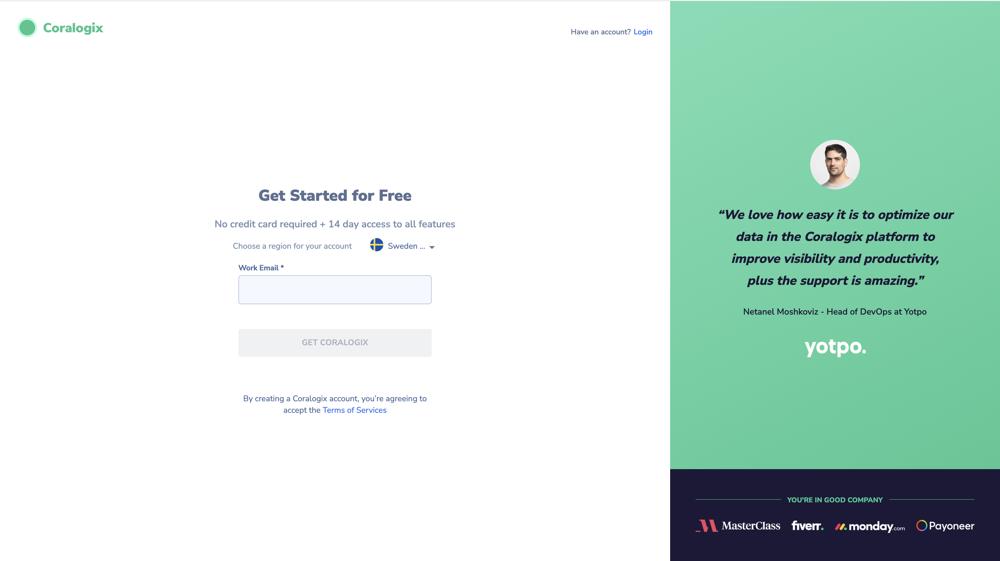
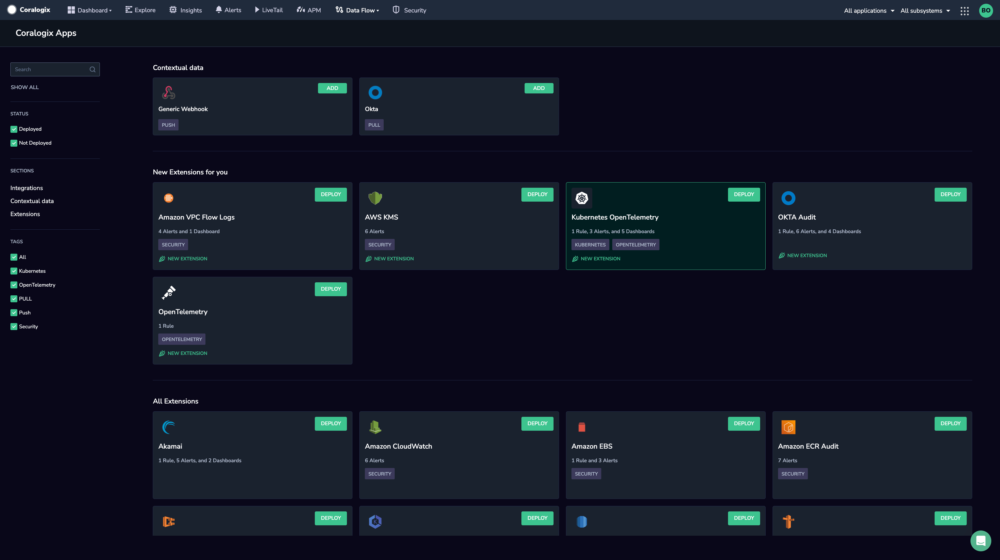
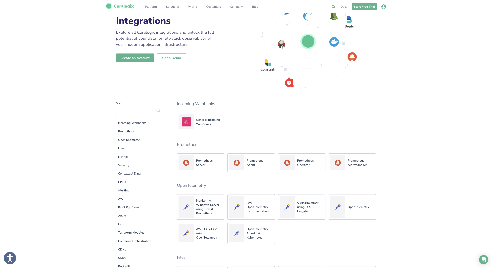

# Getting Started with Coralogix

Coralogix is a cloud-based, SaaS analytics and monitoring platform that combines  [logs, metrics, and traces](https://coralogix.com/blog/understand-three-pillars-observability/)  to gain full observability into your system using one tool. The platform ingests data from any digital source and transforms it using our  [core features](https://coralogix.com/docs/coralogix-features-tour/), allowing you to fully understand your system, analyze that data efficiently, and respond to incidents before they become problems.

To get started with Coralogix, sign up for a free account and import your system’s telemetry. Once logs, metrics, and traces are ingested by our platform, you can use our core features to obtain full observability in your Coralogix dashboard.

## Sign Up for a Free Account

Coralogix offers free account setup. If you don’t already have an account, you can sign up [here](https://dashboard.eu2.coralogix.com/#/signup). You will be prompted to create a new team.

If your organization already has an account, you may have different signup options depending on the permissions set by your organization administrator.

## Send Data to Coralogix

Coralogix supports logs, metrics, and traces from many different sources using any of the following  [integrations](https://coralogix.com/integrations/). All integrations require:

-   Your Coralogix  [Send-Your-Data API key](https://coralogix.com/docs/send-your-data-api-key/)
-   An  [endpoint](https://coralogix.com/docs/coralogix-endpoints/)  associated with your Coralogix account  [domain](https://coralogix.com/docs/coralogix-domain/)
-   [Application and subsystem names](https://coralogix.com/docs/application-and-subsystem-names/)  to organize the data in your Coralogix account

### Integration Packages

The  **easiest method**  for sending us your data is using our two-step, out-of-the box  [integration packages](https://coralogix.com/docs/integration-packages/).

### Integrations (Interactive)

For those integrations which are yet to be packaged, select a shipper for which to send us your data from our full list of  [integrations](https://coralogix.com/integrations/).

-   **Cloud-Based Integrations**. We offer a wide range of cloud-based shippers, including AWS, Azure, and GCP integrations.
-   **Telemetry Shippers**. Choose from our many shippers, including integrations using  [OpenTelemetry](https://coralogix.com/docs/opentelemetry/),  [Prometheus](https://coralogix.com/docs/prometheus-server/),  [Fluentd](https://coralogix.com/docs/fluentd/)  and  [Fluent Bit](https://coralogix.com/docs/fluent-bit/).
-   **Push & Pull Integrations**. Choose from our list of push and pull integrations, including  [Cloudflare](https://coralogix.com/docs/cloudflare-coralogix/),  [Nagios](https://coralogix.com/docs/nagios-coralogix/), and  [Okta](https://coralogix.com/docs/okta-contextual-logs/).
-   **Use-Cases.**  Select a use-case integration on the basis of the particular logs, metrics, or traces you’d like to send us.

## Coralogix APIs

Optimize Coralogix’s observability monitoring and unlock its most powerful features by using our wide range of  [APIs](https://coralogix.com/docs/coralogix-apis/). Use them to send data to Coralogix, build visualizations, manage your data, and query it.

-   **Data Ingestion APIs.**  Data is ingested seamlessly and reliably into the Coralogix platform using a wide range of APIs.
-   **Data Management APIs.**  Configure the Coralogix platform, customize your user interface, and optimize it for your observability requirements.
-   **Data Query APIs**. Use these APIs to access and query your data.

Our APIs can be configured using our Helm charts, Terraform modules, or the  [Coralogix Operator](https://coralogix.com/docs/coralogix-operator/).

## Get Familiar with Coralogix Features

Once you have started sending us your data, Coralogix offers a rich bank of  [extensions](http://www.coralogix.com/docs/extension-packages/)  to enrich your data with a set of predefined items – alerts, parsing rules, dashboards, saved views, actions, and more. Take our  [features tour](https://coralogix.com/docs/coralogix-features-tour/)  to better understand these concepts and kick-start your observability monitoring process.

## Coralogix Academy

Dive into Coralogix and discover the platform’s vast capabilities tailored for both new and experienced users. Our newest  [Coralogix Academy Course](https://coralogix.com/academy/get-to-know-coralogix/)  will introduce you to Coralogix’s main features and functionalities, so that you’re ready to utilize the platform effectively. Through straightforward lesson plans, interactive sessions and practical exercises, you’ll gain a complete understanding of how to turn Coralogix into an asset for all your observability operations.

## Support

**Need help?**

Our world-class customer success team is available 24/7 to answer any questions that may come up. Feel free to reach out to us **via our in-app chat** or by sending us an email at [support@coralogix.com](mailto:support@coralogix.com)
