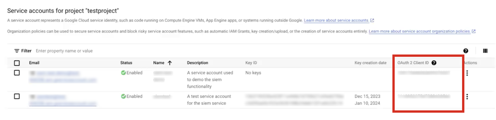
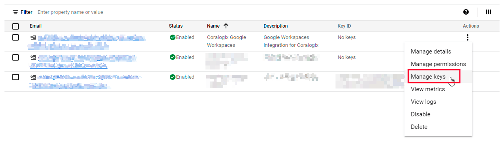

# GCP - Getting Started

## Overview

Coralogix offers a number of basic integrations with Google Cloud Platform.  However, a prerequisite for each is that you first **Configure a Service Account**. Once you have created a Service Account and its corresponding API key, access your integration-specific instructions in the table below:

## Configure a Service Account

This should be done before any GCP integration with Coralogix. Please make sure that you have **Super admin** permissions. Also, you should have an existing project within Google Cloud. Your new service account will be created there.

On the Google Cloud side, basic Service Account configuration is done in two steps: 

Step 1. You first need to create a new Service Account to authenticate with Coralogix. 

Step 2. For this account, you will create an API key. This key will be used for the Coralogix integration. 

### Step 1: Create a Service Account

**1.** Sign in to Google Cloud Console and choose the project where you want to create the service account.

**2.** Go to **IAM & Admin** in the menu and scroll down to **Service Accounts**.

**3.** On the **Service accounts** list, click **+ CREATE SERVICE ACCOUNT**.

**4.** Input your service account details: name, account ID, and description. Click **CREATE AND CONTINUE**.

**5.** Based on the type of integration you are setting up, you may need to assign specific roles to the service account.

- **GCP Logs:** To collect logs, select the `Pub/Sub Subscriber`role.
- **GCP Traces:** To collect traces, select `BigQuery Job User` and `BigQuery Data Viewer` .
- **GCP Metrics:** To collect metrics, select `Compute Viewer`, `Monitoring Viewer`, and `Cloud Asset Viewer.`
- **Google Workspace Users:** You don’t need to assign roles for this service account.
- **Google Alerts Center:** You don’t need to assign roles for this service account.

At the end, click **CONTINUE** and **DONE** in the step below**.** Your service account is now ready for use.

**6.**  Find the new service account on the list. Note down the **OAuth 2 Client ID**. You will need it to finish this tutorial.

### Step 2: Create a Private Key

**1.** Click the three dots in the rightmost **Actions** column and choose **Manage keys**.

**2.** Click **Add Key and** choose the JSON **Key type**. Download it and store locally. You will need to upload it to your Coralogix integration.

## Next Steps

Now that you have created a Service Account and an API key, consult our integration-specific tutorials. For these, you will need to use the Coralogix platform.

## Support

**Need help?** 

Our world-class customer success team is available 24/7 to walk you through your setup and answer any questions that may come up. 

Feel free to reach out to us **via our in-app chat** or by sending us an email to [support@coralogix.com](mailto:support@coralogix.com).