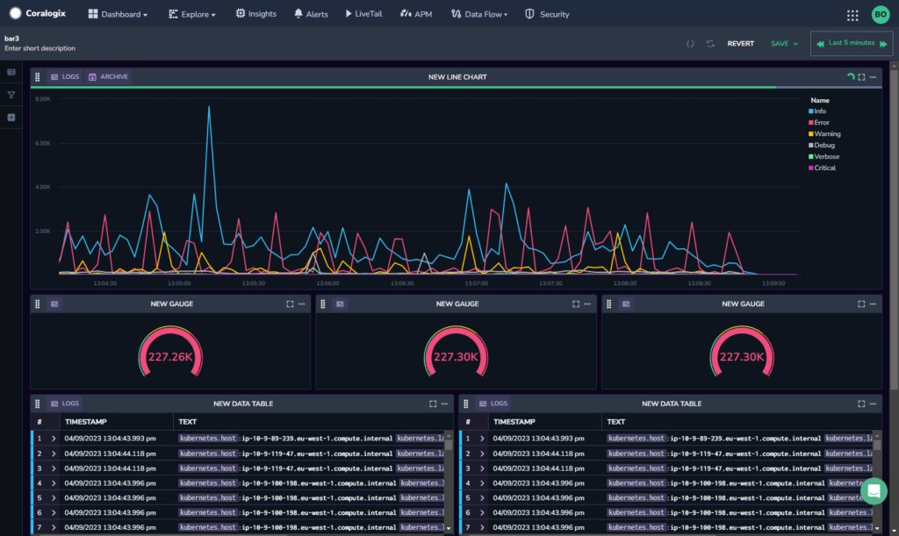
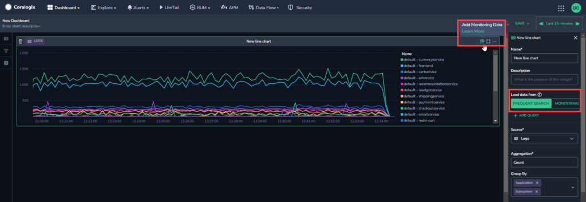
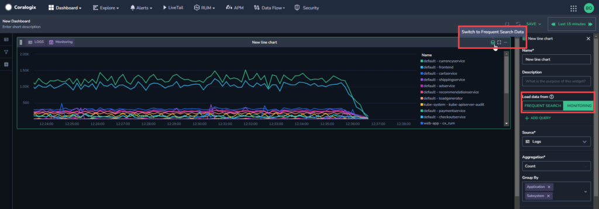

Coralogix supports **adding monitoring data** (formerly known as **archive data**) to your custom dashboard widgets. This enables you to see data from the [Monitoring (medium priority)](https://coralogixstg.wpengine.com/docs/optimize-log-management-costs/#monitoring-data-medium-priority) tier in your custom dashboards in addition to the regular [Frequent Search (high priority)](https://coralogixstg.wpengine.com/docs/optimize-log-management-costs/#frequent-search-data-high-priority) data.

## What is Monitoring Data?

When using Coralogix for log analytics, the platform typically ingests log, metrics, and traces from various sources such as servers, applications, or cloud services.

Using our [Streama© technology](https://coralogixstg.wpengine.com/how-it-works/), this data is processed, analyzed, and visualized within the Coralogix platform. However, not all system capabilities are available for compliance data.

To optimize costs and performance, Coralogix provides an option to [archive log data in Amazon S3](https://coralogixstg.wpengine.com/docs/archive-s3-bucket-forever/). This means that based on specific criteria ([TCO policies](https://coralogixstg.wpengine.com/docs/optimize-log-management-costs/)) or after a set period of time ([retention period](https://coralogixstg.wpengine.com/docs/archive-retention-policy/)), certain logs and spans are available only in the lower-cost, scalable, and durable storage solution. While in the archive, the data is still accessible, but has [limitations](https://coralogixstg.wpengine.com/docs/optimize-log-management-costs/) on real-time processing when compared to actively indexed, high-priority data.

## How Can I Use Monitoring Data in Custom Dashboards?

Including monitoring data in your custom dashboard allows you to have a more comprehensive and detailed view of your data, combining both recent real-time information and additional context. Specific reasons for using monitoring data might vary depending on your organization's requirements, compliance policies, and analytical needs.

Take a look at these use-cases to get a feel for the many ways that monitoring data in Custom Dashboards can serve you.

### Use-Case 1: Multiple Subsystem Locations

A company has a case where some of their subsystems are under a policy that is saved in OpenSearch servers, and some of their subsystems are saved in the archive due to TCO policies. A DevOps engineer wants to create a widget that collates the subsystems from all the different locations.

The DevOps engineer uses an [Archive Query](https://coralogixstg.wpengine.com/docs/archive-query/) to create a visualization that shows the subsystems from all sources, regardless of whether they are saved in the OpenSearch servers or in the archive.

### Use-Case 2: Data Whose Retention Period Has Passed

A DevOps engineer wants to query a specific status from today and compare it to the same time period in the previous month (for example, to compare a 15 minute period on the 1st of the month at 10am to the same 15 minutes on the 1st of the previous month at 10am). The data from the previous month is no longer within the retention period, and therefore is only available in the archive.

The DevOps engineer creates a visualization that shows the period of time this month and compares it to the same period of time last month from the archive data.

## Configuration

**STEP 1.** From your Coralogix toolbar, navigate to **Dashboards** > **Custom Dashboards**.

**STEP 2.** Select the dashboard you want to view with monitoring data or [create a new dashboard](https://coralogixstg.wpengine.com/docs/custom-dashboards/).

**STEP 3**. If you haven’t done so already, set the definitions for each widget ([Data Table](http://www.coralogixstg.wpengine.com/docs/custom-dashboards-data-tables), [Line Chart](http://www.coralogixstg.wpengine.com/docs/custom-dashboards-line-charts), [Gauge](http://www.coralogixstg.wpengine.com/docs/custom-dashboards-gauges), [Pie Chart](http://www.coralogixstg.wpengine.com/docs/custom-dashboards-pie-charts), [Vertical Bar Chart](http://www.coralogixstg.wpengine.com/docs/custom-dashboards-bar-charts), and [Horizontal Bar Chart](https://coralogixstg.wpengine.com/docs/horizontal-bar-charts/)) in the right-hand sidebar.

**Notes**:

- **Source** options supporting monitoring data include **logs** and **spans**.

**STEP 4.** In your custom dashboard, select a widget to which you want to add monitoring data and click the **Add Monitoring Data** icon on the right-hand side of the widget’s title bar. Alternately, select **Monitoring** in the **Load data from** section in the right-hand toolbar.

Once monitoring data is added to a widget, making changes to the query will no longer trigger automatic changes in the widget. Instead, you must manually refresh the data when you want to see more recent data.

**STEP 5.** To manually refresh data, click the **Partial Data** icon. Then click **REFRESH DATA** in the popup that appears.

If you make changes to the dashboard filters, variables, or timeframe, you must manually refresh the data in order to see the filters applied.

**STEP 6.** To return to viewing OpenSearch data only, click the **Switch to Frequent Search Data** icon. Alternately, click **FREQUENT SEARCH** in the right-hand toolbar. This reverts the dashboard to its original state where you are locally querying your Frequent Search data.

## Additional Resources

<table><tbody><tr><td>Documentation</td><td><strong><a href="https://coralogixstg.wpengine.com/docs/custom-dashboards/">Custom Dashboards</a></strong> <strong><a href="http://www.coralogixstg.wpengine.com/docs/custom-dashboards-line-charts">Line Charts</a> <a href="http://www.coralogixstg.wpengine.com/docs/custom-dashboards-data-tables">Data Tables</a> <a href="http://www.coralogixstg.wpengine.com/docs/custom-dashboards-gauges">Gauges</a> <a href="http://www.coralogixstg.wpengine.com/docs/custom-dashboards-pie-charts">Pie Charts</a> <a href="http://www.coralogixstg.wpengine.com/docs/custom-dashboards-bar-charts">Vertical Bar Charts</a></strong> <a href="https://coralogixstg.wpengine.com/docs/horizontal-bar-charts/"><strong>Horizontal Bar Charts</strong></a></td></tr></tbody></table>

## Support

**Need help?**

Our world-class customer success team is available 24/7 to walk you through your setup and answer any questions that may come up.

Feel free to reach out to us **via our in-app chat** or by sending us an email at [support@coralogixstg.wpengine.com](mailto:support@coralogixstg.wpengine.com).
