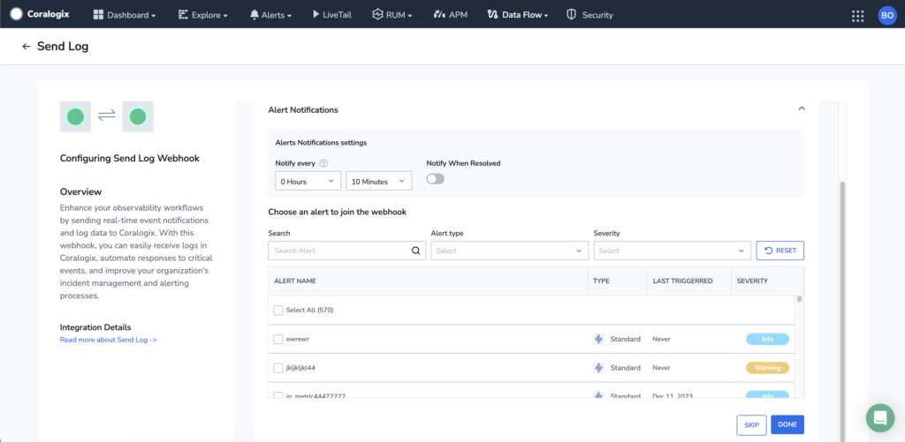
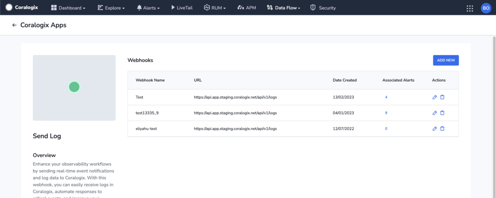
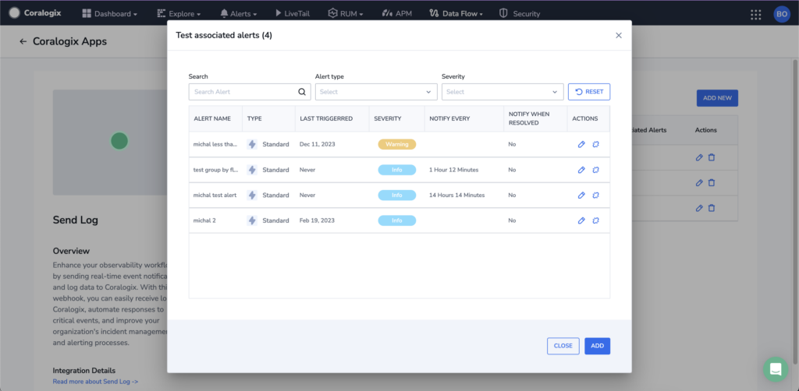

**Outbound Webhooks**, or alert webhooks, offer a streamlined way to receive immediate notifications for critical events in the form of [alerts](https://coralogixstg.wpengine.com/docs/getting-started-with-coralogix-alerts/), facilitating prompt responses to incidents.

This tutorial guides you through configuring your outgoing webhook notification settings and associating each webhook with multiple alerts.

## Configure Alert Notifications

**STEP 1**. Configure the alert notification settings.

- **Notify Every**. Sets the alert cadence. After an alert is triggered and a notification is sent to your outbound webhook, the alert will continue to work. Messages will be suppressed for the duration of the suppression period.

- **Notify When Resolved**. Activate to receive an automatic update once an alert has ceased.

**STEP 2**. Select one or more alerts to integrate into the webhook.

**STEP 3**. Click **DONE** to complete the configuration process.

## View & Edit Alert Notifications

**STEP 1**. Click on each webhook (e.g., **Send Log**) to view the specific webhooks you’ve set up for this notification channel and the number of associated alerts for each.

**STEP 2**. Click on the number of **Associated Alerts** to view details for each alert integrated within a specific webhook.

**STEP 3**. Click on each row to view all the settings for that alert in read-only mode. Edit or detach the alert from the webhook in the **ACTIONS** column.

**STEP 4**. To attach additional alerts to the specific webhook, click **ADD**. You will be rerouted to the **Alert Notifications Settings** page.

**STEP 5**. When the process is complete, click **CLOSE.**

## Support

**Need help?**

Our world-class customer success team is available 24/7 to walk you through your setup and answer any questions that may come up.

Feel free to reach out to us **via our in-app chat** or by sending us an email at [support@coralogixstg.wpengine.com](mailto:support@coralogixstg.wpengine.com).
