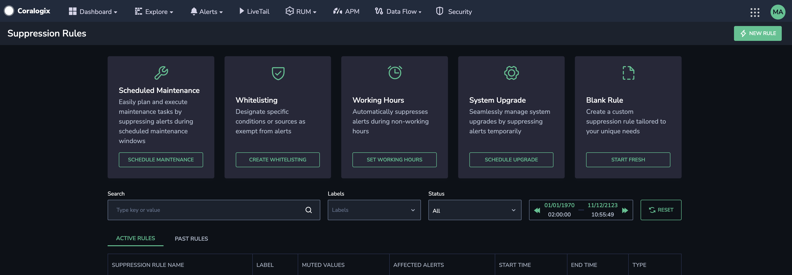
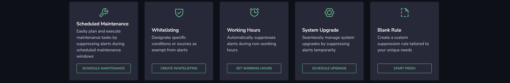
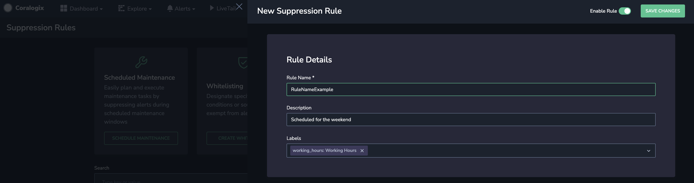
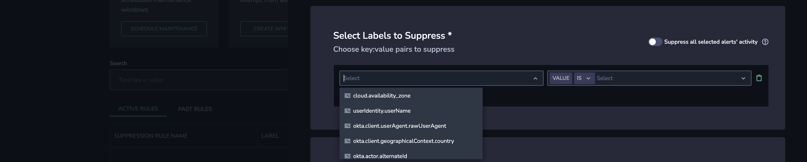
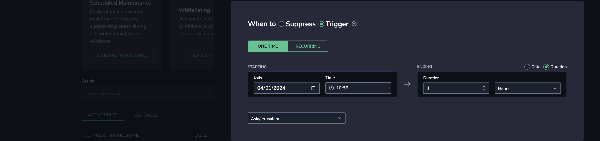
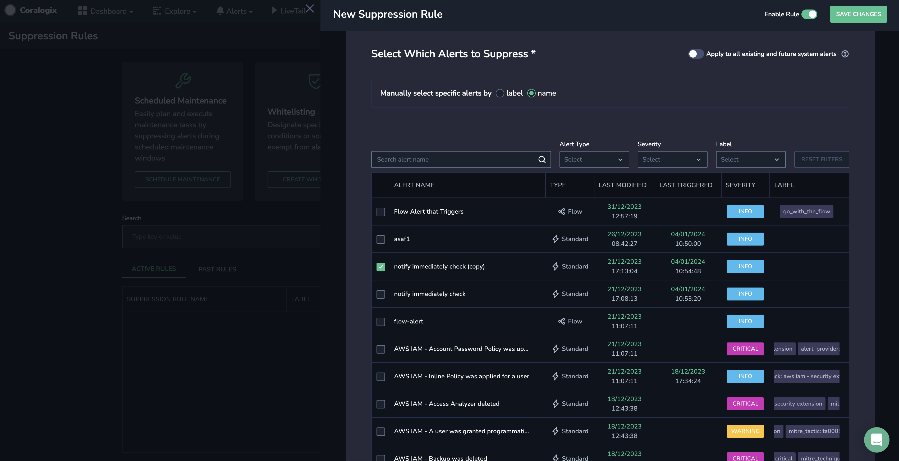
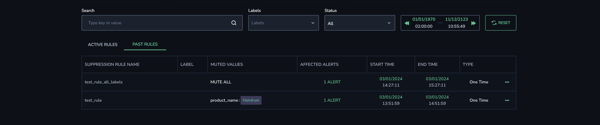
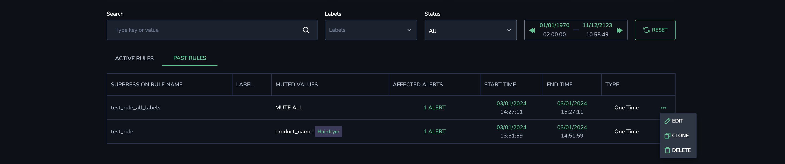

Use **Alert Suppression Rules** to eliminate unnecessary alerts during scheduled maintenance, testing, auto-scaling events, or outside working hours.

## Overview

Coralogix **Alert Suppression Rules** allow you to automatically mute alerts according to your specific parameters. You can set **what** to suppress (what group-by keys), **when** to suppress (specific times and dates, recurring times and dates, one-time suppressions), and **which** alerts to suppress during those times.

Use our preset configurations to set up your suppression rules with minimal fuss:

- **Scheduled Maintenance.** Easily plan and execute maintenance tasks by suppressing alerts during scheduled maintenance windows, preventing unnecessary interruptions.

- **Whitelisting.** Designate specific conditions or sources as exempt from alerts, ensuring critical events are still monitored while minimizing noise from expected or benign activities.

- **Working Hours.** Automatically suppresses alerts during non-working hours, ensuring your team stays focused during downtime and receives notifications only when it matters.

- **System Upgrade.** Seamlessly manages system upgrades by suppressing alerts temporarily, allowing uninterrupted maintenance without unnecessary notifications.

- **Blank Rule.** Create a custom suppression rule tailored to your unique needs, allowing you to fine-tune alert management based on your specific operational requirements.

## Create a Suppression Rule

### Getting Started

**STEP 1.** In the Coralogix toolbar, navigate to **Alerts** > **Suppression Rules**.

**STEP 2.** Click **NEW RULE** in the top right-hand corner.

**STEP 3.** Enter a **name**, **description**, and **label** for the new rule. The label serves as a metadata label attached to your suppression rule. Use it to manage, filter, and organize your suppression rules.

### Select Which Keys to Suppress

**STEP 4**. Select key:value pairs for which the alert should be suppressed or choose to suppress all alert activity during a particular time frame.

- Select one or more group-by keys and enter values for each key that should be suppressed. These values are defined in your alert settings and are aggregated into a histogram. An alert is triggered whenever the condition threshold is met for a specific aggregated value within the specified timeframe.

- Any specified values will be suppressed if you have multiple values for a single key.

- If you choose multiple keys, all of the keys must appear in the alert to trigger the suppression.

- If you select **Suppress all selected alert activity**, the selected alerts will be completely suppressed during the selected timeframe regardless of triggered values, including alerts set to notify immediately and alerts without a group-by key set.

### Select Suppression Timing & Frequency

**STEP 5**. Choose when to suppress or when to trigger alerts.

**STEP 6**. Select between one-time and recurring suppression.

- Select the frequency with which the alert should be suppressed or triggered if you have defined it as recurring. This can be on a daily, weekly, or monthly basis.

- \[**Optional**\] When recurring is selected, set a termination date.

- If **Always** is selected, the rule will always run for recurring rules. Selected alerts will always be suppressed.

**STEP 7**. Select the start/end date and time for the rule or its duration.

### Select Which Alerts to Suppress

**STEP 8.** Choose **which** alerts to suppress.

- Select whether to suppress specific alerts by **Name** or all alerts carrying a certain **Label**. The **Label** option refers to a particular metadata label attached to one or more alters when defining alert settings.

- If you select **Apply to all existing and future system alerts**, all alerts will be suppressed, including alerts created in the future, for as long as the rule applies.

**STEP 9**. Click **SAVE CHANGES**.

## Manage Suppression Rules

### Suppression Rules Overview

The Suppression Rules Overview lets you see when suppressions are scheduled in the upcoming future and when they were scheduled in the past. Filter rules by timeframe, label, status, and free search.

### Edit / Clone / Delete Recent Rules

The **Suppression Rules Management** tabs list the currently active and expired past rules. For each rule, you can see the rule name, its labels, the suppressed values, the alerts that were suppressed during the suppression time, the start and end time, the rule type, and whether or not it is enabled.

To edit, clone, or delete a rule:

**STEP 1.** Click on the three dots at the right-hand side of the rule.

**STEP 2.** Select the action you want to perform:

- **Editing.** Click **EDIT** and make changes to the rule, then click **SAVE CHANGES**.

- **Clone.** Click **CLONE** and make any changes you want to the rule, then click **SAVE CHANGES**.

- **Deleting.** Click **DELETE** and confirm you want to delete the rule.

## Additional Resources

<table><tbody><tr><td>Documentation</td><td><strong><a href="https://coralogixstg.wpengine.com/docs/getting-started-with-coralogix-alerts/">Getting Started with Coralogix Alerts</a></strong></td></tr></tbody></table>

## Support

**Need help?**

Our world-class customer success team is available 24/7 to walk you through your setup and answer any questions that may come up.

Feel free to reach out to us **via our in-app chat** or by sending us an email at [support@coralogixstg.wpengine.com](mailto:support@coralogixstg.wpengine.com).
