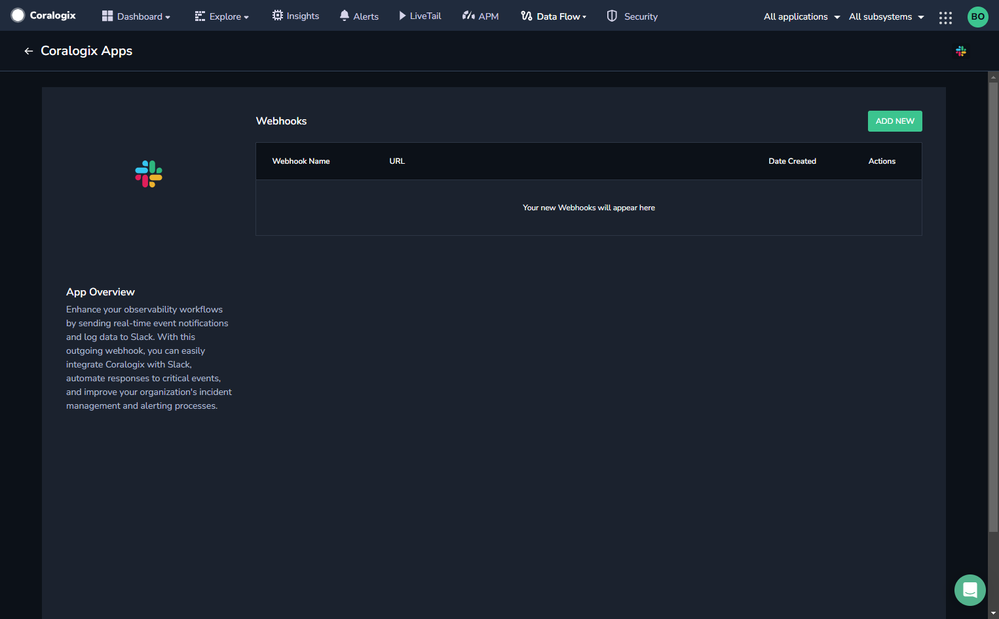
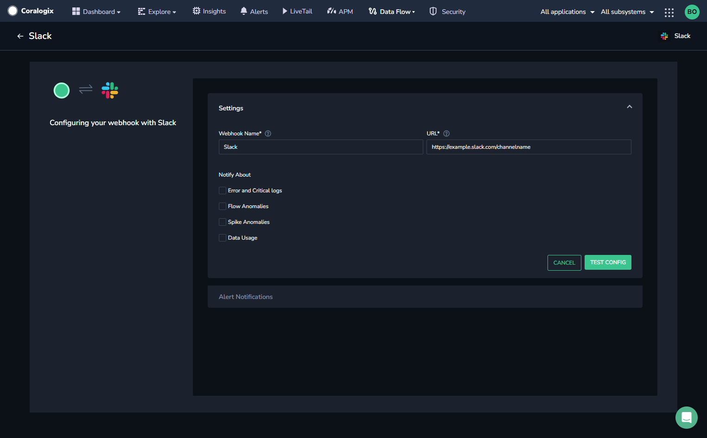
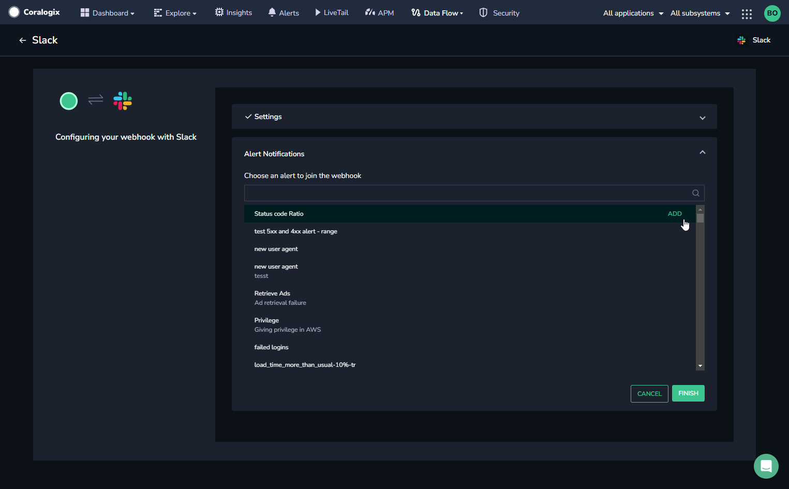

Enhance your observability workflows by sending real-time event notifications and log data to **Slack**. With this outbound webhook, you can easily integrate Coralogix with Slack, automate responses to critical events, and improve your organization's incident management and alerting processes.

## Prerequisites

Access your Slack webhook URL.

**STEP 1.** While logged into Slack, click [here](https://my.slack.com/services/new/incoming-webhook)**.**

**STEP 2.** Choose the room name. Click **Add incoming webhook integration.**

**STEP 3.** Copy the webhook URL.

## Create a Slack Webhook

**STEP 1.** From the Coralogix toolbar, navigate to **DATA FLOW** > **EXTENSIONS.**

**STEP 2.** In the **Outbound Webhooks** section, click **SLACK WEBHOOK**.

**STEP 3.** Click **\+ ADD NEW**.

**STEP 4.** Enter the following details for your webhook:

- **Webhook Name.** A memorable name for your webhook that will enable you to quickly identify this webhook later when attaching it to one of your alerts.

- **URL.** Paste the Slack webhook URL you previously copied (prerequisite step).

**STEP 5.** Select the types of events for which you would like to receive notifications. The **Notify About** section allows you to select any of four general notifications and send them to the Slack channel webhook you are creating.

The four general notification types are:

- Error and critical logs

- Flow anomalies

- Spike anomalies

- Data usage

**STEP 6.** Click **SAVE & TEST**.

The system sends a test message to the channel you specified in the Slack webhook URL and to check that your configuration is valid. If the test message is received successfully, a confirmation message is displayed.

**STEP 7.** Once the configuration is confirmed and the webhook is in place, you can choose the alert or alerts in which this webhook will be used once the alert is triggered.

**STEP 8.** [Configure your alert notifications](https://coralogixstg.wpengine.com/docs/alert-notifications-outbound-webhooks/).

## Additional Resources

<table><tbody><tr><td>Documentation</td><td><strong><a href="https://coralogixstg.wpengine.com/docs/alert-notifications-outbound-webhooks/">Configure Alert Notifications for Outbound Webhooks</a></strong></td></tr></tbody></table>

## Support

**Need help?**

Our world-class customer success team is available 24/7 to walk you through your setup and answer any questions that may come up.

Feel free to reach out to us **via our in-app chat** or by sending us an email at [support@coralogixstg.wpengine.com](mailto:support@coralogixstg.wpengine.com).
