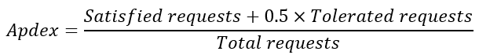
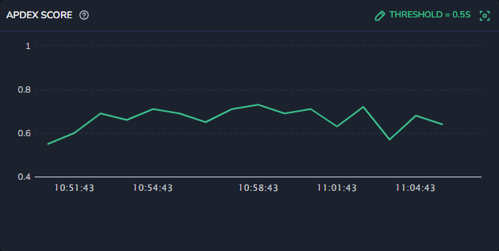
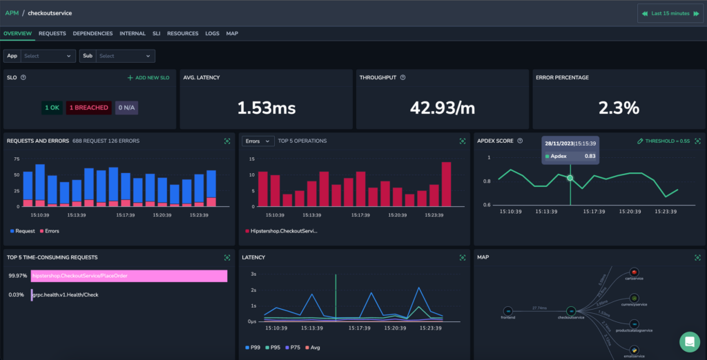
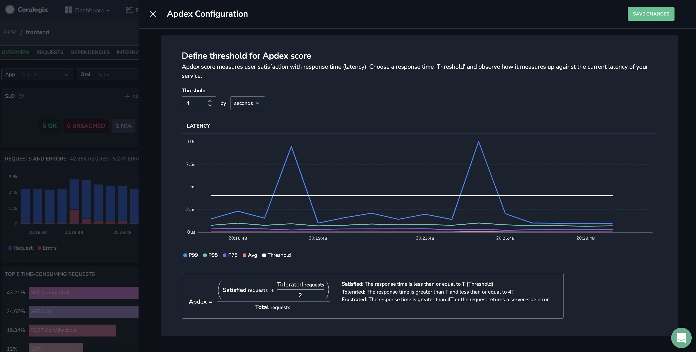

Take advantage of our **Apdex Score** widget to measure and quantify user satisfaction in your Coralogix [Service Catalog](https://coralogixstg.wpengine.com/docs/service-catalog/).

## Overview

**Apdex**, or **Application Performance Index**, is a standardized metric used to measure and quantify user satisfaction with the response time of software applications. It provides a numerical score on a scale of 0 to 1, where a score of 0-0.74 is considered poor, 0.75-0.84 is fair, 0.85-0.94 is good, and 0.95-1 is excellent.

Apdex takes into account the response time threshold, categorizing user interactions as satisfied, tolerated, or frustrating based on a predefined performance threshold. This metric is particularly valuable for organizations and developers in assessing and optimizing application performance, as it offers a concise and standardized way to communicate and benchmark user satisfaction with application responsiveness.

## How It Works

An Apdex score is calculated using a simple formula that involves defining a response time threshold and then categorizing “Satisfied” user requests based on those thresholds. The formula is as follows:

In this formula, request satisfaction is categorized as follows:

- **Satisfied requests:** The response time is less than or equal to T (Threshold).

- **Tolerated requests:** The response time is greater than T and less than or equal to 4T.

- **Frustrated requests:** The response time is greater than 4T or the request returns a server-side error (not shown in the formula).

- **Total requests:** The total number of requests.

In your [Service Catalog](https://coralogixstg.wpengine.com/docs/service-catalog/), configure the response time threshold based on what you consider to be satisfactory for users. The tolerated and frustrated requests are calculated accordingly. For example, if you define response times less than or equal to 2 seconds as satisfactory, this threshold will be used in the Apdex calculation, and a response time of 0-2 seconds will be considered satisfactory, 2-8 seconds (less than or equal to 4T) will be tolerated, and 8 seconds and above will be frustrated. The formula then generates a score between 0 and 1, where a score closer to 1 indicates better user satisfaction with application performance.

In this example, the threshold is 0.5 seconds. This gives the following response times:

- 0 - 0.5 seconds: **Satisfied**

- 0.51 - 2 seconds: **Tolerated**

- 2+ seconds: **Frustrated**

## Configure the Response Time Threshold

**STEP 1.** In your Coralogix toolbar, navigate to **APM** > **Service Catalog.**

**STEP 2.** Select the timeframe for which you want to view information.

**STEP 3.** Select a service to view the service drill-down.

**STEP 4.** Click **Threshold** on the Apdex widget.

**Note:** The default threshold is 0.5 seconds. Unless you change it, that is the data that you will see.

**STEP 5.** Select the threshold and unit for the Apdex score.

The Latency graph shows your selected threshold along with the P99, P95, P75 and Average latencies, enabling you to see how your selected threshold compares with the current latency of your service.

This graph offers a clear context to evaluate the appropriateness of your threshold. For instance, setting a threshold of 5 seconds for services with a p99 latency of 1 second could be overly tolerant, indicating a need for a more stringent threshold.

**STEP 6.** Click **SAVE CHANGES**.

Going forward the Apdex score will calculated by the threshold you’ve defined.

## Additional Resources

<table><tbody><tr><td>Documentation</td><td><strong><a href="https://coralogixstg.wpengine.com/docs/apm/">APM</a></strong> <strong><a href="https://coralogixstg.wpengine.com/docs/service-catalog/">Service Catalog</a></strong></td></tr><tr><td>Blogs</td><td><a href="https://coralogixstg.wpengine.com/guides/real-user-monitoring/apdex-score/" target="_blank" rel="noreferrer noopener"><strong>Apdex Score: Calculation, Pros/Cons &amp; 5 Ways to Improve Yours - Coralogix</strong></a></td></tr></tbody></table>

## Support

**Need help?**

Our world-class customer success team is available 24/7 to walk you through your setup and answer any questions that may come up.

Feel free to reach out to us **via our in-app chat** or by sending us an email at [support@coralogixstg.wpengine.com](mailto:support@coralogixstg.wpengine.com).
