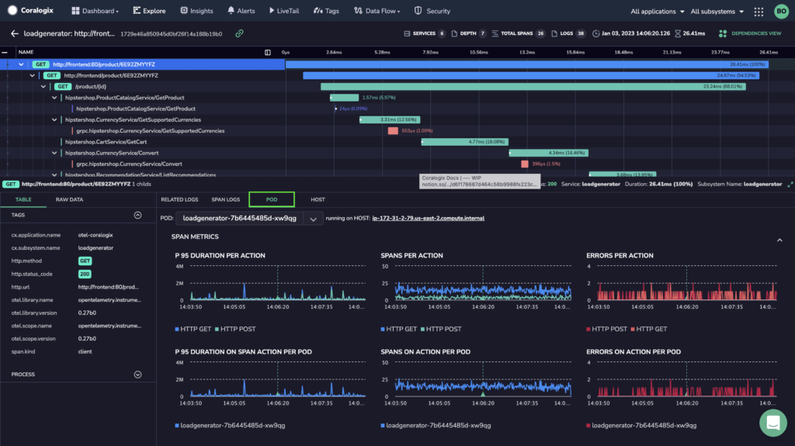
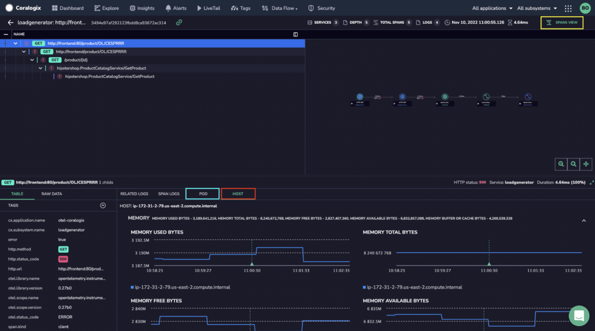
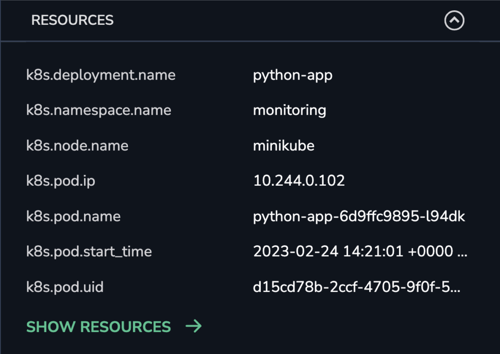
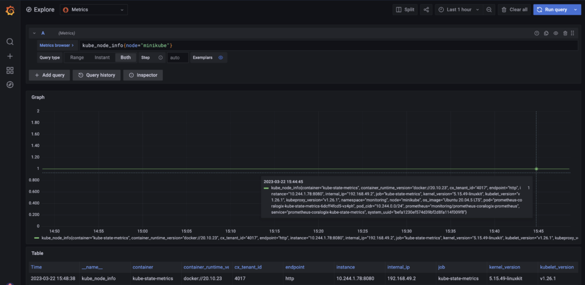
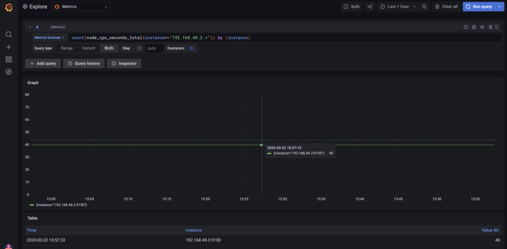
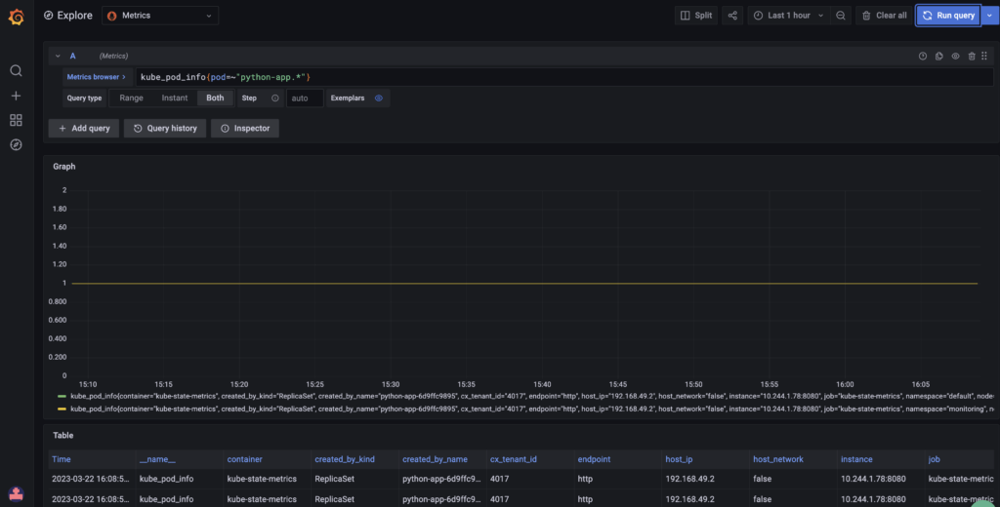
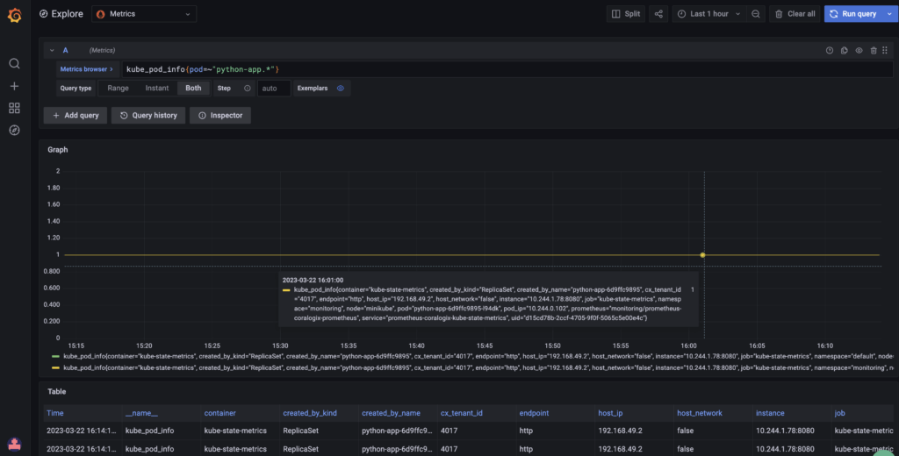
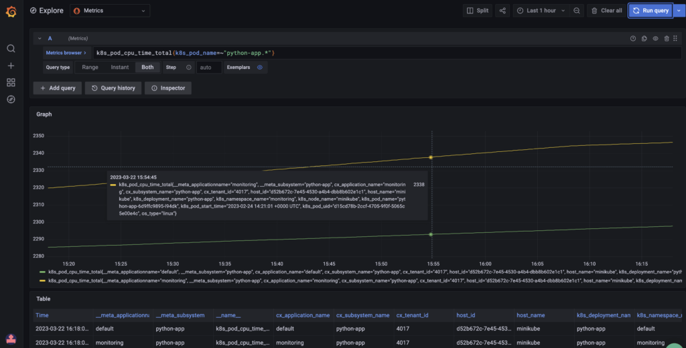

Coralogix now offers features of [application performance monitoring](https://coralogixstg.wpengine.com/docs/apm/) (APM) for modern, cloud-native environments for those customers using OpenTelemetry collector with a Kubernetes processor. Our new features decorate all pillars of [observability](https://coralogixstg.wpengine.com/blog/what-is-observability/) with additional information that extends beyond system availability, service performance, and response times.



## Prerequisites

- [Kubernetes](https://kubernetes.io/) installed with the command-line tool [kubectl](https://kubernetes.io/docs/tasks/tools/#kubectl)

- [Helm](https://helm.sh/) installed and configured

- [Metrics bucket](https://coralogixstg.wpengine.com/docs/archive-s3-bucket-forever/) set up

## Installation & Configuration

[Install and configure OpenTelemetry for Kubernetes](https://coralogixstg.wpengine.com/docs/otel-collector-for-k8s/) to send your telemetry data to Coralogix. We **strongly recommend** configuring Otel to send Coralogix your logs, metrics, **and** traces, so that you can enjoy the highest quality APM and correlate your data.

## APM on Your Coralogix Dashboard

**Access our APM features on your Coralogix dashboard**

**STEP 1**. In your Coralogix dashboard, click on the **Explore** tab > Tracing. Then click on the trace of interest.


**STEP 2**. Click on `POD` and `HOST` features, in addition to `RELATED LOGS` and `SPAN LOGS`. View them in either SPANS VIEW or DEPENDENCIES VIEW.



## Validation

Validate your configuration by taking the following steps. If any of the queries below return empty or invalid results, review the data being sent.

### K8s Resource Attributes and Trace Spans

To match Prometheus or OpenTelemetry metrics with trace spans, it is necessary to ship valid K8s Resource Attributes from OpenTelemetry.

Here is an example of K8s Resource Attributes associated with a span from the Coralogix Tracing UI.



Our APM backend will check for both the **_k8s.pod.name_** and _**k8s.node.name**_ attributes and correlate them with metrics and logs. If these values are not set or are missing, the APM process will not function correctly.

### Host Metrics (Prometheus)

There are specific metrics that are required when correlating data for APM. When using Prometheus, metrics from the [Kube State Metrics (KSM)](https://github.com/kubernetes/kube-state-metrics) and the [Node Exporter](https://github.com/prometheus/node_exporter) are required. Note that both are included when installing the [Coralogix Prometheus Operator](https://github.com/coralogix/telemetry-shippers/tree/master/metrics/prometheus/operator).

#### **Validate the Kube State Metrics (KSM)**

To verify KSM metrics are being received, run a query via the Coralogix Grafana console to validate that KSM metric labels match the **_k8s.node.name_** attribute described in our OpenTelemetry span:

```
kube_node_info{node="<your node name>"}
```



#### **Validate Node Exporter Metrics**

The PromQL query from the previous step will return the **_internal\_ip_** label. Use this value to verify that you are receiving node exporter metrics for the relevant node or host:

```
count(node_cpu_seconds_total{instance=~"<internal_ip>.+"}) by (instance)
```



#### **Validate Pod Metrics**

To verify that pod metrics are being received from KSM, run the following query in Grafana:

```
kube_pod_info{pod=~"<partialpodname>.*"}
```



Use the following queries to confirm that you are receiving pod metrics in the correct format:

```
kube_pod_info{pod=~"<partialpodname>.*"}
```



```
k8s_pod_cpu_time_total{k8s_pod_name=~"<partialpodname>.*"}
```



## **Support**

**Need help?**

Our world-class customer success team is available 24/7 to walk you through your setup and answer any questions that may come up.

Feel free to reach out to us **via our in-app chat** or by sending us an email at [support@coralogixstg.wpengine.com](mailto:support@coralogixstg.wpengine.com).
