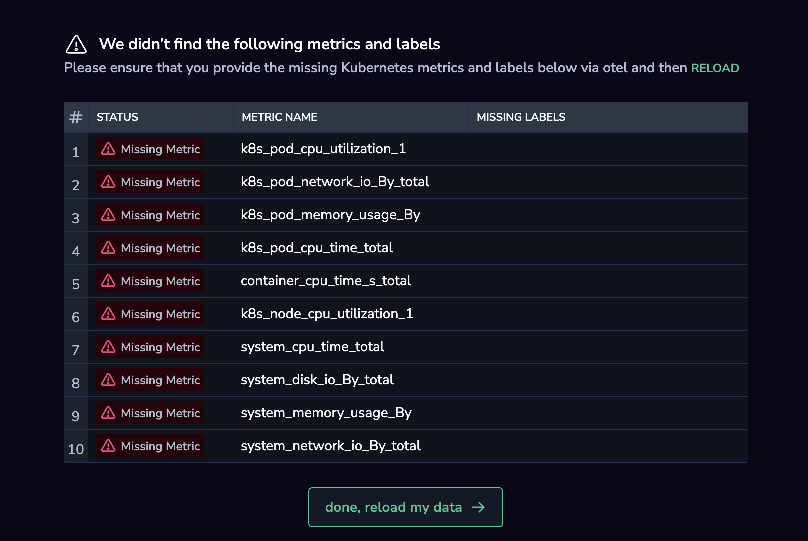

This guide provides step-by-step instructions on configuring and using [Coralogix Application Performance Monitoring (APM)](https://coralogix.com/docs/apm/). Follow these steps to effectively onboard your services, install collectors, correlate resources, and leverage advanced features.

## APM Basic Setup

To set up APM, instrument your service and install the Otel Collector.

### Service Instrumentation

To get started with Coralogix APM, generate spans from your services by instrumenting them. Choose the relevant documentation for your service’s programming language:

- [Node.js](https://coralogix.com/docs/node-js/)

- [Golang](https://coralogix.com/docs/golang-open-telemetry-instrumentation/)

- [PHP](https://coralogix.com/docs/php-opentelemetry-instrumentation/)

- [Java](https://coralogix.com/docs/java-opentelemetry-instrumentation/)

- [Python](https://coralogix.com/docs/capture-opentelemetry-traces-from-your-python-applications/)

### Otel Collector Installation

Install the OpenTelemetry Collector. The Collector is an intermediary component responsible for aggregating and transmitting data, playing a key role in the overall APM workflow. Once installed, the Coralogix [Events2Metrics](https://coralogix.com/docs/events2metrics/) feature automatically converts your spans and logs to metrics to be displayed in your UI. Select from any of the following configuration options:

- [Kubernetes Complete Observability using OpenTelemetry](https://coralogix.com/docs/otel-collector-for-k8s/)

- [Docker](https://coralogix.com/docs/opentelemetry-using-docker/)

- [EC2](https://coralogix.com/docs/install-opentelemetry-ec2/)

- [ECS-Fargate](https://coralogix.com/docs/aws-ecs-fargate/#metrics--traces)

- [ECS-EC2](https://coralogix.com/docs/opentelemetry-using-ecs-ec2/)

**APM should run once your service is instrumented and the Collector is installed**.

## Resource Correlation

Investigate service-resource correlation within your Kubernetes environment in your [APM Resources tab](https://coralogix.com/docs/service-catalog/#resources) or [Kubernetes Dashboard](https://coralogix.com/docs/kubernetes-dashboard/). This correlation relies on span tags and metric labels.

**Span tags** are metadata attached to requests moving through a distributed system, facilitating traceability and correlation. Each microservice adds or propagates span tags, creating a trace that visualizes the request's path, aiding in identifying performance bottlenecks and dependencies.

**Metric labels** are key-value pairs associated with metrics collected from Kubernetes resources. These labels offer additional context to metrics, such as CPU usage or network traffic, making organizing and analyzing data based on service names, pod names, or environments easier.

### Kubernetes OpenTelemetry Extension

Coralogix **recommends** the [Kubernetes Complete Observability](https://coralogix.com/docs/otel-collector-for-k8s/) integration package for comprehensive Kubernetes and application observability. Deploying the Kubernetes OpenTelemetry [extension](https://coralogix.com/docs/extension-packages/) enables telemetry data collection and **full service-resource correlation** in your [APM Resources tab](https://coralogix.com/docs/service-catalog/#resources) or [Kubernetes Dashboard](https://coralogix.com/docs/kubernetes-dashboard/), **without any additional steps**.

### Kubernetes Resource Correlation Without the Otel Extension

If you are not using the [Kubernetes Complete Observability](https://coralogix.com/docs/otel-collector-for-k8s/) integration package, take the following steps:

1. Ensure your span tags include the `K8s.deployment.name` label. In case of using StatefulSets or DaemonSets, replace `K8s.deployment.name` with `K8s.DaemonSets.name` or `K8s.StatefulSets.name`, respectively.

3. In cases where metrics or metric labels are missing, you will be prompted to deploy our [Kubernetes Complete Observability](https://coralogix.com/docs/otel-collector-for-k8s/) integration package or reload the missing labels and tags.

### ECS Resource Correlation

Correlate ECS-EC2 or ECS Fargate performance metrics with your service as follows:

- [ECS-EC2](https://coralogix.com/docs/opentelemetry-using-ecs-ec2/#opentelemetry-configuration)

- [ECS Fargate](https://coralogix.com/docs/aws-ecs-fargate/#metrics--traces)

Service-resource correlation within your Kubernetes environment is presented in your [APM Resources tab](https://coralogix.com/docs/service-catalog/#resources).

### Correlation Using Prometheus

If you are using Prometheus to send us telemetry, ensure that kube state metrics and node exporter metrics are sent by [Prometheus Operator](https://github.com/coralogix/telemetry-shippers/tree/master/metrics/prometheus/operator) to set up metric labels for Kubernetes resource correlation in your Kubernetes Dashboard. You may validate the metrics by following [these instructions](https://coralogix.com/docs/apm-kubernetes/#host-metrics-prometheus).

## Correlate Logs with Services

Investigate the logs produced by your service by enriching your logs with a [subsystem name](https://coralogix.com/docs/application-and-subsystem-names/) matching the service name. Alternatively, set up the correlation by following [these instructions](https://coralogix.com/docs/service-catalog/#logs).

## Add Your SLOs

Set up your service level objectives by following [these instructions](https://coralogix.com/docs/service-catalog/#sli).

## Advanced

### Instrument Serverless Functions

Auto-instrument AWS Lambda by following [these instructions.](https://coralogix.com/docs/otel-lambda-auto-instrumentation/)

### Tail Sampling

Learn about [Tail Sampling with OpenTelemetry using Kubernetes](https://coralogix.com/docs/tail-sampling-with-opentelemetry-using-kubernetes/) and [Docker](https://coralogix.com/docs/tail-sampling-with-opentelemetry-using-docker/).

## Support

**Need help?**

Our world-class customer success team is available 24/7 to walk you through your setup and answer any questions that may come up.

Feel free to reach out to us **via our in-app chat** or by sending us an email at [support@coralogix.com](mailto:support@coralogix.com).
