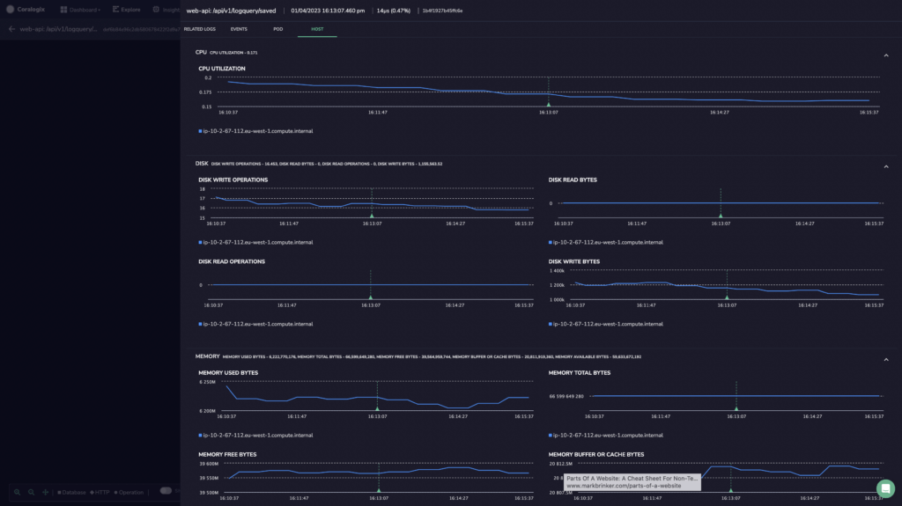
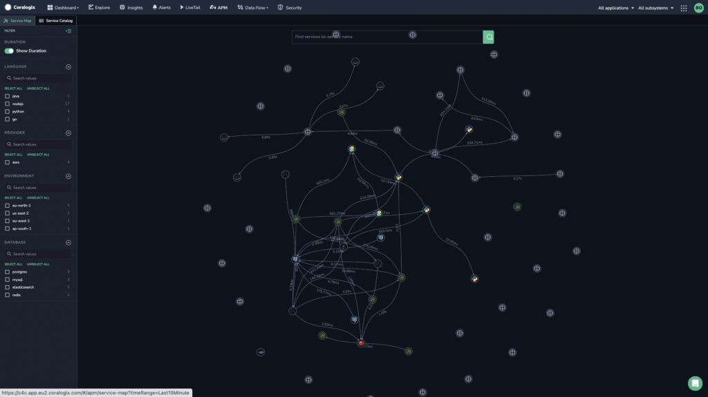
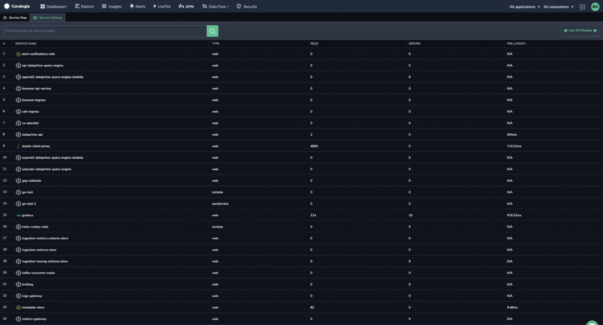
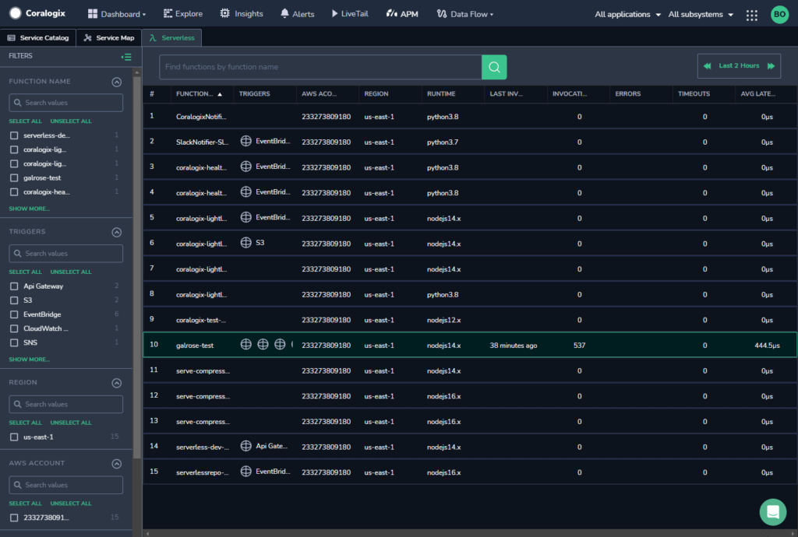

Coralogix offers **Application Performance Monitoring (APM)** for modern, cloud-native environments. Our new features decorate all pillars of [observability](https://coralogixstg.wpengine.com/blog/what-is-observability/) with additional information that extends beyond system availability, service performance, and response times.

With this expanded visibility into service performance, you can effectively monitor latency and rapidly find the component responsible for issues like performance degradation or increased errors. APM allows you to contextualize and pinpoint the root cause of a problem and respond immediately before the user is affected.

## Concepts

Spans and traces form the basis of application performance monitoring in Coralogix APM.

Using this telemetry data, Coralogix allows you to observe **application resource consumption** and **infrastructure resource consumption** using two new observability layers.

<table><tbody><tr><td><code>POD</code></td><td>application resource consumption</td><td>Key factors that impact response times and throughput of applications</td></tr><tr><td><code>HOST</code></td><td>infrastructure resource consumption</td><td>Usage of IT resources, systems, and processes</td></tr></tbody></table>

## **Features**

### Pod & Host

Our APM provides you with all logs relevant to a particular span context, granting a full picture of the services that power your applications.

Use our newest layers of observability – **[`POD` and `HOST`](https://coralogixstg.wpengine.com/docs/pod--host/)** – to:

- Instantly view all of your pod and host metrics, including resource consumption and associated network information

- Compare metrics within a specific pod and across pods from a specific service

- Compare all of the pods associated with a specific service

- Correlate between Kubernetes spans, logs, and metrics for a specific pod and/or host

- Troubleshoot log span errors

- Annotate deployment tags based on span context

Find out more [here](https://coralogixstg.wpengine.com/docs/pod--host/).

### Service Map

Our **[Service Map](https://coralogixstg.wpengine.com/docs/service-map/)** feature provides a full visualization of your system architecture, breaking down your application into all its constituent services and drawing the observed dependencies between these services in real time on the basis of your [distributed tracing](https://coralogixstg.wpengine.com/docs/distributed-tracing/).

Use **Service Map** to:

- Enjoy a visual representation of your entire system

- Gain a better understanding of the health of your system by viewing data flows

- Identify bottlenecks and troubleshoot in real time

Find out more [here](https://coralogixstg.wpengine.com/docs/service-map/).

### Service Catalog

Our **[Service Catalog](https://coralogixstg.wpengine.com/docs/service-catalog/)** feature provides a list of all the services that you have in your system, showing you the health of each service. You can choose the timeframe for which you want to see the services, from a list of options. The service catalog shows the service type, the number of requests sent by the service, the error rate, and the P95 latency (that is, the frequency with which there was a delay in the request).

The service catalog also includes a search bar that lets you search either by service or by any of the other parameters shown.

Use the **Service Catalog** to:

- Get a deeper understanding of the health of your services using the service drilldown.

- See how many and what resources are being used by your services.

- Identify problems and troubleshoot in real time.

Find out more [here](https://coralogixstg.wpengine.com/docs/service-catalog/).

### Severless Monitoring

Our **[Serverless Monitoring](https://coralogixstg.wpengine.com/docs/severless-monitoring/)** feature provides customers using the [Coralogix AWS Lambda Telemetry Exporter](https://coralogixstg.wpengine.com/docs/coralogix-aws-lambda-telemetry-exporter/) with the ability to better control and understand your lambda servers on both macro and granular levels.

For each lambda function, view its triggers, the AWS account to which the function belongs, region, runtime, invocations, errors, timeouts, last invocation, average latency, and whether the function is out of memory.

Find out more [here](https://coralogixstg.wpengine.com/docs/severless-monitoring/).

## Getting Started

Get started using our [APM Onboarding Tutorial](https://coralogix.com/docs/apm-onboarding-tutorial/).

## **Additional Resources**

<table><tbody><tr><td><strong>Blog</strong></td><td><a href="https://coralogixstg.wpengine.com/blog/application-performance-monitoring-visibility/"><strong>One Click Visibility: Coralogix Expands APM Capabilities to Kubernetes</strong></a></td></tr></tbody></table>

## **Support**

**Need help?**

Our world-class customer success team is available 24/7 to walk you through your setup and answer any questions that may come up.

Feel free to reach out to us **via our in-app chat** or by sending us an email at [support@coralogixstg.wpengine.com](mailto:support@coralogixstg.wpengine.com).
