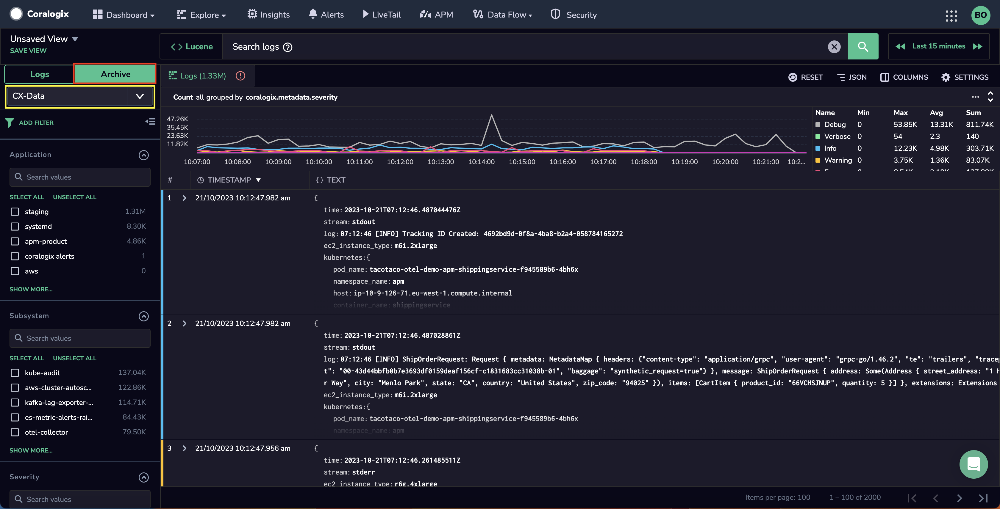
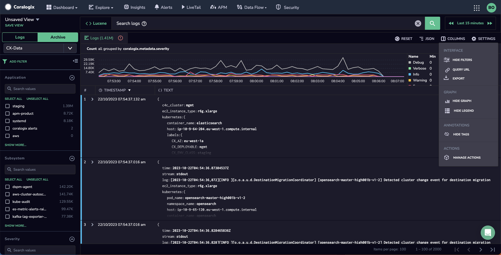
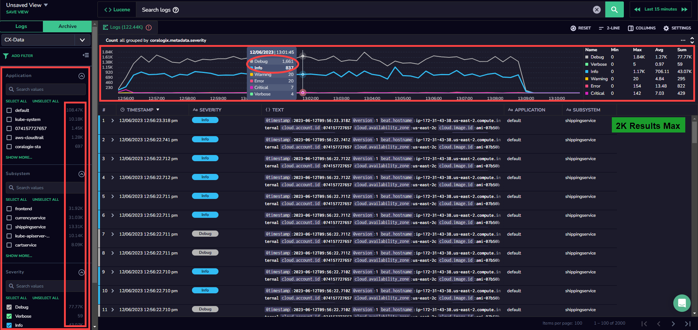

Directly query logs and spans in your S3 archive from your **Explore Screen**. Using text-based queries or specific query languages such as DataPrime or Lucene, you may query your data irrespective of its priority or timeframe and regardless of your daily quota - all with the ease of familiar functionalities.

## Overview

[Archive Query](https://coralogixstg.wpengine.com/docs/archive-query/) allows you to query the data in your S3 archive directly from your [Explore screen](https://coralogixstg.wpengine.com/docs/explore-screen/).

Use this feature to:

- Query your archive in the Coralogix UI using [any text](https://coralogixstg.wpengine.com/docs/log-query-simply-retrieve-data/#free-text-search) or [Lucene](https://coralogixstg.wpengine.com/docs/log-query-simply-retrieve-data/#lucene-query-syntax-reference) or [DataPrime](https://coralogixstg.wpengine.com/docs/dataprime-cheat-sheet/) syntax query, irrespective of log priority or daily quota.

- Enjoy various data sources. Using DataPrime, you may query logs or spans.

- Query data with unlimited time frames. There are no restrictions on how far back in time your data can go.

- View query results alongside live data streams and with the use of familiar functionalities.

- Store more of your data in our [Monitoring](https://coralogixstg.wpengine.com/docs/optimize-log-management-costs/#monitoring-data-medium-priority) and [Compliance](https://coralogixstg.wpengine.com/docs/optimize-log-management-costs/#compliance-data-low-priority) priority levels, while maintaining interactive query times and saving on costs.

## Prerequisites

- Read/ Write permissions enabled in your [AWS S3 bucket](https://coralogixstg.wpengine.com/tutorials/archive-s3-bucket-forever/)

## Getting Started

**STEP 1**. From your Coralogix toolbar, navigate to **Explore** > **Logs** tab.

**STEP 2**. Select **Archive** the upper left-hand corner of your Logs screen.

**STEP 3**. Select **CX-Data** in the dropdown menu.

## Explore Screen Functionalities

### Query

[Query](https://coralogixstg.wpengine.com/docs/explore-screen/#querying-your-data) using [any text](https://coralogixstg.wpengine.com/docs/log-query-simply-retrieve-data/#free-text-search) or [Lucene](https://coralogixstg.wpengine.com/docs/log-query-simply-retrieve-data/#lucene-query-syntax-reference) or [DataPrime](https://coralogixstg.wpengine.com/docs/dataprime-cheat-sheet/) syntax query.

### Filter

[Filter](https://coralogixstg.wpengine.com/docs/explore-screen/#filtering-your-data) your logs using application, subsystem, and severity filters.

### Manage Settings

Manage your settings by clicking on **SETTINGS** in the upper right-hand corner of your screen.

Select **ACTIONS** to trigger 3rd party services based on your search results and / or values under specific keys. Find out more [here](https://coralogixstg.wpengine.com/docs/coralogix-action-extension/).

## Limitations

The following limitations on Explore Screen archive queries are described below.

| Limitation | Description |
| --- | --- |
| Bytes processed | Up to 30% of daily ingested bytes |
| Parquet files scanned | Up to 500k files |
| Total log results | Up to 2k results  
While aggregations are available across all the data, we only pull up to 2,000 raw logs to display in the main logs grid. |
| Exported log results | Up to 2k results  
Exporting the data in the logs grid from an archive query is limited to the top 20 pages (100 logs per page), so you can export a max of 2000 logs at a time. In order to export all archive query logs, create an archive query by navigating Data Flow > Archive Queries. |

**Notes**:

- You may incur slight delays when querying archived data, when compared with other Explore screen queries.

- It is possible to use the same query syntax as queries run on the [Archive Query](https://www.notion.so/tutorials/archive-query/) page.

### Warnings

Once a limit is reached, a warning message is displayed. Refine your query results to avoid reaching a limit.

## Refine Your Query Results

Refine your query results using any of the following methods:

- Apply more selective filters to your queries (for example, on application or subsystem).

- If using the Dataprime extract operator and subsequently filtering its results, create a parsing rule and filter on the parsed field instead.

- Avoid regular expressions or wildcards in filters.

- In Dataprime, switch from using the contains operator on strings to the free text search operator (~).

## Additional Resources

<table><tbody><tr><td>Documentation</td><td><strong><a href="https://coralogixstg.wpengine.com/docs/archive-query/">Archive Query</a></strong></td></tr></tbody></table>

## Support

**Need help?**

Our world-class customer success team is available 24/7 to walk you through your setup and answer any questions that may come up.

Feel free to reach out to us **via our in-app chat** or by sending us an email at [support@coralogixstg.wpengine.com](mailto:support@coralogixstg.wpengine.com).
