Coralogix's 'Archive query' feature allows you to query logs directly from your S3 archive using SQL query syntax without counting against your daily quota, even if the data was never indexed. This enables you to store more of your data in our monitoring and compliance priority levels and take advantage of Coralogix’s real-time analysis and remote storage search capabilities. This means you can use a shorter retention period and still be able to query all your data in less than 1 minute.

Archive queries run on the S3 archive you set in Coralogix and are available for all TCO logging levels per our unique [TCO](https://coralogixstg.wpengine.com/tutorials/optimize-log-management-costs/) model. For example, prioritizing logs at the monitoring level still allows you to query them without ever indexing the data as well as view and query them in the LiveTail, receive real-time alerts and anomalies on top of them, leverage parsing rules, Loggregation, and [Events2Metrics](https://coralogixstg.wpengine.com/docs/event2metrics/) at 40% of the cost.

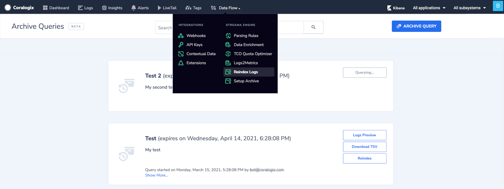

In order to use this feature, make sure you have set Read/Write permission to your AWS S3 archive bucket (read more about enabling the Archive feature [here](https://coralogixstg.wpengine.com/tutorials/archive-s3-bucket-forever/))  
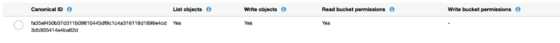

If you don't have such permission you will see the following screen:

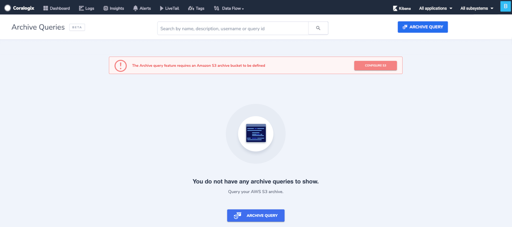

Click on the 'ARCHIVE QUERY' button and the following dialogue box will open:

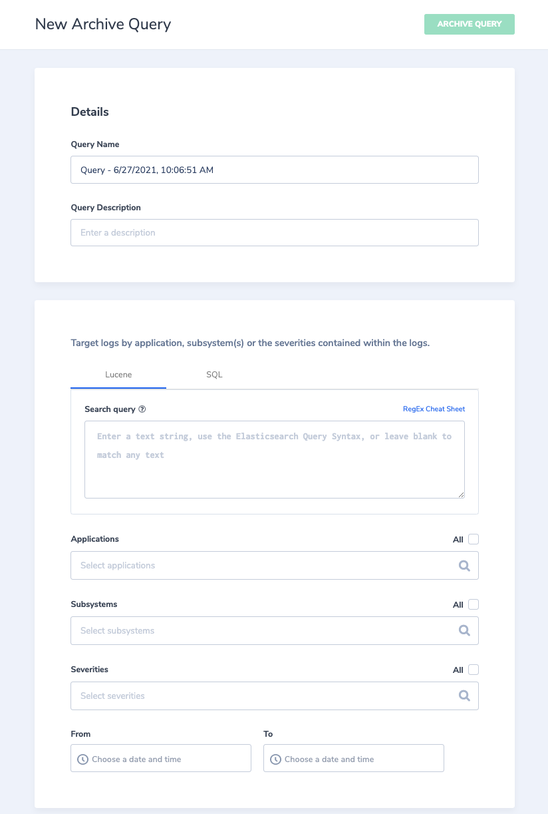

Toggle to the SQL Archive query option and the following dialog box will be shown. For more information on the Lucene query check our [Archive query](https://coralogixstg.wpengine.com/tutorials/archive-query/) tutorial.

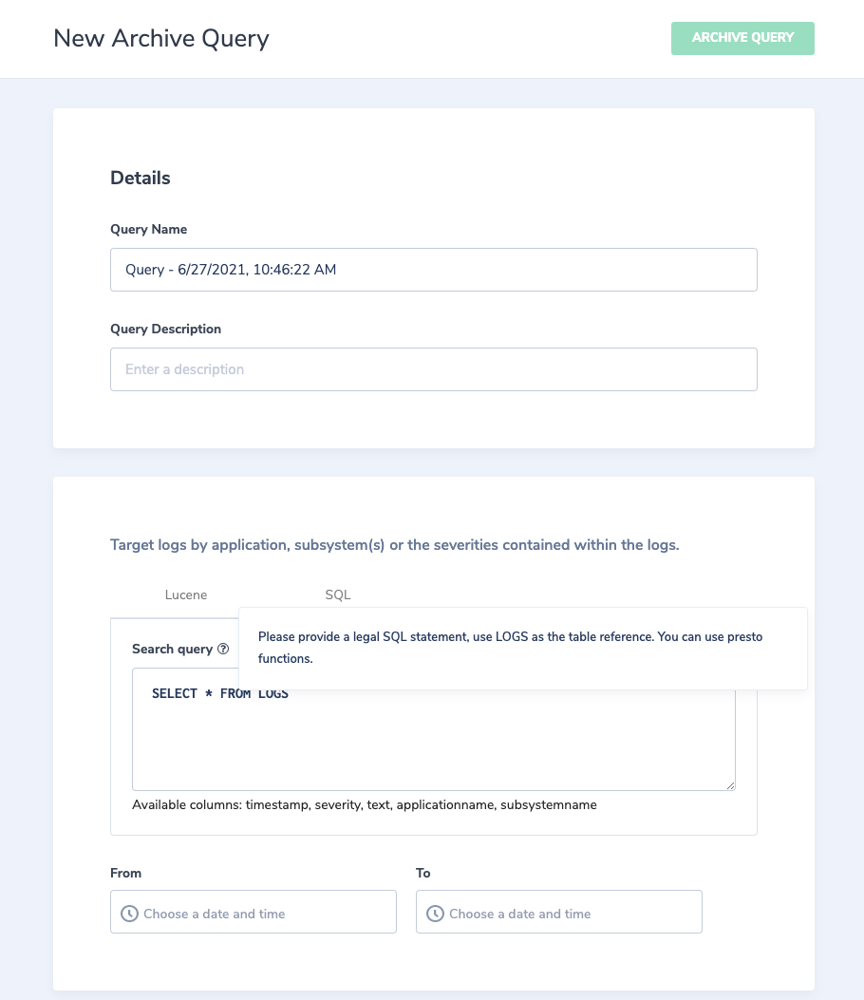

In the top section, you will fill the query name and description.

In the _Search query_ section, enter your SQL query statement and use LOGS as the table reference. You may include [**Presto functions**](https://docs.aws.amazon.com/athena/latest/ug/presto-functions.html) for performing on-the-fly parsing, aggregations, etc. to match a subset of logs from S3.

The Presto functions allow you to run on the fly parsing on data that was already sent to Coralogix, including textual data that was not parsed before its ingestion by using [Coralogix parsing rules](https://coralogixstg.wpengine.com/tutorials/log-parsing-rules/). Therefore, the value this capability brings is tremendous since not always you are in control of the parsing created/not created to the data in your account, either because you are not the owner of this data, don't know how to parse the data, or simply forgot to do so. Nevertheless, you are able to parse and aggregate the data after hand.

Note: we will not mount anything besides logs matching this query.

Choose the time frame criteria for the query. (Note: The time range limit is up to 24 hours)

After clicking on the "ARCHIVE QUERY" button and wait till it is processed, you will see your new query and the 3 options: Logs preview, Download TSV, clone. (Note: Reindex by using SQL queries will be available soon!!)

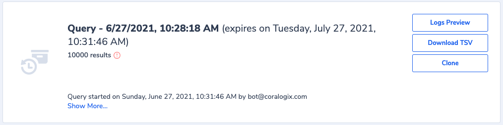

If you click on "Logs preview" you will be able to view your logs. In case we are "dealing" with logs you have placed under Medium or Low priority (according to TCO model) you are previewing the data without ever indexing it!

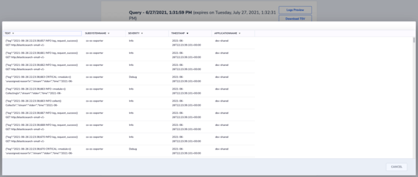

Clicking on "Download TSV" will show you the following screen with the files you will download

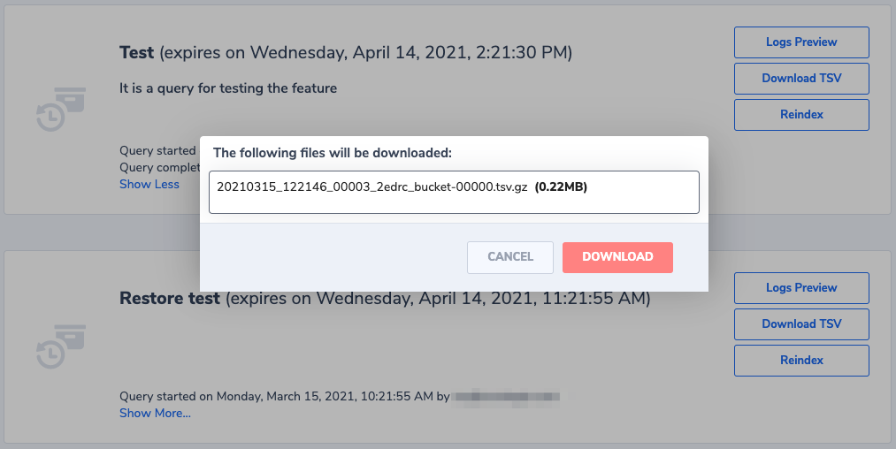

In case you want to create another Archive query similar to one query you already created you can easily duplicate it by clicking on the **Clone** button.

If you wish to share an Archive query with another teammate click on your query and on the top click again on the chain-link icon. This will copy to your clipboard the link to that same Archive query.

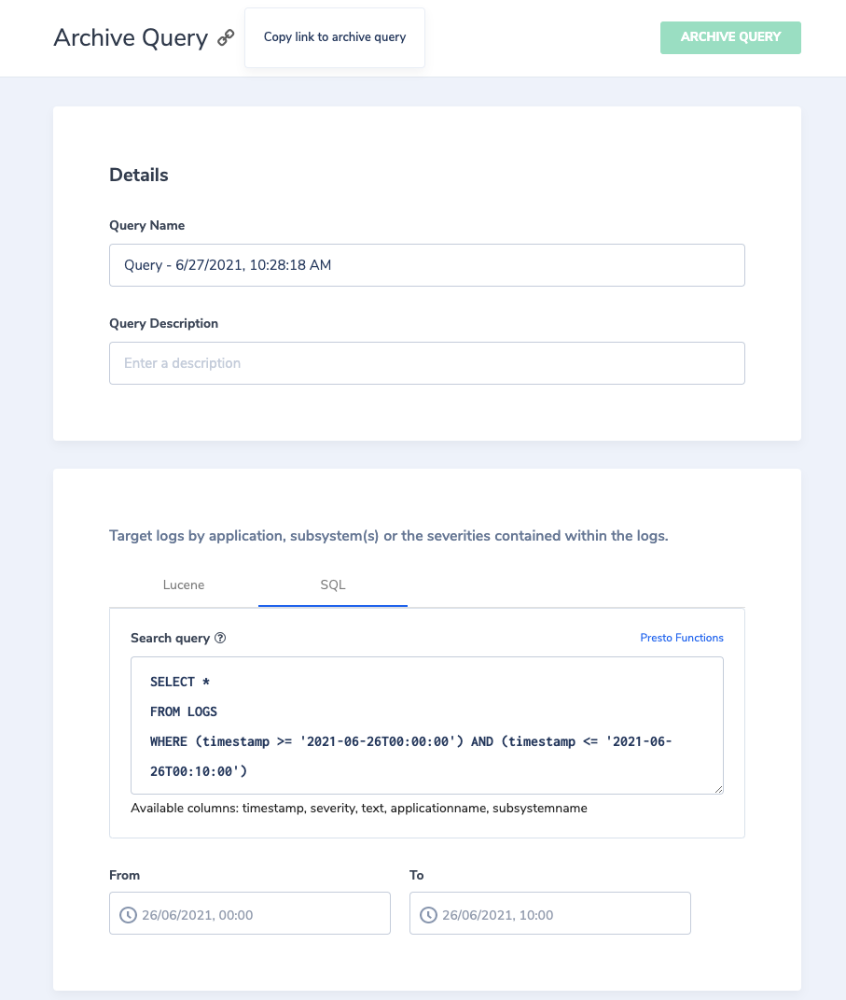

**Notes**:

- Once a query expires, it is impossible to view, download, or reindex the data.

- In this case, create another similar query.

## Query examples

1. This example matches logs with the field **kubernetes.pod\_id** equal to "540d39bc-32f1-4e66-bcaf-e2ee04cede53" and returns the count of them grouped by application name.
    
    ```
    SELECT applicationName,count(*) 
    FROM logs
    WHERE json_extract_scalar(text,'$.kubernetes.pod_id') = '540d39bc-32f1-4e66-bcaf-e2ee04cede53'
    GROUP BY applicationname
    ```
    
    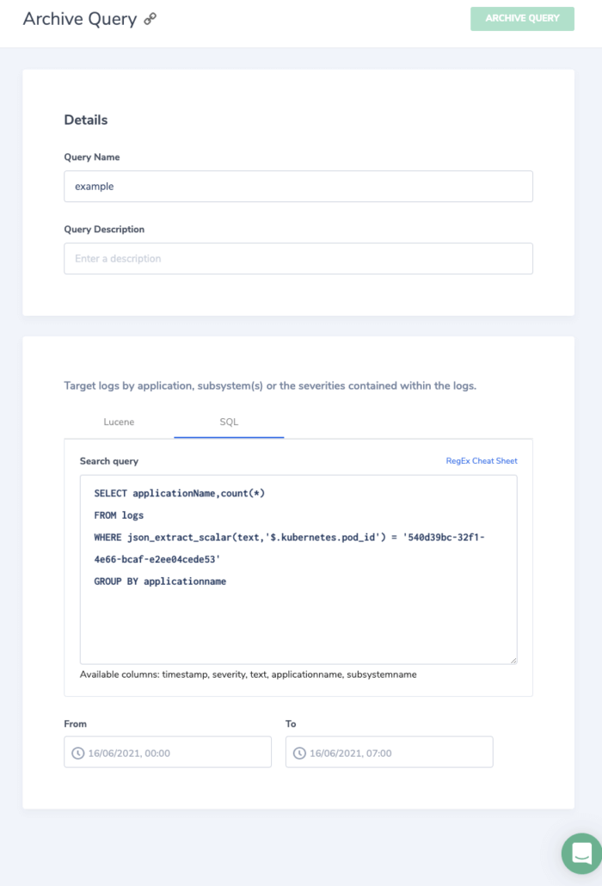
    
      
    

3. This example matches text logs where subsystem name is "presto\_archive\_query" with regular expressions and extracts the values bytes\_sent, method into separate columns.
    
    ```
    SELECT regexp_extract(text, 'bytes_sent=(\d+)', 1) bytes_sent,regexp_extract(text, 'method=([A-Z]+)', 1) method
    FROM LOGS
    WHERE subsystemName='presto_archive_query'
    ```
    
    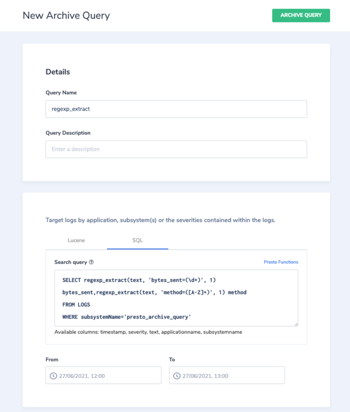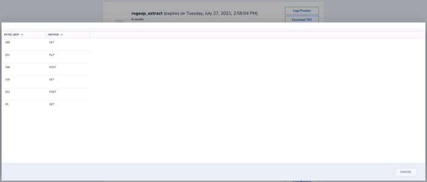
