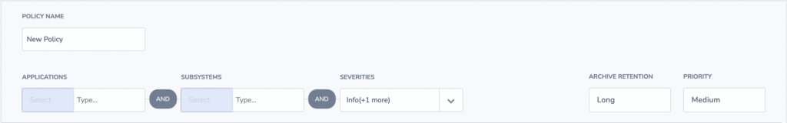
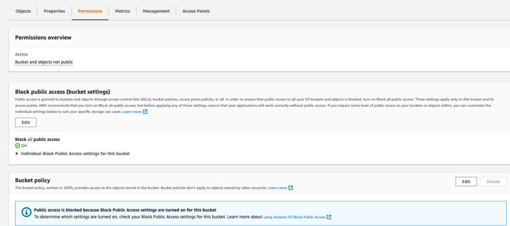
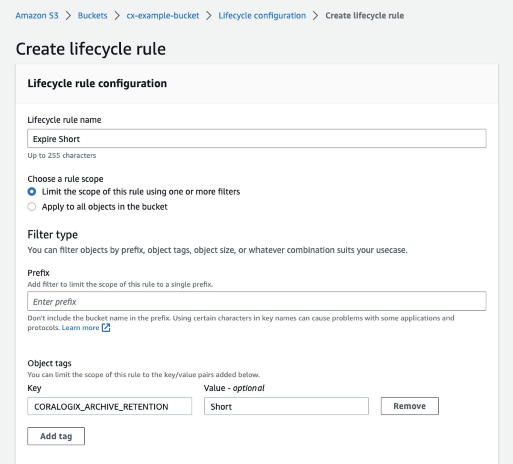
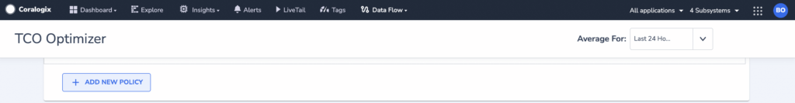

In addition to our [TCO Optimizer](https://coralogixstg.wpengine.com/docs/optimize-log-management-costs/), Coralogix now offers an extra layer of granularity for your data retention. Using our new **ARCHIVE RETENTION** feature, you can now control and modify the length of time your logs are archived.

## Overview

When creating a new policy for your data retention in your [TCO Quota Optimizer](https://coralogixstg.wpengine.com/docs/optimize-log-management-costs/) screen, you now have the option of defining a lifecycle policy - the length of archive retention for a specific group of logs, defined by [application](https://coralogixstg.wpengine.com/docs/application-and-subsystem-names/#application-name), [subsystem](https://coralogixstg.wpengine.com/docs/application-and-subsystem-names/#subsystem-name) and severity.

Users may choose between 4 default retention periods: default, short, intermediate, or long. The names and values for the latter three are subjective and determined by the tag names set by the user in his/her [s3 bucket configuration](https://coralogixstg.wpengine.com/docs/archive-s3-bucket-forever/). While one user may define a “short” retention period as 3 days, another may define this period as 15 days. Another user may choose to change the name of the “short” retention period to “minimum”.



**Note**:

- Only newly archived files are affected by these new settings.

- Files created **before** the new lifecycle policy have no retention tag and are **not** changed retroactively. The data retention policy that applied to them before the new lifecycle policy - default or defined - will continue to apply even after the new settings are put in place.

## Configuration

**STEP 1**. [Create an s3 bucket for configuration](https://coralogixstg.wpengine.com/docs/archive-s3-bucket-forever/).

**STEP 2**. Configure **`GetObjectTagging`** and **`PutObjectTagging`** permissions.

- Search **S3** in your AWS search bar and select this service.

- Find and click the bucket of choice for storing the archive.

- Navigate to the **Permissions** tab. Edit the **Bucket policy.**



- Paste the following code and update the name of your bucket:

```
{
    "Version": "2012-10-17",
    "Id": "MyPolicyID",
    "Statement": [
        {
            "Sid": "MyStatementSid",
            "Effect": "Allow",
            "Principal": {
                "AWS": "arn:aws:iam::625240141681:root"
            },
            "Action": [
                "s3:GetObject",
                "s3:ListBucket",
                "s3:PutObject",
                "s3:PutObjectTagging",
                "s3:GetObjectTagging"
            ],
            "Resource": [
                "arn:aws:s3:::<bucket name>",
                "arn:aws:s3:::<bucket name>/*"
            ]
        }
    ]
}
```

- Click **Save**.

**STEP 3**. Set up a Lifecycle configuration.

- Navigate to **Lifecycle configuration**.

- Define **Lifecycle rule name** and at least one **Lifecycle rule action**.

- Select **Limit the scope of this rule using one or more filters**.

- Add **Object tags** by defining a **Key/Value** pair.

- Click **Save**.

**Note**:

- The value of your object tag must be **identical in content and form (case-sensitivity)** to the archive retention name in your Coralogix Archive Retention Settings.



## Create a Lifecycle Policy

The following section demonstrates one method of creating a lifecycle policy using [AWS CLI](https://aws.amazon.com/cli/). The example below sets a policy to remove archive files with the retention “short” after 15 days.

**STEP 1**. Define a policy in a local lifecycle.json file.

```
{
    "Rules": [
        {
            "Filter": {
                "Tag": {
                  "Key": "CORALOGIX_ARCHIVE_RETENTION",
                  "Value": "Short"
                }
            },
            "Status": "Enabled",
            "Expiration": {
                "Days": 15
            },
            "ID": "ExampleRuleShort"
        },
        {
            "Filter": {
                "Tag": {
                  "Key": "CORALOGIX_ARCHIVE_RETENTION",
                  "Value": "Intermediate"
                }
            },
            "Status": "Enabled",
            "Expiration": {
                "Days": 150
            },
            "ID": "ExampleRuleIntermediate"
        },
        {
            "Filter": {
                "Tag": {
                  "Key": "CORALOGIX_ARCHIVE_RETENTION",
                  "Value": "Long"
                }
            },
            "Status": "Enabled",
            "Expiration": {
                "Days": 365
            },
            "ID": "ExampleRuleLong"
        }
    ]
}

```

**STEP 2**. Apply the policy.

```
aws s3api put-bucket-lifecycle-configuration --bucket <bucket-name> --lifecycle-configurationfile://lifecycle.json

```

**Note**:

- This command will completely override the current policy of the bucket, if one exists.

- If you wish to append your existing policy, proceed with this command first and only then update lifecycle.json accordingly (STEP 2 above).

```
get-bucket-lifecycle-configuration

```

**STEP 3.** Verify that the policy has been applied.

```
aws s3api get-bucket-lifecycle-configuration --bucket <bucket-name>

```

## Set Archive Retention Settings

Once you configure your cx-data bucket in S3, set your Archive Retention settings.

**STEP 1**. In your Coralogix navigation bar, click **Data Flow** > select **Setup Archive.**

**STEP 2**. In the **Archive Retention** section, name Retention Periods 2, 3, and 4. You may opt for names ‘Short’, ‘Intermediate’, and ‘Long’ as in the example below, or you may choose otherwise. The value for each period - the length of time data will be retained in a specific Retention Period - is [managed by the s3 storage lifecycle defined in your AWS account](https://docs.aws.amazon.com/AmazonS3/latest/userguide/object-lifecycle-mgmt.html).

**STEP 3**. Click **ACTIVATE.** You will receive a popup message that reads: “An archive retention policy has been added to the <bucket name> Bucket successfully.”

**Notes**:

- Only once you have activated your archive retention settings will they appear in your TCO Quota Optimizer.

- When modifying existing archive retention settings, the **ACTIVATE** button will be replaced with a **SAVE** button.


**STEP 4**. View your changes by navigating to **Data Flow** > TCO Quota Optimizer.

## Create a New Policy

Once you create your Archive Retention settings, create a new data retention policy.

**STEP 1**. In your Coralogix navigation bar, click **Data Flow** > select **TCO Quota Optimizer**.

**STEP 2**. Click **+ADD NEW POLICY**.



**STEP 3**. Input **POLICY NAME**.

**STEP 4**. Define **APPLICATIONS**, **SUBSYSTEMS** and **SEVERITY** level.

**STEP 5**. Define **PRIORITY**.

**Notes**:

- If data is marked as ‘blocked’, it will not be archived.

- Only data marked as priority ‘High’, ‘Medium’, or ‘Low’ is archived. Only this data is eligible for additional archive retention settings.

**STEP 6**. Define **ARCHIVE RETENTION** settings.

**Notes**:

- When you add an archive retention policy, logs meeting the established criteria (application, subsystem, and severity level) will be retained in your archive for the period of time associated with the policy.

- If you do not specify your retention policy, logs meeting the established criteria will be retained in your archive for the default period of time.


## Previously Archived Files

Files created **before** the new lifecycle policy have no retention tag and are **not** changed retroactively when you establish a new retention policy. The data retention policy that applied to them beforehand - whether default or defined - will continue to apply even after your new settings are put in place.

```
{
    "Rules": [
        {
            "Status": "Enabled",
            "Expiration": {
                "Days": 365
            },
            "ID": "ExampleRule"
        }
    ]
}

```

## Additional Resources

- [s3 Bucket Configuration](https://coralogixstg.wpengine.com/docs/archive-s3-bucket-forever/)

## Support

**Need help?**

Our world-class customer success team is available 24/7 to walk you through your setup and answer any questions that may come up.

Feel free to reach out to us **via our in-app chat** or by sending us an email at [support@coralogixstg.wpengine.com](mailto:support@coralogixstg.wpengine.com).
