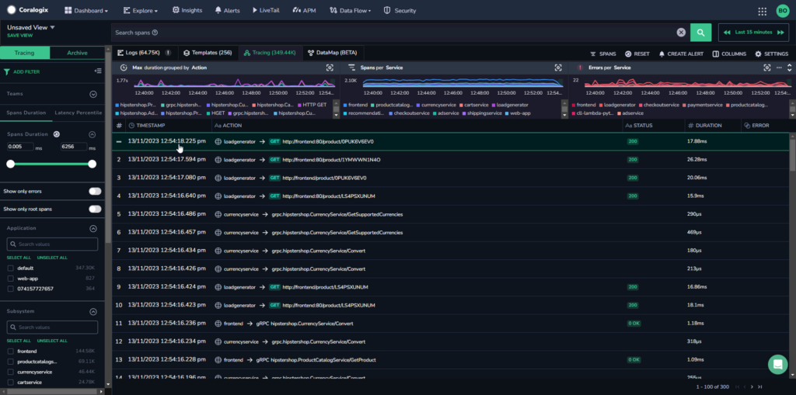
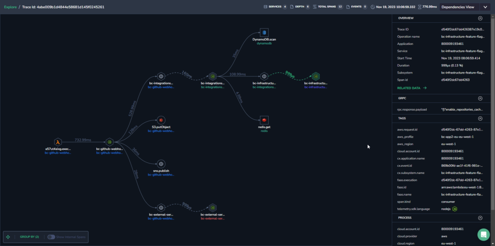
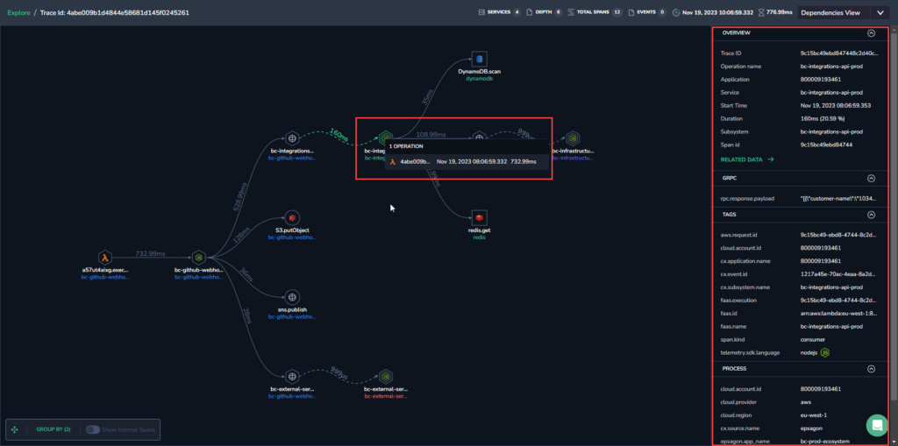
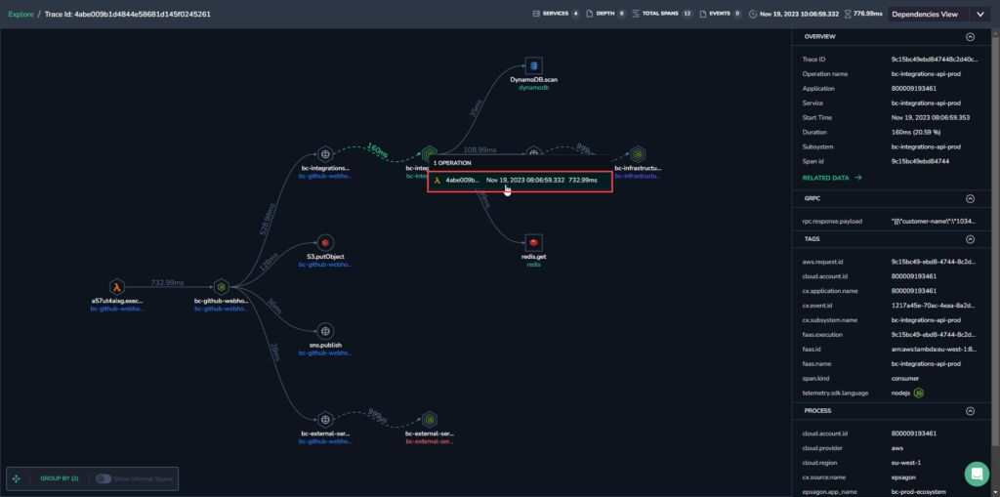

When navigating through Coralogix [Distributed Tracing](https://coralogixstg.wpengine.com/docs/distributed-tracing/), encountering converging traces forming a queue is common. **Exploring async trace calls** using the OTEL Link allows you to establish connections between these traces, revealing interconnections and aiding in the identification of related traces.

## **Overview**

In scenarios where multiple traces merge into a single flow, creating asynchronous interactions, the ability to observe and explore these interconnections becomes vital for troubleshooting span-related issues.

Asynchronous trace calls, (also known as async trace calls), serve as a powerful mechanism for tracking the flow of execution in applications utilizing asynchronous programming patterns. These calls help capture the journey of a request or transaction as it moves through various asynchronous tasks, such as background jobs, microservices, or distributed systems. They record the timing, dependencies, and contextual information associated with each asynchronous operation, allowing you to visualize the entire path of a request, even when it's distributed across multiple components and services.

## Benefits

Tracking async trace calls offers several key benefits:

- **End-to-End Visibility.** Trace the entire lifecycle of a request or transaction through asynchronous tasks, understanding the full journey and identifying bottlenecks.

- **Root Cause Analysis.** Quickly pinpoint the exact step or component where issues occur, facilitating efficient root cause analysis.

- **Performance Optimization.** Understand the timing and dependencies of asynchronous operations to optimize system performance.

- **Proactive Issue Detection.** Proactively detect anomalies or deviations from expected behavior before they impact users.

- **Microservices and Distributed Systems.** Gain a holistic view of system behavior in modern, distributed systems with a microservices architecture.

- **User Experience Improvement.** Ensure a smooth and responsive user experience by observing how different components contribute to overall performance.

## Prerequisites

- [OpenTelemetry configured for traces](https://coralogixstg.wpengine.com/docs/opentelemetry/)

## View Async Trace Calls

**STEP 1.** On the Coralogix toolbar, click **Explore** > **Tracing**.

**STEP 2.** Click on a span for which you want to see the Dependencies View.

In the dependencies view, you can see which links are asynchronous because they will have curved dotted lines connecting between them, rather than uninterrupted straight lines.

**STEP 3.** Inside the dependencies view, click on a specific trace to view the trace details in the right-hand panel.

**STEP 4.** Click on the operation name of a specific trace to open the trace up for exploration in a new tab.

### Legend

Within the dependencies view, the following shows the different types of images and connections.

- **Dotted line between two steps.** Asynchronous request.

- **Full line.** Synchronous request.

- **Double lines around a trace.** Asynchronous trace.

- **Arrows.** The direction in which a trace is headed.

- **Rhombus shape.** HTTP method (GET/POST etc.)

- **Hexagon.** Pubsub (`span.kind` consumer/producer)

- **Square.** Database (the span has a `db.statement` tag)

- **Circle.** Generic operation (none of the above)

### Group By Filter

At the bottom left of the dependencies view screen is the **Group By** filter. This controls how operations are grouped in the Dependencies View.

Choose to group by different actions or services, such as `operation.name`, `service.name`, tags, process tags, etc.

Select the aggregation method to be used for spans containing multiple converging traces. Choose to see either the max, min, average, or sum of the time it took to perform operations.

### Show Internal Spans

Next to the Group By filter is the **Show Internal Spans** toggle. This enables you to show or hide internal spans, which can be useful when there are a large number of internal spans which makes the map difficult to navigate.

## Limitations

Due to the endless nature of asynchronous calls, there is a limit of three asynchronous calls per trace level.

## Additional Resources

<table><tbody><tr><td>Documentation</td><td><strong><a href="https://coralogixstg.wpengine.com/docs/distributed-tracing/">Distributed Tracing</a></strong></td></tr></tbody></table>

## Support

**Need help?**

Our world-class customer success team is available 24/7 to walk you through your setup and answer any questions that may come up.

Feel free to reach out to us **via our in-app chat** or by sending us an email at [support@coralogixstg.wpengine.com](mailto:support@coralogixstg.wpengine.com).
