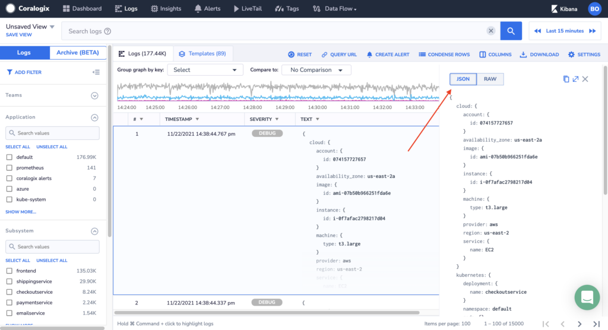
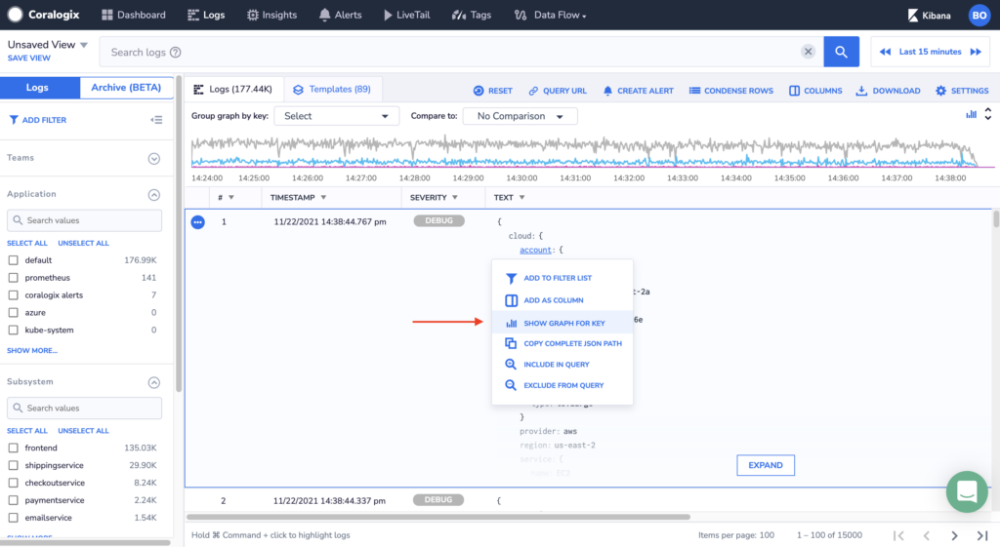
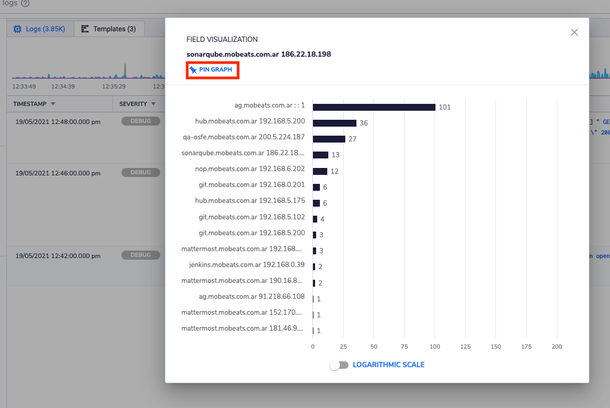

Coralogix provides automated parsing of any valid JSON message you send, allowing you to sort, filter, group, and visualize any JSON parameter without having to adjust your logs to any specific format. 

1) Any JSON format log sent will appear in its original format on the log grid and info panel (to open the info panel simply mark a row and press the space button): 

2) Click on the field name drop-down menu will show. Select Show Graph Per key option to show a graph of its top occurrences:

You can also add any key as a column to your logs view and as a filter criterion.

\*Note that if a new key that was already indexed (new type of log you are shipping or maybe a new key since you applied a parsing rule) is not shown via ‘manage columns’ you should refresh your browser to have it.

3) Use the pin Graph to add the visualization to  your dashboard as a widget: 

Join Coralogix now and enjoy a whole new world of machine learning-powered insights.
