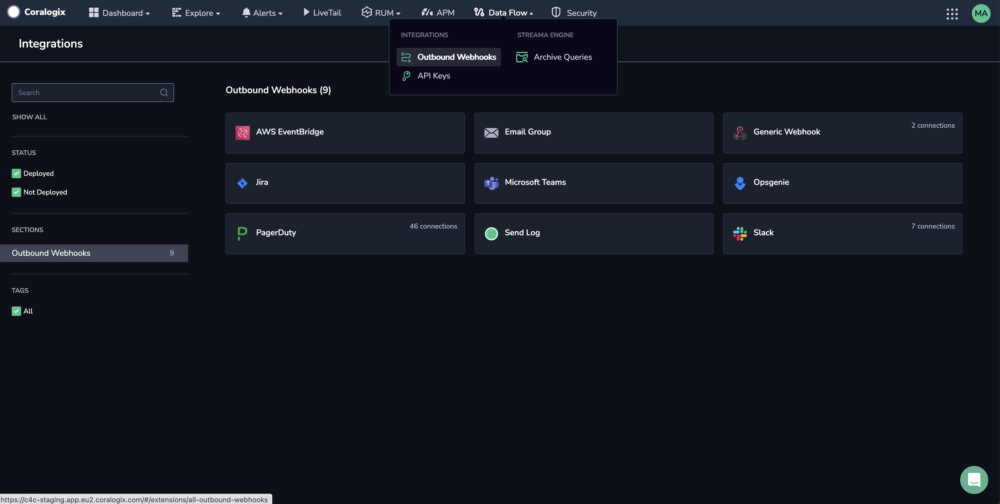
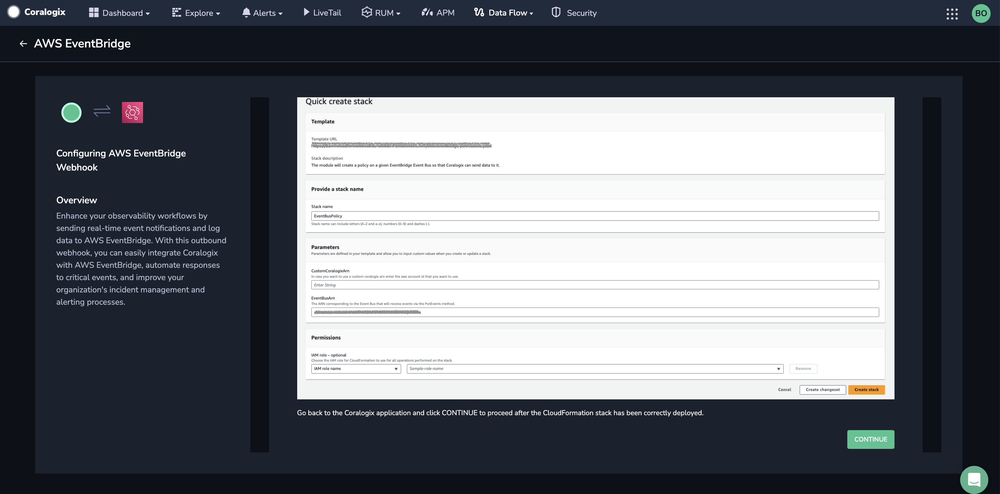
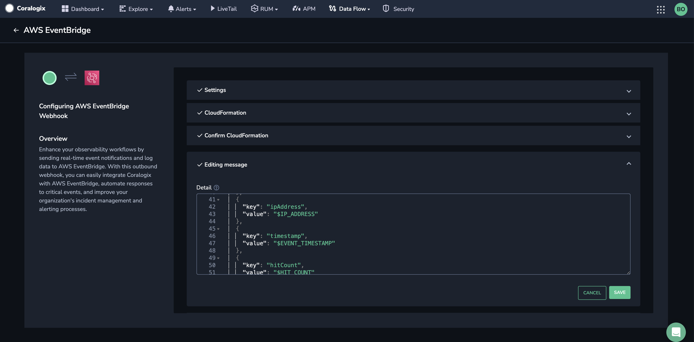
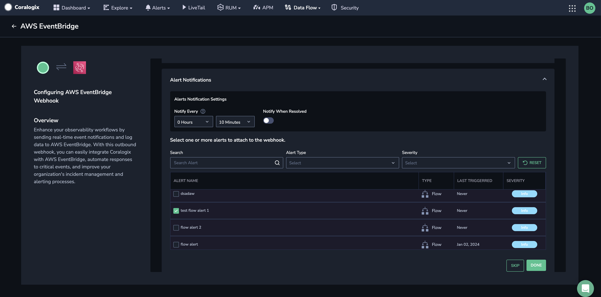
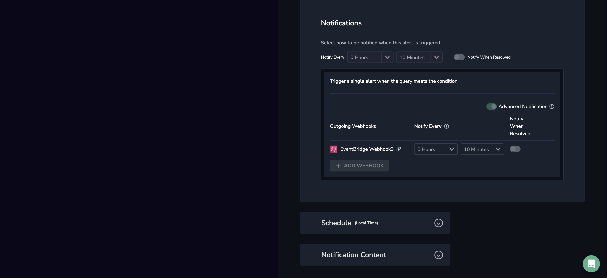
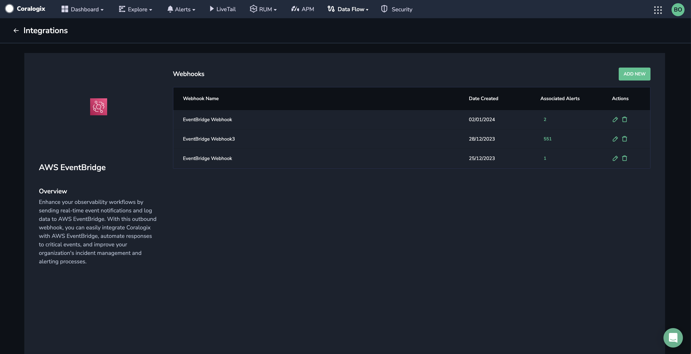

[Amazon EventBridge](https://docs.aws.amazon.com/eventbridge/latest/userguide/eb-what-is.html) serves as a serverless event bus service, facilitating the effortless collection and transmission of data from various applications and services to designated destinations. Employ the **AWS EventBridge Outbound Webhook** to establish a streamlined real-time mechanism, enabling Coralogix to transmit events seamlessly to AWS EventBridge.

## Prerequisites

- AWS account

- Amazon EventBridge event bus [created](https://docs.aws.amazon.com/eventbridge/latest/userguide/eb-create-event-bus.html)

## Create a Webhook

**STEP 1.** From your Coralogix toolbar, navigate to **DATA FLOW** > **OUTBOUND WEBHOOKS.**

**STEP 2.** Click **AWS EventBridge**.

**STEP 3.** Click **\+ ADD NEW**.

**STEP 4.** Enter the webhook details and click **Next**.

- **Webhook Name**. Enter a memorable name that will allow you to identify the webhook when attaching it to an alert easily.

- **Event Bus ARN**. Corresponds to the event bus, which will receive notifications. The policy attached must contain permission to publish.

- **Detail Type**. Free text to be included in the event.

- **Source**. Free text is used to identify the messages Coralogix sends.

- **Role Name**. Corresponds to the AWS IAM role that will be created in your account.

**STEP 5**. You will be rerouted to the AWS website for the integration to create and deploy a CloudFormation stack. This step makes a role and an associated permissions policy to allow Coralogix to use a set of temporary security credentials to access your AWS resources.

Verify that all of the auto-pre-populated values are correct. Click **Create Stack**.

**STEP 6**. Revert to the Coralogix application and click **CONTINUE.**

**STEP 6.** \[**Optional**\] Edit the message to customize the header and body of the messages sent when the webhook is triggered. Click **SAVE**.

**STEP 7.** Select one or more alerts to join the webhook.

The **Alert Notifications** panel will appear.

**STEP 8.** The new webhook will appear in the **Notifications** section of the alert. Click **+Add WEBHOOK** and select the newly created webhook. Click **SAVE CHANGES**.

**STEP 9.** Click **DONE**.

**STEP 10**. Modify or delete any of the webhook settings in the **Actions** column of the AWS EventBridge app. To add an alert to an existing webhook, click on the number under **Associated Alerts**.

## Support

**Need help?**

Our world-class customer success team is available 24/7 to walk you through your setup and answer any questions that may come up.

Feel free to contact us **via our in-app chat** or by emailing [support@coralogixstg.wpengine.com](mailto:support@coralogixstg.wpengine.com).
