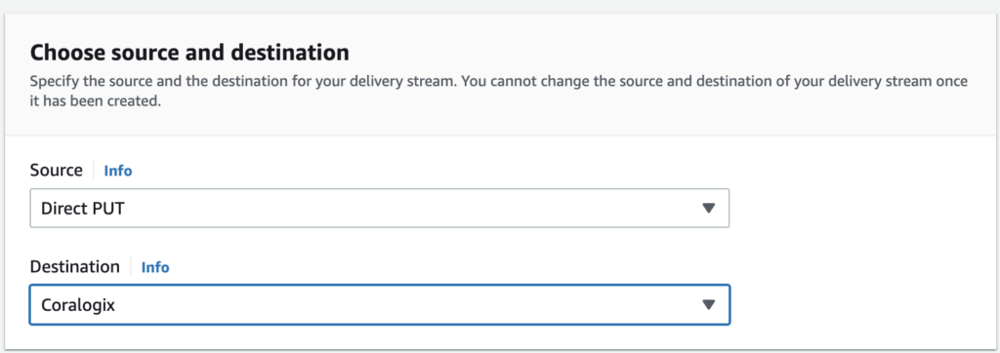
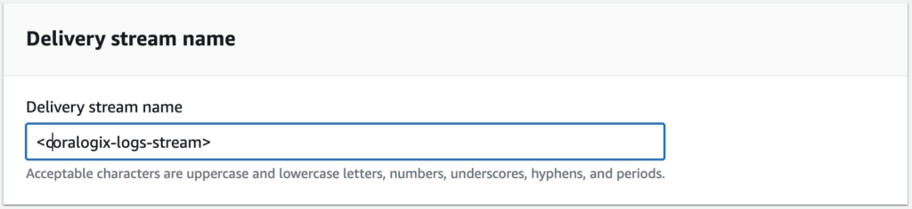
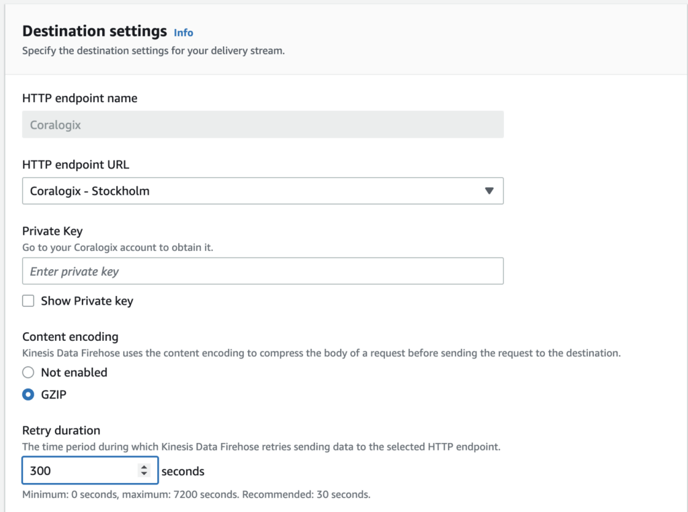
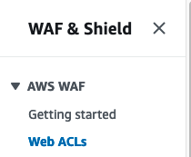
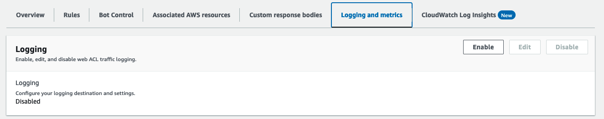
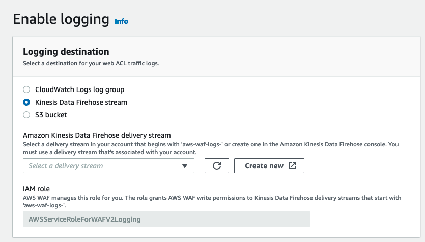
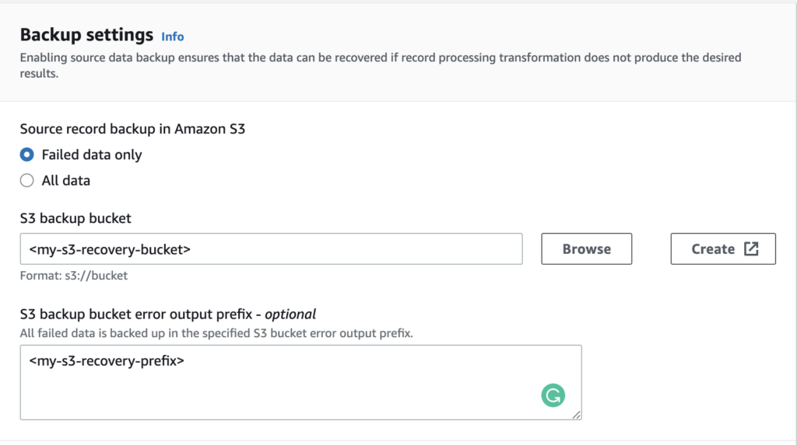

[Amazon Kinesis Data Firehose](https://aws.amazon.com/kinesis/data-firehose/) delivers real-time streaming data to destinations like Amazon Simple Storage Service (Amazon S3), Amazon Redshift, or Amazon OpenSearch Service (successor to Amazon Elasticsearch Service), and now supports delivering streaming data to Coralogix. There is no limit on the number of delivery streams, so it can be used for retrieving data from multiple AWS services.

Coralogix is an AWS Partner Network (APN) Advanced Technology Partner with AWS  Competencies in DevOps. The platform enables you to easily explore and analyze logs to gain deeper insights into the state of your applications and AWS infrastructure. Analyze all of your AWS service logs while storing only those you need. Generate metrics from aggregated logs to uncover and alert on trends in your AWS services.

## Overview

Using Coralogix with Amazon Kinesis Data Firehose offers significant benefits when compared with other solutions.

- It keeps monitoring simple.

- It integrates flawlessly.

- It's flexible with minimum maintenance.

- Scale, scale, scale.

- Real-time push monitoring involves pushing events instead of pulling.

## Configuration

**STEP 1**. Navigate to the Kinesis Data Firehose console and choose 'Create delivery stream'.

**STEP 2**. Under 'Choose source and destination':

- Source: Choose Direct PUT

- Destination: Choose Coralogix 



- Delivery stream name: Fill in the desired stream name



**STEP 3**. Scroll down to 'Destination settings':

- HTTP endpoint URL: Choose a HTTP endpoint URL based on your Coralogix [region](https://coralogixstg.wpengine.com/docs/coralogix-domain/).

- Private key: Enter your Coralogix [Send Your Data - API Key](https://coralogixstg.wpengine.com/docs/send-your-data-api-key/).

- Content encoding: Select GZIP.

- Retry duration: Choose 300 seconds.



**STEP 4**. Scroll down to 'Parameters'. This section allows you to add and configure additional parameters surrounding the Coralogix platform.


The following parameters are available:

<table><tbody><tr><td><strong>Parameter</strong></td><td><strong>Description</strong></td></tr><tr><td>applicationName</td><td>A comma-separated list of application name sources</td></tr><tr><td>applicationNameDefault</td><td>Deprecated</td></tr><tr><td>subsystemName</td><td>A comma-separated list of subsystem name sources</td></tr><tr><td>subsystemNameDefault</td><td>Deprecated</td></tr><tr><td>integrationType</td><td>Data structure:<br>- CloudWatch_JSON: data from cloudWatch log groups<br>- WAF<br>- CloudWatch_CloudTrail<br>- EksFargate<br>- Default<br>- RawText: use for VPC flow logs</td></tr><tr><td>dynamicMetadata</td><td>Deprecated</td></tr></tbody></table>

A name source can be a literal string (something), a quoted string ("something"), or a variable reference (${name}). Sources in a list are evaluated in order, variables without a value are skipped. For example, ${applicationName}, MyApp for a Default integration will use applicationName field if available, otherwise it will default to MyApp.

Available variables depend on the integration type:

- Default
    - applicationName — a value of the applicationName field of the JSON log record
    
    - subsystemName — a value of the subsystemName field of the JSON log record

- CloudWatch\_JSON, CloudWatch\_CloudTrail
    - logGroup — a CloudWatch Log Group supplied by AWS

- WAF
    - webAclName — a Web ACL Name supplied by AWS

- EksFargate
    - kubernetesNamespaceName — a value of the kubernetes.namespace\_name log record field
    
    - kubernetesContainerName — a value of the kubernetes.container\_name log record field

**Notes**:

- By default, your delivery stream name will be used as 'applicationName' and ARN as 'subsystemName'.

- To override the associated 'applicationName' or 'subsystemName', add a new parameter with the desired value.
    - Key: 'applicationName' , value - 'new-app-name'
    
    - Key: 'subsystemName' , value - 'new-subsystem-name'

- The source of the data in Firehose determines the ‘integrationType’ parameter value:
    
    - For CloudWatch logs, use ‘CloudWatch\_JSON’.
    
    - For CloudTrail logs in CloudWatch, use ‘CloudWatch\_CloudTrail’.
    
    - For logs coming from EKS Fargate using our guide, use ‘EksFargate’.
    
    - For data sources matching the Coralogix [log ingestion format](https://coralogixstg.wpengine.com/docs/coralogix-rest-api-logs/), use ‘Default’.
    
    - For other data sources, use ‘RawText’. This moves all the text to `text` field of log, adds severity of `Info`, and generates a current timestamp. All further parsing of these logs should be done using parsing rules.
    
    - For logs coming from AWS WAF, use ‘WAF’. This **requires** configuration on [WAF](https://aws.amazon.com/waf/) as follows.







- Without adding the 'integrationType' parameter, the 'Default' integration type is selected.

- For integration of type 'Default', the logs should be structured according to our [REST API rules](https://coralogixstg.wpengine.com/docs/coralogix-rest-api-logs/).

**STEP 5**. Set up a recovery bucket (**recommended**). Enabling source data backup ensures that the data can be recovered if record processing transformation does not produced the desired results.



**STEP 6**. Scroll down to 'Backup settings':

- Source record backup in Amazon S3: We suggest selecting **Failed data only**.

- S3 backup bucket: Choose an existing bucket or create a new one.

- Buffer hints, compression, encryption: Leave these fields as is.

**STEP 7**. Review your settings and select **Create delivery stream**.

Logs subscribed to your delivery stream will be immediately sent and available for analysis within Coralogix.

### Dynamic Values Table

For **applicationName** and **subsystemName** to be set dynamically, follow **STEP 4** and set the ‘dynamicMetadata' parameter to `true` along with the 'integrationType' parameter (e.g. CloudWatch\_JSON, EksFargate). Use the following dynamic values.

<table><tbody><tr><td><strong>Type</strong></td><td><strong>Dynamic applicationName</strong></td><td><strong>Dynamic subsystemName</strong></td><td><strong>Notes</strong></td></tr><tr><td>CloudWatch_JSON</td><td>the cloudwatch log group</td><td>none</td><td>supplied by aws</td></tr><tr><td>CloudWatch_CloudTrail</td><td>the cloudwatch log group</td><td>none</td><td>supplied by aws</td></tr><tr><td>Default</td><td>'applicationName' field</td><td>'subsystemName' field</td><td>need to be supplied in the log to be used</td></tr><tr><td>EksFargate</td><td>'kubernetes.namespace_name' field</td><td>'kubernetes.container_name' field</td><td>supplied by the default configuration</td></tr><tr><td>WAF</td><td>The web acl name</td><td>none</td><td>supplied by aws</td></tr></tbody></table>

## Data Source Configuration

Below are a couple of ways to connect your data source to firehose.

### Cloudwatch logs

To start sending your logs to Coralogix you first need to create a subscription filter inside your Cloudwatch log group.

First, create a new role in IAM for your Cloudwatch log group to allow sending data to firehose.

Go to the IAM console and choose 'Roles' under 'Access management'.

Click on 'Create role' on the right.

Under 'Trusted entity type' choose 'Custom trust policy' and insert this policy.

```
{
    "Version": "2012-10-17",
    "Statement": [
        {
            "Effect": "Allow",
            "Principal": {
                "Service": "logs.<region_code>.amazonaws.com"
            },
            "Action": "sts:AssumeRole"
        }
    ]
}
```

Note: change '<region\_code>' into your AWS region. e.g 'us-east-1'

Now on 'Add permissions' click on 'Create policy'.

on the opened window click on the 'JSON' tab and insert this policy

```
{
    "Version": "2012-10-17",
    "Statement": [
        {
            "Effect": "Allow",
            "Action": [
                "firehose:PutRecord",
                "firehose:PutRecordBatch"
            ],
            "Resource": [
                "<firehose_ARN>"
            ]
        }
    ]
}
```

Note: change '<firehose\_ARN>' to your firehose amazon resource name (arn).

After creating the policy go back to the role creation page and click on the refresh button

Pick the newly created policy.

Finally, give your role a name and create it.

After creating the role, go to the Cloudwatch console and choose 'Logs groups' under the 'Logs' side menu.

Create a new subscription filter for the relevant log group - '<Your\_log\_group>' -> 'Subscription filters' -> 'Create Kinesis Firehose subscription filter'.

Under 'Choose destination':

- For 'Destination account' choose 'Current account'

- For 'Kinesis Firehose delivery stream' choose the created firehose delivery stream 

Scroll down to 'Grant permission':

- For 'Select an existing role' choose the role created above

After that scroll down and click on 'Start streaming'.

That's it logs coming to your cloudwatch log group will also be directed to firehose.

Note: be sure to use the correct integration type inside your firehose configuration.

### Kinesis Data Stream

To start sending your Kinesis data stream logs to coralogix we need to connect the Data stream to Firehose.

Go to the Kinesis Data Stream console and choose 'Create data stream'.

Under 'Data stream configuration':

- Data stream name: Enter the name of the data stream

Scroll down to 'Data stream capacity':

- Capacity mode: Choose 'On-demand'

After that scroll down and click on 'Create data stream'.

Note: to connect a kinesis data stream to a firehose delivery stream the delivery stream must use 'Amazon kinesis data streams' as its source instead of 'Direct PUT'.

To get the most out of the platform, be sure to check out the documentation which will [help you get started](https://coralogixstg.wpengine.com/tutorials/guide-first-steps-coralogix/) with everything from parsing and enrichment to alerting and data clustering.

## Support

**Need help?**

Our world-class customer success team is available 24/7 to walk you through your setup and answer any questions that may come up.

Feel free to reach out to us **via our in-app chat** or by sending us an email at [support@coralogixstg.wpengine.com](mailto:support@coralogixstg.wpengine.com).
