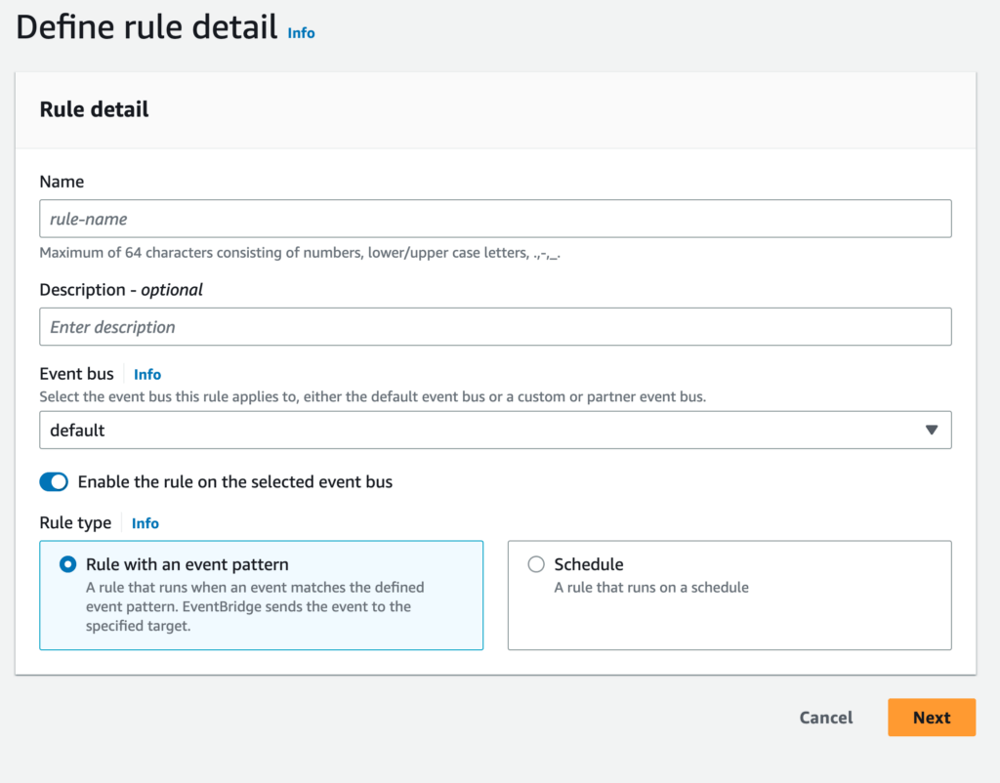
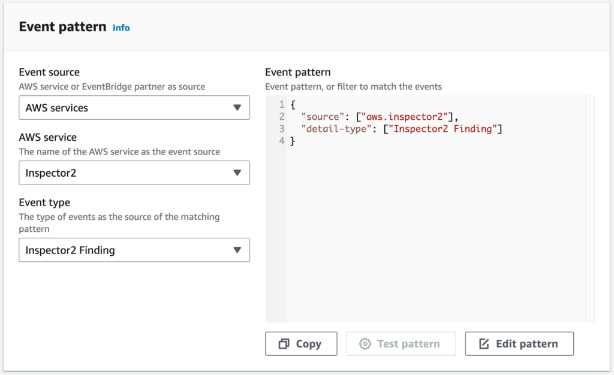

[AWS Inspector](https://aws.amazon.com/inspector/) is an automated vulnerability management service that continually scans AWS workloads for software vulnerabilities and unintended network exposure, improving the security and compliance of applications deployed on AWS. Using a hybrid approach of agent-based and agentless assessments, it provides comprehensive evaluations of network, host, and application security. The service is easy to set up and can be integrated with other AWS services.

This tutorial demonstrates how to integrate AWS Inspector with Coralogix using [Amazon EventBridge](https://aws.amazon.com/eventbridge/) API destinations.

## Configuration

**STEP 1**. Create API destination and connection by following these [EventBridge instructions](https://coralogixstg.wpengine.com/docs/amazon-eventbridge/).

**STEP 2**. Create a new rule.

- Select the appropriate **Event bus**.

- Select **Rule Type** with an event patten.

- Click **Next**.

**STEP 3**. Define **Event pattern**.

- Select Inspector2 as **AWS service**.

- Select Inspector Findings as **Event type**.

**STEP 4**. Define the **target**.

- Select EventBridge API Destination as **Target Types**.

- Select the destination you created in **STEP 1** from the drop-down menu as **API destination**.

- Create a new **Execution role**. If you have an existing role in place, click **Use existing role** and select it from the list.

- Click **Next**.add tags if needed and **Next** > **Create rule**

**STEP 5**. Add **Tags** if needed. Click **Next**.

**STEP 6**. Click **Create rule**.

## Support

**Need help?**

Our world-class customer success team is available 24/7 to walk you through your setup and answer any questions that may come up.

Feel free to reach out to us **via our in-app chat** or by sending us an email at [support@coralogixstg.wpengine.com](mailto:support@coralogixstg.wpengine.com).
