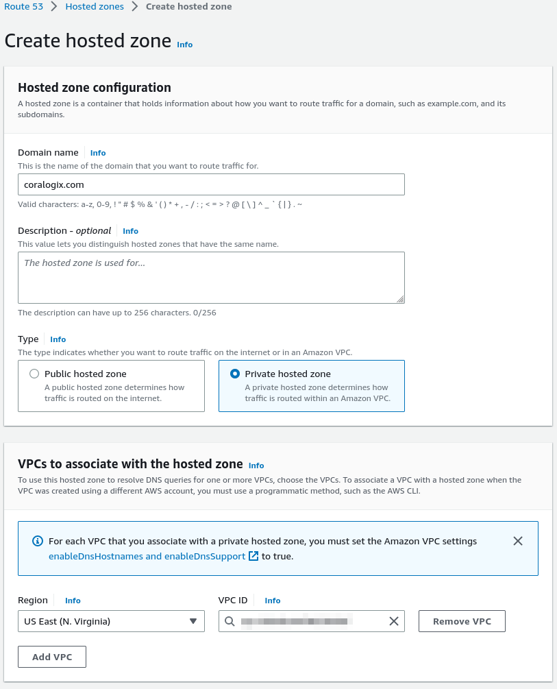
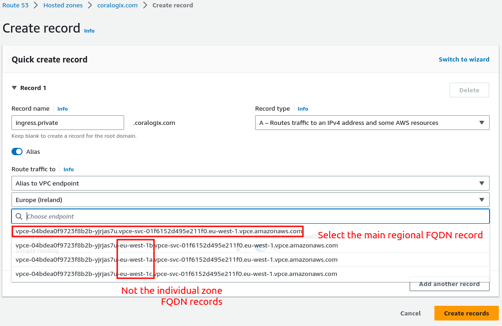
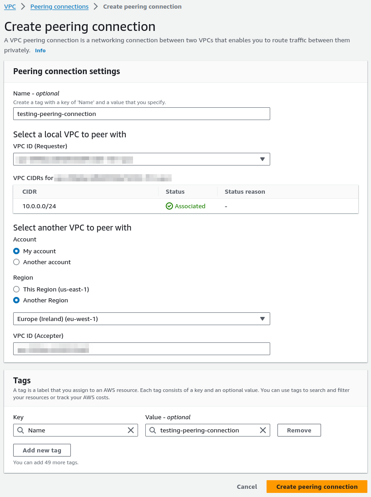
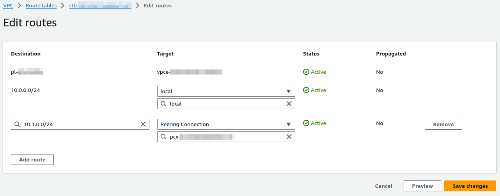

To utilize our [Coralogix AWS PrivateLink](https://coralogixstg.wpengine.com/docs/coralogix-amazon-web-services-aws-privatelink-endpoints/) feature, it is essential to establish a VPC endpoint within the Coralogix AWS region corresponding to your Coralogix domain—commonly referred to as a **same-region VPC**.

In cases where your AWS resources for monitoring are located in a different region, you can achieve the required connectivity by employing VPC peering. This involves deploying your Lambda in a **cross-region VPC**, strategically positioned in proximity to the source.

This tutorial provides step-by-step guidance on configuring your **cross-region VPC** setup. The configuration ensures that any traffic directed to the PrivateLink domain name follows a route through the VPC peering connection in the same region, ultimately reaching the PrivateLink endpoint.

## Prerequisites

When your Lambda is being deployed into a cross-region VPC, use VPC peering to allow the Lambda local VPC to communicate over the PrivateLink through the same-region VPC. To do this, [configure the same-region VPC](https://coralogixstg.wpengine.com/docs/coralogix-amazon-web-services-aws-privatelink-endpoints/).

## VPC Peering Configuration

**STEP 1**. Configure the DNS record to give it time to propagate.

- Navigate to **Route 53**.

- Create a new **private** **hosted zone** for your Coralogix [domain](https://coralogixstg.wpengine.com/docs/coralogix-domain/) and align it with your Lambda local VPC.

- Click **Created hosted zone**.

**STEP 2**. Configure an **A record type** pointing to the PrivateLink VPC endpoint.

- In the private hosted zone, set the **record name** to `ingress.private`, with an **alias to VPC endpoint** - that is, an alias pointing to the VPC PrivateLink endpoint of your same-region VPC.

- Select the main regional endpoint that does **not** include availability zone references.

- Click **Create records**.

**Notes**:

- The Route 53 rules may take some time to propagate.

**STEP 3**. Set up the VPC peering connection between the two VPCs.

- Navigate to the VPC console of the cross-region VPC.

- Select **Peering Connections** in the left-hand menu.

- Select **Create Peering Connection**.

**STEP 4**. Set the VPC ID (Requester) to the cross-region VPC that will host your Lambda.

- In the **local** **VPC to peer with** section, select the region of your same-region VPC.

- Manually enter the VPC ID (Accepter) of the same-region VPC.

- Click **Create peering connection**.

**STEP 5**. Find and accept the VPC peering request in the target region.

- Switch regions.

- In the **Peering Connections**, find and accept the request.

**STEP 6**. Adjust your routing tables.

- Adjust the **routing tables** of the cross-region VPC subnets.

- Validate that the routing table(s) in use by the subnets include routes to the same-region VPC CIDR range. The **Target** will be the peering connection you just created.

- Click **Save changes**.

**STEP 7**. Once you’ve added the route to all of your subnets, do the same for the same-region VPC. This ensures return traffic can be routed back to the cross-region VPC.

**Notes**:

- You will likely want an Internet or NAT gateway configured for testing purposes.

## Next Steps

Align the VPC to your Lambda. Instructions can be found [here](https://coralogixstg.wpengine.com/docs/aws-privatelink-lambda-configuration/).

## Support

**Need help?**

Our world-class customer success team is available 24/7 to walk you through your setup and answer any questions that may come up.

Feel free to reach out to us **via our in-app chat** or by sending us an email at [support@coralogixstg.wpengine.com](mailto:support@coralogixstg.wpengine.com).
