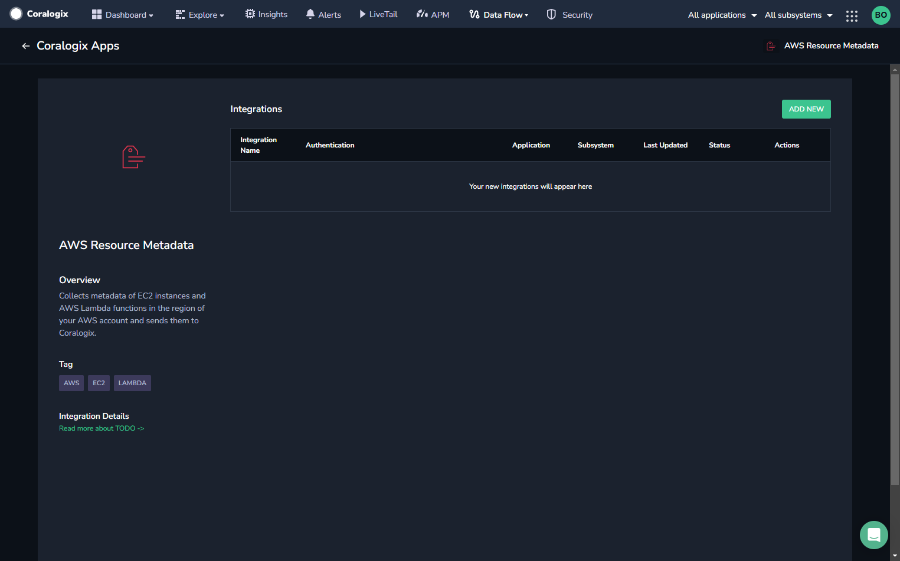
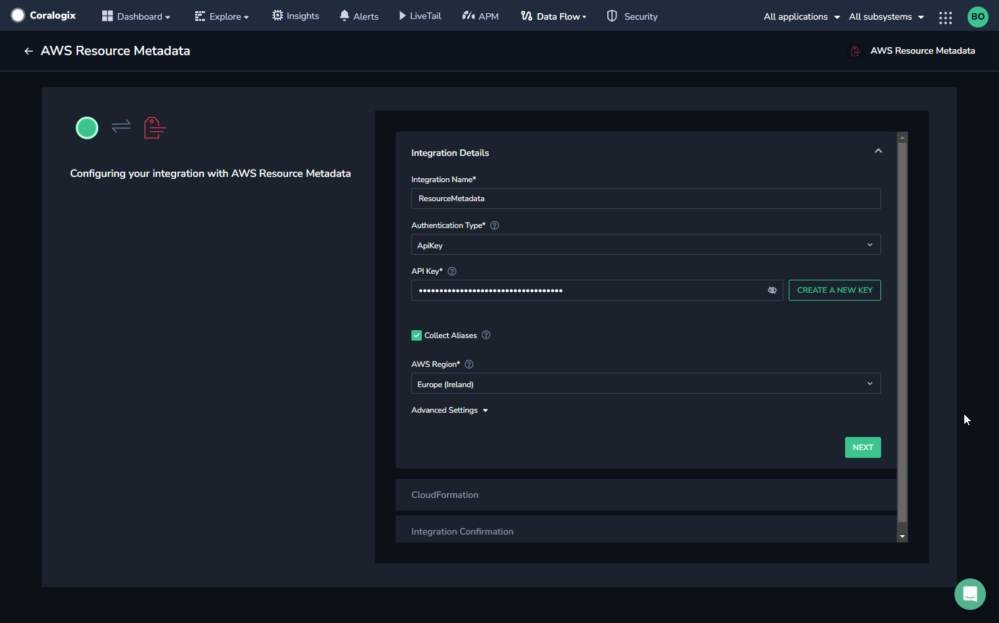
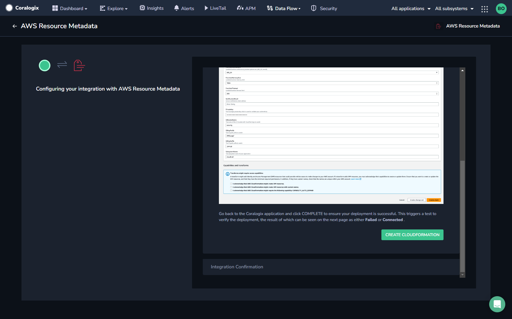
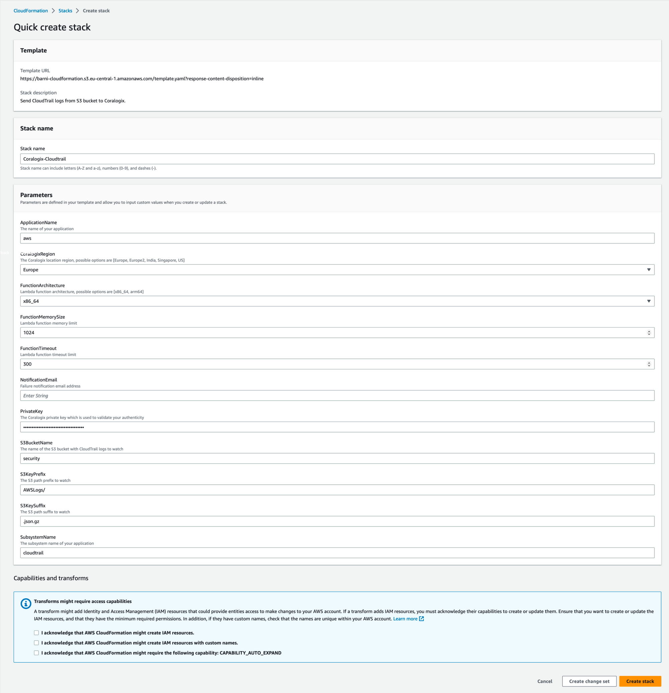
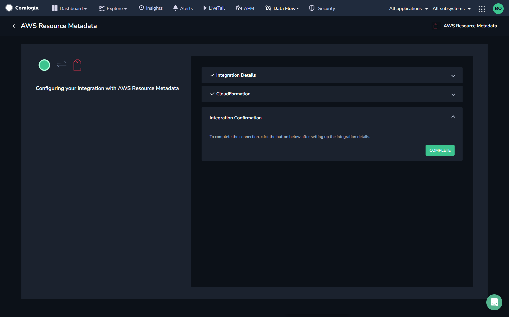
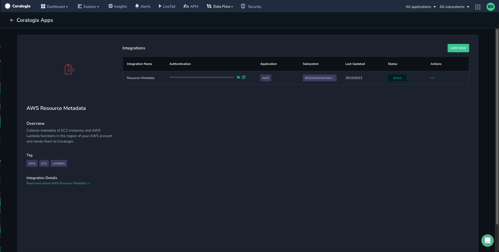

Deploy the **AWS Resource Metadata Collection** AWS Lambda function in your AWS account. The function collects **metadata** of EC2 instances and AWS Lambda functions in the region of your AWS account and sends them to Coralogix.

## Overview

AWS resources can be vast and interconnected. To better understand log data and troubleshoot issues, it's important to have context about which AWS resources are involved. The [AWS Resource Metadata Collection](https://serverlessrepo.aws.amazon.com/applications/eu-central-1/597078901540/Coralogix-Resource-Metadata) integration collects information about AWS resources that are associated with log events. This contextual information can include details about the AWS service, resource tags, AWS region, timestamps for resource creation or modification, and any relevant custom tags specific to the organization's AWS environment.

## Benefits

The collection of EC2 instance and Lambda function metadata serves as a foundation for better AWS resource management, optimization, security, and efficient troubleshooting. It helps you make informed decisions and take actions based on a more comprehensive understanding of your AWS resources and their interactions.

- **Improve Troubleshooting**. The metadata can provide valuable operational insights into your AWS environment. You can analyze resource-specific patterns, performance trends, and utilization to ensure your applications run smoothly. Having resource context helps in identifying the source of issues more quickly and accurately.

- **Resource Optimization**. By collecting metadata, you can understand the relationships between different AWS resources, such as how Lambda functions interact with specific EC2 instances or other services. This can be essential for monitoring and managing complex AWS architectures, and making informed decisions about resource usage and optimization.

- **Security and Compliance**. Resource metadata can assist in security monitoring, compliance reporting, and auditing.

- **Cost Management**. Understanding resource attributes can be valuable for cost management and allocation.

## Prerequisites

- AWS account

- Permissions to create Lambda functions

- If you are using Secret Manager you should first deploy the [SM Lambda layer](https://serverlessrepo.aws.amazon.com/applications/eu-central-1/597078901540/Coralogix-Lambda-SSMLayer). Note that you should only deploy one layer per region.

## Configuration

**STEP 1.** In your navigation pane, click **Data Flow** > **Integrations**. View the list of available integrations.

**STEP 2.** Select **AWS Resource Metadata**.

**STEP 3.** Click **\+ ADD NEW**.

**STEP 4.** Input the Integration Details.

- Input a name for your integration.

- Select the authentication type, either **APIKey** or **Existing Secret**.
    - If using an API key, input an existing Coralogix [Send-Your-Data API Key](https://coralogixstg.wpengine.com/docs/send-your-data-api-key/) or click **CREATE NEW KEY**.
    
    - If using an existing secret, enter the AWS Secret Name.

- Mark the **Collect Aliases** checkbox if you want to collect the aliases of the resources.

- Select your **AWS Region** from the dropdown list.

- If you want to use AWS PrivateLink, click **Advanced Settings** and mark the **Use AWS PrivateLink** checkbox. AWS PrivateLink is a service that facilitates secure and private connections between VPCs and AWS services, bypassing the need for the public internet. It is worth noting that the integration might not succeed if AWS PrivateLink is not properly set up.

**STEP 5.** Click **NEXT**.

**STEP 6.** View the instructions for your integration, then click **CREATE CLOUDFORMATION**.

**STEP 7.** You will be rerouted to the AWS website. Verify that all of the auto pre-populated values are correct, then click the acknowledgement checkboxes, and click **Create Stack**.

**STEP 8.** Go back to the Coralogix application and click **COMPLETE** to ensure your deployment is successful. This triggers a test to verify the deployment, the result of which can be seen on the next page as either **Failed** or **Connected**.

**STEP 9.** View your integration information.

**STEP 10.** Upon successful deployment, leverage the Coralogix APM [Serverless Monitoring](https://coralogixstg.wpengine.com/docs/serverless-monitoring/) feature to access detailed insights into the Lambda functions operating within the deployed region.

## Additional Resources

<table><tbody><tr><td>Documentation</td><td><strong><a href="https://coralogixstg.wpengine.com/docs/extension-packages/">Coralogix Extension Packages</a></strong></td></tr></tbody></table>

## Support

**Need help?**

Our world-class customer success team is available 24/7 to walk you through your setup and answer any questions that may come up.

Feel free to reach out to us **via our in-app chat** or by sending us an email at [support@coralogixstg.wpengine.com](mailto:support@coralogixstg.wpengine.com).
