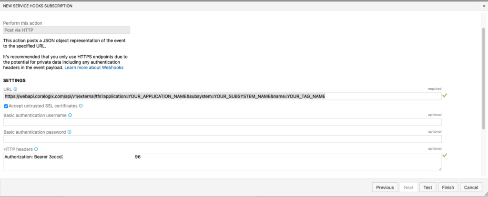

### Integrate Coralogix with your Azure DevOps Server deployment pipelines

Coralogix supports integration with `Azure DevOps Server` webhooks, use webhooks to inform Coralogix when a new build is issued.

1. Sign in to Azure DevOps Server using your user credentials.

3. Select your team project.

5. Click settings.

7. Go to Service hooks.

9. Click add new service hooks.

11. Select “Web Hooks"

13. Select “**Build Completed**” as the trigger**.**

15. Select Build Status “**Succeeded**”  and click **Next.**
    1. You may choose any filter as you desire.

17. Add URL: https://webapi.coralogixstg.wpengine.com/api/v1/external/tfs?application=YOUR\_APPLICATION\_NAME&subsystem=YOUR\_SUBSYSTEM\_NAME&name=YOUR\_TAG\_NAME  
      
    **If your account ends with .us you want to put .us in the URL.**
    1. Application - your desired application name - please use an identical name to correspond with your logs application name. - **must**
    
    3. Subsystem - your desired system name - please use an identical name to correspond with your logs subsystem name. you can add more than 1 subsystem name separated by a comma.

19. Headers - include headers with the following properties:
    1. Authorization: Bearer <YOUR\_Alerts & Rules & Tags API Key>  
          
        The API key should be taken from _`Data Flow **>** API Keys **>** Alerts, Rules and Tags API Key`_

