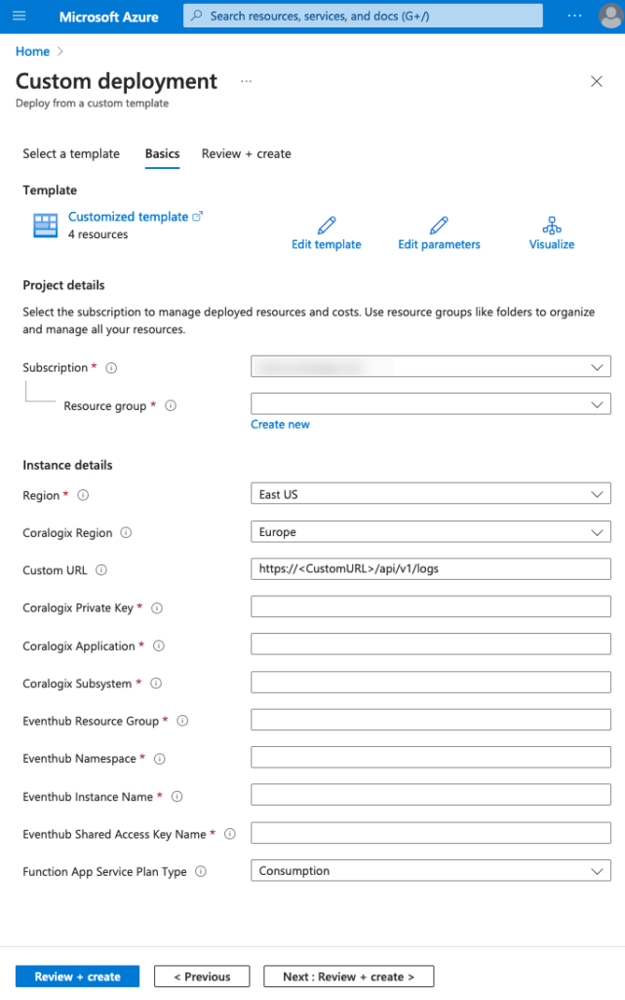

Azure Event Hubs can ingest large volumes of data from various sources, such as applications, devices, and sensors. For monitoring purposes, you can configure your systems or applications to send relevant monitoring data as events to an Event Hub.

Coralogix provides seamless integration with Azure cloud, allowing you to send your logs from anywhere and parse them according to your needs. Deploy the Event Hub integration to send Coralogix your JSON-formatted queue messages using the ARM template below.

## Prerequisites

- Azure account with an active subscription

## Azure Resource Manager Template Deployment

Sign into your Azure account and deploy the Event Hub integration by clicking [here](https://portal.azure.com/#create/Microsoft.Template/uri/https%3A%2F%2Fraw.githubusercontent.com%2Fcoralogix%2Fcoralogix-azure-serverless%2Fmaster%2FEventHub%2FARM%2FEventHub.json).

### Fields

<table><tbody><tr><td><strong>Field</strong></td><td><strong>Description</strong></td></tr><tr><td><strong>Subscription</strong></td><td>Azure subscription within which you wish to deploy the integration. Must be the same as the monitored Event Hub namespace</td></tr><tr><td><strong>Resource Group</strong></td><td>Resource group in which you wish to deploy the integration</td></tr><tr><td><strong>Coralogix Region</strong></td><td>Region associated with your <a href="https://coralogixstg.wpengine.com/docs/coralogix-domain/"><strong>Coralogix domain</strong></a></td></tr><tr><td><strong>Custom URL</strong></td><td>Custom URL associated with your Coralogix account. Ignore if you do not have a custom URL.</td></tr><tr><td><strong>Coralogix Private Key</strong></td><td>Coralogix&nbsp;<a href="https://coralogixstg.wpengine.com/docs/send-your-data-api-key/"><strong></strong></a><strong><a href="https://coralogixstg.wpengine.com/docs/send-your-data-api-key/">Send-Your-Data API key</a></strong></td></tr><tr><td><strong>Coralogix Application</strong></td><td>Mandatory <strong><a href="https://coralogixstg.wpengine.com/docs/application-and-subsystem-names/">metadata field</a> </strong>sent with each log and helps to classify it</td></tr><tr><td><strong>Coralogix Subsystem</strong></td><td>Mandatory <a href="https://coralogixstg.wpengine.com/docs/application-and-subsystem-names/"><strong>metadata field</strong></a> sent with each log and helps to classify it</td></tr><tr><td><strong>Event Hub Resource Group</strong></td><td>Name of the resource group that contains the Event Hub</td></tr><tr><td><strong>Event Hub Namespace</strong></td><td>Name of the Event Hub namespace</td></tr><tr><td><strong>Event Hub Instance Name</strong></td><td>Name of the Event Hub instance to be monitored</td></tr><tr><td><strong>Event Hub Shared Access Policy Name</strong></td><td>Name of the shared access policy of the Event Hub namespace</td></tr><tr><td><strong>Function App Service Plan Type</strong></td><td>Type of service plan to use for the integration. Consumption is cheapest with support for 'public' Event Hubs. Use Premium if you need to use VNet to configure access to restricted Event Hubs.</td></tr></tbody></table>

**Notes**:

- The Event Hub integration allows parsing of queue messages in JSON format.

- Other format messages will **not** be processed and submitted to the Coralogix platform.

## Optional Configuration Options

If your Event Hub has restricted access, review this [optional configuration documentation](https://coralogixstg.wpengine.com/docs/optional-configurations-microsoft-azure/) to learn about VNet support options.

## Additional Resources

<table><tbody><tr><td>Github</td><td><a href="https://github.com/coralogix/coralogix-azure-serverless/tree/master/EventHub"><strong>Event Hub Documentation</strong></a></td></tr><tr><td>Terraform</td><td><a href="https://coralogixstg.wpengine.com/docs/terraform-modules-for-azure-eventhub/"><strong>Terraform Modules for Microsoft Azure Event Hub</strong></a></td></tr><tr><td>Microsoft Azure Functions Manual Integrations</td><td><a href="https://coralogixstg.wpengine.com/docs/blobstorage-microsoft-azure-functions/"><strong>Blob Storage</strong></a> <a href="https://coralogixstg.wpengine.com/docs/queue-storage-microsoft-azure-functions/"><strong>Queue Storage</strong></a></td></tr><tr><td>Microsoft Azure Functions Serverless Integration</td><td><strong>Coralogix Azure serverless integration deployment container</strong></td></tr></tbody></table>

## Support

**Need help?**

Our world-class customer success team is available 24/7 to walk you through your setup and answer any questions that may come up.

Feel free to reach out to us **via our in-app chat** or by sending us an email at [support@coralogixstg.wpengine.com](mailto:support@coralogixstg.wpengine.com).
