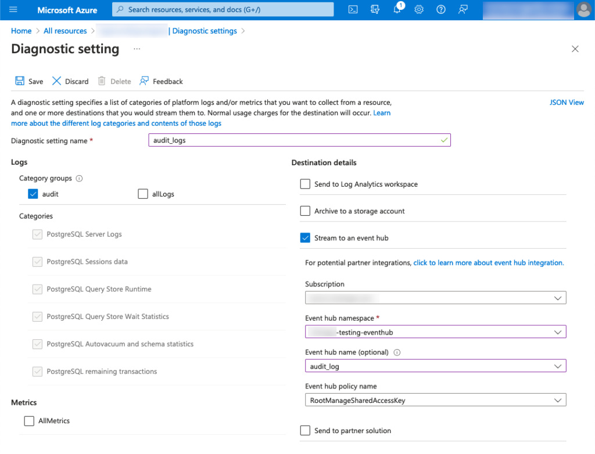

Collect **Azure Resource logs** and send them to Coralogix for seamless integration.

## Overview

[Resource logs](https://www.notion.so/Azure-Resource-Logs-baf7ce1fc5e340989143c3c15c532d24?pvs=21) \[previously referred to as diagnostic logs\] capture resource-specific audit information, providing insight into operations performed within an Azure resource. This is known as the data plane. Examples include a connection made to a PostgreSQL server or when a Blob is created, read, or deleted from a storage account. The contents of resource logs vary according to the Azure service and resource type.

This tutorial demonstrates how to collect Azure resource audit logs and submit them to Coralogix. To do so, you will need to configure your resource’s Diagnostic Settings and leverage our [Event Hub integration](https://coralogixstg.wpengine.com/docs/azure-eventhub-trigger-function/) for the collection and submission of those logs to the Coralogix platform.

## Prerequisites

- Azure account with an active subscription

- EventHub Namespace \[**Note**: If your EventHub has restricted public access you will need to enable VNet support using these [optional configuration steps](https://coralogixstg.wpengine.com/docs/optional-configurations-microsoft-azure/).\]

## Resource Audit Log Export

**STEP 1**. To configure resource audit logs, navigate to your desired resource.

**STEP 2**. Under Monitoring, click **Diagnostic Settings**.

**STEP 3**. Click **\+ Add diagnostic setting**.

**STEP 4**. In the Diagnostic Setting window, select the Audit category. Configure the Destination Details to submit entries to your existing Event Hub.

**Notes:**

- Not all resource types have audit logs.

- In this example, we’re looking at a PostgreSQL database.

## Process Event Hub

Now that your resource audit log entries are being exported to your Event Hub, you’ll need to deploy the Azure Event Hub integration to collect and submit the messages to the Coralogix platform.

To do so, you can deploy via ARM template or Terraform:

- ARM
    - [Azure Event Hub ARM](https://coralogixstg.wpengine.com/docs/azure-eventhub-trigger-function/)
    
    - [ARM Event Hub Integration Package](https://coralogixstg.wpengine.com/docs/azure-resource-manager-arm-integration-packages/)

- Terraform
    - [Azure Event Hub Terraform](https://coralogixstg.wpengine.com/docs/terraform-modules-for-azure-eventhub/)

## Additional Resources

<table><tbody><tr><td>Documentation</td><td><strong><a href="https://www.notion.so/microsoft-azure-functions-a4ced743a96d4b79be76e271fbf368e9?pvs=21">Introduction to Microsoft Azure</a></strong></td></tr></tbody></table>

## Support

**Need help?**

Our world-class customer success team is available 24/7 to walk you through your setup and answer any questions that may come up.

Feel free to reach out to us **via our in-app chat** or by sending us an email at [support@coralogixstg.wpengine.com](mailto:support@coralogixstg.wpengine.com).
