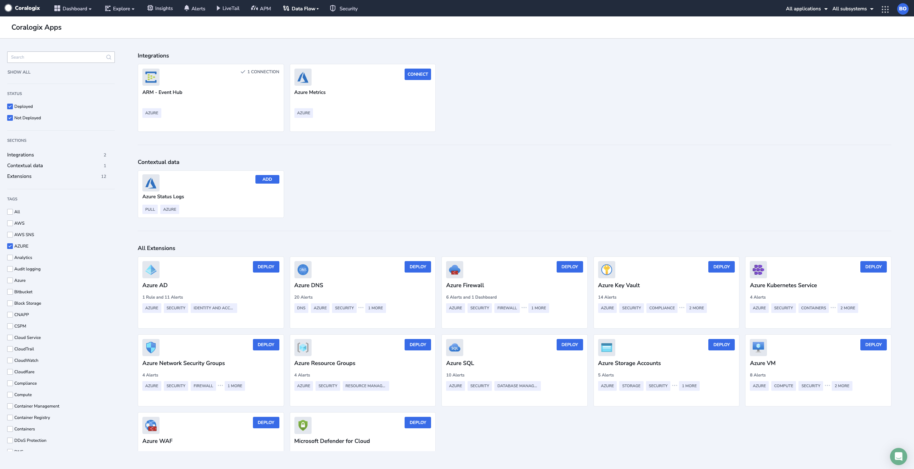
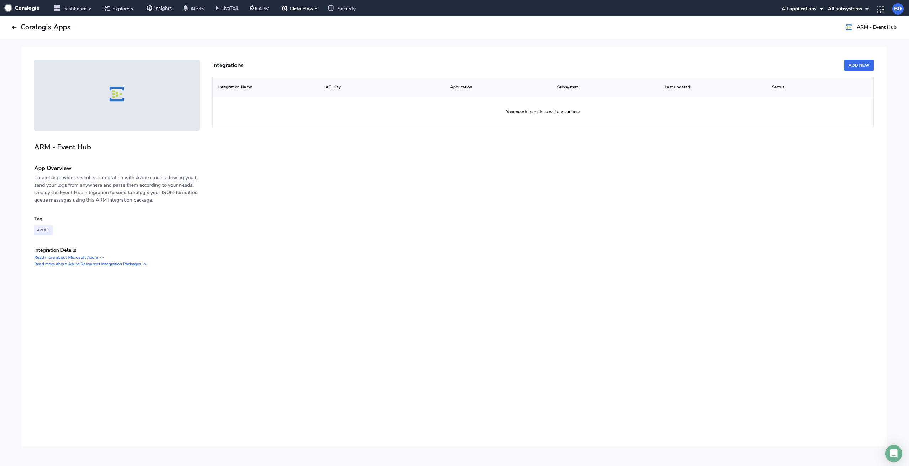
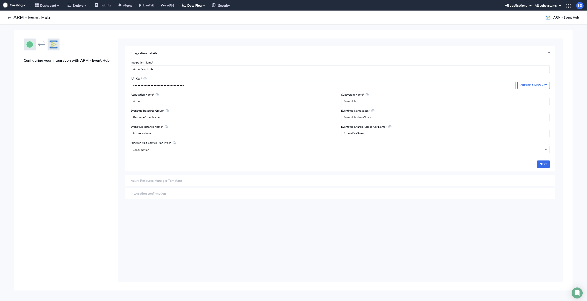
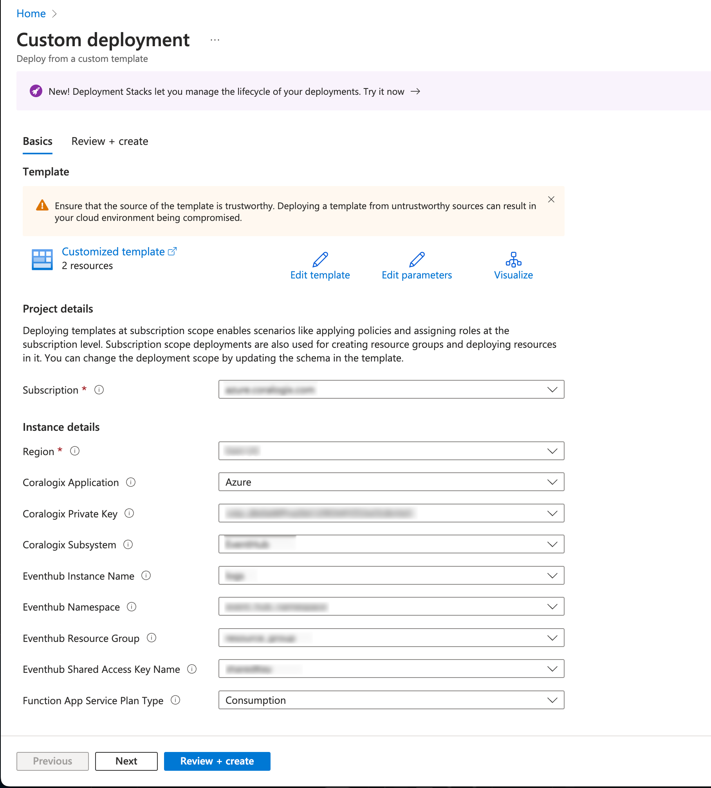
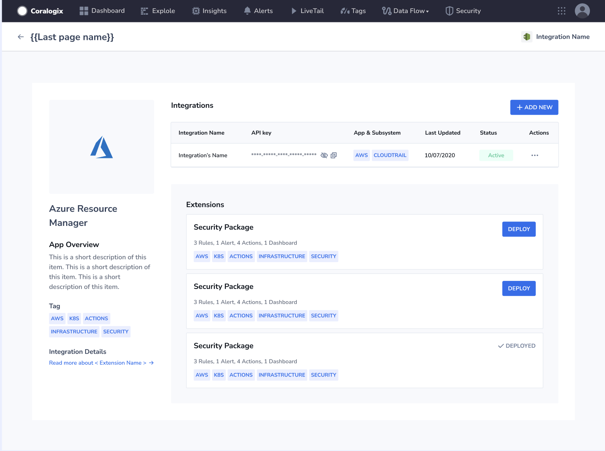
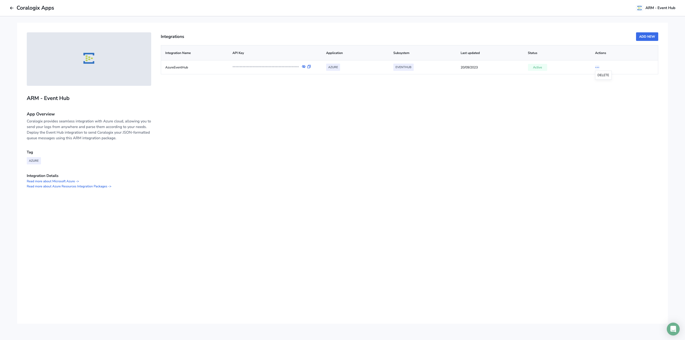
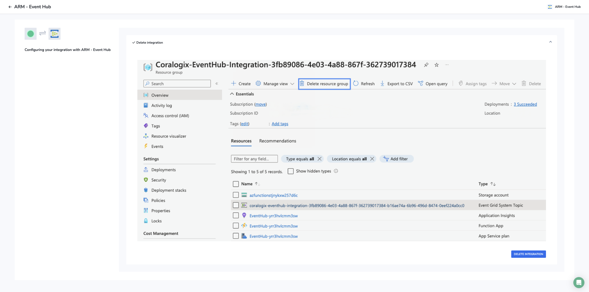
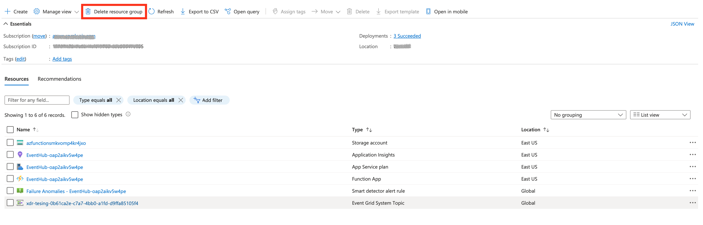
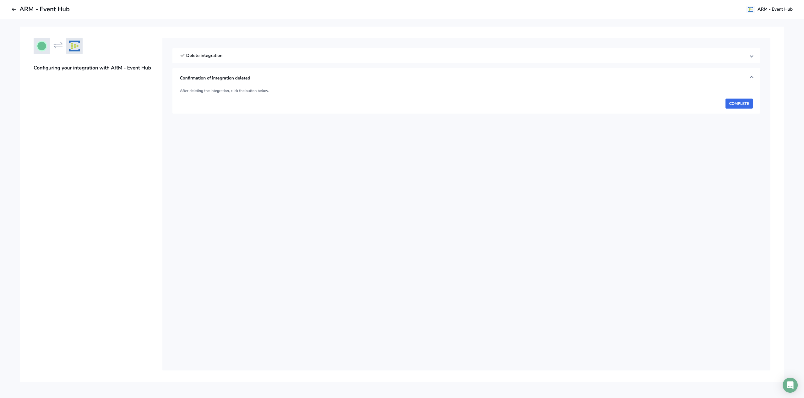

Access our **Azure Resource Manager (ARM) Integration Packages** to automatically deploy our various [Microsoft Azure](https://coralogixstg.wpengine.com/docs/introduction-to-microsoft-azure/) integrations. Extend your platform capabilities with packages and sources, without expending unnecessary time and resources. Gain insights into role, user, group and directory management, successful and failed sign-in events, and application management data that helps you understand your users’ experience and immediately troubleshoot any errors.

## Overview

Coralogix offers Azure Resource Manager (ARM) custom template deployments to build your Azure log and metric pipelines using our Azure Resources Integration Packages. Each template creates a unique dedicated resource group, to which Azure Monitor streams logs or metrics. Additionally, an Azure function is created for sending monitoring data to Coralogix, and storage accounts are established to which the function writes its own log messages about successful and failed transmissions.

Choose from any of our ARM custom template deployments:

- **Event Hub**

- **Blob Storage**

- **Queue Storage**

- **Diagnostic Data**

## Prerequisites

- Azure account with an active subscription

## Deploy the ARM Integration Package

**STEP 1.** In your Coralogix menu bar, navigate to **Data Flow** > **Integrations**. View the list of available integrations in **Coralogix Apps**.

**STEP 2.** Click **CONNECT** in the ARM deployment of choice.

**STEP 3.** View application details in the **App Overview**. For more information, click on the links under **Integration Details**. You will also see a list of [extension packages](https://coralogixstg.wpengine.com/docs/extension-packages/) available for the integration.

**STEP 4.** Click **\+ ADD NEW**.

**STEP 5.** Define your Settings.

| Common Field | Description |
| --- | --- |
| API Key | Coralogix [**Send-Your-Data API key**](https://coralogixstg.wpengine.com/docs/send-your-data-api-key/) |
| Application Name | Mandatory [**metadata field**](https://coralogixstg.wpengine.com/docs/application-and-subsystem-names/) sent with each log and helps to classify it |
| Subsystem Name | Mandatory [**metadata field**](https://coralogixstg.wpengine.com/docs/application-and-subsystem-names/) sent with each log and helps to classify it |

**STEP 6.** Click **NEXT**.

## Configure the ARM Template

**STEP 1.** Click **OPEN ARM**.

**STEP 2**. You will rerouted to your Microsoft Azure account in a new tab. Configure the custom ARM template by filling in the relevant fields.

### Common **Fields**

| Field | Description |
| --- | --- |
| Subscription | Azure subscription within which you wish to deploy the integration. Must be the same as the monitored Event Hub namespace |
| Coralogix Region | Region associated with your Coralogix [**domain**](https://coralogixstg.wpengine.com/docs/coralogix-domain/) |
| Custom URL | Custom URL associated with your Coralogix account. Ignore if you do not have a custom URL. |

### Event Hub / Diagnostic Data

| Field | Description |
| --- | --- |
| Event Hub Resource Group | Name of the resource group that contains the Event Hub |
| Event Hub Namespace | Name of the Event Hub namespace |
| Event Hub Instance Name | Name of the Event Hub instance to be monitored |
| Event Hub Shared Access Policy Name | Name of the shared access policy of the Event Hub namespace |
| Function App Service Plan Type | Type of service plan to use for the integration. Consumption is cheapest with support for ‘public’ Event Hubs. Use Premium if you need to use VNet to configure access to restricted Event Hubs. |

### Blob Storage

| Field | Description |
| --- | --- |
| Storage Account Name | Name of the storage account containing the Blob container. Must be Storagev2 (general purpose v2) type. |
| Storage Account Resource Group | Resource Group name of the storage account containing the Blob container to be monitored |
| Blob Container Name | Name of the Blob container to be monitored |
| Event Grid System Topic Name | Name of a pre-existing Event Grid system topic for the storage account containing the Blob container. Leave as ‘New’ to create one. |
| Newline Pattern | Newline pattern expected within the Blob storage documents |
| Prefix Filter | Prefix filter to apply to the Blob container. Use ‘NoFilter’ to refrain from filtering by prefix. Wildcards are not allowed. Use the following format: /subfolder1/subfolder2/. |
| Suffix Filter | Suffix filter to apply to the Blob container. Use ‘NoFilter’ to refrain from filtering by suffix. Wildcards are not allowed. Use the following format: .log. |
| Function App Service Plan Type | Type of service plan for the function app. Choose ‘Premium’ if you need vNet support. |

### Queue Storage

| Field | Description |
| --- | --- |
| Storage Account Name | Name of the storage account containing the storage queue. Must be of StorageV2 (general purpose V2) type. |
| Storage Account Resource Group | Name of the storage account resource group containing the storage queue to be monitored |
| Storage Queue Name | Name of the Storage Queue to be monitored |
| Function App Service Plan Type | Type of the function app service plan. Choose ‘Premium’ if you need VNet support. |

**STEP 3**. Click **Next: Review + create >**.

**STEP 4**. Review your configuration settings. If correct, click **Create**.

## Validation

**STEP 1.** Revert back to **Coralogix Apps** in the previous tab and click **COMPLETE** to ensure your deployment is successful. This triggers a test to verify the deployment, the result of which is displayed as either **Active** or **Failed**.

**STEP 2.** Deploy the [extension package](https://coralogixstg.wpengine.com/docs/extension-packages/) of your choice to complement your integration needs.

**STEP 3.** Once the verification process is complete and you have deployed your extension package, view your logs in your Coralogix dashboard.

## Remove / Modify the ARM Integration Package

To remove / modify this integration, you will need to delete the dedicated resource group created during deployment.

**STEP 1**. In your Coralogix menu bar, navigate to **Data Flow** > **Extensions**. Access the ARM integration package.

**STEP 2**. In the opening screen, click on the More Options icon \[…\] under **Actions**. Select **DELETE**.

**STEP 3**. Click **DELETE INTEGRATION**.

**STEP 4**. You will rerouted to your Microsoft Azure account. Select the relevant resource group. Click **Delete resource group**.

**STEP 5**. Click **COMPLETE** in your Coralogix UI to revert back to the **App Overview**.

## Additional Resources

<table><tbody><tr><td>Documentation</td><td><strong><a href="https://coralogixstg.wpengine.com/docs/introduction-to-microsoft-azure/">Introduction to Microsoft Azure</a></strong> <strong><a href="https://coralogixstg.wpengine.com/docs/extension-packages/">Extension Packages</a></strong></td></tr></tbody></table>

## Support

**Need help?**

Our world-class customer success team is available 24/7 to walk you through your setup and answer any questions that may come up.

Feel free to reach out to us **via our in-app chat** or by sending us an email at [support@coralogixstg.wpengine.com](mailto:support@coralogixstg.wpengine.com).
