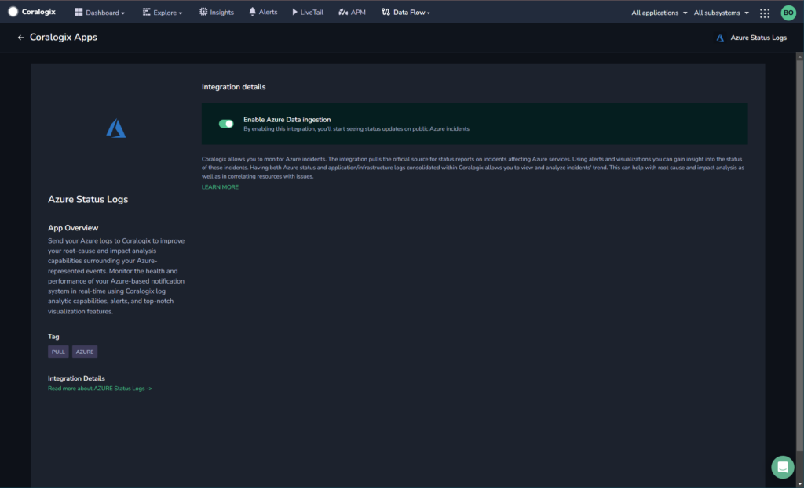

Collect your Microsoft Azure Status log messages in the Coralogix platform using our automatic **Contextual Data Integration Package**. The package lets you enable Azure Status log data ingestion to allow you to see status updates on public Azure incidents.

## Overview

Microsoft Azure, commonly referred to as Azure, is a comprehensive cloud computing platform and infrastructure offered by Microsoft. It provides a vast array of cloud services that encompass computing, storage, databases, networking, analytics, artificial intelligence, Internet of Things (IoT), and more. Azure allows organizations to build, deploy, and manage applications and services across a global network of data centers, offering scalability, flexibility, and reliability. With a wide range of tools, frameworks, and languages, Azure enables businesses to accelerate digital transformation, enhance productivity, and innovate by harnessing the power of cloud technology and integrating seamlessly with existing IT environments.

Forwarding your Azure status logs to Coralogix simplifies log consolidation, enhances monitoring capabilities, and streamlines issue resolution. By directing Azure status logs to Coralogix, you gain a unified perspective on your Azure infrastructure's status, enabling swift identification of irregularities, proactive problem-solving, and informed decision-making. This integration empowers teams to optimize resource allocation, bolster system dependability, and uphold operational efficiency, utilizing Coralogix's analytical, alerts, and visualization features to extract actionable insights from Azure status logs and ensure a resilient cloud environment.

## Get Started

**STEP 1.** In your navigation pane, click **Data Flow** > **Contextual Data**.

**STEP 2.** In the **Contextual Data** section, select **Azure** and click **ADD**.



**STEP 3.** Click **Enable Azure Data Ingestion**.

## Example Log

```
{
	"source_system": "azure",
	"azure": {
		"uri": "azure-front-door-connectivity-issues-and-increased-latency-applying-mitigation",
		"title": "Azure Front Door - Connectivity issues and increased latency - Applying Mitigation",
		"date": "2021-07-12T16:00:05Z",
		"description": "&lt;p&gt;Starting approximately 16:00 UTC, on 12 Jul 2021, a subset of customers primarily in US, Canada region may experience connection timeouts and increased latency to Azure front door and Azure CDN services. Retries may be successful on the resources\/environments experiencing issues.&lt;\/p&gt;&lt;p&gt;&lt;br&gt;&lt;\/p&gt;&lt;p&gt;&lt;strong&gt;Current Status&lt;\/strong&gt;: Initial investigation indicates an increase in traffic in US region, which exceeded the available capacity in 3 edge locations in the US. We have completed&nbsp;rebalancing traffic to other available edge locations nearby. Customers should see signs of successful connections. We are monitoring the service health to ensure full recovery. The next update will be in 60 minutes, or as events warrant.&lt;\/p&gt;",
		"categories": ["Azure Front Door", "Content Delivery Network", "Public Non-Regional"],
		"tags": []
	}
}

```

## Support

**Need help?**

Our world-class customer success team is available 24/7 to walk you through your setup and answer any questions that may come up.

Feel free to reach out to us **via our in-app chat** or by sending us an email at [support@coralogixstg.wpengine.com](mailto:support@coralogixstg.wpengine.com).
