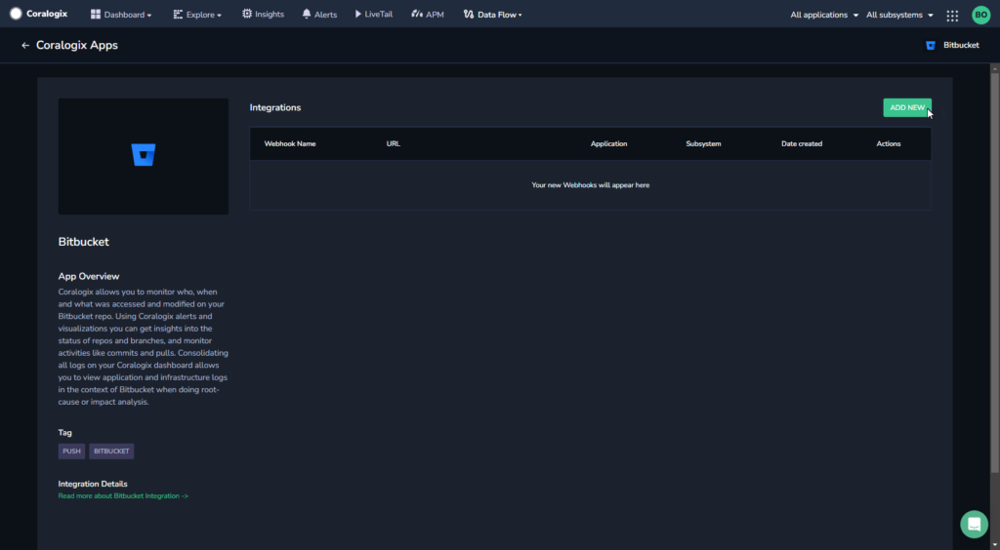
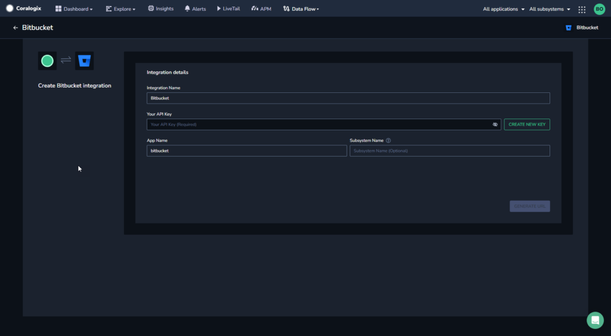
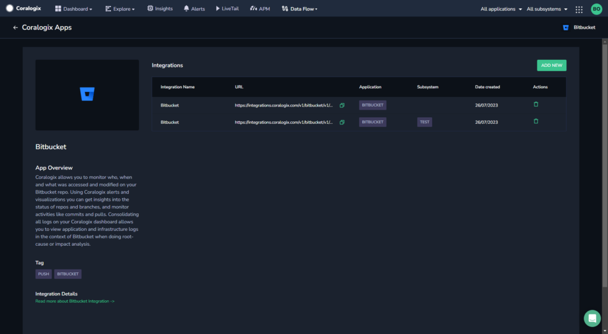
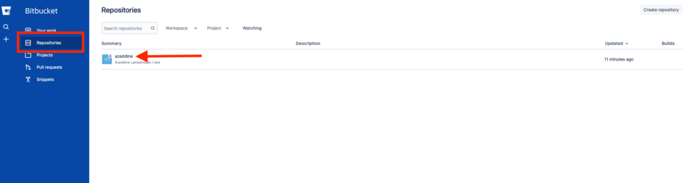
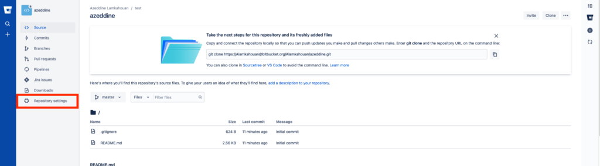
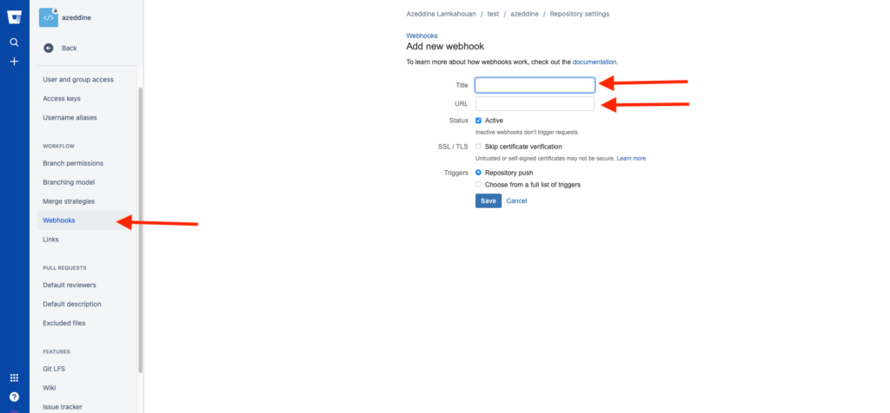

Collect your Bitbucket messages in the Coralogix platform using our automatic **Contextual Data Integration Package**. The package automatically generates a URL to be used when creating a Bitbucket webhook.

## Overview

Bitbucket is a web-based platform that facilitates version control and collaboration for software development projects, owned by Atlassian. Bitbucket offers Git and Mercurial repositories, allowing teams to efficiently manage and track changes to their codebase. It provides features like pull requests, code reviews, issue tracking, and continuous integration, enabling developers to collaborate seamlessly, maintain code quality, and streamline the development workflow. Bitbucket supports both public and private repositories, making it a versatile choice for individual developers and teams of all sizes.

Send your Bitbucket logs to Coralogix to enhance log consolidation, strengthen monitoring capabilities, and streamline issue resolution. By directing Bitbucket logs into Coralogix, you can achieve a comprehensive view of your code repository activities, enabling swift anomaly detection, proactive debugging, and informed decision-making. This integration empowers teams to optimize development workflows, fortify system reliability, and maintain operational effectiveness, leveraging Coralogix's analytics, alerts, and visualization tools to extract valuable insights from Bitbucket logs and ensure a productive and resilient software development environment.

## Get Started

**STEP 1.** In your navigation pane, click **Data Flow** > **Contextual Data**.

**STEP 2.** In the **Contextual Data** section, select **Bitbucket** and click **+** **ADD**.



**STEP 3.** Click **ADD NEW**.

**STEP 4.** Fill in the **Integration Details**:

- **Name.** Name your integration.

- **Your API Key**. Click **CREATE NEW KEY** to generate an API Key and name it.

- **Application Name and Subsystem Name**. Enter an [application and subsystem name](https://coralogixstg.wpengine.com/docs/application-and-subsystem-names/).



**STEP 5.** Click **GENERATE URL**. The URL for the integration will be automatically created. Use this when creating a Bitbucket webhook.



## **Create a Bitbucket Webhook**

Create a Bitbucket webhook using your URL.

**STEP 1**. Log in to your Bitbucket account.

**STEP 2.** If you have not yet done so, create a project.

**STEP 3.** On the left top corner click on your repository. Select the repository from which you would like to collect events.



**STEP 4.** Click **Repository Settings** in the new screen.



**STEP 5.** Click the **Webhooks** tab in the left hand menu.

**STEP 6.** Complete the **Add new webhook** form using the URL generated by Coralogix and select the event for which you want to trigger the collection.



**STEP 7.** Click **Save**.

## Example Log

```json
{
	"source_system": "bitbucket",
	"bitbucket": {
		"changes": {
			"description": {
				"new": "My test repo",
				"old": "My first repo"
			}
		},
		"repository": {
			"scm": "git",
			"website": null,
			"uuid": "{0a519024-7bc7-49f8-add8-2fbe1d2cf66c}",
			"links": {
				"self": {
					"href": "https://api.bitbucket.org/2.0/repositories/test_user/testrepo"
				},
				"html": {
					"href": "https://bitbucket.org/test_user/testrepo"
				},
				"avatar": {
					"href": "https://bytebucket.org/ravatar/%7B0a519024-7bc7-49f8-add8-2fbe1d2cf66c%7D?ts=default"
				}
			},
			"project": {
				"links": {
					"self": {
						"href": "https://api.bitbucket.org/2.0/workspaces/test_user/projects/AD"
					},
					"html": {
						"href": "https://bitbucket.org/test_user/workspace/projects/AD"
					},
					"avatar": {
						"href": "https://bitbucket.org/account/user/test_user/projects/AD/avatar/32?ts=1623065966"
					}
				},
				"type": "project",
				"name": "TestProject",
				"key": "AD",
				"uuid": "{12345678-b705-40c8-af4c-7905c047d73b}"
			},
			"full_name": "test_user/testrepo",
			"owner": {
				"display_name": "John Smith",
				"uuid": "{1234abcd-0000-aaaa-1111-0123456789ab}",
				"links": {
					"self": {
						"href": "https://api.bitbucket.org/2.0/users/%1234abcd-0000-aaaa-1111-0123456789ab"
					},
					"html": {
						"href": "https://bitbucket.org/%1234abcd-0000-aaaa-1111-0123456789ab/"
					},
					"avatar": {
						"href": "https://secure.gravatar.com/avatar/d8dee7d2f2ac223263989224f7f99fe3?d=https%3A%2F%2Favatar-management--avatars.us-west-2.prod.public.atl-paas.net%2Finitials%2FAP-2.png"
					}
				},
				"type": "user",
				"nickname": "John Smith",
				"account_id": "01234567892cc1006957e666"
			},
			"workspace": {
				"slug": "test_user",
				"type": "workspace",
				"name": "John Smith",
				"links": {
					"self": {
						"href": "https://api.bitbucket.org/2.0/workspaces/test_user"
					},
					"html": {
						"href": "https://bitbucket.org/test_user/"
					},
					"avatar": {
						"href": "https://bitbucket.org/workspaces/test_user/avatar/?ts=1623065881"
					}
				},
				"uuid": "{12345678-1111-2222-aaaa-74e612ecd2ae}"
			},
			"type": "repository",
			"is_private": true,
			"name": "TestRepo"
		},
		"actor": {
			"display_name": "John Smith",
			"uuid": "{12345678-1111-2222-bbbb-74e612ecd2ae}",
			"links": {
				"self": {
					"href": "https://api.bitbucket.org/2.0/users/%1234abcd-0000-aaaa-1111-0123456789ab"
				},
				"html": {
					"href": "https://bitbucket.org/%1234abcd-0000-aaaa-1111-0123456789ab/"
				},
				"avatar": {
					"href": "https://secure.gravatar.com/avatar/d8dee7d2f2ac223263989224f7f99fe3?d=https%3A%2F%2Favatar-management--avatars.us-west-2.prod.public.atl-paas.net%2Finitials%2FAP-2.png"
				}
			},
			"type": "user",
			"nickname": "John Smith",
			"account_id": "01234567892cc1006957e666"
		}
	}
}

```
