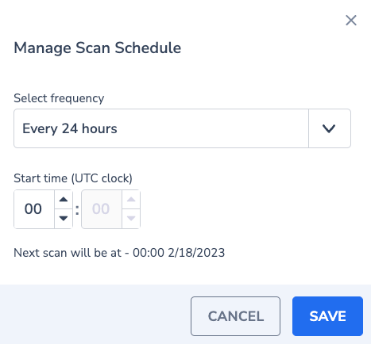

Cloud Security Posture Management (CSPM) helps to mitigate and minimize cloud data security breaches and to assess the overall posture of the entire cloud environment against best practices and compliance standards to help remediate issues.

CSPM tools verify that cloud configurations follow security best practices and compliance standards such as CIS, Azure, and GCP benchmarks as well as PCI and HIPAA frameworks. As companies are increasingly moving to the cloud, CSPM is becoming a necessary aspect of security insights.

The CSPM can be installed using the following methods:

1. Docker container

3. Kubernetes CronJob

For each installation method, we need to pass the following environment variables:

<table><tbody><tr><td>API_KEY</td><td>Under "Send your data" on your Coralogix account</td></tr><tr><td>APPLICATION_NAME</td><td>Set the application name</td></tr><tr><td>SUBSYSTEM_NAME</td><td>Set the subsystem name</td></tr><tr><td>COMPANY_ID</td><td>Company ID from the settings screen in your Coralogix account</td></tr><tr><td>CORALOGIX_ENDPOINT_HOST</td><td>Coralogix <strong><a href="https://coralogixstg.wpengine.com/docs/coralogix-endpoints/#grpc">GRPC endpoint</a></strong> associated with your Coralogix <a href="https://coralogixstg.wpengine.com/docs/coralogix-domain/"><strong>domain</strong></a></td></tr><tr><td>CLOUD_PROVIDER</td><td>The Cloud Provider that CSPM will be deployed into in lowercase (e.g. aws, gcp, etc)</td></tr><tr><td>TESTER_LIST</td><td>If specified, will run the tests on the specified service, otherwise will run tests on all the AWS services. leave empty to run all testers, otherwise, comma separated per tester name without spaces</td></tr><tr><td>REGION_LIST</td><td>If specified, will check only the specified regions (For global services like AWS S3, IAM and Route53, make sure you add region "global"). Otherwise, the tests will be conducted in all regions. leave empty to run on all regions, otherwise, comma separated per region name without spaces</td></tr><tr><td>AWS_DEFAULT_REGION</td><td>AWS default region for authentication</td></tr><tr><td>ROLE_ARN_LIST</td><td>An additional role(s) that can be assumed from other AWS accounts to scan. leave empty to run on the current account, for additional accounts, add in a comma-separated manner per role ARN without spaces.<br>Note: please follow the instructions below for multi-account configuration</td></tr><tr><td>CORALOGIX_ALERT_API_KEY</td><td>(Optional parameter) Under "Alerts, Rules and Tags API Key" on your Coralogix account.<br>When providing this variable, a custom enrichment for failed resources will be created in Coralogix's account at the end of each run if specified</td></tr></tbody></table>

## Installing as a Docker container

### Prerequisites

1. EC2 Instance
    - The minimum Instance Type should be "**t3a.medium**"
    
    - Internet connectivity (thorough Internet/NAT Gateway)

3. IAM Role with the [following policy](https://github.com/coralogix/snowbit-cspm-policies/blob/master/AWS/cspm-aws-policy.json) attached to the instance

5. Docker installed on the EC2 instance - refer to [Docker documentation](https://docs.docker.com/engine/install/ubuntu/)

Note that the instance type will affect the run time, so it's up to a personal preference and is affected by the environment size.

### Deploying

After prerequisites are met, download the docker image using the following command (if the following command hasn't run, the image will still be downloaded automatically in the next step):

```
docker pull coralogixrepo/snowbit-cspm
```

In order to automate the process, use Crontab in the following manner:

Create the crontab using your favorite editor

```
sudo crontab -e
```

Inside the document, on the bottom, paste the following one-liner (note that the API\_KEY and the CORALOGIX\_ENDPOINT\_HOST fields are mandatory)

```
*/10 * * * * docker rm snowbit-cspm ; docker rmi coralogixrepo/snowbit-cspm ; docker run --name snowbit-cspm -d -e PYTHONUNBUFFERED=1 -e CLOUD_PROVIDER="choose_the_cloud_provider - aws / gcp" -e AWS_DEFAULT_REGION="eu-west-1" -e CORALOGIX_ENDPOINT_HOST="coralogix_grpc_endpoint" -e APPLICATION_NAME="application_name" -e COMPANY_ID=<coralogix_company_ID> -e SUBSYSTEM_NAME="subsystem_name" -e TESTER_LIST="" -e API_KEY="send_your_data_api_key" -e REGION_LIST="" -e ROLE_ARN_LIST="" -e CORALOGIX_ALERT_API_KEY="" --network host -v ~/.aws:/root/.aws coralogixrepo/snowbit-cspm
```

The above command will **try** to run every 10\* minutes, and consists of two commands:

- docker rm snowbit-cspm - removes the last docker container if exists

- docker rmi coralogixrepo/snowbit-cspm - will remove and redownload the docker images to ensure it have the latest images locally available.

- docker run --name snowbit-cspm \[Options...\] - runs a new container sequence

\*\* The actual scheduling is set in the Coralogix security tab - scroll to the "**Configuring the scan settings**" section for further details

## Installing as a Kubernetes CronJob in EKS – via kubectl and eksctl

In order to deploy the image in a pod that follows the principle of least privileged, we should use a service account that assumes the needed role at the start of each job and doesn't inherit its permission from his host node.

### Prerequisites

1. An existing Amazon EKS cluster

3. Version 2.7.21 or later or 1.25.46 or later of the AWS CLI installed and configured on your device or AWS CloudShell

5. The **kubectl** command line tool is installed on your device or AWS CloudShell

7. The **eksctl** command line tool is installed on your device or AWS CloudShell

9. An existing kubectl config file that contains your cluster configuration

11. IAM policy with the [following permissions](https://github.com/coralogix/snowbit-cspm-policies/blob/master/AWS/cspm-aws-policy.json)

### Before Deploying

Determine whether you have an existing IAM OIDC provider for your cluster:

- Retrieve your cluster's OIDC provider ID and store it in a variable:

```
oidc_id=$(aws eks describe-cluster --name my-cluster --query "cluster.identity.oidc.issuer" --output text | cut -d '/' -f 5)
```

- Determine whether an IAM OIDC provider with your cluster's ID is already in your account

```
aws iam list-open-id-connect-providers | grep $oidc_id
```

Note: If the output is returned from the previous command, then you already have a provider for your cluster and you can skip the next step. If no output is returned, then you must create an IAM OIDC provider for your cluster

### Deploying

If the output from the above test is blank, create an IAM OIDC identity provider for your cluster with the following command. Replace "my-cluster" with your own value

```
eksctl utils associate-iam-oidc-provider --cluster my-cluster --approve
```

Configuring a Kubernetes service account to assume an IAM role (the policy ARN is the policy created in section 6 of the above prerequisites)

```
eksctl create iamserviceaccount --name my-service-account --namespace default --cluster my-cluster --role-name "my-role" --attach-policy-arn arn:aws:iam::111111111111:policy/my-policy --approve
```

Use the following CronJob configurations:

```
apiVersion: batch/v1
kind: CronJob
metadata:
  name: snowbit-cspm-cronjob
  namespace: <optional - when using the default, remove entire row>
spec:
  schedule: "*/10 * * * *"
  successfulJobsHistoryLimit: 1
  jobTemplate:
    spec:
      template:
        spec:
          serviceAccountName: <my-service-account>
          hostNetwork: true
          containers:
          - image: coralogixrepo/snowbit-cspm
            name: snowbit-cspm-cronjob
            command: ["python3"]
            args: ["lambda_function.py"]
            env:
              - name: API_KEY
                value: "send_your_data_api_key" 
              - name: CORALOGIX_ENDPOINT_HOST
                value: "coralogix_endpoint"
              - name: CLOUD_PROVIDER
                value: "choose_the_cloud_provider - aws / gcp"
              - name: APPLICATION_NAME
                value: "application_name"
              - name: SUBSYSTEM_NAME
                value: "subsystem_name"
              - name: TESTER_LIST
                value: ""
              - name: REGION_LIST
                value: ""
              - name: ROLE_ARN_LIST
                value: ""
              - name: COMPANY_ID
                value: "<coralogix_company_ID>"
              - name: PYTHONUNBUFFERED
                value: "1"
              - name: AWS_DEFAULT_REGION
                value: "eu-west-1"
              - name: CORALOGIX_ALERT_API_KEY
                value: ""
          restartPolicy: OnFailure
```

Save the above content into a .yaml file and execute the following command:

```
kubectl create -f Cronjob.yaml
```

## Configuring the scan settings

Inside the security tab in your Coralogix account, you will find the **SCAN SETTINGS** button:

1. Scan Now will start the scan of the selected environment(s) in up to 10 minutes from pressing (according to the configured cronjob)

3. Scan Schedule allows choosing the frequency of the scans, and the start time of each scan. the default is every 24 hours



## Multi-Account Configuration

**Definitions**

- Primary Account - the account that the CSPM is initially was deployed at

- Additional Account - an account that you wish to be scanned on top of the Primary Account

#### For each Additional Account

1. go to IAM > Roles and click "Create role"

3. choose "AWS account"

5. Below, choose "Another AWS account" and paste the account ID of the primary account

7. for permissions, create and add the [following policy](https://github.com/coralogix/snowbit-cspm-policies/blob/master/AWS/cspm-aws-policy.json)

9. Give the Role a name and Click "Create role"

11. Go to the role and copy his ARN

#### For Primary Account

1. Add the [following policy](https://github.com/coralogix/snowbit-cspm-policies/blob/master/AWS/primary_account/assume_roles_permission.json) to the existing CSPM Role (done in the initial deployment)

3. Fill the **resource** key according to the amount of roles to assume

Example for one additional account:

```
{
    "Version": "2012-10-17",
    "Statement": [
        {
            "Sid": "CSPMMultiAccountAccess",
            "Effect": "Allow",
            "Action": "sts:AssumeRole",
            "Resource": "arn:aws:iam::123456789012:role/cspm_additional_account_to_scan"
        }
    ]
}
```

#### Add the Environmental Variable to the Docker\\Kubernetes command

1. use the **ROLE\_ARN\_LIST** environmental variable as listed above to point each run to use the role ARN in all the additional accounts.

3. when using more than one account, use comma-separated strings without spaces.
