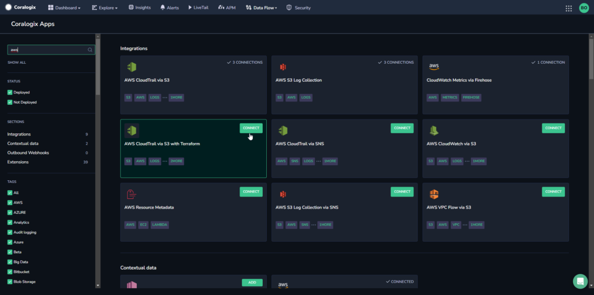
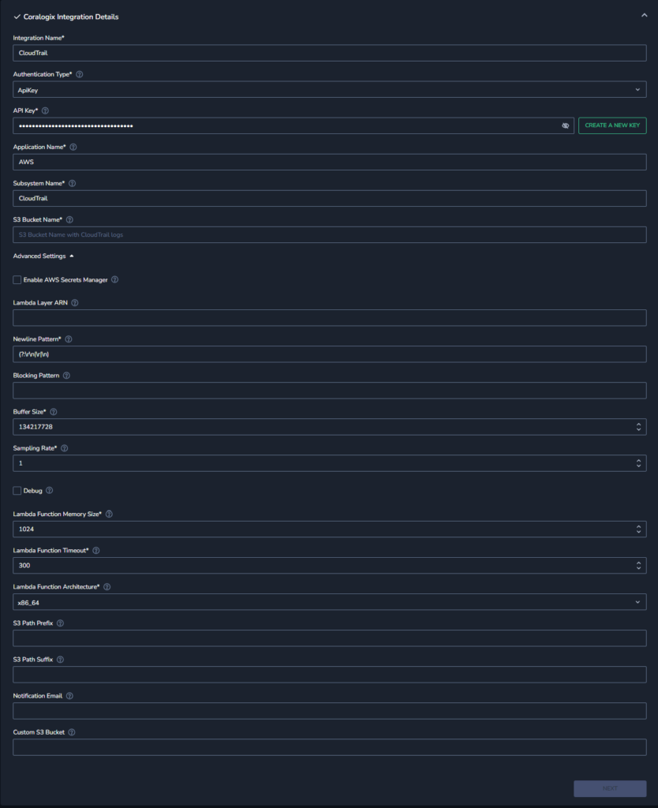
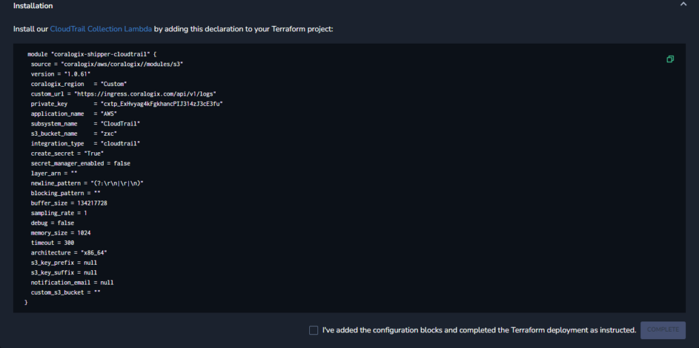

Streamline the process of ingesting and analyzing logs from your AWS resources using our automated **AWS CloudTrail via S3 with Terraform** integration package.

## Overview

**AWS CloudTrail** is an Amazon Web Services (AWS) service that helps you enable operational and risk auditing, governance, and compliance of your AWS account. Actions taken by a user, role, or an AWS service are recorded as events in CloudTrail.

Coralogix ingests the logs stored in your Amazon S3 bucket and process them for further analysis and monitoring.

Sending CloudTrail logs to Coralogix via Terraform provides a streamlined and automated approach to configure and manage the necessary AWS resources for CloudTrail log delivery.

## Benefits

Use the **AWS CloudTrail via S3 with Terraform** integration package to enjoy:

- **Robust Security Monitoring.** Terraform and Coralogix together offer a unified solution to send AWS CloudTrail logs, ensuring a centralized and robust security audit trail. Rapidly detect and respond to potential security threats or unauthorized access.

- **Swift Incident Response.** Coralogix's real-time visibility, driven by Terraform, accelerates incident response by quickly identifying and analyzing unusual patterns or suspicious activities in AWS CloudTrail logs.

- **Efficient Compliance.** Terraform automation guarantees consistent delivery of CloudTrail logs to Coralogix, streamlining compliance management and providing a centralized solution for auditing and reporting.

- **Comprehensive Infrastructure Monitoring.** The integration of CloudTrail logs with Coralogix via Terraform allows for a holistic view of your AWS infrastructure, enabling correlation with other logs and metrics for comprehensive monitoring and troubleshooting.

- **Scalable Configuration.** Terraform's infrastructure as code ensures scalable and repeatable deployment of CloudTrail log forwarding, adapting seamlessly to changes in your AWS environment and supporting both small and large-scale infrastructures.

## Configuration

**STEP 1**. From your Coralogix toolbar, navigate to **Data Flow** > **Extensions**.

**STEP 2.** In the Integrations section, select **AWS CloudTrail via S3 with Terraform.**

**STEP 3.** Click **\+ SETUP INTEGRATION**.

**STEP 4.** Input your integration details.

- **Integration Name.** Enter a name for your integration.

- **Authentication Type.** Select the authentication type: **API Key** or **Existing Secret**.
    - If using an API key, enter your [Send-Your-Data API key](https://www.notion.so/d6f178687d464c58b9988fe223c719cc?pvs=21) or click **CREATE A NEW KEY** to create a new API key for the integration.
    
    - If using an existing secret, enter the secret name.

- **Application Name.** Enter an [application name](https://coralogixstg.wpengine.com/docs/application-and-subsystem-names/). The default name is AWS.

- **Subsystem Name.** Enter a [subsystem name](https://coralogixstg.wpengine.com/docs/application-and-subsystem-names/). The default name is CloudTrail.

- **S3 Bucket Name.** Enter the name of your [S3 bucket](https://coralogixstg.wpengine.com/docs/archive-s3-bucket-forever/).

- **Enable AWS Secrets Manager (Advanced Settings).** Enabling AWS Secrets Manager is necessary if you want to keep your [Send-Your-Data API key](https://www.notion.so/d6f178687d464c58b9988fe223c719cc?pvs=21) as a secret in AWS Secrets Manager.

- **Lambda Layer ARN (Advanced Settings).** If you are using Secret Manager, this is the ARN of the Coralogix Security lambda layer.

- **Newline Pattern (Advanced Settings).** The pattern for where to split new lines.

- **Blocking Pattern (Advanced Settings).** \[**Optional**\] The pattern for line blocking.

- **Buffer Size (Advanced Settings).** The Coralogix logger buffer size. Default is `134217728`.

- **Sampling Rate (Advanced Settings).** Allows you to send messages with a specific sampling rate. Default is `1`.

- **Debug (Advanced Settings).** Enables Coralogix Logger Debug mode.

- **Lambda Function Memory Size (Advanced Settings).** The memory limit of the lambda function. Default is `1024`MB.

- **Lambda Function Timeout (Advanced Settings).** The timeout limit of the lambda function. Default is `300` seconds.

- **Lambda Function Architecture (Advanced Settings).** The architecture of the lambda function. Default is `x86_64`.

- **S3 Path Prefix (Advanced Settings).** \[**Optional**\] The S3 path prefix to watch.

- **S3 Path Suffix (Advanced Settings).** \[**Optional**\] The S3 path suffix to watch.

- **Notification Email (Advanced Settings).** \[**Optional**\] The email address for failure notifications.

- **Custom S3 Bucket (Advanced Settings).** \[**Optional**\] The name of the S3 bucket in which the lambda zip code is saved.

**STEP 5.** Click **NEXT**.

**STEP 6.** Copy the declaration from the integration screen and add it to your Terraform project.

**STEP 7.** Check the box next to “I’ve added the configuration blocks and completed the Terraform deployment as instructed.” Click **COMPLETE**.

**STEP 8.** \[**Optional**\] Deploy the **AWS CloudTrail** [extension package](https://coralogixstg.wpengine.com/docs/extension-packages/) to complement your integration needs.

**STEP 9.** View your logs by navigating to **Explore** > **Logs** in your Coralogix toolbar. Find out more [here](https://coralogixstg.wpengine.com/docs/logs-screen/).

## Additional Resources

<table><tbody><tr><td>Documentation</td><td><a href="https://coralogixstg.wpengine.com/docs/aws-cloudtrail-data-collection-options/"><strong>AWS CloudTrail: Data Collection Options</strong></a> <strong><a href="https://registry.terraform.io/namespaces/coralogix">Coralogix Terraform Registry</a></strong></td></tr></tbody></table>

## Support

**Need help?**

Our world-class customer success team is available 24/7 to walk you through your setup and answer any questions that may come up.

Feel free to reach out to us **via our in-app chat** or by sending us an email at [support@coralogixstg.wpengine.com](mailto:support@coralogixstg.wpengine.com).
