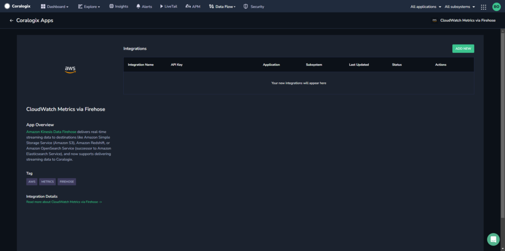
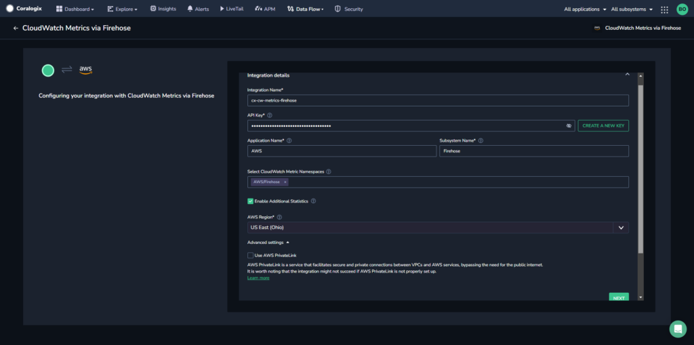

[Amazon Kinesis Data Firehose](https://aws.amazon.com/kinesis/data-firehose/) delivers real-time streaming data to destinations like Amazon Simple Storage Service (Amazon S3), Amazon Redshift, or Amazon OpenSearch Service (successor to Amazon Elasticsearch Service), and now supports delivering streaming data to Coralogix, an [AWS Partner Network (APN) Advanced Technology Partner](http://AWS Partner Network (APN) Advanced Technology Partner).

Use this seamless integration for easy monitoring, flexibility with minimum maintenance, and maximum scalability. There is no limit on the number of delivery streams, so it can be used for getting data from multiple AWS services.

## Setup Options

- **Automated Integration Package (Recommended)**. Streamline the ingesting and analyzing metrics from your AWS resources using our automated integration package setup below.

- **Manual Integration.** Alternatively, use our manual integration below.

- **Terraform**. Install and manage the Firehose Metrics integration with AWS services as modules in your infrastructure code.

- **CloudFormation**. Install our [AWS Kinesis Firehose Metrics with CloudFormation Template](https://github.com/coralogix/cloudformation-coralogix-aws/tree/master/aws-integrations/firehose-metrics) and incorporate the necessary configurations and settings via CloudFormation to automate your Firehose metrics collection setup and management.

## Automated Integration Package

Streamline your setup process using our automated integration package **CloudWatch Metrics via Firehose**. This package lets you preconfigure and deploy a template, replicating the manual setup.

Once completed, select from various out-of-the-box [extension packages](https://coralogixstg.wpengine.com/docs/extension-packages/): AWS EBS, AWS EC2, AWS ElastiCache, or AWS RDS.

Each tailored extension unlocks a set of predefined items – such as alerts, parsing rules, dashboards, saved views, and actions – allowing you to jumpstart Coralogix monitoring of your external-facing resources.

## Configuration

**STEP 1.** From your Coralogix toolbar, navigate to **Data Flow** > **Integrations**.

**STEP 2.** In the Integrations section, select **CloudWatch Metrics via Firehose**.



**STEP 3.** Click **ADD NEW**.



**STEP 4.** Input your integration details.

- **Integration Name.** Enter a name for your integration and either enter your [Send-Your-Data API key](https://coralogix.com/docs/send-your-data-api-key/) or click **CREATE A NEW KEY** to create a new API key for the integration.

- **Application Name.** Enter an [application name](https://coralogixstg.wpengine.com/docs/application-and-subsystem-names/). The default name is AWS.

- **Subsystem Name.** Enter a [subsystem name](https://coralogixstg.wpengine.com/docs/application-and-subsystem-names/). The default name is Firehose.

- **CloudWatch Metric Namespaces.** Select the namespaces you want to bring from the dropdown menu into the Coralogix platform.

- **Enable Additional Statistics.** Enabling [additional statistics](https://docs.aws.amazon.com/AWSCloudFormation/latest/UserGuide/aws-properties-cloudwatch-metricstream-metricstreamstatisticsconfiguration.html) is **recommended** to receive detailed percentile data on key AWS metrics. However, enabling it [may incur additional costs from AWS](https://aws.amazon.com/cloudwatch/pricing/%5C). The configuration used for the additional statistics is as follows:

```
[ { "AdditionalStatistics": ["p50", "p75", "p95", "p99"], "IncludeMetrics": [ {"Namespace": "AWS/EBS", "MetricName": "VolumeTotalReadTime"}, {"Namespace": "AWS/EBS", "MetricName": "VolumeTotalWriteTime"}, {"Namespace": "AWS/ELB", "MetricName": "Latency"}, {"Namespace": "AWS/ELB", "MetricName": "Duration"}, {"Namespace": "AWS/Lambda", "MetricName": "PostRuntimeExtensionsDuration"}, {"Namespace": "AWS/S3", "MetricName": "FirstByteLatency"}, {"Namespace": "AWS/S3", "MetricName": "TotalRequestLatency"} ] } ]
```

- **AWS Region.** Select your AWS region from the dropdown menu.

**Optional \[Recommended\]:**

- **Enable Metrics Tags Processors.** Enabling the Metrics Tags Processors involves using the mentioned [Transformation Lambda](#TransformationLambda) to enhance metrics by adding AWS resource tags using the abovementioned settings.

- **AWS PrivateLink (Advanced Settings)**. Enabling the use of AWS PrivateLink is **recommended** to ensure a secure and private connection between your VPCs and AWS services. Find out more [here](https://coralogixstg.wpengine.com/docs/coralogix-amazon-web-services-aws-privatelink-endpoints/).

**STEP 6.** Click **NEXT**.

**STEP 7.** Review the instructions for your integration and click **CREATE CLOUDFORMATION**.

**STEP 8.** You will be rerouted to the AWS website. Verify that all of the auto pre-populated values are correct. Click **Create Stack**.

**STEP 9.** Go back to the Coralogix application and click **COMPLETE** to close the module. Revert to the integration page.

**STEP 10.** \[**Optional**\] Deploy the [extension package](https://coralogixstg.wpengine.com/docs/extension-packages/) of your choice to complement your integration needs.

- AWS EBS

- AWS EC2

- AWS ElastiCache

- AWS RDS

**STEP 11.** View the metrics in your Coralogix dashboard using [Custom Dashboards](https://coralogixstg.wpengine.com/docs/custom-dashboards/) \[**recommended**\] or hosted [Grafana View](https://coralogixstg.wpengine.com/docs/hosted-grafana-view/).

## Manual Setup

### Prerequisites

- Metrics bucket configured in your Coralogix dashboard. Data Flow > Setup Archive

### Configuration

**STEP 1**. Go to the Kinesis Data Firehose console and choose ‘Create delivery stream’.

**STEP 2**. Under ‘Choose source and destination’.

- Source: Direct PUT

- Destination: Coralogix

- Delivery stream name: Fill in the desired stream name.

**STEP 3**. Scroll down to ‘Destination settings’.

- HTTP endpoint URL: Choose a [Firehose HTTP endpoint URL](https://coralogixstg.wpengine.com/docs/coralogix-endpoints/#firehose) based on your Coralogix [domain and region](https://coralogixstg.wpengine.com/docs/coralogix-domain/).

**STEP 4**. Scroll down to ‘Parameters’:

- Private key: Enter your Coralogix [Send Your Data – API Key](https://coralogixstg.wpengine.com/docs/send-your-data-api-key/).

- Content encoding: Select GZIP.

- Retry duration: Choose 300 seconds.

By default, your delivery stream arn and name will be used as ‘applicationName’ and ‘subsystemName’.

Add a new parameter with the desired value to override the associated 'applicationName' or 'subsystemName'.

- Key: 'applicationName' , value - 'new-app-name'

- Key: 'subsystemName' , value - 'new-subsystem-name'

The source of the data in Firehose determines the ‘integrationType’ parameter value:

- Key: ‘integrationType’ , value: ‘CloudWatch\_Metrics\_OpenTelemetry070\_WithAggregations′

**STEP 5**. Scroll down to ‘Backup settings’:

- Source record backup in Amazon S3: We suggest selecting ‘**Failed data only’**.

- S3 backup bucket: Choose an existing bucket or create a new one.

- Buffer hints, compression, encryption: Leave these fields as is.

**STEP 6**. Review your settings and choose ‘Create delivery stream’.

Metrics subscribed to your delivery stream will be immediately sent and available for analysis within Coralogix.

## Data Source Configuration

### Cloudwatch Metrics

To start sending your metrics to Coralogix, you first need to create a metric stream.

**STEP 1**. Go to the Cloudwatch console and choose ‘Streams’ under the ‘Metrics’ side menu.

**STEP 2**. Click on ‘Create metric stream’.

**STEP 3**. Under ‘Metrics to be streamed’:

- Choose what metrics to send

**STEP 4**. Scroll down to ‘Configuration’:

- For ‘Select configuration option’ choose ‘Select an existing Firehose owned by your account’

- For ‘Select your Kinesis Data Firehose stream’ choose the delivery stream created above

**STEP 5**. Scroll down to ‘Change output format’

- Make sure that ‘OpenTelemetry 0.7’ is selected

**STEP 6**. Scroll down to ‘Custom metric stream name’ and pick a name for the metrics stream.

**STEP 7**. Scroll down and click on ‘Create metric stream’.

After a few minutes, the metrics will start streaming to Coralogix, and you will see them on the Grafana dashboard.

## Transformation Lambda

\[**Optional**\] [CloudWatch Metric Streams Lambda transformation](https://github.com/coralogix/cloudwatch-metric-streams-lambda-transformation) function can be used as a Kinesis Firehose transformation function, to enrich the metrics from CloudWatch Metric Streams with AWS resource tags.

This installation is **optional**, and you can install the transformation Lambda if you’d like to take advantage of having AWS resource tags as labels in your metrics data. Find out more [here](https://github.com/coralogix/cloudwatch-metric-streams-lambda-transformation/blob/main/README.md).

Take the following steps to install the transformation Lambda.

**STEP 1.** Create a new AWS Lambda function in your designated region with the following parameters:

- Runtime: `Custom runtime on Amazon Linux 2`

- Handler: `bootstrap`

- Architecture: `arm64`

**STEP 2.** Download the bootstrap ZIP file from the [releases](https://github.com/coralogix/cloudwatch-metric-streams-lambda-transformation/releases) in the repository. Unless instructed otherwise, use the latest release. Upload the `bootstrap.zip` as the code source for Lambda.

**STEP 3.** Make sure to set the memory. We recommend starting with `512 MB` and, depending on the number of metrics you export and the speed of Lambda processing, see if you need to increase it.

**STEP 4.** Adjust the role of the Lambda function as described in the [necessary permissions](https://github.com/coralogix/cloudwatch-metric-streams-lambda-transformation#necessary-permissions).

**STEP 5.** Optionally, add environment variables to configure the Lambda, as described in the [configuration](https://github.com/coralogix/cloudwatch-metric-streams-lambda-transformation#configuration).

**STEP 6.** The Lambda function is ready for use in [Kinesis Data Firehose Data Transformation](https://docs.aws.amazon.com/firehose/latest/dev/data-transformation.html?icmpid=docs_console_unmapped). Please note the ARN and provide it in the relevant section of the Kinesis Data Firehose configuration.

To prevent delay in the delivery of your data and depending on the size of your setup, we recommend adjusting your Lambda buffer hint and Kinesis Data Firehose buffer size configuration accordingly. For the most optimal experience, we recommend setting the Lambda buffer hint  0.2 MB and the Kinesis Data Firehose buffer size to 1 MB. Note that this may cause more frequent Lambda runs, resulting **in higher costs**.

You can check the staleness of your data in your Kinesis Data Firehose delivery stream in the Monitoring tab by looking at the ‘Delivery to HTTP endpoint data freshness’. Seeing the staleness value grow may indicate that the Lambda function runs are too slow. In such a case, you may increase the Lambda’s memory and set the buffering configuration as described above.

## **Terraform -** Module Setup

Using **Coralogix Terraform modules**, you can easily install and manage Coralogix integrations with AWS services as modules in your infrastructure code. Our open-source modules are available on our [GitHub](https://github.com/coralogix/terraform-coralogix-aws/) and in the [Terraform Registry](https://registry.terraform.io/modules/coralogix/aws/coralogix/latest). Visit our full [AWS Kinesis Firehose Terraform Module](https://coralogix.com/docs/aws-kinesis-data-firehose-terraform-module/) documentation for more information.

### **Metrics**

For metrics, install **AWS Kinesis Data Firehose** by also adding this declaration to your Terraform project:

```
module "cloudwatch_firehose_coralogix_metrics" {
  source           = "coralogix/aws/coralogix//modules/firehose-metrics"
  private_key      = "XXXXXXXX-XXXX-XXXX-XXXX-XXXXXXX"
  firehose_stream  = "coralogix-firehose-metrics"
  coralogix_region = "Europe"
}

```

## Amazon CloudWatch Extensions

Coralogix offers a variety of out-of-the-box data [extension packages](https://coralogixstg.wpengine.com/docs/extension-packages/): AWS EBS, AWS EC2, AWS ElastiCache, or AWS RDS.

Each tailored extension unlocks a set of predefined items – such as alerts, parsing rules, dashboards, saved views, and actions – allowing you to jumpstart Coralogix monitoring of your external-facing resources.

## Destination Errors

Review these common destination errors presented by Firehose and their possible solutions

| Message | Solution |
| --- | --- |
| The delivery timed out before a response was received and will be retried. If this error persists, contact the AWS Firehose service team. | None needed – no data loss |
| Delivery to the endpoint was unsuccessful. See Troubleshooting HTTP Endpoints in the Firehose documentation for more information. Response received with status code. 502… | Coralogix returned an HTTP 502 error code; Firehose will resend the data. None needed – no data loss |

## Limitations

CloudWatch Metric Streams does not send metrics that have a timestamp older than 2 hours. This means that some CloudWatch metrics that are calculated at the end of a day and reported with the beginning timestamp of the same day would not be streamed. This includes S3 daily storage metrics and some billing metrics.

Should you need these metrics, we **recommend** using [Cloudwatch Exporter using Prometheus](https://github.com/prometheus/cloudwatch_exporter) alongside our new CloudWatch integration designed to retrieve those metrics. For updated information, contact **Coralogix Support**.

## Support

**Need help?**

Our world-class customer success team is available 24/7 to walk you through your setup and answer any questions that may come up.

Contact us **via our in-app chat** or by emailing [support@coralogixstg.wpengine.com](mailto:support@coralogixstg.wpengine.com).
