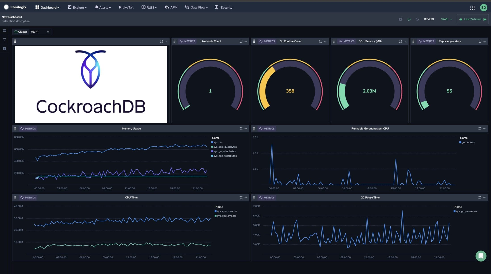
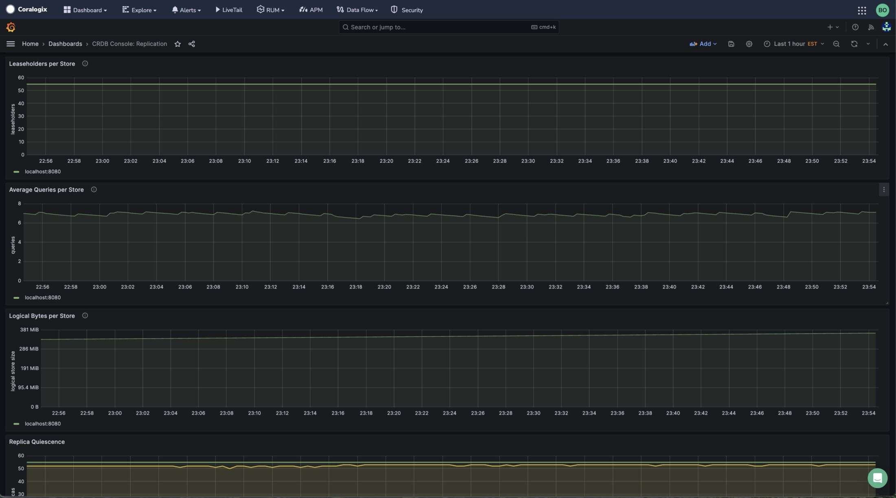
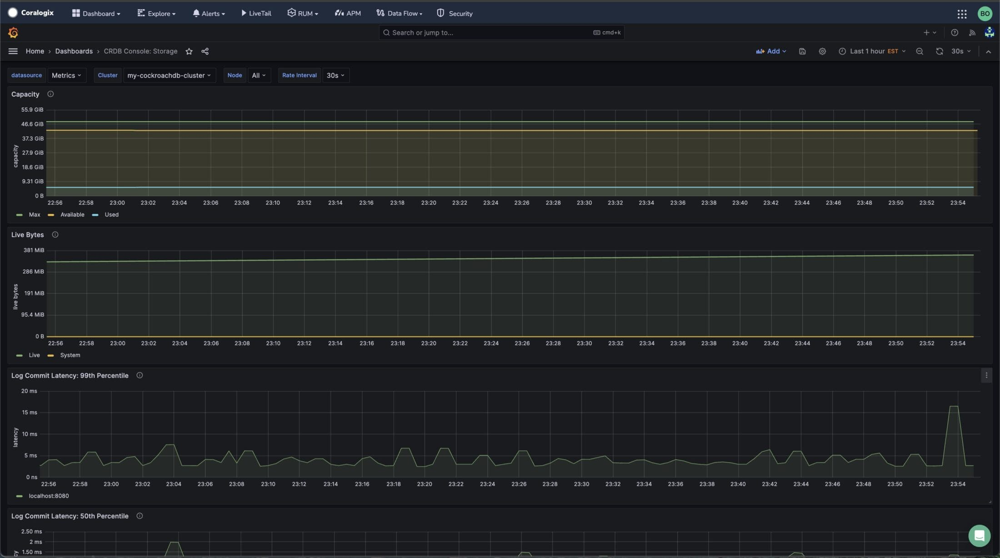

## Overview

This guide demonstrates the process of integrating Coralogix with a self-managed CockroachDB instance from [Cockroach Labs](https://www.cockroachlabs.com/docs/). Initially, we will set up a CockroachDB instance on an EC2 instance, following the outlined steps below.

## CockroachDB Instance Setup

**STEP 1**. Bring up an Ubuntu EC2 instance. This example uses a t2.xlarge instance. Run the DB instance on your EC2 instance by following steps [these steps](https://www.cockroachlabs.com/docs/v23.2/start-a-local-cluster).

**STEP 2**. Start the CockroachDB instance as a single node cluster using the [command listed here](https://www.cockroachlabs.com/docs/v23.2/cockroach-start-single-node).

```
cockroach start-single-node --insecure
```

**STEP 3**. Start a Prometheus server on that same machine following [these instructions](https://www.cherryservers.com/blog/install-prometheus-ubuntu).

**STEP 4**. Create a configuration file.

The example config file below includes a scrape\_config section to scrape the data from the CockroachDB and a remote\_write section that sends the data to Coralogix.

```
# my global config
global:
  scrape_interval: 15s # Set the scrape interval to every 15 seconds. Default is every 1 minute.
  evaluation_interval: 15s # Evaluate rules every 15 seconds. The default is every 1 minute.
  # scrape_timeout is set to the global default (10s).

# Alertmanager configuration
alerting:
  alertmanagers:
    - static_configs:
        - targets:
          # - alertmanager:9093

# Load rules once and periodically evaluate them according to the global 'evaluation_interval'.
rule_files:
  # - "first_rules.yml"
  # - "second_rules.yml"

# A scrape configuration containing exactly one endpoint to scrape:
# Here it's Prometheus itself.
scrape_configs:
  - job_name: 'cockroachdb'
    metrics_path: '/_status/vars'
    # Insecure mode:
    scheme: 'http'
    # Secure mode:
    # scheme: 'https'
    tls_config:
      insecure_skip_verify: true

    static_configs:
    - targets: ['localhost:8080']
      labels:
        cluster: 'my-cockroachdb-cluster'

remote_write:
- url: https://ingress.coralogix.us/prometheus/v1
  name: 'cockroachlabs'
  remote_timeout: 120s
  bearer_token: 'MY_CX_API_KEY'
```

## Monitoring CockroachDB Performance Metrics

Once you start the Prometheus server, it will push the CockroachDB performance metrics into Coralogix, which you can view in [Custom Dashboards](https://coralogixstg.wpengine.com/docs/custom-dashboards/) or your [Grafana-hosted dashboard](https://coralogixstg.wpengine.com/docs/hosted-grafana-view/).

### Custom Dashboards

Here is a screenshot of CockreachDB performance metrics in a Coralogix custom dashboard.



The following are the dashboard artifacts:

```
{
  "id": "0a1Tqgj3vl8LsGBzDwmn0",
  "name": "CockroachDB Performance",
  "description": "Displays the performance of cockoach DB",
  "layout": {
    "sections": [
      {
        "id": {
          "value": "9c1aa22d-3c7b-eb45-c636-864e09f5fe1a"
        },
        "rows": [
          {
            "id": {
              "value": "8e02b618-fe69-90ab-45b6-11c1f8a20576"
            },
            "appearance": {
              "height": 24
            },
            "widgets": [
              {
                "id": {
                  "value": "d856f898-bda6-57bb-d9a3-2e9f683c8787"
                },
                "title": "New Markdown",
                "definition": {
                  "markdown": {
                    "markdownText": "# "
                  }
                },
                "appearance": {
                  "width": 0
                }
              },
              {
                "id": {
                  "value": "f9060fb8-bf1f-09a0-05b3-211cf73869ee"
                },
                "title": "Live Node Count",
                "definition": {
                  "gauge": {
                    "query": {
                      "metrics": {
                        "promqlQuery": {
                          "value": "sum(liveness_livenodes{cluster=~\"{{cluster}}\"})"
                        },
                        "aggregation": "AGGREGATION_UNSPECIFIED",
                        "filters": []
                      }
                    },
                    "min": 0,
                    "max": 100,
                    "showInnerArc": true,
                    "showOuterArc": true,
                    "unit": "UNIT_NUMBER",
                    "thresholds": [
                      {
                        "from": 0,
                        "color": "var(--c-severity-log-verbose)"
                      },
                      {
                        "from": 33,
                        "color": "var(--c-severity-log-warning)"
                      },
                      {
                        "from": 66,
                        "color": "var(--c-severity-log-error)"
                      }
                    ],
                    "dataModeType": "DATA_MODE_TYPE_HIGH_UNSPECIFIED",
                    "thresholdBy": "THRESHOLD_BY_UNSPECIFIED"
                  }
                },
                "appearance": {
                  "width": 0
                }
              },
              {
                "id": {
                  "value": "c3d96ad2-eb5c-be56-af9b-36460c5a8fbb"
                },
                "title": "Go Routine Count",
                "definition": {
                  "gauge": {
                    "query": {
                      "metrics": {
                        "promqlQuery": {
                          "value": "sum(sys_goroutines{cluster=~\"{{cluster}}\"})"
                        },
                        "aggregation": "AGGREGATION_UNSPECIFIED",
                        "filters": []
                      }
                    },
                    "min": 0,
                    "max": 1000,
                    "showInnerArc": true,
                    "showOuterArc": true,
                    "unit": "UNIT_NUMBER",
                    "thresholds": [
                      {
                        "from": 0,
                        "color": "var(--c-severity-log-verbose)"
                      },
                      {
                        "from": 33,
                        "color": "var(--c-severity-log-warning)"
                      },
                      {
                        "from": 66,
                        "color": "var(--c-severity-log-error)"
                      }
                    ],
                    "dataModeType": "DATA_MODE_TYPE_HIGH_UNSPECIFIED",
                    "thresholdBy": "THRESHOLD_BY_UNSPECIFIED"
                  }
                },
                "appearance": {
                  "width": 0
                }
              },
              {
                "id": {
                  "value": "e45cec9e-c0a9-6a32-8cb7-1429791b9980"
                },
                "title": "SQL Memory (MB)",
                "definition": {
                  "gauge": {
                    "query": {
                      "metrics": {
                        "promqlQuery": {
                          "value": "sum(sql_mem_root_current{cluster=~\"{{cluster}}\"})"
                        },
                        "aggregation": "AGGREGATION_UNSPECIFIED",
                        "filters": []
                      }
                    },
                    "min": 0,
                    "max": 10000000,
                    "showInnerArc": true,
                    "showOuterArc": true,
                    "unit": "UNIT_NUMBER",
                    "thresholds": [
                      {
                        "from": 0,
                        "color": "var(--c-severity-log-verbose)"
                      },
                      {
                        "from": 33,
                        "color": "var(--c-severity-log-warning)"
                      },
                      {
                        "from": 66,
                        "color": "var(--c-severity-log-error)"
                      }
                    ],
                    "dataModeType": "DATA_MODE_TYPE_HIGH_UNSPECIFIED",
                    "thresholdBy": "THRESHOLD_BY_UNSPECIFIED"
                  }
                },
                "appearance": {
                  "width": 0
                }
              },
              {
                "id": {
                  "value": "b1dfd3a8-ee84-a28a-5707-3226c87c61e2"
                },
                "title": "Replicas per store",
                "definition": {
                  "gauge": {
                    "query": {
                      "metrics": {
                        "promqlQuery": {
                          "value": "sum(replicas{cluster=~\"{{cluster}}\"})"
                        },
                        "aggregation": "AGGREGATION_UNSPECIFIED",
                        "filters": []
                      }
                    },
                    "min": 0,
                    "max": 1000,
                    "showInnerArc": true,
                    "showOuterArc": true,
                    "unit": "UNIT_NUMBER",
                    "thresholds": [
                      {
                        "from": 0,
                        "color": "var(--c-severity-log-verbose)"
                      },
                      {
                        "from": 33,
                        "color": "var(--c-severity-log-warning)"
                      },
                      {
                        "from": 66,
                        "color": "var(--c-severity-log-error)"
                      }
                    ],
                    "dataModeType": "DATA_MODE_TYPE_HIGH_UNSPECIFIED",
                    "thresholdBy": "THRESHOLD_BY_UNSPECIFIED"
                  }
                },
                "appearance": {
                  "width": 0
                }
              }
            ]
          },
          {
            "id": {
              "value": "d1e9dd53-1589-0c95-2db8-68a8c9e440ab"
            },
            "appearance": {
              "height": 19
            },
            "widgets": [
              {
                "id": {
                  "value": "0f3cc7cd-cb6b-d306-557d-c19798aa61ec"
                },
                "title": "Memory Usage",
                "definition": {
                  "lineChart": {
                    "legend": {
                      "isVisible": true,
                      "columns": [],
                      "groupByQuery": false
                    },
                    "tooltip": {
                      "showLabels": false,
                      "type": "TOOLTIP_TYPE_ALL"
                    },
                    "queryDefinitions": [
                      {
                        "id": "f1413d5b-0e93-0a13-607a-54ca9d33864d",
                        "query": {
                          "metrics": {
                            "promqlQuery": {
                              "value": "sum(sys_rss{cluster=~\"{{cluster}}\"})"
                            },
                            "filters": []
                          }
                        },
                        "seriesNameTemplate": "sys_rss",
                        "seriesCountLimit": "20",
                        "unit": "UNIT_UNSPECIFIED",
                        "scaleType": "SCALE_TYPE_LINEAR",
                        "name": "Query 1",
                        "isVisible": true,
                        "colorScheme": "cold",
                        "resolution": {
                          "bucketsPresented": 96
                        },
                        "dataModeType": "DATA_MODE_TYPE_HIGH_UNSPECIFIED"
                      },
                      {
                        "id": "51323169-44a2-810d-9d12-4df2a4d22135",
                        "query": {
                          "metrics": {
                            "promqlQuery": {
                              "value": "sum(sys_cgo_allocbytes{cluster=~\"{{cluster}}\"})"
                            },
                            "filters": []
                          }
                        },
                        "seriesNameTemplate": "sys_cgo_allocbytes",
                        "seriesCountLimit": "20",
                        "unit": "UNIT_UNSPECIFIED",
                        "scaleType": "SCALE_TYPE_LINEAR",
                        "isVisible": true,
                        "colorScheme": "cold",
                        "resolution": {
                          "bucketsPresented": 96
                        },
                        "dataModeType": "DATA_MODE_TYPE_HIGH_UNSPECIFIED"
                      },
                      {
                        "id": "d3fafaac-a0e8-9a1d-76a8-d3578ba1434c",
                        "query": {
                          "metrics": {
                            "promqlQuery": {
                              "value": "sum(sys_go_allocbytes{cluster=~\"{{cluster}}\"})"
                            },
                            "filters": []
                          }
                        },
                        "seriesNameTemplate": "sys_go_allocbytes",
                        "seriesCountLimit": "20",
                        "unit": "UNIT_UNSPECIFIED",
                        "scaleType": "SCALE_TYPE_LINEAR",
                        "isVisible": true,
                        "colorScheme": "cold",
                        "resolution": {
                          "bucketsPresented": 96
                        },
                        "dataModeType": "DATA_MODE_TYPE_HIGH_UNSPECIFIED"
                      },
                      {
                        "id": "be8a5da2-5aba-1321-ff02-5bb814f3dc71",
                        "query": {
                          "metrics": {
                            "promqlQuery": {
                              "value": "sum(sys_cgo_totalbytes{cluster=~\"{{cluster}}\"})"
                            },
                            "filters": []
                          }
                        },
                        "seriesNameTemplate": "sys_cgo_totalbytes",
                        "seriesCountLimit": "20",
                        "unit": "UNIT_UNSPECIFIED",
                        "scaleType": "SCALE_TYPE_LINEAR",
                        "isVisible": true,
                        "colorScheme": "cold",
                        "resolution": {
                          "bucketsPresented": 96
                        },
                        "dataModeType": "DATA_MODE_TYPE_HIGH_UNSPECIFIED"
                      }
                    ]
                  }
                },
                "appearance": {
                  "width": 0
                }
              },
              {
                "id": {
                  "value": "0a7c51b9-b4cb-7987-256a-b55f799151a2"
                },
                "title": "Runnable Goroutines per CPU",
                "definition": {
                  "lineChart": {
                    "legend": {
                      "isVisible": true,
                      "columns": [],
                      "groupByQuery": true
                    },
                    "tooltip": {
                      "showLabels": false,
                      "type": "TOOLTIP_TYPE_ALL"
                    },
                    "queryDefinitions": [
                      {
                        "id": "1108b91b-e9c8-839f-20e4-6a92a34b7011",
                        "query": {
                          "metrics": {
                            "promqlQuery": {
                              "value": "sum(sys_runnable_goroutines_per_cpu{cluster=~\"{{cluster}}\"})"
                            },
                            "filters": []
                          }
                        },
                        "seriesNameTemplate": "goroutines",
                        "seriesCountLimit": "20",
                        "unit": "UNIT_UNSPECIFIED",
                        "scaleType": "SCALE_TYPE_LINEAR",
                        "name": "Query 1",
                        "isVisible": true,
                        "colorScheme": "cold",
                        "resolution": {
                          "bucketsPresented": 96
                        },
                        "dataModeType": "DATA_MODE_TYPE_HIGH_UNSPECIFIED"
                      }
                    ]
                  }
                },
                "appearance": {
                  "width": 0
                }
              }
            ]
          },
          {
            "id": {
              "value": "d81dbd99-ecd5-7059-690b-5795b4fc7021"
            },
            "appearance": {
              "height": 19
            },
            "widgets": [
              {
                "id": {
                  "value": "3771ada3-7b0b-8d6d-d900-d9a8d75dca47"
                },
                "title": "CPU Time",
                "definition": {
                  "lineChart": {
                    "legend": {
                      "isVisible": true,
                      "columns": [],
                      "groupByQuery": false
                    },
                    "tooltip": {
                      "showLabels": false,
                      "type": "TOOLTIP_TYPE_ALL"
                    },
                    "queryDefinitions": [
                      {
                        "id": "108f4c9f-3267-a71c-a114-05f4a9860673",
                        "query": {
                          "metrics": {
                            "promqlQuery": {
                              "value": "sum(rate(sys_cpu_user_ns{cluster=~\"{{cluster}}\"}))"
                            },
                            "filters": []
                          }
                        },
                        "seriesNameTemplate": "sys_cpu_user_ns",
                        "seriesCountLimit": "20",
                        "unit": "UNIT_UNSPECIFIED",
                        "scaleType": "SCALE_TYPE_LINEAR",
                        "name": "Query 1",
                        "isVisible": true,
                        "colorScheme": "cold",
                        "resolution": {
                          "bucketsPresented": 96
                        },
                        "dataModeType": "DATA_MODE_TYPE_HIGH_UNSPECIFIED"
                      },
                      {
                        "id": "477a447e-5e72-3303-0d34-e206bb2cee56",
                        "query": {
                          "metrics": {
                            "promqlQuery": {
                              "value": "sum(rate(sys_cpu_sys_ns{cluster=~\"{{cluster}}\"}))"
                            },
                            "filters": []
                          }
                        },
                        "seriesNameTemplate": "sys_cpu_sys_ns",
                        "seriesCountLimit": "20",
                        "unit": "UNIT_UNSPECIFIED",
                        "scaleType": "SCALE_TYPE_LINEAR",
                        "isVisible": true,
                        "colorScheme": "cold",
                        "resolution": {
                          "bucketsPresented": 96
                        },
                        "dataModeType": "DATA_MODE_TYPE_HIGH_UNSPECIFIED"
                      }
                    ]
                  }
                },
                "appearance": {
                  "width": 0
                }
              },
              {
                "id": {
                  "value": "ffcb3fe1-1c34-5561-273e-8ff73c41db87"
                },
                "title": "GC Pause Time",
                "definition": {
                  "lineChart": {
                    "legend": {
                      "isVisible": true,
                      "columns": [],
                      "groupByQuery": true
                    },
                    "tooltip": {
                      "showLabels": false,
                      "type": "TOOLTIP_TYPE_ALL"
                    },
                    "queryDefinitions": [
                      {
                        "id": "737e908f-6eb4-1de3-5d10-1d831feaf777",
                        "query": {
                          "metrics": {
                            "promqlQuery": {
                              "value": "sum(rate(sys_gc_pause_ns{cluster=~\"{{cluster}}\"}))"
                            },
                            "filters": []
                          }
                        },
                        "seriesNameTemplate": "sys_gc_pause_ns",
                        "seriesCountLimit": "20",
                        "unit": "UNIT_UNSPECIFIED",
                        "scaleType": "SCALE_TYPE_LINEAR",
                        "name": "Query 1",
                        "isVisible": true,
                        "colorScheme": "cold",
                        "resolution": {
                          "bucketsPresented": 96
                        },
                        "dataModeType": "DATA_MODE_TYPE_HIGH_UNSPECIFIED"
                      }
                    ]
                  }
                },
                "appearance": {
                  "width": 0
                }
              }
            ]
          }
        ]
      }
    ]
  },
  "variables": [
    {
      "name": "cluster",
      "definition": {
        "multiSelect": {
          "selected": [],
          "source": {
            "metricLabel": {
              "metricName": "sys_uptime",
              "label": "cluster"
            }
          },
          "selection": {
            "all": {}
          },
          "valuesOrderDirection": "ORDER_DIRECTION_ASC"
        }
      },
      "displayName": "Cluster"
    }
  ],
  "filters": [
    {
      "source": {
        "logs": {
          "operator": {
            "equals": {
              "selection": {
                "list": {
                  "values": []
                }
              }
            }
          },
          "observationField": {
            "keypath": [
              "applicationname"
            ],
            "scope": "DATASET_SCOPE_LABEL"
          }
        }
      },
      "enabled": true,
      "collapsed": false
    },
    {
      "source": {
        "logs": {
          "operator": {
            "equals": {
              "selection": {
                "list": {
                  "values": []
                }
              }
            }
          },
          "observationField": {
            "keypath": [
              "subsystemname"
            ],
            "scope": "DATASET_SCOPE_LABEL"
          }
        }
      },
      "enabled": true,
      "collapsed": false
    }
  ],
  "relativeTimeFrame": "86400s",
  "annotations": []
}
```

### Grafana Dashboard

Here are screenshots of CockroachDB performance metrics in your Grafana-hosted dashboard. Others can be found [here](https://www.cockroachlabs.com/docs/v23.2/monitor-cockroachdb-with-prometheus).





The following are the dashboard artifacts:

wget [https://raw.githubusercontent.com/cockroachdb/cockroach/master/monitoring/grafana-dashboards/by-cluster/runtime.json](https://raw.githubusercontent.com/cockroachdb/cockroach/master/monitoring/grafana-dashboards/by-cluster/runtime.json)

wget [https://raw.githubusercontent.com/cockroachdb/cockroach/master/monitoring/grafana-dashboards/by-cluster/storage.json](https://raw.githubusercontent.com/cockroachdb/cockroach/master/monitoring/grafana-dashboards/by-cluster/storage.json)

wget [https://raw.githubusercontent.com/cockroachdb/cockroach/master/monitoring/grafana-dashboards/by-cluster/sql.json](https://raw.githubusercontent.com/cockroachdb/cockroach/master/monitoring/grafana-dashboards/by-cluster/sql.json)

wget [https://raw.githubusercontent.com/cockroachdb/cockroach/master/monitoring/grafana-dashboards/by-cluster/replication.json](https://raw.githubusercontent.com/cockroachdb/cockroach/master/monitoring/grafana-dashboards/by-cluster/replication.json)

## Support

**Need help?**

Our world-class customer success team is available 24/7 to walk you through your setup and answer any questions that may come up.

Contact us **via our in-app chat** or by emailing [support@coralogixstg.wpengine.com](mailto:support@coralogixstg.wpengine.com).
