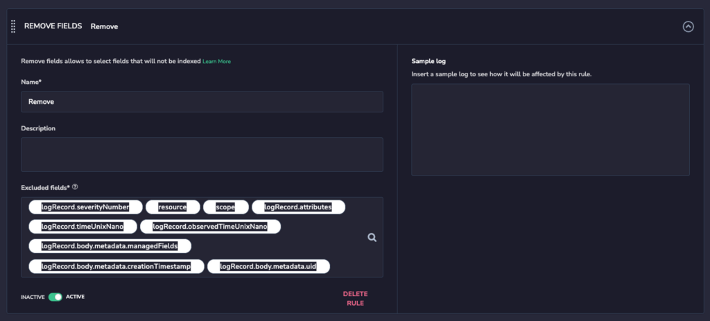

The following tutorial demonstrates how to collect Kubernetes Events using [OpenTelemetry](https://coralogixstg.wpengine.com/docs/opentelemetry/).

## Overview

The Kubernetes event is valuable telemetry data to help understand what is happening for a given resource inside the cluster, providing the cluster administrator and engineer more visibility using Kubernetes as their hosting platform.

OpenTelemetry has established a new receiver called [k8sobjects](https://github.com/open-telemetry/opentelemetry-collector-contrib/tree/main/receiver/k8sobjectsreceiver), used to collect and export required data to any destination, including Coralogix.

## Set Up Kubernetes Events

To set up Kubernetes events, use the following configuration.

```
receivers:
  k8sobjects:
    objects:
      - name: events
        mode: watch
				group: events.k8s.io

exporters:
	coralogix:
    application_name: '${APP_NAME}'
    application_name_attributes:
	    - '${APP_NAME}'
    logs:
      endpoint: '<endpoint>'
    metrics:
      endpoint: '<endpoint>'
    private_key: ${CORALOGIX_PRIVATE_KEY}
    subsystem_name: 'nodes'
    subsystem_name_attributes:
	    - service.name
    timeout: 1m
    traces:
      endpoint: '<endpoint>'

service:
    pipelines:
      logs:
        receivers: [k8sobjects]
        exporters: [coralogix]

```

**Notes**:

- [k8sobjects](https://github.com/open-telemetry/opentelemetry-collector-contrib/tree/main/receiver/k8sobjectsreceiver) serves as an OpenTelemetry receiver collecting logs, making the task of configuration simple.

- The configuration watches all of the events through all of the namespaces and sends them to Coralogix under the configured `**application_name**` and **`subystem_name`**. Learn more about Coralogix application and subsystem names [here](https://coralogixstg.wpengine.com/docs/application-and-subsystem-names/).

- Input the following variables:
    - `**private_key**`: Coralogix [Send-Your-Data API key](https://coralogixstg.wpengine.com/docs/send-your-data-api-key/)
    
    - `**endpoint**`: [OpenTelemetry endpoint](https://coralogixstg.wpengine.com/docs/coralogix-endpoints/) associated with your Coralogix domain

## Send Events to a Specific Subsystem in Coralogix

The configuration above will send the Kubernetes events data to the default `node` sub\_system in Coralogix. This occurs because the k8sobject receiver collects data from events produced by another system and does not have information regarding the app that produced the event.

To work around this default behavior, leverage the [Resource](https://github.com/open-telemetry/opentelemetry-collector-contrib/tree/main/processor/resourceprocessor) OpenTelemetry processor, which grants the possibility of setting attributes on the collected data before exporting it.

```
receivers:
  k8sobjects:
    objects:
      - name: events
        mode: watch
				group: events.k8s.io

processors:
  resource:
    attributes:
    - key: service.name
      value: "kube-events"
      action: upsert

exporters:
	coralogix:
    application_name: '${APP_NAME}'
    application_name_attributes:
	    - '${APP_NAME}'
    logs:
      endpoint: '<endpoint>'
    metrics:
      endpoint: '<endpoint>'
    private_key: ${CORALOGIX_PRIVATE_KEY}
    subsystem_name: 'nodes'
    subsystem_name_attributes:
	    - service.name
    timeout: 1m
    traces:
      endpoint: '<endpoint>'

service:
    pipelines:
      logs:
        receivers: [k8sobjects]
				processors: [resource]
        exporters: [coralogix]

```

This configuration will ship all of the events collected to the sub\_system `kube-events`, making it easier to identify and contextualize events.

## Keep Log Contents Clean

OpenTelemetry ships all the OpenTelemetry log objects to Coralogix and because of this, resulting in many unnecessary properties.

### OpenTelemetry

Transform your data using the [Transform](https://github.com/open-telemetry/opentelemetry-collector-contrib/tree/main/processor/transformprocessor) OpenTelemetry processor to reduce costs on bandwidth and unnecessary storage and [parsing rules](https://coralogixstg.wpengine.com/docs/log-parsing-rules/) in your Coralogix account.

```
receivers:
  k8sobjects:
    objects:
      - name: events
        mode: watch
				group: events.k8s.io

processors:
  resource:
    attributes:
    - key: service.name
      value: "kube-events"
      action: upsert
	transform:
		log_statements:
			- context: log	
        statements:	
          - keep_keys(body, ["type", "action", "eventTime", "reason", "regarding", "reportingController", "note", "series", "metadata", "deprecatedFirstTimestamp", "deprecatedLastTimestamp"])

exporters:
	coralogix:
    application_name: '${APP_NAME}'
    application_name_attributes:
	    - '${APP_NAME}'
    logs:
      endpoint: '<endpoint>'
    metrics:
      endpoint: '<endpoint>'
    private_key: ${CORALOGIX_PRIVATE_KEY}
    subsystem_name: 'nodes'
    subsystem_name_attributes:
	    - service.name
    timeout: 1m
    traces:
      endpoint: '<endpoint>'

service:
    pipelines:
      logs:
        receivers: [k8sobjects]
				processors: [resource, transform]
        exporters: [coralogix]

```

This configuration enables storing only important event data and drops all other related properties.

### Coralogix Dashboard

Leverage Coralogix [parsing rules](https://coralogixstg.wpengine.com/docs/log-parsing-rules/) to further clean up your data set, using the following parsing rule configuration.



## Reduce the Amount of Collected Data

The number of events produced by Kubernetes may easily reach the millions, especially if one has big clusters with many nodes and applications scaling up and down all the time. Collect only that data that really matters to you using our suggestions below.

### Collect Only Warning Events

Currently, Kubernetes has two different types of events: `Normal` and `Warning`. As we have the ability to filter events according to their type, you may choose to collect only `Warning` events, as these events are key to troubleshooting.

### Filter the Event Reason

The reason field describes, in a readable manner, why an action was taken. You may apply some filters to avoid the reasons you want to drop.

### Coralogix Block Feature

OpenTelemetry provides a filter processor which allows one to filter out telemetry data, enabling a reduction in data sent to Coralogix.

At present, the filter processor provides only simple filters for log metadata and prevents filters (such as `reason: BackoffLimitExceeded and kind: Job`) from being combined. This may lead to important data being deleted.

If the same reasons are produced by different controllers, leverage the [Coralogix Dynamic Blocking Feature](https://coralogixstg.wpengine.com/docs/dynamic-blocking/) under the [parsing rules](https://coralogixstg.wpengine.com/docs/log-parsing-rules/) and utilize the powerful regex system available.

## Alerting for Events

Once your data appears in your Coralogix dashboard, create alerts to give you visibility about important events inside the cluster that may lead to outages or issues.

### FailedCreatePodSandBox

This error usually occurs due to issues with networking, although it can also be caused by suboptimal system resource limit configuration, such as the number of available IPs, your Subnet being exhausted, or the instances using all the network interfaces available on the node.

### Evicted

A pod eviction is a characteristic function of Kubernetes used in certain scenarios, such as node NotReady, insufficient node resources, and expelling pods to other nodes.

## Support

**Need help?**

Our world-class customer success team is available 24/7 to walk you through your setup and answer any questions that may come up.

Feel free to reach out to us **via our in-app chat** or by sending us an email at [support@coralogixstg.wpengine.com](mailto:support@coralogixstg.wpengine.com).
