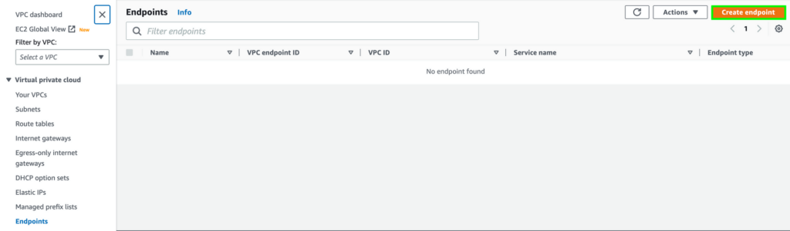
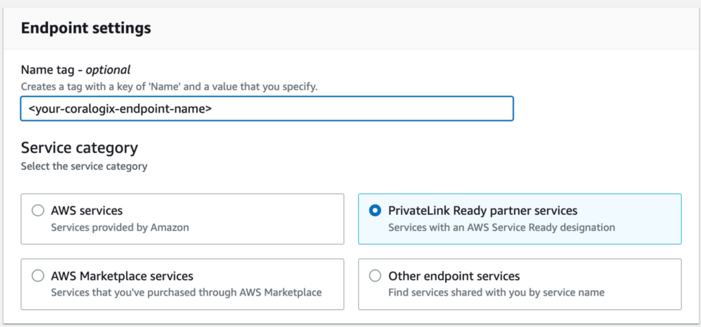
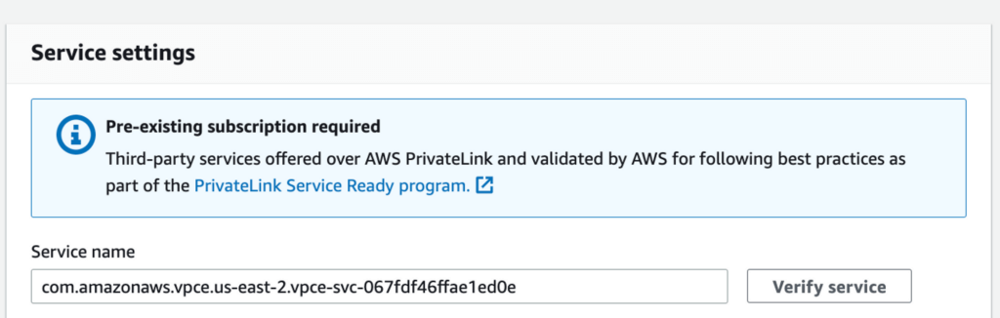
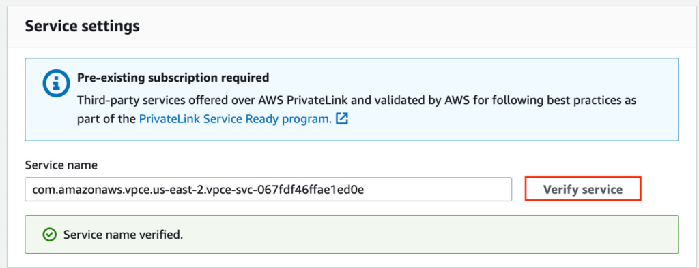
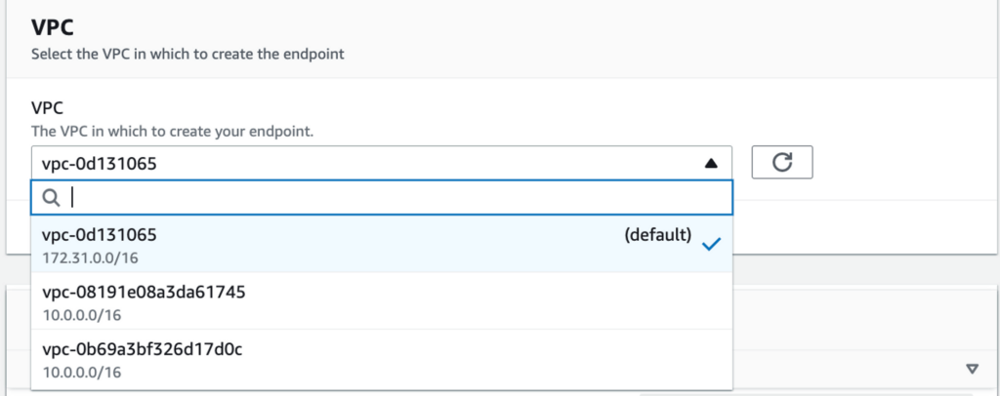
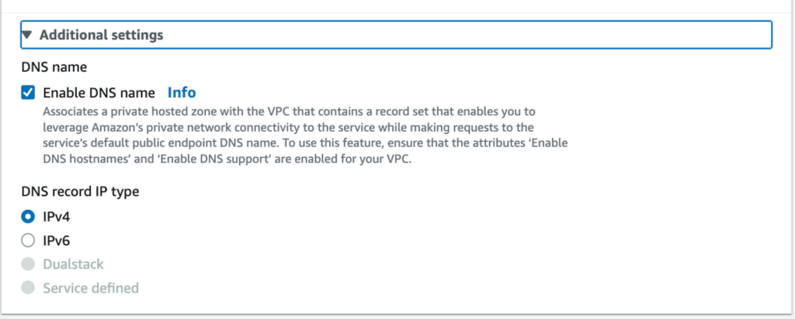
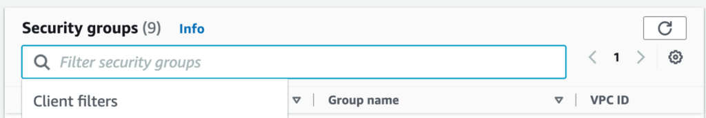
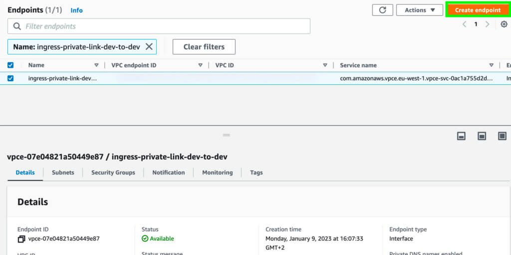

[AWS PrivateLink](https://aws.amazon.com/privatelink/) provides private connectivity between virtual private clouds (VPCs), supported AWS services, and your on-premises networks without exposing your traffic to the public internet. Interface VPC endpoints, powered by PrivateLink, connect you to services hosted by Coralogix. While Coralogix monitoring traffic is always secure, PrivateLink provides stable connectivity, a reduction in traffic costs, and even greater security by maintaining data on the AWS network.

This tutorial provides AWS Coralogix PrivateLink endpoints and instructions for standard configuration.

## Use Cases

The primary use case for PrivateLink with Coralogix is connectivity for monitored applications running in AWS VPCs. To use Coralogix PrivateLink, you must create a VPC endpoint in the Coralogix AWS region matching your Coralogix domain. This is referred to as **same-region VPC**.


If your AWS resources to be monitored are in a different region, you can leverage VPC peering to meet the requirements by launching your Lambda in a **cross-region VPC**, local to the source.


## PrivateLink Endpoints

Coralogix exposes the AWS PrivateLink endpoint in all Coralogix AWS regions.

<table><tbody><tr><td><strong>Coralogix Domain</strong></td><td><strong>Coralogix AWS</strong> <strong>Region</strong></td><td><strong>Service Name</strong></td><td><strong>OpenTelemetry -<br>Otel-Traces<br>Otel-Metrics<br>Otel-Logs</strong></td><td><strong>Coralogix<br>Lambda<br>Telemetry</strong></td><td><strong>Coralogix<br>Logs</strong></td><td><strong>Prometheus<br>RemoteWrite</strong></td></tr><tr><td>coralogixstg.wpengine.com</td><td>eu-west-1 (Ireland)</td><td>com.amazonaws.vpce.eu-west-1.vpce-svc-01f6152d495e211f0</td><td>ingress.private.coralogixstg.wpengine.com:443</td><td>ingress.private.coralogixstg.wpengine.com:443</td><td>https://ingress.private.coralogixstg.wpengine.com/logs/v1/singles</td><td>https://ingress.private.coralogixstg.wpengine.com/prometheus/v1</td></tr><tr><td><br>coralogix.in</td><td>ap-south1 (India)</td><td>com.amazonaws.vpce.ap-south-1.vpce-svc-0eb807f14d645a973</td><td>ingress.private.coralogix.in:443</td><td>ingress.private.coralogix.in:443</td><td>https://ingress.private.coralogix.in/logs/v1/singles</td><td>https://ingress.private.coralogix.in/prometheus/v1</td></tr><tr><td><br>coralogix.us</td><td>us-east2<br>(US)</td><td>com.amazonaws.vpce.us-east-2.vpce-svc-067fdf46ffae1ed0e</td><td>ingress.private.coralogix.us:443</td><td>ingress.private.coralogix.us:443</td><td>https://ingress.private.coralogix.us/logs/v1/singles</td><td>https://ingress.private.coralogix.us/prometheus/v1</td></tr><tr><td><br>eu2.coralogixstg.wpengine.com</td><td>eu-north-1 (Stockholm)</td><td>com.amazonaws.vpce.eu-north-1.vpce-svc-041b21c87be842c08</td><td>ingress.private.eu2.coralogixstg.wpengine.com:443</td><td><a href="http://prometheus-gateway.eu2.coralogixstg.wpengine.com/" target="_blank" rel="noreferrer noopener">i</a>ngress.private.coralogixsg.com:443</td><td>https://ingress.private.eu2.coralogixstg.wpengine.com/logs/v1/singles</td><td>https://ingress.private.eu2.coralogixstg.wpengine.com/prometheus/v1</td></tr><tr><td>coralogixsg.com</td><td>ap-southeast-1<br>(Singapore)</td><td>com.amazonaws.vpce.ap-southeast-1.vpce-svc-0e4cd83852ff2869b</td><td>ingress.private.coralogixsg.com:443</td><td><a href="http://prometheus-gateway.eu2.coralogixstg.wpengine.com/" target="_blank" rel="noreferrer noopener">i</a>ngress.private.coralogixsg.com:443</td><td>https://ingress.private.coralogixsg.com/logs/v1/singles</td><td>https://ingress.private.coralogixsg.com/prometheus/v1</td></tr><tr><td><br>cx498.coralogixstg.wpengine.com</td><td><br>us-west-2<br>(Oregon)</td><td>com.amazonaws.vpce.us-west-2.vpce-svc-0f6436ddb210e5dbb</td><td>ingress.private.cx498-aws-us-west-2.coralogixstg.wpengine.com:443</td><td>ingress.private.cx498-aws-us-west-2.coralogixstg.wpengine.com:443</td><td>https://ingress.private.cx498-aws-us-west-2.coralogixstg.wpengine.com:443/logs/v1/singles</td><td>https://ingress.private.cx498-aws-us-west-2.coralogixstg.wpengine.com:443/prometheus/v1</td></tr></tbody></table>

## Prerequisites

- If you use an integration involving Amazon S3, you must ensure that the VPC in which your Lambda is deployed has an [S3 Service Gateway configured](https://docs.aws.amazon.com/vpc/latest/privatelink/vpc-endpoints-s3.html#create-gateway-endpoint-s3).

- If you intend to use [AWS Secrets Manager](https://aws.amazon.com/blogs/security/how-to-connect-to-aws-secrets-manager-service-within-a-virtual-private-cloud/) with your Lambda, you must create another VPC endpoint for the `com.amazonaws.<AWS Region>.secretsmanager` service. Detailed instructions can be found [here](https://aws.amazon.com/blogs/security/how-to-connect-to-aws-secrets-manager-service-within-a-virtual-private-cloud/).

## VPC Configuration

To use Coralogix PrivateLink, you must create a VPC endpoint in the Coralogix AWS region matching your Coralogix domain. This is referred to as **same-region VPC**. For example, the `coralogixstg.wpengine.com` domain is hosted in `eu-west-1`. A same-region VPC must be deployed in `eu-west-1`.

If your AWS resources to be monitored are in a different region, you can leverage VPC peering to meet the requirements by launching your Lambda in a **cross-region VPC**, local to the source. Cross-region VPC configuration instructions can be found [here](https://coralogixstg.wpengine.com/docs/aws-privatelink-vpc-peering-configuration/).

**STEP 1**. Create a VPC endpoint.

- Connect to the AWS console in your Coralogix AWS region.

- Navigate to the **Endpoints** section.

- Click **Create endpoint**.



**STEP 2**. Name the VPC endpoint and select the service category: **PrivateLink Ready partner services**.



**STEP 3**. Input the **Service name** associated with your Coralogix AWS region, as per the above table.



**STEP 4**. Click **Verify** **service**.

- You should receive the following message: **Service name verified**.

- If you do not receive this message, contact us via our in-app chat or by sending us an email at [support@coralogixstg.wpengine.com](mailto:support@coralogixstg.wpengine.com).



**STEP 5**. Select a **VPC** in which to create the endpoint.



**STEP 6**. Expand the **Additional settings** section and **Enable DNS name**.



**STEP 7**. Select a security group to enable traffic to this VPC endpoint.

- The security group **must** accept inbound traffic in port 443 (TCP).



**STEP 8**. Click **Create endpoint**.

**STEP 9**. Verify your configuration.

- Ensure the VPC endpoint status appears as **Available**.



**STEP 10**. Enter the connected VPC and type the following command, adjusted per region:

```
#example US region
#telnet ingress.private.coralogix.us
telnet <ingress.private.<region> 443
```

## Next Steps

- If your AWS resources to be monitored are in a different region than your Coralogix domain, you have the option of leveraging VPC peering to meet the requirements by launching your Lambda in a cross-region VPC, local to the source. Cross-region VPC configuration instructions can be found [here](https://coralogixstg.wpengine.com/docs/aws-privatelink-vpc-peering-configuration/).

- Align the VPC to your Lambda. Instructions can be found [here](https://coralogixstg.wpengine.com/docs/aws-privatelink-lambda-configuration/).

## Support

**Need help?**

Our world-class customer success team is available 24/7 to walk you through your setup and answer any questions that may come up.

Feel free to reach out to us **via our in-app chat** or by sending us an email at [support@coralogixstg.wpengine.com](mailto:support@coralogixstg.wpengine.com).
