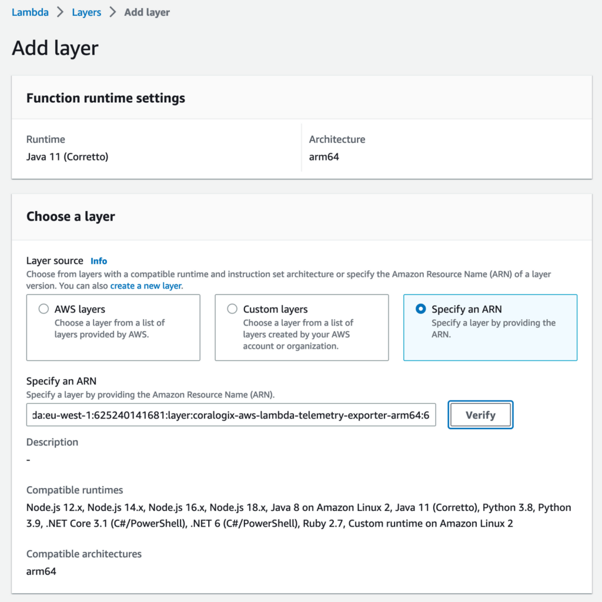

This tutorial demonstrates how to set up and install the **Coralogix AWS Lambda Telemetry Exporter**.

This integration is one of two options - **complete** and **basic** - for monitoring Lambda, a requirement of our cutting-edge [Serverless Monitoring](https://coralogixstg.wpengine.com/docs/serverless-monitoring/) feature.

- This tutorial demonstrates how to set up Lambda monitoring to get **basic telemetry**, including logs, which requires setting up the Coralogix AWS Lambda Telemetry Exporter.

- To set up Lambda monitoring to get **complete telemetry**, including traces, view the relevant documentation [here](https://coralogixstg.wpengine.com/docs/aws-lambda-auto-instrumentation/).

## Overview

The Coralogix AWS Lambda Telemetry Exporter is an [AWS Lambda extension](https://docs.aws.amazon.com/lambda/latest/dg/using-extensions.html) that uses AWS Lambda Telemetry API and seamlessly collects Lambda function logs, as well as Lambda platform logs, metrics, and traces. It is currently available as an open beta.

The Coralogix AWS Lambda Telemetry Exporter supersedes the previously offered Coralogix Extension for AWS Lambda (version 1.x.y) by extending its capabilities beyond logs. If you’re already using the Coralogix Extension for AWS Lambda, you can use it for now or migrate to the Telemetry Exporter to enjoy the new goodies early. We **recommend** using the Telemetry Exporter in new deployments.

This document assumes version 0.6.2 (layer version 25) of the Coralogix AWS Lambda Telemetry Exporter. If you’re using an older version, we **highly recommend** [updating](#UpdateCoralogixAWSLambdaTelemetryExporter).

## Setting up Lambda monitoring

To monitor AWS Lambda functions using Coralogix, follow these steps.

**STEP 1.** Set up the [Coralogix AWS Resource Metadata Collection](https://coralogixstg.wpengine.com/docs/aws-resource-metadata-collection/).

**STEP 2a.** To get full telemetry, including tracing, set up the [AWS Lambda Auto-Instrumentation](https://coralogixstg.wpengine.com/docs/aws-lambda-opentelemetry-wrappers/). This is available for Node.js and Python (3.8 or newer). For other runtimes choose Step 2b.

**STEP 2b.** Alternatively, to get logs and basic telemetry, set up just the [Coralogix AWS Lambda Telemetry Exporter](https://coralogixstg.wpengine.com/docs/coralogix-aws-lambda-telemetry-exporter/)

**STEP 3.** Learn what the [Serverless Monitoring](https://coralogixstg.wpengine.com/docs/serverless-monitoring/) feature has to offer.

The document you’re viewing now is for Step 2b. You may want to proceed with Step 2a instead.

## Prerequisites

- An [active AWS account](https://docs.aws.amazon.com/accounts/latest/reference/manage-acct-creating.html) with permissions to manage Lambda functions.

- At least one AWS Lambda function selected for monitoring

## Setup

The Coralogix AWS Lambda Telemetry Exporter is available with any of the following:

- Using ARN of a lambda layer published by Coralogix (**recommended**)

- Copying the telemetry exporter into a container image (**recommended** for [Docker](https://www.docker.com/))

- Deploying your copy of the lambda layer to your AWS account from [AWS Serverless Repository](https://serverlessrepo.aws.amazon.com/applications/eu-central-1/597078901540/Coralogix-AWS-Lambda-Telemetry-Exporter)

### Installation: Published Layer ARN

To deploy or update the Coralogix AWS Lambda Telemetry Exporter, select the ARN corresponding to your AWS region and CPU architecture from the following list:

```
arn:aws:lambda:ap-south-1:625240141681:layer:coralogix-aws-lambda-telemetry-exporter-x86_64:25
arn:aws:lambda:ap-south-1:625240141681:layer:coralogix-aws-lambda-telemetry-exporter-arm64:25
arn:aws:lambda:eu-north-1:625240141681:layer:coralogix-aws-lambda-telemetry-exporter-x86_64:25
arn:aws:lambda:eu-north-1:625240141681:layer:coralogix-aws-lambda-telemetry-exporter-arm64:25
arn:aws:lambda:eu-west-3:625240141681:layer:coralogix-aws-lambda-telemetry-exporter-x86_64:25
arn:aws:lambda:eu-west-3:625240141681:layer:coralogix-aws-lambda-telemetry-exporter-arm64:25
arn:aws:lambda:eu-west-2:625240141681:layer:coralogix-aws-lambda-telemetry-exporter-x86_64:25
arn:aws:lambda:eu-west-2:625240141681:layer:coralogix-aws-lambda-telemetry-exporter-arm64:25
arn:aws:lambda:eu-west-1:625240141681:layer:coralogix-aws-lambda-telemetry-exporter-x86_64:25
arn:aws:lambda:eu-west-1:625240141681:layer:coralogix-aws-lambda-telemetry-exporter-arm64:25
arn:aws:lambda:ap-northeast-3:625240141681:layer:coralogix-aws-lambda-telemetry-exporter-x86_64:25
arn:aws:lambda:ap-northeast-3:625240141681:layer:coralogix-aws-lambda-telemetry-exporter-arm64:25
arn:aws:lambda:ap-northeast-2:625240141681:layer:coralogix-aws-lambda-telemetry-exporter-x86_64:25
arn:aws:lambda:ap-northeast-2:625240141681:layer:coralogix-aws-lambda-telemetry-exporter-arm64:25
arn:aws:lambda:ap-northeast-1:625240141681:layer:coralogix-aws-lambda-telemetry-exporter-x86_64:25
arn:aws:lambda:ap-northeast-1:625240141681:layer:coralogix-aws-lambda-telemetry-exporter-arm64:25
arn:aws:lambda:ca-central-1:625240141681:layer:coralogix-aws-lambda-telemetry-exporter-x86_64:25
arn:aws:lambda:ca-central-1:625240141681:layer:coralogix-aws-lambda-telemetry-exporter-arm64:25
arn:aws:lambda:sa-east-1:625240141681:layer:coralogix-aws-lambda-telemetry-exporter-x86_64:25
arn:aws:lambda:sa-east-1:625240141681:layer:coralogix-aws-lambda-telemetry-exporter-arm64:25
arn:aws:lambda:ap-southeast-1:625240141681:layer:coralogix-aws-lambda-telemetry-exporter-x86_64:25
arn:aws:lambda:ap-southeast-1:625240141681:layer:coralogix-aws-lambda-telemetry-exporter-arm64:25
arn:aws:lambda:ap-southeast-2:625240141681:layer:coralogix-aws-lambda-telemetry-exporter-x86_64:25
arn:aws:lambda:ap-southeast-2:625240141681:layer:coralogix-aws-lambda-telemetry-exporter-arm64:25
arn:aws:lambda:eu-central-1:625240141681:layer:coralogix-aws-lambda-telemetry-exporter-x86_64:25
arn:aws:lambda:eu-central-1:625240141681:layer:coralogix-aws-lambda-telemetry-exporter-arm64:25
arn:aws:lambda:us-east-1:625240141681:layer:coralogix-aws-lambda-telemetry-exporter-x86_64:25
arn:aws:lambda:us-east-1:625240141681:layer:coralogix-aws-lambda-telemetry-exporter-arm64:25
arn:aws:lambda:us-east-2:625240141681:layer:coralogix-aws-lambda-telemetry-exporter-x86_64:25
arn:aws:lambda:us-east-2:625240141681:layer:coralogix-aws-lambda-telemetry-exporter-arm64:25
arn:aws:lambda:us-west-1:625240141681:layer:coralogix-aws-lambda-telemetry-exporter-x86_64:25
arn:aws:lambda:us-west-1:625240141681:layer:coralogix-aws-lambda-telemetry-exporter-arm64:25
arn:aws:lambda:us-west-2:625240141681:layer:coralogix-aws-lambda-telemetry-exporter-x86_64:25
arn:aws:lambda:us-west-2:625240141681:layer:coralogix-aws-lambda-telemetry-exporter-arm64:25
arn:aws:lambda:af-south-1:625240141681:layer:coralogix-aws-lambda-telemetry-exporter-x86_64:25
arn:aws:lambda:af-south-1:625240141681:layer:coralogix-aws-lambda-telemetry-exporter-arm64:25
arn:aws:lambda:ap-east-1:625240141681:layer:coralogix-aws-lambda-telemetry-exporter-x86_64:25
arn:aws:lambda:ap-east-1:625240141681:layer:coralogix-aws-lambda-telemetry-exporter-arm64:25
arn:aws:lambda:ap-southeast-3:625240141681:layer:coralogix-aws-lambda-telemetry-exporter-x86_64:25
arn:aws:lambda:ap-southeast-3:625240141681:layer:coralogix-aws-lambda-telemetry-exporter-arm64:25
arn:aws:lambda:eu-south-1:625240141681:layer:coralogix-aws-lambda-telemetry-exporter-x86_64:25
arn:aws:lambda:eu-south-1:625240141681:layer:coralogix-aws-lambda-telemetry-exporter-arm64:25
arn:aws:lambda:me-south-1:625240141681:layer:coralogix-aws-lambda-telemetry-exporter-x86_64:25
arn:aws:lambda:me-south-1:625240141681:layer:coralogix-aws-lambda-telemetry-exporter-arm64:25
arn:aws:lambda:ap-south-2:625240141681:layer:coralogix-aws-lambda-telemetry-exporter-x86_64:25
arn:aws:lambda:ap-south-2:625240141681:layer:coralogix-aws-lambda-telemetry-exporter-arm64:25
arn:aws:lambda:ap-southeast-4:625240141681:layer:coralogix-aws-lambda-telemetry-exporter-x86_64:25
arn:aws:lambda:ap-southeast-4:625240141681:layer:coralogix-aws-lambda-telemetry-exporter-arm64:25
arn:aws:lambda:eu-central-2:625240141681:layer:coralogix-aws-lambda-telemetry-exporter-x86_64:25
arn:aws:lambda:eu-central-2:625240141681:layer:coralogix-aws-lambda-telemetry-exporter-arm64:25
arn:aws:lambda:eu-south-2:625240141681:layer:coralogix-aws-lambda-telemetry-exporter-x86_64:25
arn:aws:lambda:eu-south-2:625240141681:layer:coralogix-aws-lambda-telemetry-exporter-arm64:25
arn:aws:lambda:me-central-1:625240141681:layer:coralogix-aws-lambda-telemetry-exporter-x86_64:25
arn:aws:lambda:me-central-1:625240141681:layer:coralogix-aws-lambda-telemetry-exporter-arm64:25
arn:aws:lambda:il-central-1:625240141681:layer:coralogix-aws-lambda-telemetry-exporter-x86_64:25
arn:aws:lambda:il-central-1:625240141681:layer:coralogix-aws-lambda-telemetry-exporter-arm64:25
arn:aws:lambda:ca-west-1:625240141681:layer:coralogix-aws-lambda-telemetry-exporter-x86_64:25
```

**STEP 1**. Configure the `coralogix-aws-lambda-telemetry-exporter`.

- Access the Lambda function that you would like to monitor and configure the environment variables: **Configuration** > Environment variables

- View the list of configuration variables in the **[Configuration](#Configuration)** section below**.**

**STEP 2**. Add the Telemetry Exporter layer to the chosen function.

- Access the Lambda function from which you want to send telemetry data to Coralogix: **Layers** > **Add Layer**\> Specify an ARN > paste ARN from the list provided above > **Add**

**Notes**:

- If you are unsure about the architecture, it is displayed under **Function runtime settings**.



- If that function was already using `coralogix-lambda-extension`, we **recommend** removing it: **Layers** > **Edit** > **Select the Lambda layer** > **Remove**

### Installation: Container Image Lambda

To deploy your lambda as a container image and inject an extension as part of your function, build from the exporter image found [here](https://hub.docker.com/r/coralogixrepo/coralogix-aws-lambda-telemetry-exporter/tags).

```dockerfile
FROM coralogixrepo/coralogix-aws-lambda-telemetry-exporter:0.6.2 AS coralogix-extension
FROM public.ecr.aws/lambda/python:3.8
# Layer code
WORKDIR /opt
COPY --from=coralogix-extension /opt/ .
# Function code
WORKDIR /var/task
COPY app.py .
CMD ["app.lambda_handler"]
```

In this example, python3.8 is being used as the runtime, but all runtimes are supported with our lambda extension.

**Notes**:

- There is no latest tag for the `coralogix-aws-lambda-telemetry-exporter` image; you must specify the version explicitly.

- Find information on available versions/tags [here](https://hub.docker.com/r/coralogixrepo/coralogix-aws-lambda-telemetry-exporter/tags).

## Configuration

- **CX\_DOMAIN:** Coralogix [domain](https://coralogixstg.wpengine.com/docs/coralogix-domain/) within which you’ve set up your account.

- **CX\_API\_KEY:** Coralogix [Send Your Data - API Key](https://coralogixstg.wpengine.com/docs/send-your-data-api-key/).

- **CX\_SECRET**: As an alternative to providing the [Send Your Data – API Key](https://coralogixstg.wpengine.com/docs/send-your-data-api-key/) directly in **CX\_API\_KEY** you can use AWS Secrets Manager to store the key, and provide the name of the secret in CX\_SECRET. See the Secrets Manager section below for more details.

- **CX\_REPORTING\_STRATEGY:** Acceptable values include `LOW_OVERHEAD`, `REPORT_AFTER_INVOCATION` and `REPORT_DURING_AND_AFTER_INVOCATION`. For info on how to choose the optimal strategy for your Lambda function, see the [Reporting Strategies](#ReportingStrategies) section below.

- **CX\_APPLICATION & CX\_SUBSYSTEM (optional)**: Defaults to AWS account number and Lambda function, respectively. Learn more about application and subsystem names on your Coralogix dashboard [here](https://coralogixstg.wpengine.com/docs/application-and-subsystem-names/).

- **CX\_LOG\_METADATA\_ENABLED (optional):** Defaults to `true`. Set to false to exclude the `cx_metadata` from logs in order to reduce their size.

- **CX\_OTLP\_SERVER\_ENABLED (optional):** Defaults to `true`. Set to false to disable the OTLP server and free up the `4317` and `4318` ports.

- **CX\_LOG\_ONLY (optional):** When set to `true` disables metrics and tracing.

- **CX\_LOG\_MODE (optional):** Defaults to `structured`. Acceptable values are:
    - `disabled` - no logs will be delivered to Coralogix
    
    - `structured` - logs will be wrapped in a JSON and delivered to Coralogix

- **CX\_METRICS\_MODE (optional):** Defaults to `platform_report`. Acceptable values are:
    - `disabled` - no metrics will be delivered to Coralogix
    
    - `platform_report` - metrics based on AWS Telemetry API Platform Report event will be delivered to Coralogix

- **CX\_TRACING\_MODE** (**optional**): Defaults to otel when OTEL instrumentation is detected. Otherwise defaults to telemetry\_api. Acceptable values are:
    - `disabled` - no traces will be delivered to Coralogix
    
    - `telemetry_api` - will generate spans based on data provided by the AWS Lambda Telemetry API.
    
    - `otel` - will expect to receive spans from the function via OTLP. This mode is meant to be used in conjunction with OTEL instrumentation of the function and the **CX\_OTLP\_SERVER\_ENABLED** enabled. Warning: `otel` tracing mode delays emitting logs until the end of the invocation even when the reporting strategy is set to `REPORT_DURING_AND_AFTER_INVOCATION` .

- **CX\_TRACE\_SAMPLING\_MODE (optional):** Defaults to `all`. Acceptable values are:
    - `all` - all traces are sent to Coralogix
    
    - `follow_xray` - the telemetry exporter will respect AWS XRay’s decision which traces should be sampled

- **CX\_TAGS\_ENABLED (optional):** Defaults to `false`. Setting it to `true` will enable enrichment of the telemetry with the tags of the Lambda function. See the **Enrichment with tags** section to learn how to correctly set this up.

- **CX\_TAG\_CACHE\_VALIDITY\_MS** **(optional):** Defaults to 300000 (5 minutes). Controls how often the tags will be refreshed.

- **CX\_MESSAGE\_SIZE\_LIMIT (optional):** Defaults to 30000. Log messages longer than **CX\_MESSAGE\_SIZE\_LIMIT** bytes will be truncated.

- **CX\_EXCLUDED\_SPAN\_ATTRIBUTES (optional):** Defaults to `disabled`. Acceptable values are:
    - `disabled`
    
    - `predefined` - will remove known vulnerable attributes. Currently `http.request.header.x-api-key` and `http.request.header.authorization`. More may be added in the future.
    
    - Any regex that will match attributes should be removed. For example: `http\\.request\\.header\\.x-api-key|http\\.request\\.header\\.authorization`

- **CX\_REPORTING\_DELAY\_MS (optional):** Defaults to 15000. Controls how often telemetry is sent in `LOW_OVERHEAD` and `REPORT_DURING_AND_AFTER_INVOCATION` modes

- **CX\_MAX\_SHUTDOWN\_FLUSH\_DELAY\_MS (optional):** Defaults to 600. Controls how long telemetry exporter will wait for the remaining telemetry to arrive during shutdown.

- **CX\_SPAN\_SENDING\_THRESHOLD (optional):** Defaults to 2048. Telemetry exporter will send function spans early if the number of spans exceeds this threshold.

## Reporting Strategies

Due to the serverless nature of AWS Lambda and Lambda extensions, the `telemetry-exporter` cannot freely do its job after and between invocations of the monitored Lambda function. A tradeoff has to be made between timely delivery of the telemetry and keeping overhead costs low.

The optimal strategy choice depends on how often the Lambda function is invoked and how long it runs. The `coralogix-aws-lambda-telemetry-exporter` offers three reporting strategies that enable you to adjust reporting to the characteristics of your function.

- `LOW_OVERHEAD` : **Recommended for** **frequently called functions**. Telemetry is batched across many invocations of the function, and the `telemetry-exporter` avoids keeping the Lambda execution environment active after an invocation is complete (and in turn avoids additional billable time to the invocations). This may result in long delays (in the order of minutes) in the delivery of telemetry.

- `REPORT_AFTER_INVOCATION` : **Recommended for rarely called functions with short to moderate execution times.** Telemetry is reported at the end of each invocation, limiting the amount of billable time for each invocation.

- `REPORT_DURING_AND_AFTER_INVOCATION` : **Recommended for rarely called functions with long execution times** (15s or more). Telemetry is reported in regular intervals during the execution of the function and then after the execution completes. This strategy will add 2-3s of billable time to each invocation.

**Notes**:

- Regardless of the chosen reporting strategy, technical limitations may place constraints on delivery times for some telemetry data.

- Rather than being delivered _directly_ _after_ the invocation, some data (such as the total billable time of an invocation) is delivered during the _next_ invocation of the Lambda function instance.

## Using Metrics

Check out our tutorial [here](https://coralogixstg.wpengine.com/docs/create-lambda-function-metrics-dashboard/).

## Enrichment with Tags

Coralogix AWS Lambda Telemetry Exporter can read the tags of the AWS Lambda function and add them to all reported telemetry (logs/metrics/traces). This feature is disabled by default and can be enabled with `CX_TAGS_ENABLED`, but it requires prior configuration of permissions for the Lambda function. The configuration can be done in the following steps:

**STEP 1**. In AWS Console access the Lambda function that you would like to configure and navigate to: **Configuration** **\> Permissions**

**STEP 2**. Click on the name of the execution role. This will bring to the IAM configuration of that role.

**STEP 3**. Click **Add Permissions** \> **Create Inline Policy**

**STEP 4**. Switch to `JSON` view and paste the following policy JSON:

```
{
    "Version": "2012-10-17",
    "Statement": [
        {
            "Effect": "Allow",
            "Action": "lambda:GetFunction",
            "Resource": "<paste lambda ARN here>"
        }
    ]
}
```

**STEP 5**. Replace the `<paste lambda ARN here>` with the ARN of the Lambda function. (you can find it on the main page of the function’s configuration)

**STEP 6**. Click **Review Policy**

**STEP 7**. Name the policy, for example `ListLambdaTags`.

**STEP 8**. Click **Create Policy**.

**STEP 9**. Set the `CX_TAGS_ENABLED` environment variable to `true`.

## PrivateLink

The Coralogix AWS Lambda Telemetry Exporter can send telemetry to Coralogix over AWS Private Link by implementing the following steps:

**STEP 1**. [Set up](https://coralogixstg.wpengine.com/docs/coralogix-amazon-web-services-aws-privatelink-endpoints/) PrivateLink for your VPC.

**STEP 2**. [Configure](https://docs.aws.amazon.com/lambda/latest/dg/configuration-vpc.html) the lambda function to run in that VPC.

**STEP 3**. Change the `CX_DOMAIN` environment variable, by adding `private.` at the beginning. For example, if your `CX_DOMAIN` used to be `coralogixstg.wpengine.com` , now it should appear as `private.coralogixstg.wpengine.com`.

## Code Signing

The Coralogix AWS Lambda Telemetry Exporter Lambda layers are signed with `arn:aws:signer:eu-west-1:625240141681:/signing-profiles/coralogix_lambda` AWS Signer profile. You may need to add this profile to your code signing configuration if you have configured Lambda to require signed code.

## Secrets Manager

Coralogix AWS Lambda Telemetry Exporter can retrieve the [Send Your Data – API Key](https://coralogixstg.wpengine.com/docs/send-your-data-api-key/) from AWS Secrets Manager. It requires prior configuration of permissions for the Lambda function. The configuration can be done in the following steps:

- Create a secret with the [Send-Your-Data API key](https://coralogixstg.wpengine.com/docs/send-your-data-api-key/) in AWS Secrets Manager. You can lear how to create Secrets Manager secrets from this instruction [https://docs.aws.amazon.com/secretsmanager/latest/userguide/hardcoded.html#hardcoded\_step-1](https://docs.aws.amazon.com/secretsmanager/latest/userguide/hardcoded.html#hardcoded_step-1)

- In AWS Console access the Lambda function that you would like to configure and go to: **Configuration** **\> Permissions**

- Click on the name of the execution role. This will bring to the IAM configuration of that role.

- Click **Add Permissions > Create inline policy**

- Switch to `JSON` view and paste the following policy JSON:

```
{
	"Version": "2012-10-17",
	"Statement": [
		{
			"Effect": "Allow",
			"Action": "secretsmanager:GetSecretValue",
			"Resource": "<paste ARN of the secret>"
		}
	]
}
```

- Replace the `<paste ARN of the secret>` with the ARN of the Secret.

- Click **Review Policy**

- Give it a name. For example `GetSecretValue`

- Click **Create Policy**

- Set the `CX_SECRET` environment variable to the name of the secret

- Remove the `CX_PRIVATE_KEY` environment variable if you added it before

## Update Coralogix AWS Lambda Telemetry Exporter

### Update the Procedure for **ARN-Based Installations**

**STEP 1**. Look up the latest layer version by reviewing the list of ARNs presented earlier. The number at the end of the ARN is the layer version.

**STEP 2**. Change the Telemetry Exporter layer version used by the function: **Layers** > **Edit** > Change to the updated layer version > **Save**

### Update the Procedure for **AWS Serverless Repository-Based Installations**

**STEP 1.** [Deploy](https://serverlessrepo.aws.amazon.com/applications/eu-central-1/597078901540/Coralogix-AWS-Lambda-Telemetry-Exporter) the Coralogix-AWS-Lambda-Telemetry-Exporter in your AWS Serverless Application Repository. You are **required** to deploy it in the **same account and region** as your Lambda function.

**STEP 2**. Verify the deployment by clicking on ‘Layers’ in the left-hand menu. You should see that the two previously deployed Lambda layers have new versions. Keep in mind that the version number of the Lambda layer is simply incremented with each deployment and does not correspond to the semantic version shown in the AWS Serverless repository.

**STEP 3**. Change the Telemetry Exporter layer version used by the function: **Layers** > **Edit** > **Change to latest available layer version** \> **Save**

## Additional Resources

<table><tbody><tr><td>Documentation</td><td><strong><a href="https://coralogixstg.wpengine.com/docs/aws-lambda-auto-instrumentation/">AWS Lambda Auto Instrumentation</a></strong><br><strong><a href="https://coralogixstg.wpengine.com/docs/serverless-monitoring/">Serverless Monitoring</a></strong></td></tr></tbody></table>

## Support

**Need help?**

Our world-class customer success team is available 24/7 to walk you through your setup and answer any questions that may come up.

Feel free to reach out to us **via our in-app chat** or by sending us an email at [support@coralogixstg.wpengine.com](mailto:support@coralogixstg.wpengine.com).
