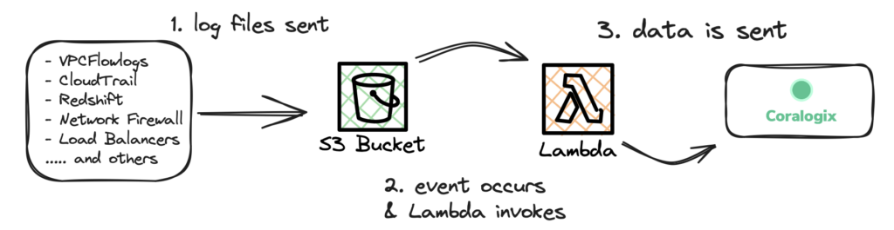
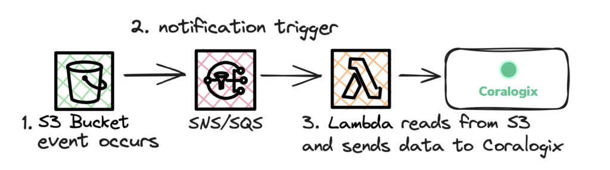
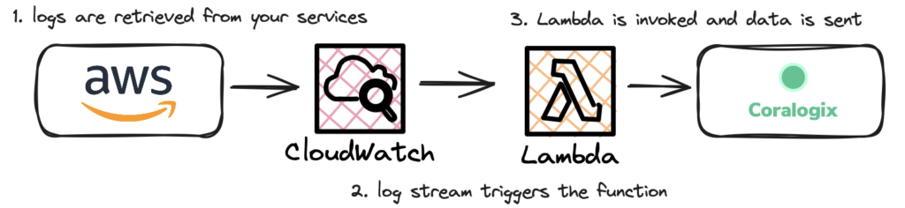
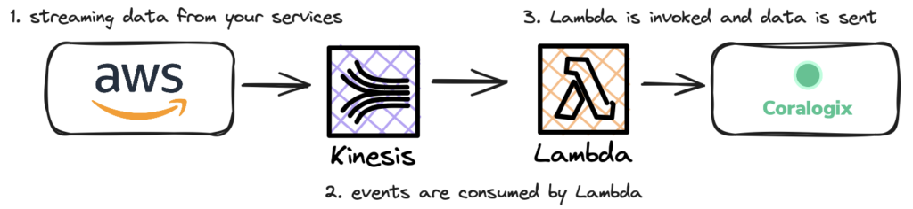

Our newest AWS integration offers the most seamless way to link up with Coralogix. Using a predefined Lambda function, you can send your AWS logs and events to your Coralogix subscription for in-depth analysis, monitoring, and troubleshooting.

## Overview

This integration guide focuses on connecting your AWS environment and Coralogix using AWS Lambda functions. To complete this integration, you may either use the Coralogix platform UI, CloudFormation templates from AWS, AWS SAM applications, or a dedicated Terraform module from our [GitHub repository](https://github.com/coralogix/terraform-coralogix-aws/tree/master/modules/coralogix-aws-shipper).

Our latest integration is based on the `[coralogix-aws-shipper](https://github.com/coralogix/coralogix-aws-shipper)`, which is written in Rust. It is designed with a focus on optimizing memory safety and runtime performance. Rust improves control over system resources without sacrificing safety. As a result, your integration is more resource-efficient.

We will show you how to complete our predefined Lambda function template to simplify the integration. Your task will be to provide specific configuration parameters, based on the service that you wish to connect. The reference list for these parameters is provided below.

**Note:** As we improve `[coralogix-aws-shipper](https://github.com/coralogix/coralogix-aws-shipper)`, we invite you to contribute, ask questions, and report issues in the repository.

### Supported Services

**Amazon S3, CloudTrail, VPC Flow Logs and more**

This integration is based on S3. Your Amazon S3 bucket can receive log files from all kinds of services, such as [CloudTrail](https://docs.aws.amazon.com/awscloudtrail/latest/userguide/cloudtrail-log-file-examples.html), [VPC Flow Logs](https://docs.aws.amazon.com/vpc/latest/userguide/flow-logs-s3.html), [Redshift](https://docs.aws.amazon.com/redshift/latest/mgmt/db-auditing.html#db-auditing-manage-log-files), [Network Firewall](https://docs.aws.amazon.com/network-firewall/latest/developerguide/logging-s3.html), or different types of load balancers ([ALB](https://docs.aws.amazon.com/elasticloadbalancing/latest/application/load-balancer-access-logs.html)/[NLB](https://docs.aws.amazon.com/elasticloadbalancing/latest/network/load-balancer-access-logs.html)/[ELB](https://docs.aws.amazon.com/elasticloadbalancing/latest/classic/access-log-collection.html)). This data is then sent to Coralogix for analysis.

You may also include SNS/SQS in the pipeline so that the integration triggers upon notification.

**Amazon CloudWatch**

Coralogix can be configured to directly receive data directly from your [CloudWatch](https://docs.aws.amazon.com/cloudwatch/) log group. In this case, the S3 is not used as an intermediary.

**Amazon Kinesis**

Coralogix can receive stream data from your AWS account. This option does not use S3 and lets you connect to services directly.

### Amazon MSK & Kafka

Coralogix can be configured to receive data directly from your [MSK](https://docs.aws.amazon.com/msk/) or [Kafka](https://docs.aws.amazon.com/lambda/latest/dg/with-kafka.html) cluster.

### Amazon ECR Image Security Scan

Coralogix can be configured to receive ECR [Image Scanning](https://docs.aws.amazon.com/AmazonECR/latest/userguide/image-scanning.html).

**Note:** Although `coralogix-aws-shipper` handles all of the AWS product integrations, some of the parameters are product-specific. Consult the [Configuration Parameters](#ConfigurationParameters) for product-specific requirements.

## Deployment Options

⚠️ **Important:** Before you get started, ensure that your AWS user has the permissions to create Lambda functions and IAM roles.

### Integrate using the Coralogix Platform (Recommended)

The fastest way to deploy your predefined Lambda function is from within the Coralogix platform. Fill out an integration form and confirm the integration from your AWS account. Product integrations can be by navigating to **Data Flow > Integrations** in your Coralogix toolbar. For detailed UI instructions, please read the [Integration Packages](https://coralogixstg.wpengine.com/docs/integration-packages/) tutorial.

### Quick Create a CloudFormation Stack

You can always launch the CloudFormation stack by filling out a Quick Create template. This is done from within your AWS Management Console. Log into your AWS account and click the button below to deploy the CloudFormation stack.

If you use AWS CLI, you can use a [CloudFormation template](https://github.com/coralogix/cloudformation-coralogix-aws/tree/master/aws-integrations/aws-shipper-lambda) from our repository.

### Deploy the AWS Serverless Application

Alternatively, you may use the [SAM deployment link](https://serverlessrepo.aws.amazon.com/applications/eu-central-1/597078901540/coralogix-aws-shipper). The procedure is very similar to filling out the above Quick Create template.

### **Terraform Module**

If you are using Terraform to launch your infrastructure, you can access `[coralogix-aws-shipper](https://github.com/coralogix/coralogix-aws-shipper)` it via our [Terraform Module](https://github.com/coralogix/terraform-coralogix-aws/tree/master/modules/coralogix-aws-shipper). Use the parameters defined in the repository README, as they better reflect the configuration process.

## Configuration Parameters

This document explains the basic config options for your template. You will need these values to launch your integration. For additional optional parameters, view our [Advanced Configuration](#AdvancedConfiguration) options.

Use the tables below as a guide to properly configure your deployment. The provided configuration variables are for the Serverless or CloudFormation deployment options. The variable requirements are slightly different if you wish to deploy with Terraform. Please refer to the [Terraform Module](https://github.com/coralogix/terraform-coralogix-aws/tree/master/modules/coralogix-aws-shipper) for further details.

### Universal Configuration

Use an existing Coralogix Send-Your-Data API key to make the connection or create one as you fill our pre-made template. Additionally, make sure your integration is [region-specific.](https://coralogixstg.wpengine.com/docs/coralogix-domain/)

**Note:** You should always deploy the AWS Lambda function in the same AWS Region as your resource (e.g. the S3 bucket).

| Parameter | Description | Default Value | Required |
| --- | --- | --- | --- |
| Application name | This will also be the name of the CloudFormation stack that creates your integration. It can include letters (A–Z and a–z), numbers (0–9) and dashes (-). |  | ✔️ |
| IntegrationType | Choose the AWS service that you wish to integrate with Coralogix. Can be one of: S3, CloudTrail, VpcFlow, CloudWatch, S3Csv, SNS, SQS, Kinesis, CloudFront’ | S3 | ✔️ |
| CoralogixRegion | Your data source should be in the same region as the integration stack. You may choose from one of the [**default Coralogix regions**](https://coralogixstg.wpengine.com/docs/coralogix-domain/): \[Custom, EU1, EU2, AP1, AP2, US1, US2\]. If this value is set to Custom you must specify the Custom Domain to use via the CustomDomain parameter. | Custom | ✔️ |
| CustomDomain | If you choose a custom domain name for your private cluster, Coralogix will send telemetry from the specified address (e.g. custom.coralogixstg.wpengine.com). |  |  |
| ApplicationName | [**The name of the application**](https://coralogixstg.wpengine.com/docs/application-and-subsystem-names/) for which the integration is configured. [**Advanced Configuration**](#AdvancedConfiguration) specifies dynamic value retrieval options. |  | ✔️ |
| SubsystemName | Specify [**the name of your subsystem**](https://coralogixstg.wpengine.com/docs/application-and-subsystem-names/). For a dynamic value, refer to the [**Advanced Configuration**](#AdvancedConfiguration) section. For CloudWatch, leave this field empty to use the log group name. |  |  |
| ApiKey | The **[Send-Your-Data API Key](https://coralogixstg.wpengine.com/docs/send-your-data-api-key/)** validates your authenticity. This value can be a direct Coralogix API Key or an AWS Secret Manager ARN containing the API Key. |  | ✔️ |
| StoreAPIKeyInSecretsManager | Enable this to store your API Key securely. Otherwise, it will remain exposed in plain text as an environment variable in the Lambda function console. | True | ✔️ |

### **S3/CloudTrail/VpcFlow/S3Csv** Configuration

This is the most flexible type of integration, as it is based on receiving log files to Amazon S3. First, your bucket can receive log files from all kinds of other services, such as [CloudTrail](https://docs.aws.amazon.com/awscloudtrail/latest/userguide/cloudtrail-log-file-examples.html), [VPC Flow Logs](https://docs.aws.amazon.com/vpc/latest/userguide/flow-logs-s3.html), [Redshift](https://docs.aws.amazon.com/redshift/latest/mgmt/db-auditing.html#db-auditing-manage-log-files), [Network Firewall](https://docs.aws.amazon.com/network-firewall/latest/developerguide/logging-s3.html) or different types of load balancers ([ALB](https://docs.aws.amazon.com/elasticloadbalancing/latest/application/load-balancer-access-logs.html)/[NLB](https://docs.aws.amazon.com/elasticloadbalancing/latest/network/load-balancer-access-logs.html)/[ELB](https://docs.aws.amazon.com/elasticloadbalancing/latest/classic/access-log-collection.html)). Once the data is in the bucket, a pre-made Lambda function will then transmit it to your Coralogix account.

**Tip:** The S3 integration supports generic data. You can ingest any generic text, JSON, and CSV data stored in your S3 bucket.

**Figure 1: Sending data directly from an S3 bucket.** Your applications will deposit their logs and events in a specified S3 Bucket. Each S3 Bucket event will trigger a Lambda invocation, thus sending the data to your Coralogix Account.

### **Adding SNS/SQS**

If you don’t want to send data directly as it enters S3, you can also use SNS/SQS to maintain notifications before any data is sent from your bucket to Coralogix. For this, you need to set the `SNSTopicArn` or `SQSTopicArn` parameters.

**Figure 2: First trigger via SNS, then send to an S3 bucket.** Alternatively, you can configure a notification to invoke the Lambda. The SNS/SQS is triggered as your S3 Bucket event occurs.

**Note:** All resources, such as S3 or SNS/SQS, should be provisioned already. If you are using an S3 bucket as a resource, please make sure it is clear of any Lambda triggers located in the same AWS region as your new function.

| Parameter | Description | Default Value | Required |
| --- | --- | --- | --- |
| S3BucketName | Specify the name of the AWS S3 bucket that you want to monitor. |  | ✔️ |
| S3KeyPrefix | Specify the prefix of the log path within your S3 bucket. This value is ignored if you use the SNSTopicArn/SQSTopicArn parameter. | CloudTrail/VpcFlow 'AWSLogs/' |  |
| S3KeySuffix | Filter for the suffix of the file path in your S3 bucket. This value is ignored if you use the SNSTopicArn/SQSTopicArn parameter. | CloudTrail '.json.gz', VpcFlow '.log.gz' |  |
| NewlinePattern | Enter a regular expression to detect a new log line for multiline logs, e.g., \\n(?=\\d{2}-\\d{2}\\s\\d{2}:\\d{2}:\\d{2}.\\d{3}). |  |  |
| SNSTopicArn | The ARN for the SNS topic that contains the SNS subscription responsible for retrieving logs from Amazon S3. |  |  |
| SQSTopicArn | The ARN for the SQS queue that contains the SQS subscription responsible for retrieving logs from Amazon S3 |  |  |
| CSVDelimiter | Specify a single character to be used as a delimiter when ingesting a CSV file with a header line. This value is applicable when the S3Csv integration type is selected, for example, "," or " ". | , |  |

### CloudWatch Configuration

Coralogix can be configured to receive data directly from your [CloudWatch](https://docs.aws.amazon.com/cloudwatch/) log group. This option does not use S3. You must provide the log group name as a parameter during setup.

**Figure 3:** CloudWatch logs are streamed directly to Coralogix via Lambda.

| Parameter | Description | Default Value | Required |
| --- | --- | --- | --- |
| CloudWatchLogGroupName | Provide a comma-separated list of CloudWatch log group names to monitor, for example, (log-group1, log-group2, log-group3). |  | ✔️ |

### SNS Configuration

To receive SNS messages directly to Coralogix, use the SNSIntegrationTopicARN parameter. This differs from the above use of `SNSTopicArn`, which notifies based on S3 events.

| Parameter | Description | Default Value | Required |
| --- | --- | --- | --- |
| SNSIntegrationTopicARN | Provide the ARN of the SNS topic to which you want to subscribe for retrieving messages. |  | ✔️ |

### SQS Configuration

To receive SQS messages directly to Coralogix, use the `SQSIntegrationTopicARN` parameter. This differs from the above use of `SQSTopicArn`, which notifies based on S3 events.

| Parameter | Description | Default Value | Required |
| --- | --- | --- | --- |
| SQSIntegrationTopicARN | Provide the ARN of the SQS queue to which you want to subscribe for retrieving messages. |  | ✔️ |

### Kinesis Configuration

We can receive direct stream data from your AWS account. This option does not use S3. Your [Kinesis](https://aws.amazon.com/kinesis/) stream ARN is a required parameter in this case.

**Figure 4:** Streaming Kinesis data from AWS Services directly to Coralogix

| Parameter | Description | Default Value | Required |
| --- | --- | --- | --- |
| KinesisStreamARN | Provide the ARN of the Kinesis Stream to which you want to subscribe for retrieving messages. |  | ✔️ |

### Kafka Configuration

| Parameter | Description | Default Value | Required |
| --- | --- | --- | --- |
| KafkaBrokers | Comma-delimited list of Kafka brokers to establish a connection with. |  | ✔️ |
| KafkaTopic | Subscribe to this Kafka topic for data consumption. |  | ✔️ |
| KafkaBatchSize | Specify the size of data batches to be read from Kafka during each retrieval. | 100 |  |
| KafkaSecurityGroups | Comma-delimited list of Kafka security groups for secure connection setup. |  | ✔️ |
| KafkaSubnets | Comma-delimited list of Kafka subnets to use when connecting to Kafka. |  | ✔️ |

### MSK Configuration

Your Lambda function must be in a VPC that has access to the MSK cluster. You can configure your VPC via the provided [VPC configuration parameters](https://github.com/coralogix/coralogix-aws-shipper#vpc-configuration-optional).

| Parameter | Description | Default Value | Required |
| --- | --- | --- | --- |
| MSKBrokers | Comma-delimited list of MSK brokers to connect to. |  | ✔️ |
| KafkaTopic | Subscribe to this Kafka topic for data consumption. |  | ✔️ |

### Generic Configuration (Optional)

These are optional parameters if you wish to 1) receive notification emails, 2) exclude certain logs or 3) send messages to Coralogix at a particular rate.

| Parameter | Description | Default Value | Required |
| --- | --- | --- | --- |
| NotificationEmail | A failure notification will be sent to this email address. |  |  |
| BlockingPattern | Enter a regular expression to identify lines excluded from being sent to Coralogix. For example, use MainActivity.java:\\d{3} to match log lines with MainActivity followed by exactly three digits. |  |  |
| SamplingRate | Send messages at a specific rate, such as 1 out of every N logs. For example, if your value is 10, a message will be sent for every 10th log. | 1 | ✔️ |

### Lambda Configuration (Optional)

These are the default presets for Lambda. Read [Troubleshooting](#Troubleshooting) for more information on changing these defaults.

| Parameter | Description | Default Value | Required |
| --- | --- | --- | --- |
| FunctionMemorySize | Specify the memory size for the Lambda function in megabytes. | 1024 | ✔️ |
| FunctionTimeout | Set a timeout for the Lambda function in seconds. | 300 | ✔️ |
| LogLevel | Specify the log level for the Lambda function, choosing from the following options: INFO, WARN, ERROR, DEBUG. | WARN | ✔️ |
| LambdaLogRetention | Set the CloudWatch log retention period (in days) for logs generated by the Lambda function. | 5 | ✔️ |

### VPC Configuration (Optional)

Use the following options if you need to configure a private link with Coralogix.

| Parameter | Description | Default Value | Required |
| --- | --- | --- | --- |
| LambdaSubnetID | Specify the ID of the subnet where the integration should be deployed. |  | ✔️ |
| LambdaSecurityGroupID | Specify the ID of the Security Group where the integration should be deployed. |  | ✔️ |
| UsePrivateLink | Set this to true if you will be using AWS PrivateLink. | false | ✔️ |

## Advanced Configuration

### AWS PrivateLink

If you want to bypass using the public internet, you can use AWS PrivateLink to facilitate secure connections between your VPCs and AWS Services. This option is available under the **VPC Configuration** tab. To turn it on, either check off the **Use Private Link** box in the Coralogix UI or set the parameter to `true`. For additional instructions on AWS PrivateLink, please [follow our dedicated tutorial.](https://coralogixstg.wpengine.com/docs/coralogix-amazon-web-services-aws-privatelink-endpoints/)

### Dynamic Values

If you wish to use dynamic values for the Application and Subsystem Name parameters, consider the following:

- JSON support: To reference dynamic values from the log, use _$.my\_log.field._ For the CloudTrail source, use _$.eventSource_.

- S3 folder: Use the following tag: {{s3\_key._value_}} where the value is the folder level. For example, if the file path that triggers the event is AWSLogs/112322232/ELB1/elb.log or AWSLogs/112322232/ELB2/elb.log and you want ELB1 and ELB2 to be the subsystem, your subsystemName should be {{s3\_key.3}}

## Troubleshooting

**Timeout errors**

If you see "Task timed out after", you need to increase the Lambda **Timeout** value. You can do this from the AWS Lambda function settings under **Configuration** > **General Configuration**.

**Not enough memory**

If you see "Task out of memory", you should increase the Lambda maximum **Memory** value. In the AWS Lambda function settings, go to **Configuration** > **General Configuration**.

**Verbose logs**

To add more verbosity to your function logs, set RUST\_LOG to DEBUG.

⚠️ **Warning:** Remember to change it back to INFO after troubleshooting.

**Changing defaults**

- Set the MAX\_ELAPSED\_TIME variable for default change (default = 250).

- Set BATCHES\_MAX\_SIZE (in MB) sets batch max size before sending to Coralogix. This value is limited by the max payload accepted by the Coralogix endpoint (default = 4).

- Set BATCHES\_MAX\_CONCURRENCY sets the maximum amount of concurrent batches that can be sent.

## Support

**Need help?**

Our world-class customer success team is available 24/7 to walk you through your setup and answer any questions that may come up.

Contact us **via our in-app chat** or by emailing [support@coralogixstg.wpengine.com](mailto:support@coralogixstg.wpengine.com).
