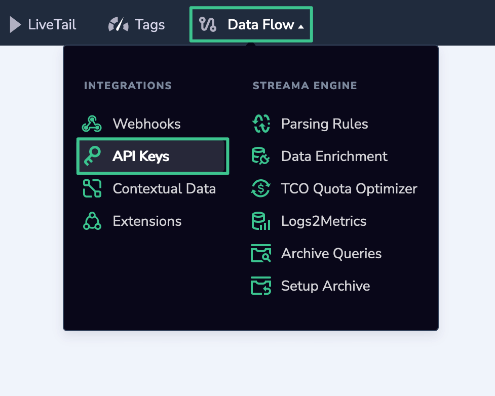
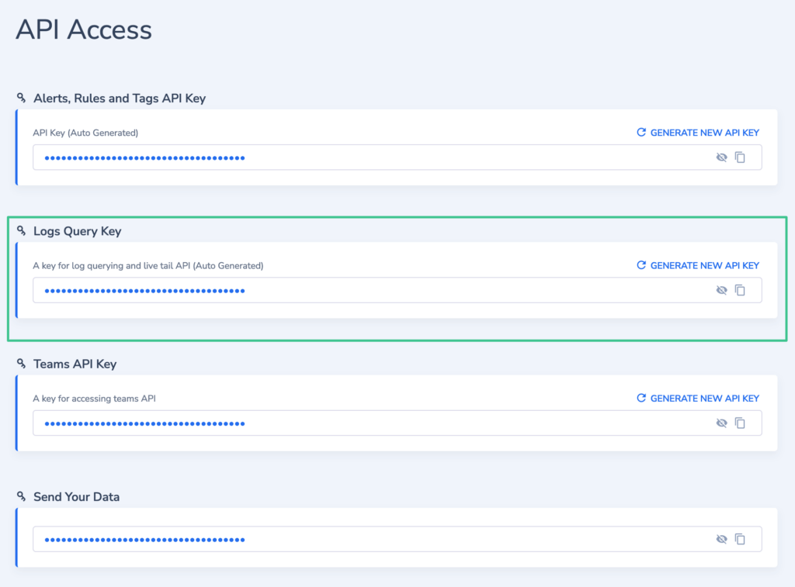

Coralogix is on a mission to provide a CLI that will enable you to do all your Coralogix operations without the web interface involved. Currently, we support:

1. [Quota management](https://coralogixstg.wpengine.com/tutorials/quota-management/) to help you manage quota across your teams.

3. [SAML management](https://coralogixstg.wpengine.com/tutorials/saml-management-via-cli/) allows the management of SAML SSO configuration by admin users.

5. [Team management](https://coralogixstg.wpengine.com/tutorials/team-management-via-cli/) allows admins to create teams and invite users.

7. LiveTail (a live log stream from all your services). You can filter your logs by Coralogix metadata fields such as application name, subsystem name, and severity and also by querying the data itself. Live tail is much like how the stern command in K8s streams logs in real-time. 

## **Install the Coralogix CLI for MacOS/Linux**

### Download:

```
curl -O https://coralogix-public.s3-eu-west-1.amazonaws.com/cxctl/latest/cxctl-macOS.gz
```

Or

```
curl -O https://coralogix-public.s3-eu-west-1.amazonaws.com/cxctl/latest/cxctl-Linux.gz
```

### Unzip

```
gunzip -N cxctl-*.gz
```

### Make Executable:

```
chmod +x cxctl
```

## Set Environment Variables:

Required for Live Tail:

```
export CORALOGIX_API_KEY=YOUR_LOGS_API_KEY
```

The API key to use can be found under Data Flow / API Keys / Logs Query Key:





## Scan Option:

\[table id=36 /\]

## Scan Examples

\[table id=37 /\]

## Histogram:

Prints a time-based log count histogram.

\[table id=36 /\]

## Log Streaming

In order to stream the logs in real-time (as they are being archived) use the following command:

```
./cxctl livetail --region "region-name" --api-key <api-key> --format pretty --application "app-name" --subsystem "subsystem-name"
```

A Coralogix API key can be passed to the scanner through the \`--api-key\` argument or as an environment variable

Streaming supports the following regions:

<table><tbody><tr><td>Region</td><td>US1</td><td>EU1</td><td>EU1</td><td>AP1</td><td>AP2</td></tr><tr><td><code>region-name</code></td><td><code>us</code></td><td><code>eu</code></td><td><code>se</code></td><td><code>in</code></td><td><code>sg</code></td></tr></tbody></table>

By default, the logs use the \`pretty\` format. A \`raw\` format is also available which prints out the logs as JSON objects

The scanner will tail the logs infinitely by default but can stop after a specified number of log lines using --count

## LiveTail Option:

\[table id=38 /\]
