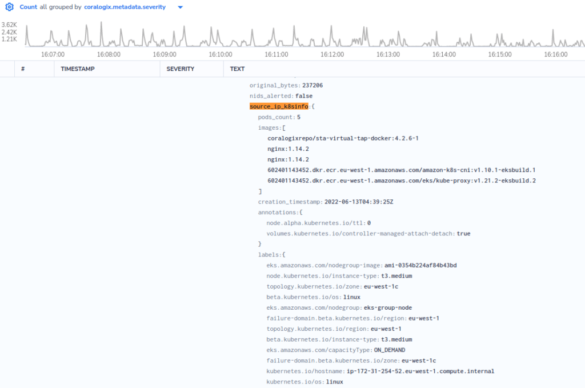

If there are Kubernetes nodes among the instances that are mirrored to the STA, the STA can automatically enrich source and destination IPs in its events with information about the pod or node that generated this traffic.

To get this to work, follow these simple steps:

## Self-hosted Kubernetes (Non - EKS)

1. During the STA's installation set an S3 bucket to store the configuration (Using the `ConfigS3Bucket` CloudFormation/Terraform parameter)

3. Create a kube config file (that allows at least to run `kubectl get nodes` and `kubectl get pods`) and upload it to that S3 bucket at the root of the bucket under the name `kube.config`

## AWS EKS

- During the STA's installation set an empty S3 bucket to store the configuration (Using the `ConfigS3Bucket` CloudFormation/Terraform parameter)

- Open AWS EC2 console and click the STA instance, navigate to the Security tab and click the STA's IAM role

- Copy the role's ARN to clipboard or to a text file

- Click the policy named "cgx\_sta", click on "Add additional permissions", click on "Choose a service" and select "STS"

- In the "Actions" section, click the tiny triangle next to "Write" and select "AssumeRole"

- In the "Resources" section, click the tiny triangle next to "Resources" and click "Add ARN" and at the top text box under "Specify ARN for role" replace all the text with the ARN you copied at step 3 and click "Add", click "Review policy" and then on "Save changes"

- Connect to your AWS environment via CLI and run the following command:

- Use this command on your EKS management instance to generate the kube config file:

- `aws --profile <aws_profile> eks update-kubeconfig --name <cluster_name> --region <aws_region>`

- `kubectl edit configmap aws-auth -n kube-system`

- Under `mapRoles:` add the following content (for rolearn paste the ARN you copied at step 3 and for username copy and paste the last part after the slash):

```
    - rolearn: arn:aws:iam::123456789012:role/test-sta-spot-k8s-eks-CoralogixSTASpotsManagerRole-4ECRD39DWTKT
      username: test-sta-spot-k8s-eks-CoralogixSTASpotsManagerRole-4ECRD39DWTKT
      groups:
      - system:masters
```

- Save and quit the editor

- Upload the `~/.kube/config` file to the S3 bucket chosen to hold the configuration under the name `kube.config`

## AZURE AKS

during the STA's installation, you provided several arguments representing Azure's storage variables.

in case AKS and STA are using same virtual network and subnet:

- Upload the `~/.kube/config` file to the Storage container chosen to hold the configuration under the name `kube.config` - thats it!

## FINAL STEPS

- The following steps are essentially optional and will be automatically carried out by the system but carrying them out now will force applying the new settings immediately:
    - Log in to the STA via SSH and run the following commands:
        - `sta-force-sync-configs` _(if it returns with a message saying it has collided with one of the STA's core services, wait for three minutes and try again)_
        
        - `sta-restart-enrichment-k8s-context`

- You should now see that events from the STA are now enriched with on of the fields `source_ip_k8sinfo` or `destination_ip_k8sinfo` or both:


