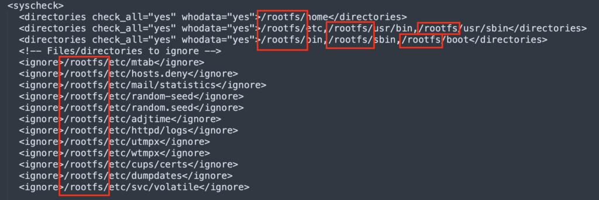
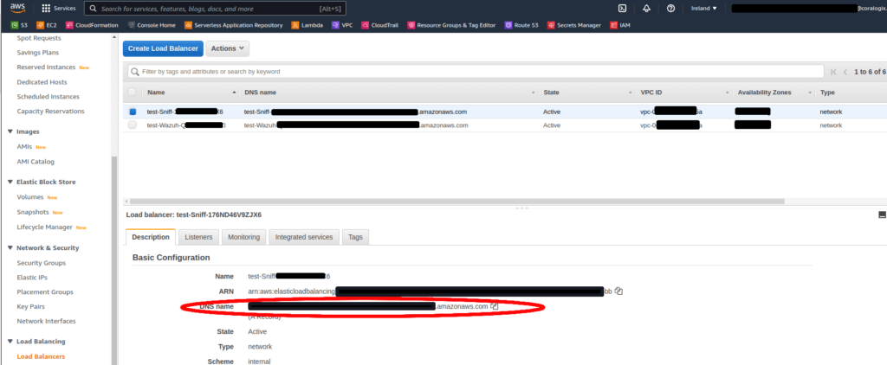

The [Coralogix STA](https://coralogixstg.wpengine.com/docs/sta-whats-in-the-box/) is capable of detecting security-related issues in network traffic and host activities (with Wazuh integration). Until now it could receive the mirrored traffic in only two ways: AWS VPC Traffic Mirroring and physical network taps or SPAN ports.

We are excited to inform you that we have launched our own virtual tap which can be used to mirror traffic from instances which are not supported for AWS VPC Traffic Mirroring, from containerized environments or from environments in which it won't make economic sense to use AWS VPC Traffic Mirroring.

The Coralogix STA Virtual Tap can run as a container (either as a Docker container or as a Kubernetes pod) and can both mirror the instance's traffic by using [eBPF](https://ebpf.io/) as well as function as a Wazuh agent and collect host based information and handle tasks defined by the Wazuh manager's configuration.

## Kubernetes Installation

To install the Coralogix STA Virtual Tap copy the following file to a file:

```
apiVersion: apps/v1
kind: DaemonSet
metadata:
  name: coralogix-vtap-wazuh
  namespace: default
  labels:
    k8s-app: coralogix-sta-ng
spec:
  selector:
      matchLabels:
        kubernetes.io/os: linux
  template:
    metadata:
      labels:
        kubernetes.io/os: linux
    spec:
      hostNetwork: true
      containers:
      - name: coralogix-vtap-wazuh
        image: coralogixrepo/sta-virtual-tap-docker
        securityContext:
          privileged: true
        env:
        - name: STA_SNIFFING_FILTER
          value: "not dst port 4789"
        - name: STA_SNIFFING_DEST
          value: "<REMOTE_STORAGE_CONFIGURATION|RELEVANT_INTERNAL_IP>"
        - name: STA_DISABLE_WAZUH
          value: "<TRUE|FALSE>"
        - name: WAZUH_MANAGER
          value: "<WAZUH_MANAGER_NLB_DNS_NAME>"
        - name: TAP_INTERFACE
          value: "<eth0(commonly_used_CHANGE_IF_DIFFERENT)>"
        resources:
          limits:
            memory: 200Mi
          requests:
            cpu: 100m
            memory: 200Mi
### Uncomment when using Wazuh
#      volumeMounts:
#        - name: rootfs
#          mountPath: /rootfs
      terminationGracePeriodSeconds: 30
#      volumes:
#      - name: rootfs
#        hostPath:
#          path: /

```

Pay attention that the line **`terminationGracePeriodSeconds: 30`** needs to stay uncommented and is required

When using Wazuh via Daemonset, uncomment the lines that map the node content into the pod and edit the **`agent.conf`** file located on the STA's configuration bucket under `**wazuh-clients > default > agent.conf**` to match the new change - add the **`/rootfs`** prefix to all the paths in the files



The values for the STA\_SNIFFING\_DEST (if connected to NLB) and WAZUH\_MANAGER environment variables should be retrieved from the "Load Balancers" in the EC2 console in AWS:



## Docker installation

```bash
docker run -d --name sta-virtual-tap \
-e "STA_SNIFFING_DEST=<REMOTE_STORAGE_CONFIGURATION|RELEVANT_INTERNAL_IP>" \
-e "TAP_INTERFACE=<TAP_INTERFACE>" \
-e "STA_SNIFFING_FILTER=not dst port 4789" \
-v /:/rootfs \
--privileged --net host coralogixrepo/sta-virtual-tap-docker
```

#### Notes

- In case you don't want to install `Wazuh`, make sure to add environment variable `STA_DISABLE_WAZUH` and set it to `TRUE`

- If the STA is deployed on AWS, the mirroring process will attempt to connect directly to the STA using its IP (extracted from the bucket's configuration). All traffic is mirrored at NO COST, but the Virtual Tap's process itself might require your machine to have more resources.  
    In case there was an issue with connecting directly to the STA, it will cascade the connection to the STA's NLB - this will apply mirroring costs, and can be reduced via defining mirroring filter.  
    To validate how the mirroring is handled you can check from within your machine where the Virtual Tap in installed by running the following command (You can determine what connection was established by looking at the output):  
    

```
docker logs <VIRTUAL_TAP_CONTAINER_ID>
```

- Additional steps are required if Azure is used as a cloud provider, and the STA is using different resource group or virtual network than your other mirrored machines - peering between those networks is required - please read [this article](https://learn.microsoft.com/en-us/azure/virtual-network/tutorial-connect-virtual-networks-portal) for more information.

To function properly, the instance hosting this docker should have an IAM role attached to it (or the AWS credentials provided to default profile) with the following permissions:

1. S3:GetObject

3. S3:ListBucket

## Advanced Installation

It is possible to control many aspects of the behavior of the Coralogix STA Virtual Tap by setting the following environment variables (in addition to **STA\_SNIFFING\_NLB** and **WAZUH\_MANAGER** mentioned above):

**STA\_DISABLE\_TAP** - Can be set to "TRUE" to disable the tap feature of the Coralogix STA Virtual Tap, essentially making it work just as a Wazuh agent. By default this value is set to "FALSE"

**STA\_DISABLE\_WAZUH** - Can be set to "TRUE" to disable the Wazuh agent **STA\_DISABLE\_TAP** - Can be set to "TRUE" to disable the tap feature of the Coralogix STA Virtual Tap, essentially making it work just as a virtual tap. By default this value is set to "FALSE".

**TAP\_INTERFACE** - Can be set to a specific network interface that its traffic you wish to mirror to the STA. By default this value is set to "any" which will mirror traffic from all of the instance's network interface. **It's recommended to set a specific name depending on the machine's network interface.**

**STA\_SNIFFING\_DEST** - Indicates which STA cluster the mirrored traffic will be sent to.  
you can specify this by the following options:

1. Remote storage (AWS S3 bucket, Azure storage, etc) - will need relevant read permissions. (seamlessly will read from storage and make the relevant connection).

3. Internal IP of dedicated STA instance's NIC VXLAN sniffer.

5. Internal IP of the STA's NLB - on AWS this option is not recommended as you pay on the mirrored traffic.

**STA\_SNIFFING\_FILTER** - Can be set to a BPF filter that will determine which traffic will be mirrored to the STA. By default this value is empty which will mirror all types of traffic seen.

**WAZUH\_GROUP** - The Wazuh agent group to use for the built in agent in the Coralogix STA Virtual Tap. By default this value is set to "default".

## Post-Installation

After installing this container on your environment, the STA should start receiving traffic and Wazuh events from your environment and display them on the Coralogix UI and, if needed, alert you upon security related issues found.

## VPC Traffic Mirroring vs. Coralogix STA Virtual Tap

Although it is possible to install Coralogix STA Virtual Tap instead of using the AWS VPC Traffic Mirroring, we recommend that you will consider the following notes:

1. VPC Traffic Mirroring is handled by the AWS virtualization hypervisor which means it cannot impact the performance of the EC2 instances. A virtual tap, runs inside your EC2 instance (as a container) and therefore, can potentially have some effect on the instance's performance.

3. VPC Traffic Mirroring is handled by the AWS virtualization hypervisor which means it cannot be detected and evaded by a potential attacker that has a foothold in that EC2 instance. A virtual tap, runs inside your EC2 instance (as a container) and therefore, can potentially be evaded or tampered with.

5. AWS charges for every traffic mirroring session a certain fee (in addition to what they charge for the traffic that is being mirrored). The virtual tap doesn't incur such charges.

## Sample values for STA\_SNIFFING\_FILTER

The Virtual Tap allows you to specify an eBPF filter for limiting the amount of traffic that will be mirrored to the STA. Here are some examples of what you can set it to (by default it will mirror everything):

- The essential filter: `portrange 1-7`9 or icmp  
    This filter will mirror the most important protocols that generate the lowest amounts of traffic (in our view). That means you'll get the best value for money while trading off the ability to get the full details of what went on your network.

- The moderate filter: `icmp or (not portrange 443-445 and not port 80)`  
    This filter will exclude from mirroring protocols that tend to be noisy in most environments. It is important that you'll not exclude protocols that are potentially hazardous for your instances.

You can consult this document for more information: [https://biot.com/capstats/bpf.html](https://biot.com/capstats/bpf.html )  
For more information about selecting the best mirroring strategy: [https://coralogixstg.wpengine.com/docs/aws-traffic-mirroring/](https://coralogixstg.wpengine.com/docs/aws-traffic-mirroring/)
