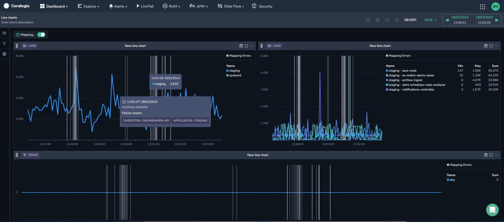
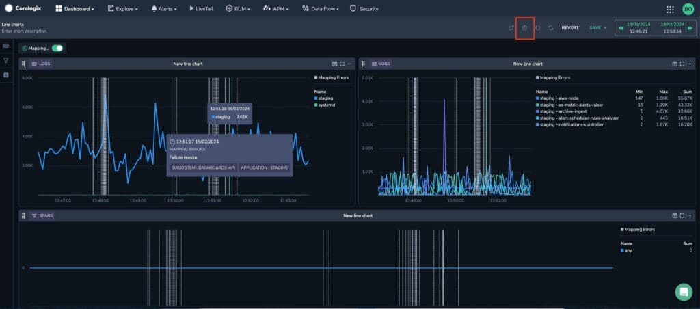
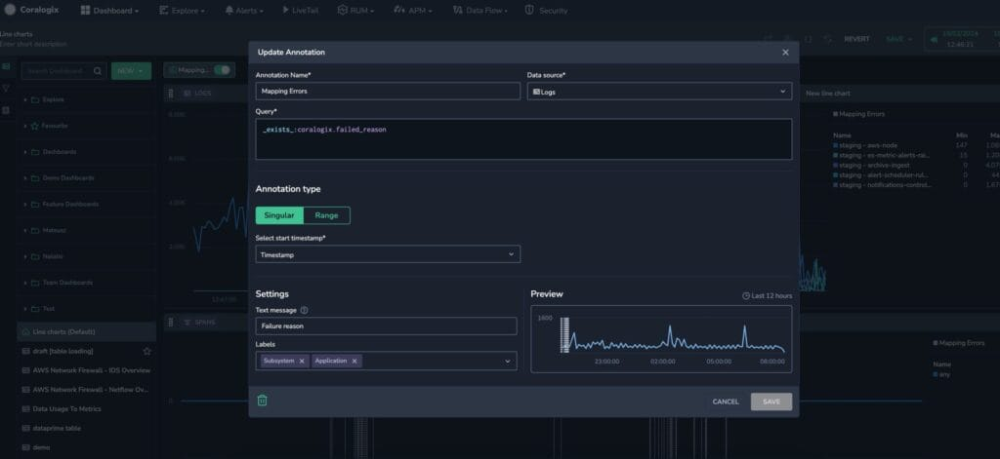

Add **Annotations** in Custom Dashboards to provide rich contextual information about single points in time.

## Overview

Annotations in [Custom Dashboards](https://coralogixstg.wpengine.com/docs/custom-dashboards/) allow you to spotlight crucial events by adding an agnostic query that runs parallel to the query underlying your widget. Represented as vertical lines cutting across your line and bar charts, you may hover over an annotation to uncover event details and tags, adding an extra layer of context. The text message field even lets you embed dynamic label values for comprehensive insights. When two or more events occur simultaneously on an annotation, toggle between events on the same timestamp.

Utilize annotations strategically — mark the deployment time of a new software release for instant correlation with system changes, or, during an incident response, create annotations to pinpoint critical events revealed by logs, metrics, or spans. This creates a precise chronological record of investigative steps for swift and effective resolution.

When an annotation is created, it applies to all time-based widgets in your dashboard.

Easily edit or delete the annotation at any time.

## Create an Annotation

**STEP 1**. Click the annotation icon in the upper right-hand corner of your dashboard to add an annotation.

**STEP 2**. Enter the annotation details.

### Annotation Name

Select a name that will be easily recognizable.

### Data Source

Annotations can be extracted from any of the following data sources:

- **Logs**

- **Spans**

- **Metrics**. When you select metrics, you may choose a predefined metric in the **Metric to Annotation** field or use a free-text PromQL query in the **Query** field.

- **DataPrime**. This option allows logs and spans to be sourced within a [DataPrime](https://coralogix.com/docs/dataprime-cheat-sheet/) syntax query.

Annotations can be extracted from metrics. When you select metrics, you may choose a predefined metric in the **Metric to Annotation** field or use a free-text PromQL query in the **Query** field.

### Query

If you haven’t chosen to use a [DataPrime](https://coralogix.com/docs/dataprime-cheat-sheet/) syntax query, logs and traces are queried with [Lucene](https://coralogix.com/docs/log-query-simply-retrieve-data/#querying-your-logs) and metrics with [PromQL](https://coralogix.com/academy/get-to-know-coralogix/intro-to-promql/). An annotation will be automatically generated on your widgets when query results are met.

### Annotation Type

Select a singular event (**Single**) or a time range (**Range**) with a start and end time.

- **Single**. From the drop-down menu, choose the field that represents the start timestamp.

- **Range**. From the drop-down menu, choose the fields that represent the start and end timestamps. Alternatively, select the field representing the timestamp duration from the available options.

### Settings

- **Text Message**. Use free text with dynamic field placeholders enclosed in curly brackets, which become visible upon hovering over the annotation. For instance: 'Service {{service name}} experienced deployment at {{deployment.timestamp}}'. Replace the field placeholders accordingly.

- **Labels**. Select label keys - such as pod name, node name, or environment - to be displayed in the annotation.

**STEP 3**. If you are satisfied with the annotation displayed in the **Preview**, click **SAVE**.

## Hiding Annotations

When an annotation is created, it applies to all time-based widgets in your dashboard. Toggle your annotation on and off for all widgets in the dashboard toolbar.

Toggle an annotation on and off in a specific widget by clicking on the annotation name in the widget legend.

## Modify & Delete Annotations

**STEP 1**. Click on an annotation name to be rerouted to the annotation setup.

**STEP 2**. Modify the configuration settings, and click **SAVE**.

To delete the annotation, click on the trash icon in the lower left-hand corner of your settings box.

## Additional Resources

<table><tbody><tr><td>Documentation</td><td><strong><a href="https://coralogixstg.wpengine.com/docs/custom-dashboards/">Custom Dashboards</a></strong></td></tr></tbody></table>

## Support

**Need help?**

Our world-class customer success team is available 24/7 to walk you through your setup and answer any questions that may come up.

Contact us **via our in-app chat** or by emailing [support@coralogixstg.wpengine.com](mailto:support@coralogixstg.wpengine.com).
