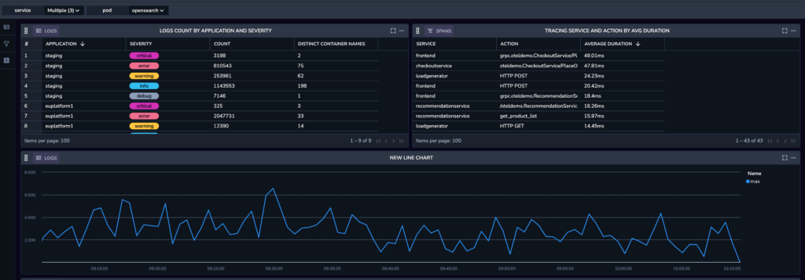
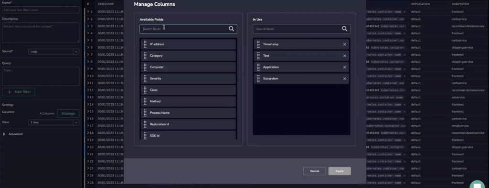

Create a **Data Table** in your custom dashboard in Events or Aggregated View.

## Overview

Create a customized data table and visualize logs or metrics using Events or Aggregated View.

### Events View

Events View is supported for logs and spans.

### Aggregated View

Aggregated View is supported for logs, spans and metrics.

For logs and spans, you need to select a column by which you want to aggregate the data, then select which columns you want to see.

For metrics, the data is auto-generated from within the metric. Two different calculations based on a PromQL query exist:

- In case [instant vector selectors](https://prometheus.io/docs/prometheus/latest/querying/basics/#instant-vector-selectors) are used without [@ modifier](https://prometheus.io/docs/prometheus/latest/querying/basics/#modifier), it is possible to run PromQL aggregation functions to return precise results.

- In case of a more complex query, aggregations are calculated based on sampled values and are approximations.

### Create a Data Table

**Create a customized data table and visualize logs or metrics**.

**STEP 1**. In a custom dashboard, drag and drop the **Data Table** widget from your left-hand side bar to get started.

**STEP 2**. Set the definitions for your Data Table in the right-hand sidebar.

- **Name & Description**. Create a name and description for your data table.

- **Load data from.** Select whether to load data from [Frequent Search](https://coralogixstg.wpengine.com/docs/optimize-log-management-costs/#frequent-search-data-high-priority) or [Monitoring](https://coralogixstg.wpengine.com/docs/optimize-log-management-costs/#monitoring-data-medium-priority).

- **Source**. Select a data source.
    - Coralogix supports metrics, logs and spans as the data source for the data table widget. The metrics data source provides you with the ability to investigate any metric easily despite the volume of information given. It enables you to view all the permutations of each label for a given query. Each permutation gives you the values for the selected timespan including Last, Min, Max, Avg, and Sum. It includes a view that lets you see the values at any given time in the selected timespan.
    
    - If the **Source** chosen is metrics, specify the metric or desired PromQL in the **Query** field. Use free text to search for a metric of your choice. As you do so, all relevant metrics will appear. Hover over any metric to view its system-generated metadata labels. Hover over a label to see its values.

- **Table Type.** When using logs or spans as the data source, you can choose between the Events view and the Aggregated view. Metrics are automatically generated in aggregated view.
    - **Event tables** show a table with a list of logs or spans ordered by time (you can change this to be sorted by other columns later) with additional metadata and labels relevant to those events, similar to the view you see in the Explore screen.
    
    - **Aggregation tables** creates a table of values, grouped by a field or fields you specify. Each column represents a different value depending on the chosen group. Values could be a simple count or an average of the values for the specific field, for each of the defined group-by values.
    
    - You can add and edit columns and filters for the aggregation table using the right-hand side bar.
    
    - **Note:** Traces are currently limited to a single aggregation column per table widget.

- **Columns**. Manage columns by selecting one or more relevant fields.

- **Advanced**: Select the number of results to be displayed per page.

**STEP 4**. In the bottom Query bar, add a Lucene or PromQL query to filter specific information.

**STEP 5**. If you wish to save your dashboard with the new widget, click **SAVE** in the upper right hand corner.

## Additional Resources

<table><tbody><tr><td>Documentation</td><td><a href="http://www.coralogixstg.wpengine.com/docs/custom-dashboards"><strong>Custom Dashboards</strong></a> <strong><a href="http://www.coralogixstg.wpengine.com/docs/custom-dashboards-line-charts">Line Charts</a> <a href="http://www.coralogixstg.wpengine.com/docs/custom-dashboards-gauges">Gauges</a> <a href="http://www.coralogixstg.wpengine.com/docs/custom-dashboards-pie-charts">Pie Charts</a> <a href="http://www.coralogixstg.wpengine.com/docs/custom-dashboards-bar-charts">Bar Charts</a></strong></td></tr></tbody></table>

## Support

**Need help?**

Our world-class customer success team is available 24/7 to walk you through your setup and answer any questions that may come up.

Feel free to reach out to us **via our in-app chat** or by sending us an email at [support@coralogixstg.wpengine.com](mailto:support@coralogixstg.wpengine.com).
