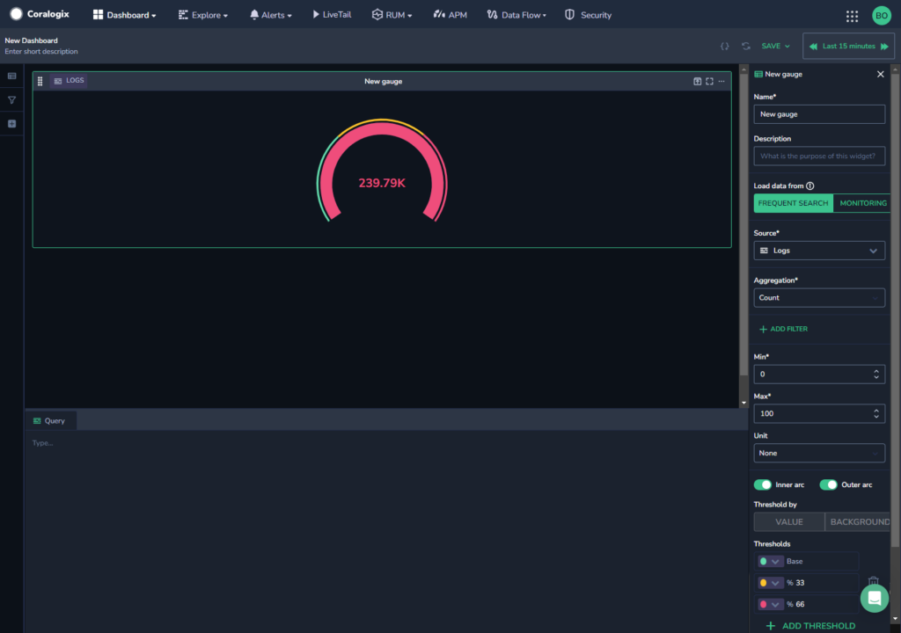

Create a customized gauge visualization in [Custom Dashboards](https://coralogixstg.wpengine.com/docs/custom-dashboards/).

## Create a Gauge

**STEP 1**. In a custom dashboard, drag and drop the **Gauge** widget from your left-hand sidebar to get started.

**STEP 2**. Set the definitions for your Gauge in the right-hand sidebar.

- **Name & Description**. Create a name and description.

- **Load data from.** Select whether to load data from [Frequent Search](https://coralogixstg.wpengine.com/docs/optimize-log-management-costs/#frequent-search-data-high-priority) or [Monitoring](https://coralogixstg.wpengine.com/docs/optimize-log-management-costs/#monitoring-data-medium-priority).

- **Source**. Select a data type.
    - If the data type chosen is metrics, specify the metric or desired PromQL in the **Query** field. Use free text to search for a metric of your choice. As you do so, all relevant metrics will appear. Hover over any metric to view its system-generated metadata labels. Hover over a label to see its values.
        - **Calculation**: Determines the values for your gauge. Instant, Last, Avg, Sum, Min and Max are possible parameters.
            - Selecting the parameter **Last** will provide the last data point in a time series within the selected time frame, whereas **Instant** will provide the final value at the end of the time frame. **Avg**, **Sum**, **Min**, and **Max** calculate the value by applying the selected aggregation function to the time series data points within the time frame.
                - For example, if the time is 03:25:00, fetching the time series with hour steps returns 00:00:00 - 1, 01:00:00 - 3, 02:00:00 - 15, 03:00:00 - 60, therefore the **Last** value would be 60. However, if we get the value for the exact time of 03:25:00 using **Instant**, the value returned will be taken from the exact time in the timeline, resulting in a value of 120.
    
    - If the data type chosen is logs or spans, you will be directed to select an **Aggregation.**

- **Add Filter.** \[Optional\] Add a filter to your gauge.
    - As opposed to the dashboard filter in the left-hand sidebar which affects the entire dashboard, this filter only affects the widget.
    
    - The widget and dashboard filters operate in parallel to one another and intersect. If they negate one another, dashboard filters override widget filters.

- **Visuality**.
    - **Unit**. Choose to display a % symbol alongside your results.
    
    - Enable or disable the **Inner arc** and **Outer arc**. The inner arc will show actual value. The outer arc will show the thresholds. If you choose not to enable either arc, you will be left only with a number in your gauge.
    
    - **Thresholds.** Choose the base **Thresholds** - that is, when the gauge should appear green and red. Add additional thresholds - yellow and orange - if necessary.

**STEP 3**. Click **SAVE** in the upper right-hand corner.

**Note**: The gauge widget currently works on a **single** time series.

## Additional Resources

<table><tbody><tr><td>Documentation</td><td><a href="https://coralogixstg.wpengine.com/docs/custom-dashboards/"><strong>Custom Dashboards</strong></a> <strong><a href="http://www.coralogixstg.wpengine.com/docs/custom-dashboards-line-charts">Line Charts</a> <a href="http://www.coralogixstg.wpengine.com/docs/custom-dashboards-data-tables">Data Tables</a> <a href="http://www.coralogixstg.wpengine.com/docs/custom-dashboards-pie-charts">Pie Charts</a> <a href="http://www.coralogixstg.wpengine.com/docs/custom-dashboards-bar-charts">Bar Charts</a></strong></td></tr></tbody></table>

## Support

**Need help?**

Our world-class customer success team is available 24/7 to walk you through your setup and answer any questions that may come up.

Feel free to reach out to us **via our in-app chat** or by sending us an email at [support@coralogixstg.wpengine.com](mailto:support@coralogixstg.wpengine.com).
