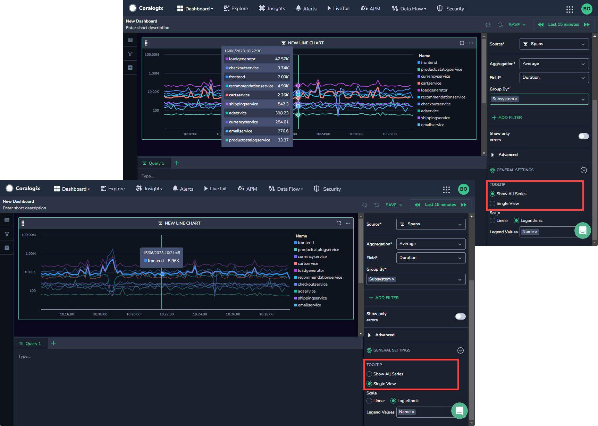
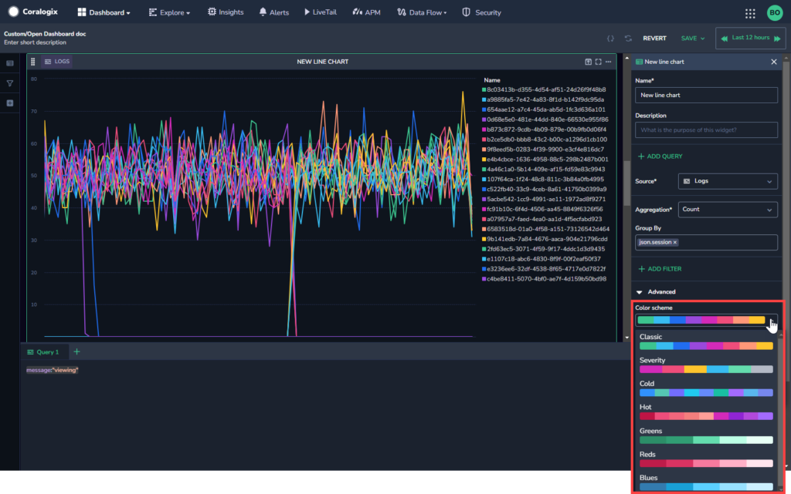

Create a customized line chart and visualize logs or metrics in [Custom Dashboards](http://www.coralogixstg.wpengine.com/docs/custom-dashboards).

## Create a Line Chart

**STEP 1**. In a custom dashboard, drag and drop the **Line Chart** widget from the left-hand sidebar to get started.

**STEP 2**. Set the definitions for your Line Chart in the right-hand sidebar.

- **Name & Description**. Create a name and description for your line chart.

- **Load data from.** Select whether to load data from [Frequent Search](https://coralogixstg.wpengine.com/docs/optimize-log-management-costs/#frequent-search-data-high-priority) or [Monitoring](https://coralogixstg.wpengine.com/docs/optimize-log-management-costs/#monitoring-data-medium-priority).

- **Source**. Select a data type.
    - If the data type chosen is metrics, specify the metric or desired PromQL in the **Query** field. Use free text to search for a metric of your choice. As you do so, all relevant metrics will appear. Hover over any metric to view its system-generated metadata labels. Hover over a label to see its values.
    
    - If the data type chosen is logs or spans, you will be directed to select the following fields:
        - **Aggregation**: Aggregate by Count, Count Distinct, Sum, Min, Max, and/or Average
        
        - **Group By**: Select any field from the dropdown menu

- **\+ ADD FILTER**. \[Optional\] Add a widget filter.
    - As opposed to the dashboard filter in the left-hand sidebar which affects the entire dashboard, this filter only affects the widget.
    
    - The widget and dashboard filters operate in parallel to one another and intersect. If they negate one another, dashboard filters override widget filters.

- **Advanced**: Select from the following advanced options.
    - **Scale.** Select whether you want the scale of the line chart to be **Logarithmic** or **Linear**. The default setting is linear, however if you have large differences between the different values, it can be helpful to show the logarithmic scale instead. For example, if the majority of your values are under 1k and one value is 10k, using the logarithmic scale will show you an easier to read line chart than the linear scale.
    
    - **Series Per Query.**
    
    - **Series Name.** Create a series name
    
    - **Unit.** Select the unit type to use in your line chart.
    
    - **Tooltip.** Select whether to see all time series when hovering over them, or to see only the single time series you hover over.
    
    - 
    
    - **Legend Values.** Customize values to be displayed in your legend: Min, Max, Sum, Avg, Last.
    
    - **Color Scheme.** Select the color scheme for your chart. Note that when **Legend Colors By** **Group** is selected, color scheme is disabled.

**STEP 3**. In the bottom Query bar, add a Lucene or PromQL query to query specific information.

- New! Coralogix is bringing Full Stack Observability into your Custom Dashboards! With the new multiple query feature available in custom dashboard widgets, you can view queries from multiple data types in a single chart. For more information on multiple queries, see [Multiple Queries in Custom Dashboard Widgets](https://coralogixstg.wpengine.com/docs/multiple-queries-in-custom-dashboard-widgets/).

**STEP 4**. \[Optional\] If you want to save your dashboard for future use, click **SAVE** in the upper right-hand corner.

## Additional Resources

<table><tbody><tr><td>Documentation</td><td><strong><a href="http://www.coralogixstg.wpengine.com/docs/custom-dashboards">Custom Dashboards</a> <a href="http://www.coralogixstg.wpengine.com/docs/custom-dashboards-data-tables">Data Tables</a> <a href="http://www.coralogixstg.wpengine.com/docs/custom-dashboards-gauges">Gauges</a> <a href="http://www.coralogixstg.wpengine.com/docs/custom-dashboards-pie-charts">Pie Charts</a> <a href="http://www.coralogixstg.wpengine.com/docs/custom-dashboards-bar-charts">Bar Charts</a></strong></td></tr></tbody></table>

## Support

**Need help?**

Our world-class customer success team is available 24/7 to walk you through your setup and answer any questions that may come up.

Feel free to reach out to us **via our in-app chat** or by sending us an email at [support@coralogixstg.wpengine.com](mailto:support@coralogixstg.wpengine.com).
