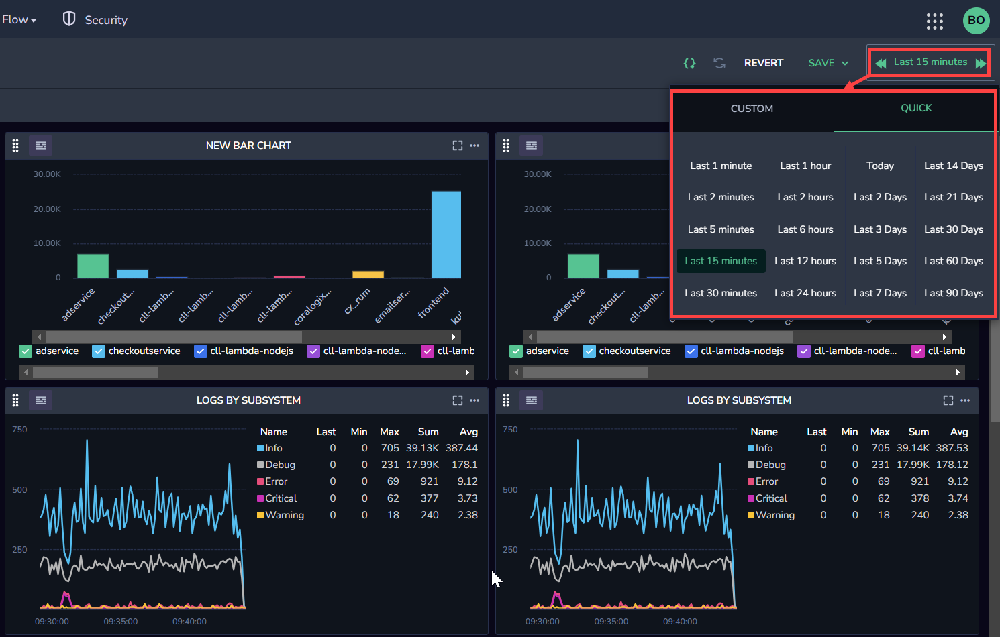

Coralogix now offers the ability to create unlimited, personalized **custom dashboards**. Use six new visualizations - [Data Table](http://www.coralogixstg.wpengine.com/docs/custom-dashboards-data-tables), [Line Chart](http://www.coralogixstg.wpengine.com/docs/custom-dashboards-line-charts), [Gauge](http://www.coralogixstg.wpengine.com/docs/custom-dashboards-gauges), [Pie Chart](http://www.coralogixstg.wpengine.com/docs/custom-dashboards-pie-charts), [Vertical Bar Chart](http://www.coralogixstg.wpengine.com/docs/custom-dashboards-bar-charts), and [Horizontal Bar Chart](https://coralogixstg.wpengine.com/docs/horizontal-bar-charts/) - each of which supports all three data types - logs, metrics, and spans - to define and create a dashboard catered to your specific observability needs. Then, query across your widgets using our new **Filter** and **Variable** capabilities.

## Create a Custom Dashboard

**STEP 1**. In your navigation bar, click **Dashboard** > **Custom Dashboards**.

**STEP 2**. Create a new dashboard by clicking **+NEW DASHBOARD**.

**STEP 3**. Drag a widget into your new dashboard: [Data Table](http://www.coralogixstg.wpengine.com/docs/custom-dashboards-data-tables), [Line Chart](http://www.coralogixstg.wpengine.com/docs/custom-dashboards-line-charts), [Gauge](http://www.coralogixstg.wpengine.com/docs/custom-dashboards-gauges), [Pie Chart](http://www.coralogixstg.wpengine.com/docs/custom-dashboards-pie-charts), [Vertical Bar Chart](http://www.coralogixstg.wpengine.com/docs/custom-dashboards-bar-charts), or [Horizontal Bar Chart](https://coralogixstg.wpengine.com/docs/horizontal-bar-charts/). Set the definitions.

**STEP 4**. Hover over **SAVE**, then click **SAVE AS** and enter a name for your new dashboard.

**STEP 5**. Hover over your new dashboard in the dashboard panel, and three dots will appear to the right. Click on the three dots and select from several options in the drop-down menu: **STAR**, **SET AS DEFAULT**, **RENAME**, **DELETE**, **SAVE AS**.

**Notes**:

- Your entire team will have access to all dashboards. Those with editing permissions can edit all dashboards.

- Log filters are applied to log-based widgets.

- Variables defined on a dashboard are accessible from all widgets.

- When editing a widget, the widget you are currently editing is highlighted, and all other widgets are faded.

## Select Dashboard Timeframe

By default, custom dashboards show data from the last 15 minutes. This can be modified using the timeframe dropdown at the upper right-hand side of the dashboard.

You can choose between different timeframes by selecting one of the quick timeframes or by using the custom tab and selecting two dates between which you want to show data.

### 90-Day Timeframe

Coralogix supports selecting a timeframe of up to 90 days for your custom dashboards. This lets you easily view metric widgets with long retention periods within your custom dashboards.

**Notes:**

- Timeframe limitations may apply depending on the data source and the data origin.

- When selecting more than seven days, the results will appear based on the specific settings of each data source, similar to the Explore screen time limitation.

- For example, if your logs in the Explore screen are limited by up to 8 days timeframe, this will be the case also for the custom dashboard, and logs data will appear for only the last eight days, as opposed to metrics, which can show up to 90 days of data in the same dashboard.

- The query range and retention period are each marked with an annotation line. Hovering over the line shows an explanation.

- If the retention period is, for example, 21 days, the user can see that limit on the time series widget, and selecting an older 7-day time query within those 21 days will still return results.

### Refreshing Your Dashboard

Manually refresh your dashboard by clicking the refresh icon in the upper right-hand corner. Hover over the icon to see when the last refresh occurred.

You may also rely on the auto-refresh capability. Choose your auto-refresh interval in the time-picker for [Frequent Search](https://coralogix.com/docs/optimize-log-management-costs/#frequent-search-data-high-priority), high-priority data. Select from the following settings: off, 2m, or 5m. [Monitoring data](https://coralogix.com/docs/optimize-log-management-costs/#monitoring-data-medium-priority) extracted from the archive will auto-refresh at a frequency of triple this rate.

## View & Modify a Custom Dashboard

**Widgets are always in edit mode and may be edited at any time.**

**STEP 1**. In your dashboard, navigate to the **Dashboard** tab > **Custom Dashboards**.

**STEP 2**. In the left-hand sidebar, view all available dashboards.

**STEP 3**. Click on the dashboard you wish to view and modify as desired.

- When you click on **the SAVE dropdown menu, you can** select either **SAVE** or **SAVE AS**. **SAVE** changes your current dashboard; **SAVE AS** clones your dashboard and saves the changes while maintaining the original as is.

- If you choose to **SAVE AS**, a popup requires you to name your cloned dashboard.

**STEP 4**. Once you have made changes to a widget, click **SAVE**. This saves your entire dashboard. Click **RESET** to revert your changes and view the previously saved dashboard.

**Notes**:

- Three dots can be found in the upper right-hand corner of every widget. Click on this and select from the menu options **DELETE** or **CLONE**. For line charts, you also have the option to **HIDE LEGEND**.

- To expand a specific widget within a dashboard, click on the Expand icon in the top right corner of the widget. This temporarily expands the widget to fill the entire dashboard.

- Hover over a specific dashboard name; three dots will appear to the right. Click on the three dots and select from several options in the drop-down menu: **STAR**, **SET AS DEFAULT**, **RENAME**, **DELETE**.

- **STAR** and **DEFAULT** settings are unique for each user. All other settings apply to all team members.

- Right-clicking on a value in the legend of a Line chart opens a context menu with the following options:
    - **Exclude.** Exclude this value from the current filter.
    
    - **Include.** Include only this value in the filter.
    
    - **Explore.** Opens the query in the Explore screen for further analysis.
    
    - **Create Alert.** Create an alert directly from the custom dashboard (see [Creating Alerts from Custom Dashboard Widgets](http://www.coralogixstg.wpengine.com/docs/creating-alerts-from-custom-dashboard-widgets) ).
    
    - **Copy Name.** Lets you copy the exact time series name for use in queries or searches.

## Create & Manage Folders

Manage your respective dashboards in a more organized way using folders. Our folder system makes it easy to view and manage all of the dashboards you created or shared in one place. Create new folders and subfolders to keep your dashboard organized.

**STEP 1**. Click **NEW**. Choose **CREATE FOLDER** and assign a name to the folder.

You can create subfolders by clicking on the subfolder icon, which is visible when hovering over a folder.

**STEP 2**. Drag and drop your dashboards into the appropriate folders and subfolders. You can move subfolders between folders or transform them into subfolders by dragging and dropping them into another folder.

## Import & Export Custom Dashboards

Effortlessly share your custom dashboards within your organization by importing and exporting them, eliminating the need to recreate them and minimizing overhead. Find out more [here](https://coralogixstg.wpengine.com/docs/import-export-custom-dashboards/).

## Create Variables

**STEP 1**. Click on the variable icon **{ }** in the upper right-hand corner of your dashboard.

**STEP 2**. Define your Variable by defining **Type**, **Field**, **Variable Name**, and **Display Name**.

**STEP 3**. Click **SAVE**.

**STEP 4**. View the variables per **Field** in the upper right-hand corner of your screen.

**STEP 5**. Use the `{{ variable_name }}` in the widgets query language.

**Notes**:

- Input the Value in the Lucene or PromQL query. When the Value is changed, all widgets are affected.

- To use the current dashboard timeframe in your query, use the `${__range}` variable. This variable is always available and does not need to be defined before you use it. You can also use the ${\_\_range\_s}  and ${\_\_range\_ms} variants of this variable to get the range in seconds or milliseconds. For example, you could use the query `sum(last_over_time(request_count[${__range}])) by (service)` to show the last reported request\_count metric value over the entire time frame grouped by service.

## Create Filters

**STEP 1**. Click on **Filters View** in your left-hand sidebar.

**STEP 2**. Click **+ADD FILTER**.

**Note**: Application and subsystem filters are created by default; you can create new filters.

**STEP 3**. Define the parameters of your Filter: **Source**, **Field**, and **Operator**.

**STEP 4**. Click **SAVE**.

**Notes**:

- When a filter is enabled, only log-based widgets are filtered.

- Disable a filter by clicking on the toggle next to the filter name.

## Create Annotations

Add [Annotations](https://coralogixstg.wpengine.com/docs/create-annotations/) to your dashboards to provide rich contextual information about single points in time.

Annotations allow you to spotlight crucial events by adding an agnostic query that runs in parallel to the query underlying your widget. Represented as vertical lines cutting across your line and bar charts, you may hover over an annotation to uncover event details and tags, adding an extra layer of context. The text message field even lets you embed dynamic label values for comprehensive insights.

Find out more [here](https://coralogixstg.wpengine.com/docs/create-annotations/).

## Metrics Exploration

When you select metrics as the source for your Custom Dashboards widget, use free text in the **Query** section to search for a metric of your choice. As you do so, all relevant metrics will appear. Hover over any metric to view its system-generated metadata labels. Hover over a label to see its values.

## Additional Resources

<table><tbody><tr><td>Documentation</td><td><strong><a href="http://www.coralogixstg.wpengine.com/docs/custom-dashboards-line-charts">Line Charts</a> <a href="http://www.coralogixstg.wpengine.com/docs/custom-dashboards-data-tables">Data Tables</a> <a href="http://www.coralogixstg.wpengine.com/docs/custom-dashboards-gauges">Gauges</a> <a href="http://www.coralogixstg.wpengine.com/docs/custom-dashboards-pie-charts">Pie Charts</a> <a href="http://www.coralogixstg.wpengine.com/docs/custom-dashboards-bar-charts">Vertical Bar Charts</a></strong> <a href="https://coralogixstg.wpengine.com/docs/horizontal-bar-charts/"><strong>Horizontal Bar Charts</strong></a></td></tr></tbody></table>

## Support

**Need help?**

Our world-class customer success team is available 24/7 to walk you through your setup and answer any questions that may come up.

Contact us **via our in-app chat** or by emailing [support@coralogixstg.wpengine.com](mailto:support@coralogixstg.wpengine.com).
