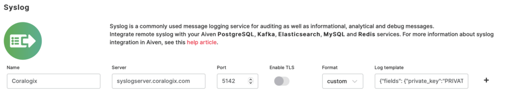

Seamlessly send Coralogix your logs using a [syslog template](https://coralogixstg.wpengine.com/blog/syslog-101-everything-you-need-to-know-to-get-started/) with a custom format.

## Overview

Syslog is a protocol that computer systems use to send event data logs to an external syslog server for storage. Several applications and SaaS services have the ability to send logs using syslog.

For using this kind of integration, use a syslog template with a custom format.



## General

**Private Key**: Your [Send-Your-Data API key](https://coralogixstg.wpengine.com/docs/send-your-data-api-key/) is a unique ID that represents your company.

**Company ID**: A unique number that represents your company. Access your Company ID from the settings tab in your Coralogix dashboard.

**Application Name**: The [name of your main application](https://coralogixstg.wpengine.com/docs/application-and-subsystem-names/). For example, the "SuperData" company might insert the “SuperData” string parameter. If it wants to debug its test environment, it might choose “SuperData– Test”.

**SubSystem Name**: The [name of your subsystem(s)](https://coralogixstg.wpengine.com/docs/application-and-subsystem-names/), such as "backend servers", "middleware", "frontend servers," etc. This is required in order to organize and query your data.

**SyslogEndpoint**: Select one of the following [**Syslog endpoints**](https://coralogixstg.wpengine.com/docs/coralogix-endpoints/) on the basis of your **Coralogix domain**.

## Syslog Template

Create a Syslog template with the following variables modified: PRIVATE\_KEY, COMPANY\_ID, APPLICATION\_NAME, and SUBSYSTEM\_NAME.

```
{"fields": {"private_key":"PRIVATE_KEY","company_id":"COMPANY_ID","app_name":"APPLICATION_NAME","subsystem_name":"SUBSYSTEM_NAME"},"message": {"message":"%msg%"}}

```

## **Support**

**Need help?**

Our world-class customer success team is available 24/7 to walk you through your setup and answer any questions that may come up.

Feel free to reach out to us **via our in-app chat** or by sending us an email at [support@coralogixstg.wpengine.com](mailto:support@coralogixstg.wpengine.com).
