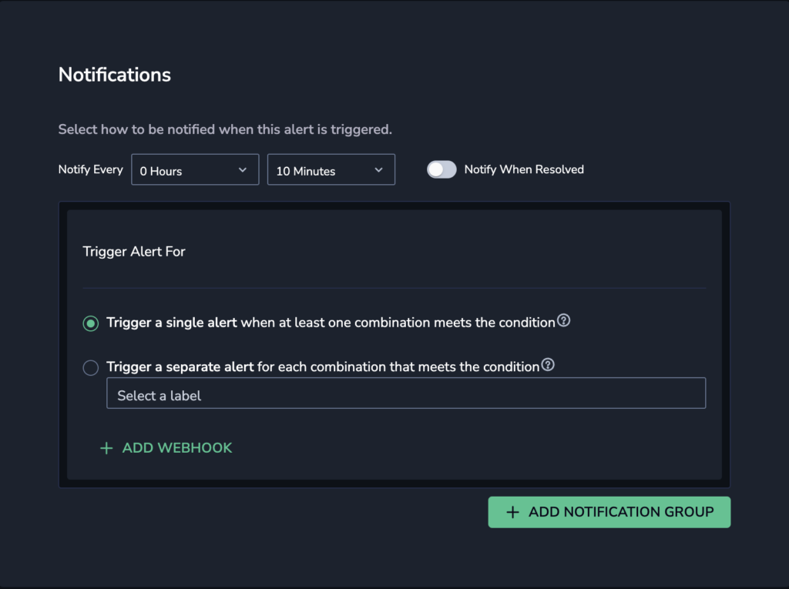

Set up one or more **custom webhooks** to define notification settings for your [metric alerts](https://coralogixstg.wpengine.com/docs/metric-alerts-promql/).

## Set Up a Custom Webhook for Your Metric Alert

### Create a Custom Webhook

**STEP 1**. Create a [generic outbound webhook](https://coralogixstg.wpengine.com/docs/alert-webhooks/) or other custom webhook.

### Define Your Metric Alert Notification Settings

As you create a [metric alert](https://coralogixstg.wpengine.com/docs/metric-alerts-promql/), you must define your alert's **Notifications** settings. You have different options, depending on whether or not you are using the **Group By** condition.

### Using Group By

When using **Group By** conditions, you will see the following options:

- **Trigger a single alert when at least one combination of** the group by values meets the condition. A single notification, aggregating all values matching an alert query and conditions, will be sent to your Coralogix Incidents screen.

- **Trigger a separate alert for each combination that meets the condition**. Multiple individual notifications for each Group By field value may be sent to your Coralogix [Incidents Screen](https://coralogixstg.wpengine.com/docs/incidents/) when query conditions are met. Select one or more keys – consisting of a subset of the fields selected in the alert conditions – in the drop-down menu. A separate notification will be sent for each key selected.

- When grouping by a given Group By field, you **must** group the metric by this field to allow the data to propagate to the $GROUP\_BY\_VALUE\_1 [parameter](https://coralogixstg.wpengine.com/docs/alert-webhooks/#placeholders).

- The number of **Group By** permutations is limited to 1000. If there are more permutations, then only the first 1000 are tracked.

When not using the **Group By** condition, **a single alert will be triggered** and sent to your [Incidents Screen](https://coralogixstg.wpengine.com/docs/incidents/) when the query meets the condition.

### Define Notification Parameters

- **Notify every**. Sets the alert cadence. After an alert is triggered and a notification is sent, the alert will continue to work, but notifications will be suppressed for the duration of the suppression period.

- **Notify when resolved**. Activate to receive an automatic update once an alert has ceased.

- Define additional alert recipient(s) and notification channels by clicking **\+ ADD WEBHOOK**.

## Additional Resources

<table><tbody><tr><td>Documentation</td><td><strong><a href="https://coralogixstg.wpengine.com/docs/metric-alerts-promql/">Metric Alerts</a></strong></td></tr></tbody></table>

## Support

**Need help?**

Our world-class customer success team is available 24/7 to walk you through your setup and answer any questions that may come up.

Feel free to reach out to us **via our in-app chat** or by sending us an email at [support@coralogixstg.wpengine.com](mailto:support@coralogixstg.wpengine.com).
