Coralogix is all about making your life simple. That’s why we put a strong emphasis on a simple and intuitive user experience that provides insights at a glance. An essential part of a great user experience is dashboards and widgets. The right widgets and dashboards are perfect for detecting abnormal activity or keeping an eye on your business KPIs. Widgets can be saved personally or for the entire team. They can be pinned to your dashboard, or to your Coralogix ‘[**Tags**](https://coralogixstg.wpengine.com/tutorials/software-builds-display/)‘ view for maximum control over your system’s performance.

## **Built-in Graphs**

Coralogix comes with some graphs built in, which can be filtered on application and subsystem. In cases where some of the data sources (e.g Tracing, Metrics or Security) have not been configured, you can choose which graphs will be displayed on the dashboard.

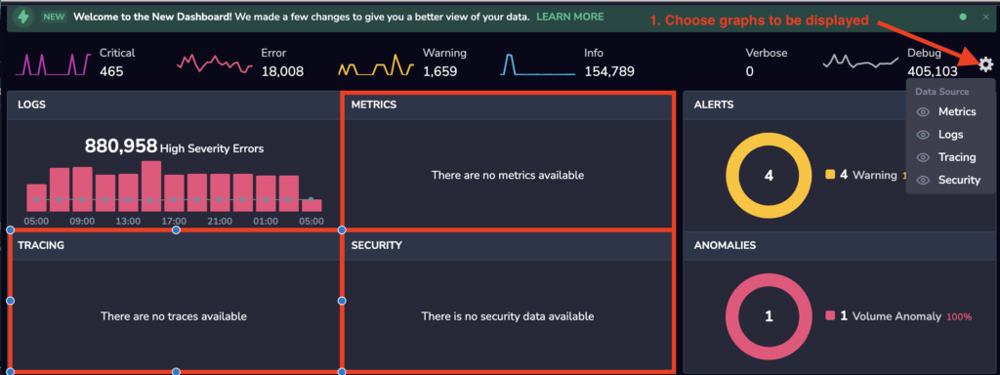

Here is the list of built-in graphs:

- Volume of logs, grouped by severity:

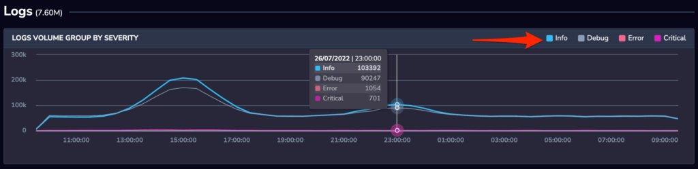

This UI enables you to view your logging volumes, to better understand activity in your system and also highlight when your error rates are increasing.

- High severity errors and errored traces:

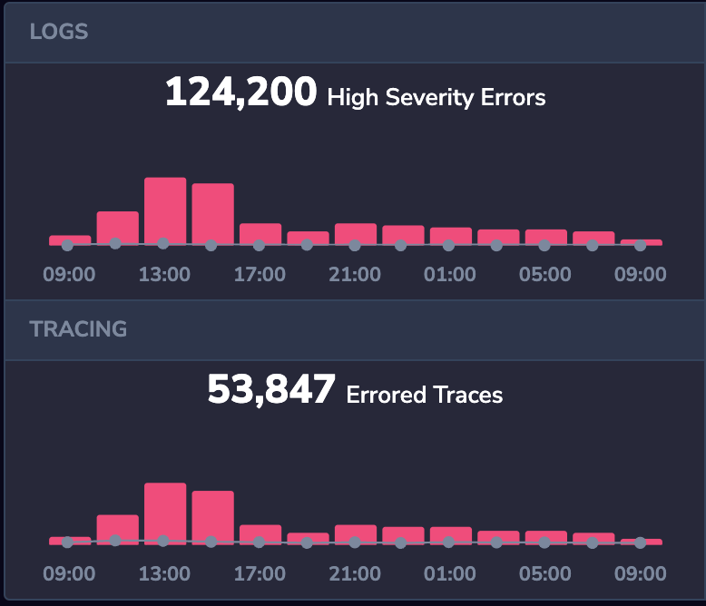

This view helps you to zoom in on the error activity in both your logs and your tracing data. Sudden changes in this view may indicate a breaking change or other system impacting event.

- Metrics Series used:

- High Severity Failed Tests count:

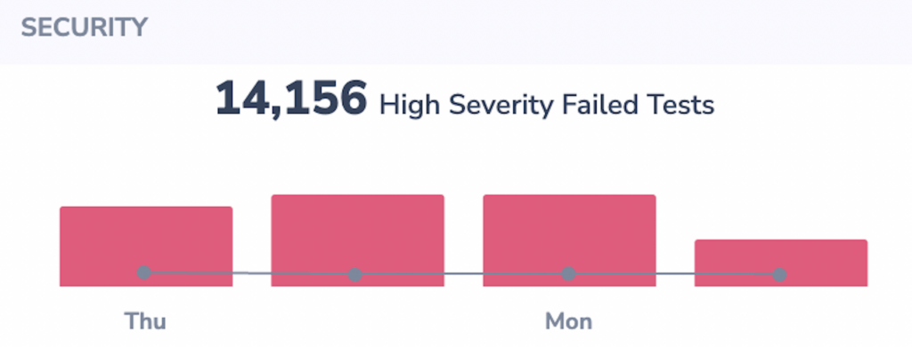

- Triggered Alerts statistics on number of occurrences and overall percentage by their severity:

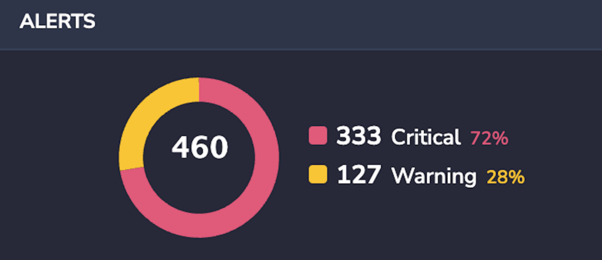

- Anomalies on number of occurrences and overall percentage by their severity:

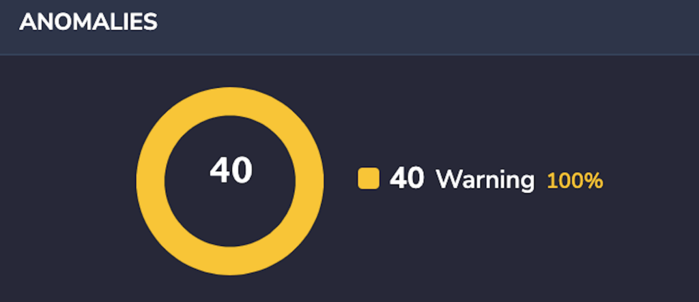

- Triggered Alerts information, where you also have the option of snoozing an alert:

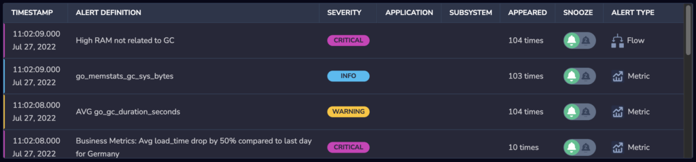

- Top 3 Abnormal Errors that occurred at above their usual occurrence rates or occurred for the first time in this time frame:

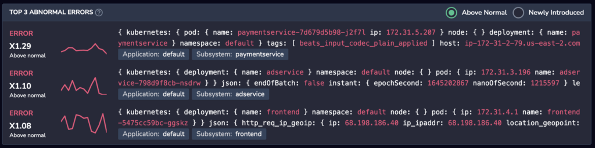

- Top Error rate subsystems where the highest error rates are grouped by application and subsystem:

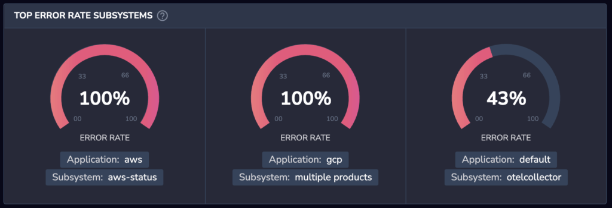

- Tracing section where the graphs breakdown is by actions with the longest duration, how many spans the service produces and errors per service:

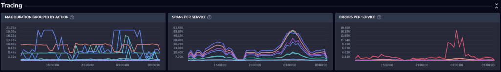

## Filtering and Querying Data

You can filter the data brought up within our default graphs and show only the relevant information to you, by using the Applications and Subsystems filter list:

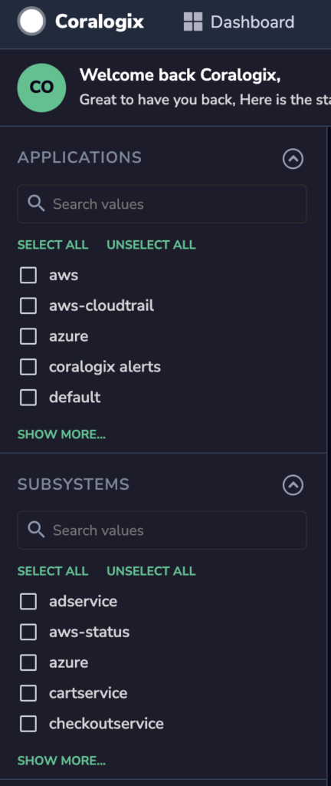

In addition, Coralogix provides a simple and intuitive interface for creating your dashboard widgets, on queries, patterns, or even parameters within log patterns.

You can  also select a timeframe from the UI, to further filter your data:

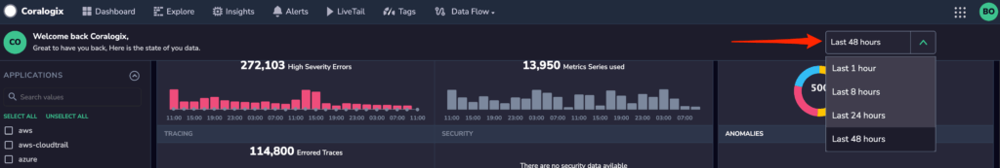

## Add New Widgets

### Query-Based Widgets

To define a new query-based widget, follow these 3 simple steps:

1) Click the Explore icon on your dashboard:

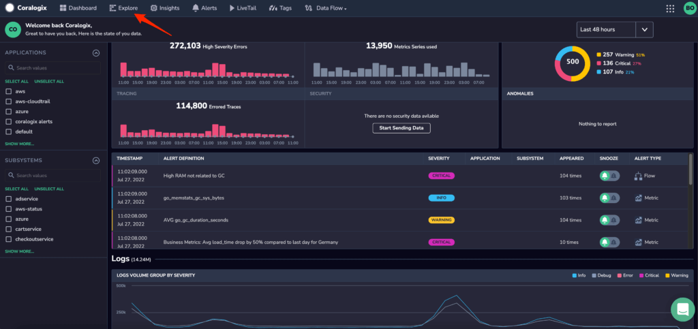

2) Run a query according to the graph you want to create (e.g IP\_geoip.postal\_code:"20149" AND coralogix.metadata.severity:5):

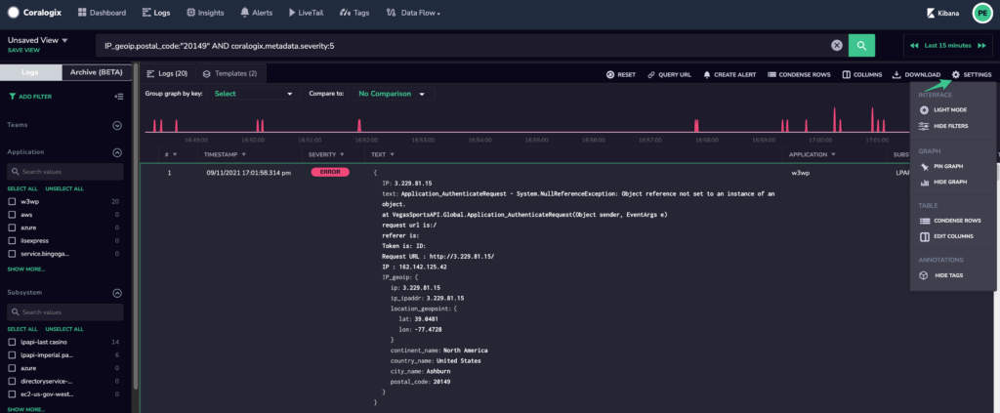

3) Click Settings - Pin Graph, then give your widget a name and description. Choose whether to submit your widget straight to your Main Dashboard or the Tag Reports, and choose the timeline. Click Create. That's it!

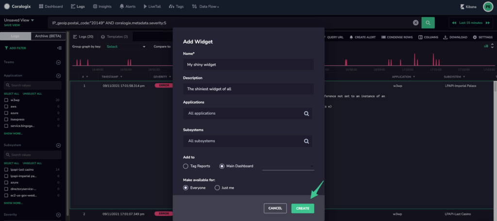

### Pattern-Based Widgets

You can use Coralogix [Templates](https://coralogixstg.wpengine.com/tutorials/what-is-coralogix-loggregation/) to define powerful widgets on specific log patterns in just seconds:

1) Run a query according to the filters you want to apply and click the "Templates" tab:

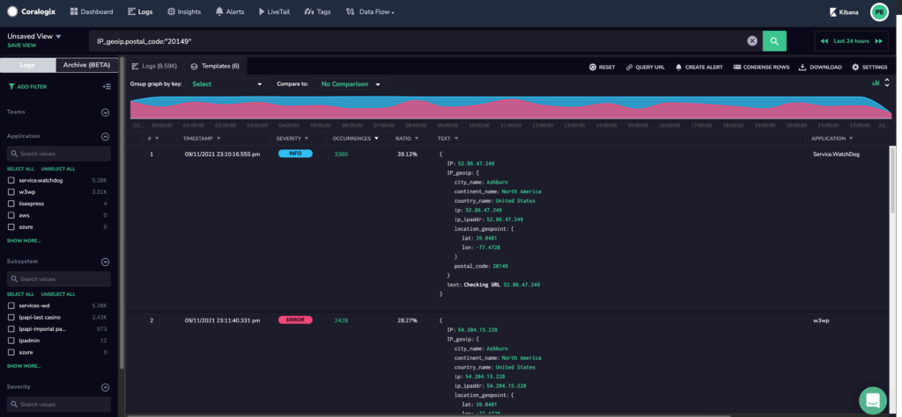

2) Click the number in the "Occurrences" column, this is the number of occurrences for a pattern in the query timeframe:

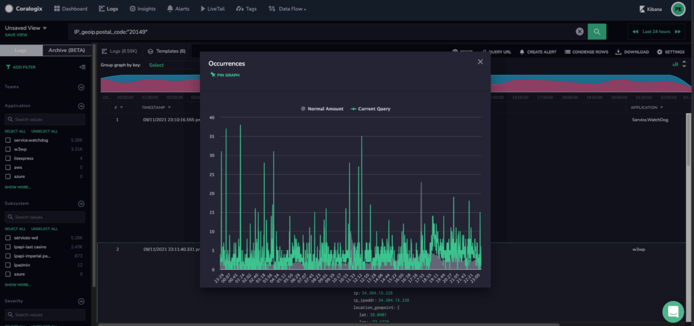

\*Notice that you have two values here, 1 (green) is the number of occurrences for that pattern per minute in the current query timeframe and the second (gray) is the normal behavior of that pattern for that day and hour as learned by Coralogix for the past 2 weeks.

3) Click "Pin Graph" in the top left corner, to give your new widget a name, description, timeframe, and the ability to submit it to your Main Dashboard:

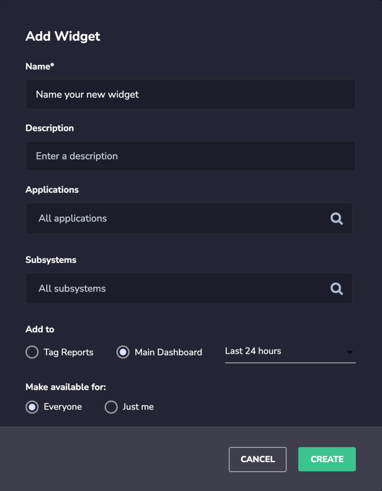

### Parameter-Based Widgets

1) Run a query according to the filters you want to apply and click the "Templates" tab:

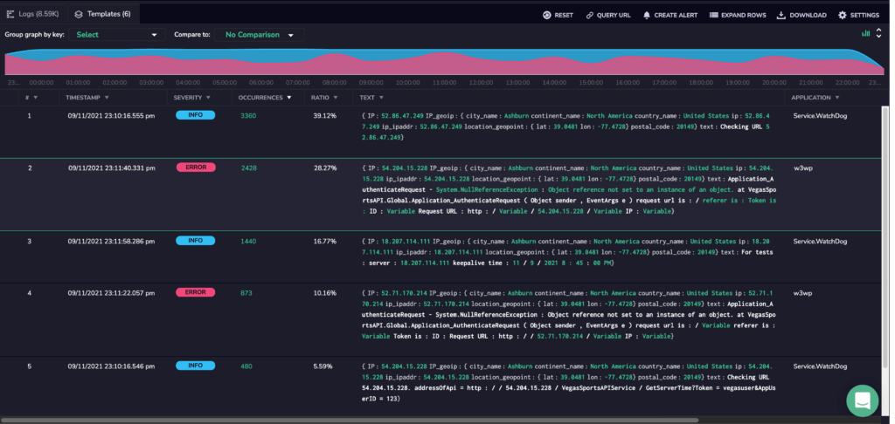

2) Click a parameter within a log pattern (parameters can be categorical, numeric or free, determined by Coralogix’s algorithm)

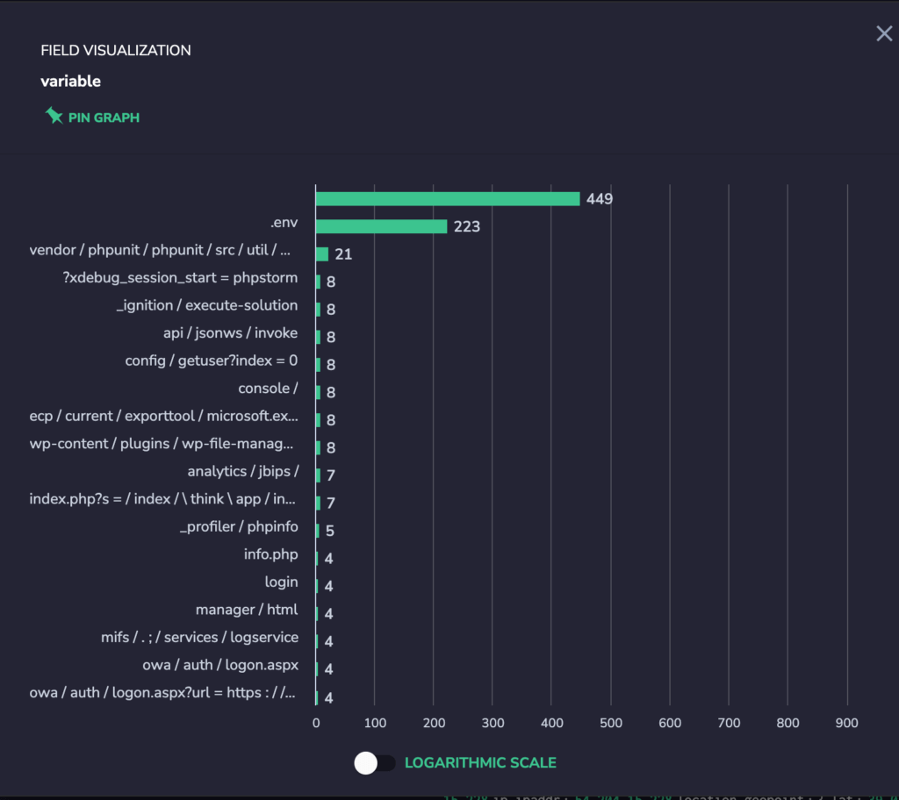

3) Click "Pin Graph" in the top left corner, to give your new widget a name, description, timeframe, and submit it to your Main Dashboard:

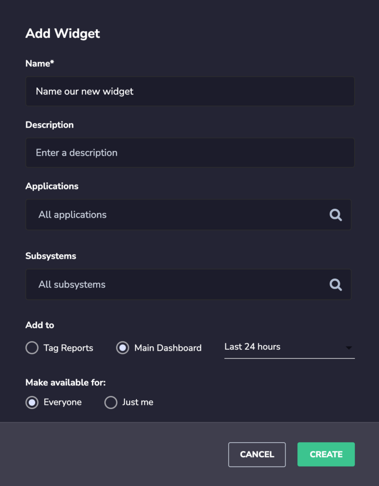

### JSON Value Widget 

Coralogix automatically parses JSON format logs to allow you an easier view, smart filtering, and super simple widgets definition.

1) Click to select a JSON formatted log, and press the 'space' bar. 

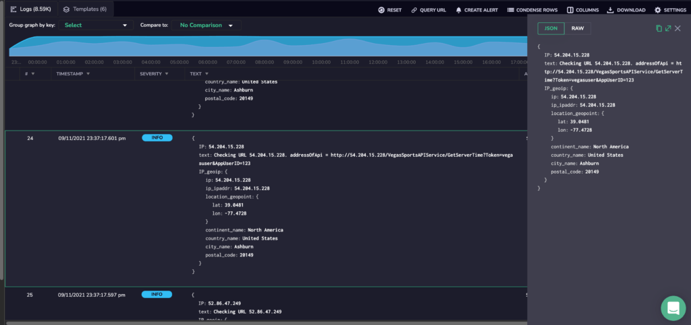

2) Hover over a JSON value and click it. Then select "Show Graph for Key": 

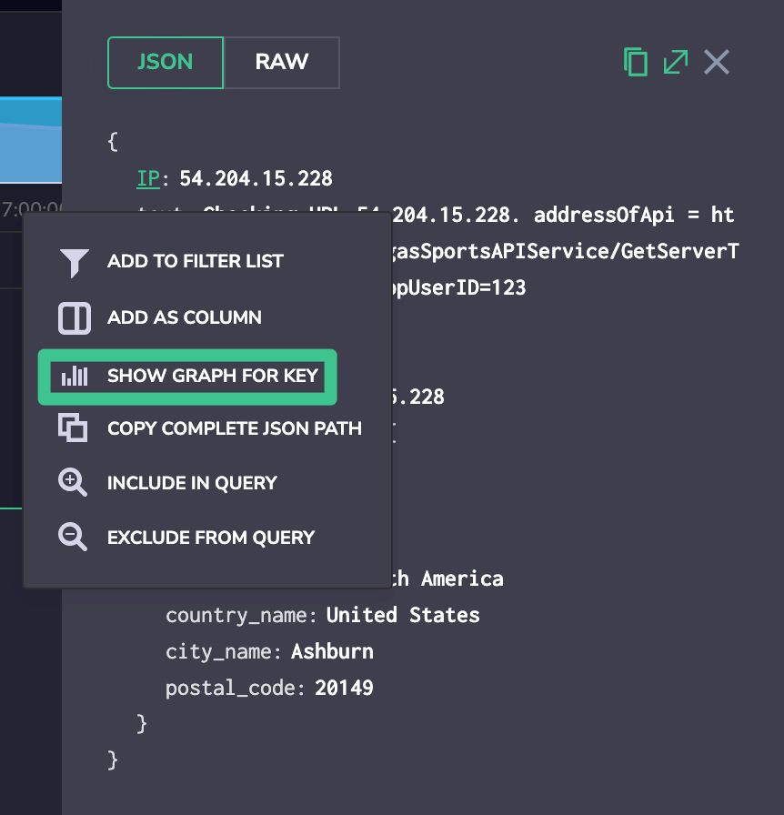

3) Click "Pin Graph" on the top left of the graph to send this field visualization to your Main Dashboard: 

**To make the best of Coralogix, you are welcome to [schedule your demo](#marketoModalForm-demo) and we’ll walk you through all you need to know, step by step, to make you a production monster.**
