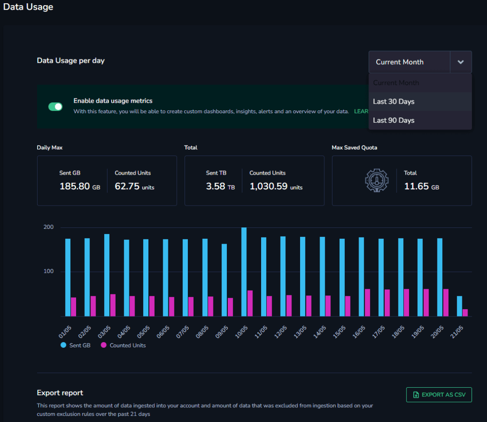
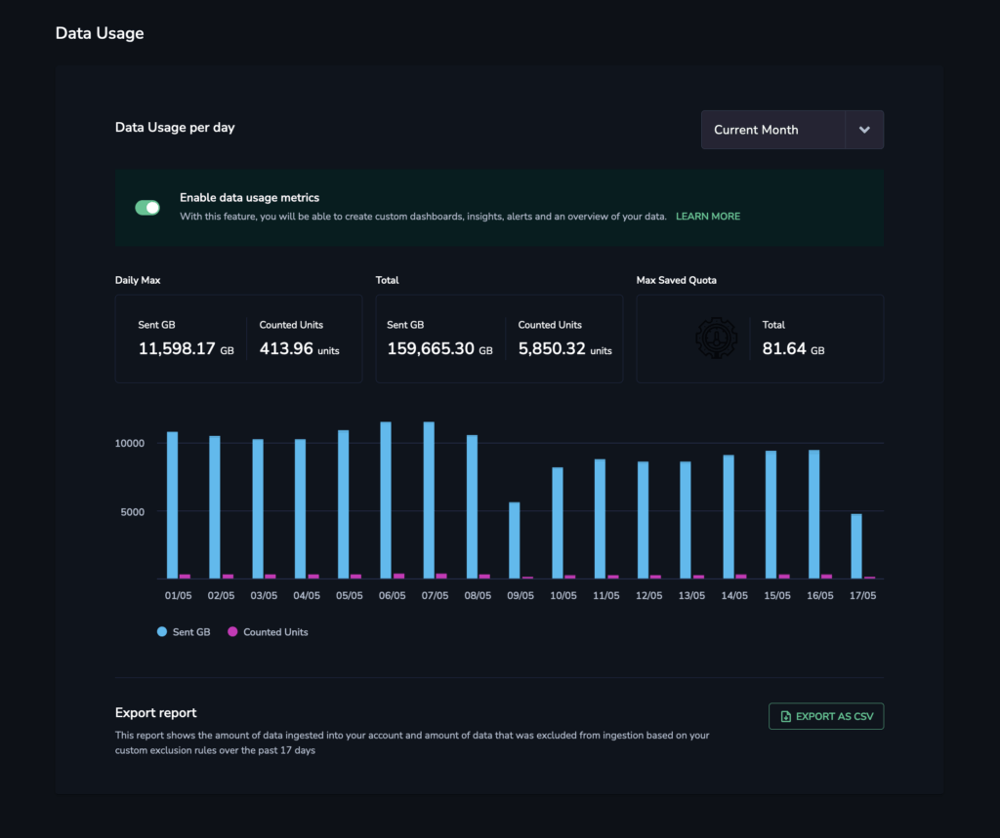

View your **Data Usage Report** to receive an overview of your account usage for the previous 90 days.

View your **Detailed Data Usage Report** to receive an overview of all data sent, per policy, for either the current month or retroactively 30 or 90 days.

Access both by clicking **Settings** > Data Usage in your navigation pane.

## Data Usage Report

### Overview

The Data Usage Report includes:

- **Usage chart**. This includes two usage columns, with the green column presenting the actual amount of data sent per day and the purple column presenting the units for which you've been charged per day in conformity with your [TCO Optimizer settings](https://coralogixstg.wpengine.com/tutorials/optimize-log-management-costs/).

- **DAILY MAX**. The day in which the largest amount of data was sent.

- **TOTAL.** The sum of all days.

- **MAX SAVED**. Total data sent minus the total amount of counted units for a given period - 90 days, 30 days, or the current month.

Hover over any day to view a tooltip that includes information on the actual GB sent for each type of priority category and how many counted units it is worth.

**Notes**:

- Units available per day are equal to your team’s daily quota or maximum daily usage (if all your data is assigned as HIGH priority). This is the default setting for any set of logs or traces unless it is modified in the [TCO Optimizer](https://coralogixstg.wpengine.com/tutorials/optimize-log-management-costs/).

<table><tbody><tr><td class="has-text-align-left" data-align="left"><strong>Logs Priority</strong></td><td><strong>Sent data</strong></td><td><strong>Units</strong></td></tr><tr><td class="has-text-align-left" data-align="left"><meta charset="utf-8">HIGH (Frequent search)</td><td>1 GB</td><td><meta charset="utf-8">0.75</td></tr><tr><td class="has-text-align-left" data-align="left"><meta charset="utf-8">MEDIUM (Monitoring)</td><td><meta charset="utf-8">1 GB</td><td><meta charset="utf-8">0.32</td></tr><tr><td class="has-text-align-left" data-align="left"><meta charset="utf-8">LOW (Compliance)</td><td><meta charset="utf-8">1 GB</td><td><meta charset="utf-8">0.12</td></tr><tr><td class="has-text-align-left" data-align="left"><meta charset="utf-8">BLOCK</td><td><meta charset="utf-8">1 GB</td><td><meta charset="utf-8">0.065</td></tr><tr><td class="has-text-align-left" data-align="left"><meta charset="utf-8">METRICS</td><td>30 GB</td><td>1</td></tr></tbody></table>

<table><tbody><tr><td class="has-text-align-left" data-align="left"><strong>Traces Priority</strong></td><td><strong>Sent data</strong></td><td><strong>Units</strong></td></tr><tr><td class="has-text-align-left" data-align="left"><meta charset="utf-8">HIGH (Frequent search)</td><td>1 GB</td><td><meta charset="utf-8">0.5</td></tr><tr><td class="has-text-align-left" data-align="left"><meta charset="utf-8">MEDIUM (Monitoring)</td><td><meta charset="utf-8">1 GB</td><td><meta charset="utf-8">0.25</td></tr><tr><td class="has-text-align-left" data-align="left"><meta charset="utf-8">LOW (Compliance)</td><td><meta charset="utf-8">1 GB</td><td><meta charset="utf-8">0.1</td></tr></tbody></table>

- In the example above, 185.80 units were sent, but the customer - whose plan quota is 300 units - is only charged for 62.75 units given his / her TCO Optimizer settings.

- Data blocked is also presented as "counted units”, with the charge 8% - the cost of the network traffic ingest.

- Current day information is not updated live.

### Export Your Data Usage Report

Export the Data Usage Report as a CSV file.

**STEP 1.** In the navigation bar, click **Settings** \> **Data Usage**.

**STEP 2.** Click **Export as CSV**.

**STEP 3.** Select the **Data Usage Overview Report** type.

**STEP 4.** Select the time range (either **Current Month**, **Last 30 days**, or **Last 90 days**).

**STEP 5.** Click **EXPORT**.

## Detailed Data Usage Report

### Overview

The Detailed Data Usage Report shows you all data sent, per policy, for either the current month or retroactively 30 or 90 days. Use our [Data Usage Service API](https://coralogixstg.wpengine.com/docs/data-usage-service-api/) in support of this feature.

When exported as a CSV file, it includes the following details:

- Date

- Application

- Subsystem

- Severity

- TCO Priority (if applicable)

- Type (logs, spans or metrics)

- GB sent

- Units sent

<figure>

<figcaption>

Example of an exported CSV file including logs, metrics and traces (spans).

</figcaption>

</figure>

This enables you to see for each policy on a daily basis which TCO priority it was sent to, how much data was ingested, and how many units were used in practice for that policy. The report also contains the daily metric and traces usage for the policy, which is sent once a day.

### Export Your Detailed Data Usage Report

Export the Detailed Data Usage Report as a CSV file.

**STEP 1.** In the navigation bar, click **Settings** \> **Data Usage**.

**STEP 2.** Click **Export as CSV**.

**STEP 3.** Select the **Detailed Usage Report** type.

**STEP 4.** Select the time range (either **Current Month**, **Last 30 days**, or **Last 90 days**).

**STEP 5.** Click **EXPORT**.

## Enabling Data Usage Metrics

Enable **[Data Usage Metrics](https://coralogixstg.wpengine.com/docs/data-usage-metrics/)** for an added layer of granularity in your data usage overview. Use this feature to create custom dashboards, insights, alerts, and useful summaries of your data. Find out more [here](https://coralogixstg.wpengine.com/docs/data-usage-metrics/).

## Additional Resources

<table><tbody><tr><td><strong>Documentation</strong></td><td><a href="https://coralogixstg.wpengine.com/docs/data-usage-metrics/">Data Usage Metrics</a></td></tr><tr><td><strong>API</strong></td><td><a href="https://coralogixstg.wpengine.com/docs/data-usage-service-api/">Data Usage Service API</a></td></tr></tbody></table>

## **Support**

**Need help?**

Our world-class customer success team is available 24/7 to walk you through your setup and answer any questions that may come up.

Feel free to reach out to us **via our in-app chat** or by sending us an email at [support@coralogixstg.wpengine.com](mailto:support@coralogixstg.wpengine.com).
