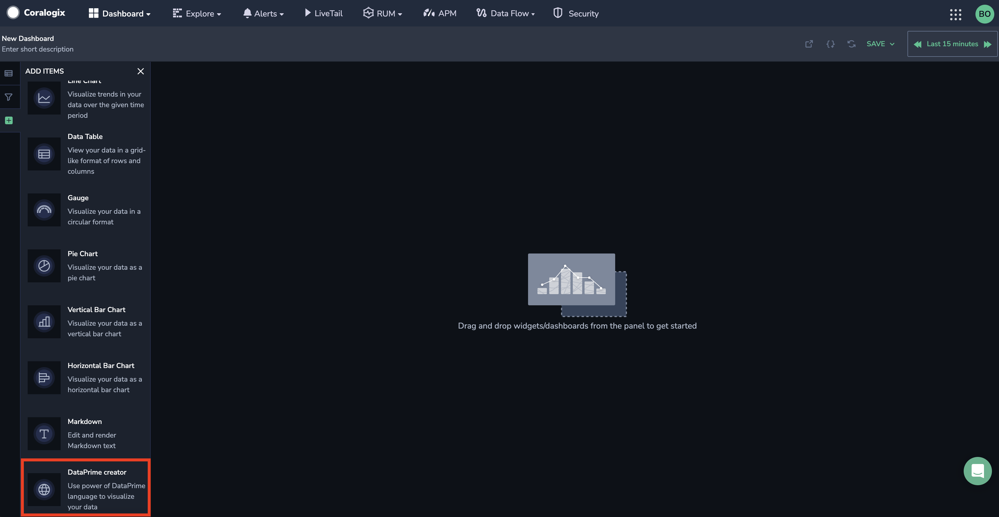

Leverage the capabilities of DataPrime queries in Custom Dashboards using the **DataPrime Widget**.

## Overview

Coralogix's innovative [DataPrime](https://coralogixstg.wpengine.com/docs/dataprime-cheat-sheet/) language empowers you to query your data and transform it through various operations tailored to your specific needs, such as calculation, extraction, and aggregation.

In [Custom Dashboards](https://coralogixstg.wpengine.com/docs/custom-dashboards/), the DataPrime Widget enables you to harness the capabilities of DataPrime queries. As your query evolves, this feature automatically generates optimal visualizations to display your data and suggests modifying your query for additional visualizations.

## Create a DataPrime Widget

**STEP 1**. In a [custom dashboard](https://coralogixstg.wpengine.com/docs/custom-dashboards/), drag and drop the **DataPrime Widget** from your left-hand sidebar to get started.

A data table will appear in the top panel of the widget, while the DataPrime query will appear in the bottom panel.

**STEP 2.** Construct your [DataPrime query](https://coralogix.com/docs/dataprime-cheat-sheet/). As your query evolves, select from a list of visualizations supporting your query results - [horizontal](https://coralogix.com/docs/horizontal-bar-charts/) or [vertical bar chart](https://coralogix.com/docs/custom-dashboards-bar-charts/), [line chart](https://coralogix.com/docs/custom-dashboards-line-charts/), [gauge](https://coralogix.com/docs/custom-dashboards-gauges/), or [pie chart](https://coralogix.com/docs/custom-dashboards-pie-charts/) - in the right-hand column. Hover over faded visualizations to receive suggestions on modifying your query, enabling you to achieve the desired visualization.

**STEP 3.** Fill in the remaining fields in the right-hand column.

**STEP 4.** \[**Optional**\] If you want to save your dashboard with the new widget, click **SAVE** in the upper right-hand corner.

At any stage, view the raw data of the query by clicking **RAW DATA** on the toolbar of the query pane.

<table><tbody><tr><td>Documentation</td><td><strong><a href="https://coralogixstg.wpengine.com/docs/custom-dashboards/">Custom Dashboards</a></strong> <strong><a href="https://coralogixstg.wpengine.com/docs/dataprime-cheat-sheet/">DataPrime Cheat Sheet</a></strong></td></tr></tbody></table>

## Support

**Need help?**

Our world-class customer success team is available 24/7 to walk you through your setup and answer any questions that may come up.

Contact us **via our in-app chat** or by emailing [support@coralogixstg.wpengine.com](mailto:support@coralogixstg.wpengine.com).
