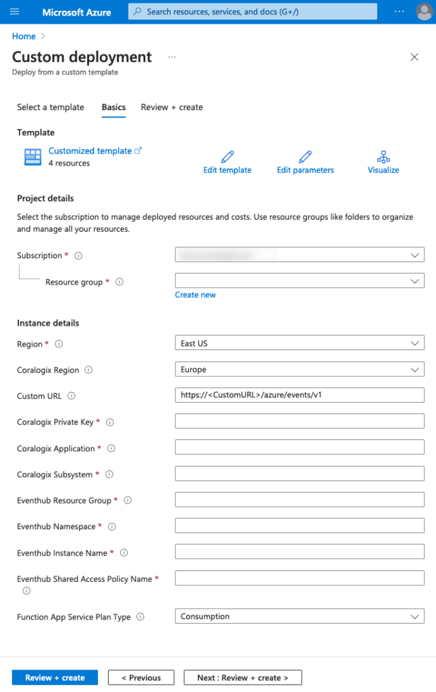

Coralogix provides a seamless integration with Azure cloud, allowing you to send your logs from anywhere and parse them according to your needs.

The Azure Diagnostic Data integration allows processing of logs and metrics submitted to an Event Hub using the resource diagnostic settings configuration.

## Prerequisites

- Azure account with an active subscription

## Azure Resource Manager Template Deployment

Sign in to your Azure account and deploy the Diagnostic Data integration by clicking [here](https://portal.azure.com/#create/Microsoft.Template/uri/https%3A%2F%2Fraw.githubusercontent.com%2Fcoralogix%2Fcoralogix-azure-serverless%2Fmaster%2FDiagnosticData%2FARM%2FDiagnosticData.json).

**Notes**:

- Newly configured diagnostic settings can take [up to 90 minutes](https://learn.microsoft.com/en-us/azure/azure-monitor/essentials/diagnostic-settings?tabs=portal#time-before-telemetry-gets-to-destination) to begin submission of data to the configured Event Hub.

- Due to the varying formats of metrics generated by Azure, some metrics may not be supported.

## Fields

<table><tbody><tr><td><strong>Field</strong></td><td><strong>Description</strong></td></tr><tr><td><strong>Subscription</strong></td><td>Azure subscription for which you wish to deploy the integration. Must be the same as the monitored storage account.</td></tr><tr><td><strong>Resource Group</strong></td><td>Resource group into which you wish to deploy the integration</td></tr><tr><td><strong>Coralogix Region</strong></td><td>Region associated with your&nbsp;<a href="https://coralogixstg.wpengine.com/docs/coralogix-domain/"><strong>Coralogix domain</strong></a></td></tr><tr><td><strong>Custom URL</strong></td><td>Custom URL associated with your Coralogix account. Ignore if you do not have a custom URL.</td></tr><tr><td><strong>Coralogix Private Key</strong></td><td>Coralogix&nbsp;<a href="https://coralogixstg.wpengine.com/docs/send-your-data-api-key/">Send-Your-Data API key</a></td></tr><tr><td><strong>Coralogix Application</strong></td><td>Mandatory&nbsp;<a href="https://coralogixstg.wpengine.com/docs/application-and-subsystem-names/"><strong>metadata field</strong></a>&nbsp;sent with each log and helps to classify it</td></tr><tr><td><strong>Coralogix Subsystem</strong></td><td>Mandatory&nbsp;<a href="https://coralogixstg.wpengine.com/docs/application-and-subsystem-names/"><strong>metadata field</strong></a>&nbsp;sent with each log and helps to classify it</td></tr><tr><td><strong>Event Hub Resource Group</strong></td><td>Name of the resource group that contains the Event Hub</td></tr><tr><td><strong>Event Hub Instance Name</strong></td><td>Name of the Event Hub instance to be monitored</td></tr><tr><td><strong>Event Hub Shared Access Policy Name</strong></td><td>Name of a shared access policy of the Event Hub namespace</td></tr><tr><td><strong>Function App Service Plan Type</strong></td><td>Type of service plan to use for the integration Consumption is cheapest with support for 'public' Event Hubs. Use Premium if you need to use VNet to configure access to restricted EventHubs.</td></tr></tbody></table>

## Optional Configuration Options

If your Event Hub has restricted access, review our [optional configuration documentation](https://coralogixstg.wpengine.com/docs/optional-configurations-microsoft-azure/) to learn about VNet Support options.

## Additional Resources

<table><tbody><tr><td><strong>Microsoft Azure Functions</strong>&nbsp;<strong>Manual Integrations</strong></td><td><strong><a href="https://coralogixstg.wpengine.com/docs/azure-eventhub-trigger-function/">Event Hub</a> <a href="https://coralogixstg.wpengine.com/docs/queue-storage-microsoft-azure-functions/">Queue Storage</a> <a href="https://coralogixstg.wpengine.com/docs/blobstorage-microsoft-azure-functions/">Blob Storage</a></strong></td></tr></tbody></table>

## **Support**

**Need help?**

Our world-class customer success team is available 24/7 to walk you through your setup and answer any questions that may come up.

Feel free to reach out to us **via our in-app chat** or by sending us an email at **[support@coralogixstg.wpengine.com](mailto:support@coralogixstg.wpengine.com)**.
