Coralogix has created a unique tracing experience, allowing you to observe and gain instant insights into your modern micro-services infrastructure. Use our updated **Tracing** function, alongside **Logs** and **Templates**, to enjoy powerful data visualization of your traces and spans.

Enjoy distributed tracing using our **Tracing** function. Optimize performance, troubleshoot bottlenecks, monitor latency, and link traces to logs in an improved visual format.

## What is Tracing?

Tracing refers to the ability to trace the flow of a request or transaction through a system. Tracing provides a detailed view of how a request moves through various components of a system, helping to identify bottlenecks and performance issues and understand the overall system behavior.

Traces are made up of spans. A span represents a unit of work in a trace. It encapsulates information about a specific operation within the system, such as a method call or an HTTP request. Spans have a start time and duration and may contain additional metadata.

## Query Traces & Spans

To access our **Tracing** function:

**STEP 1.** From the Coralogix navigation toolbar, click **Explore** > **Tracing**.

**STEP 2.** Choose whether you want to view spans or traces by clicking the **SPANS**/**TRACES** button in the toolbar. View only Frequent Search (high priority) data or data of all [priority levels](https://coralogixstg.wpengine.com/docs/tracing-tco-optimizer/) (Frequent Search, Monitoring, and Archive).

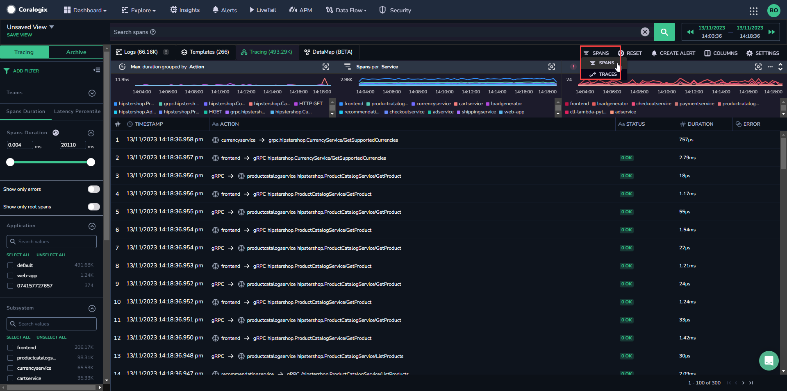

**STEP 3**. Search for traces/spans of interest with the relevant filters. Use Lucene or [DataPrime](https://coralogixstg.wpengine.com/docs/dataprime-cheat-sheet/) to query your spans.

**Notes**:

- When viewing traces, we will present the 50 latest traces that meet your specified filter criteria. Each displayed row is a trace, which may have multiple spans within it.

- When viewing spans, 15,000 rows are displayed in either ascending or descending order based on the timestamp. Each row is a single span.

- Hover over the trace or span number and click the ellipsis that appears to visualize the data, copy the ID, view the raw span, or export as a JSON or CSV file.

## Filter

On the left-hand sidebar, you will find the following default filters:

- **[Application & Subsystem](https://coralogixstg.wpengine.com/docs/application-and-subsystem-names/)**

- **Action**

- **Service**

- **Duration.** The **Duration** filter allows you to find traces that last a long time or are within a certain min-max range that you can easily define, either by adjusting the double range slider from each side or by inputting the exact time in milliseconds in the start-end boxes above the slider.

- **Teams.** When a user is a member of multiple teams, they can search for a trace across multiple teams in a single action. The list of teams will be displayed under the **Teams** filter.

Once you have added all of the relevant filters, click APPLY.

## Save Your Traces View

If you would like to use the same filters and column order in the future:

**STEP 1.** Click **SAVE VIEW** at the top of the grid.

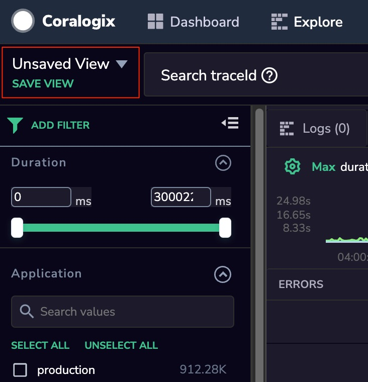

**STEP 2.** Enter a name for your new view.

**STEP 3.** Select whether you want to keep the view private or share it with your team.

**STEP 4.** Select whether you would also like to save the query parameters.

**STEP 5.** Select if you want to set this as your default view.

**STEP 6.** To access your saved views or your team’s public views, click **SAVE VIEW**. Once the View Menu pops up, scroll down and click on the name of your view. You can toggle between ‘**All views**’/’**My views**’, or search views by text.

**Note:** When you save the view, you save the view for the Logs and Tracing tabs at the same time.

## Aggregation Function

In the tracing screen, the graphs in the top section give you the ability to calculate statistics using any of the supported arithmetic options: Count, AVG, MIN, MAX SUM and Percentiles (50th / 95th / 99th). You have the option of Grouping by: Application, Subsystem, Service and Action.

The tracing screen has 3 default graphs:

- **Max Duration** grouped by **Action**:

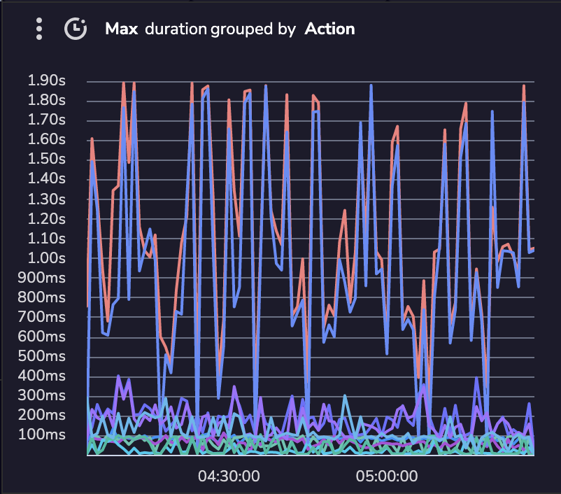

- **Spans** (count) grouped by **Application**:

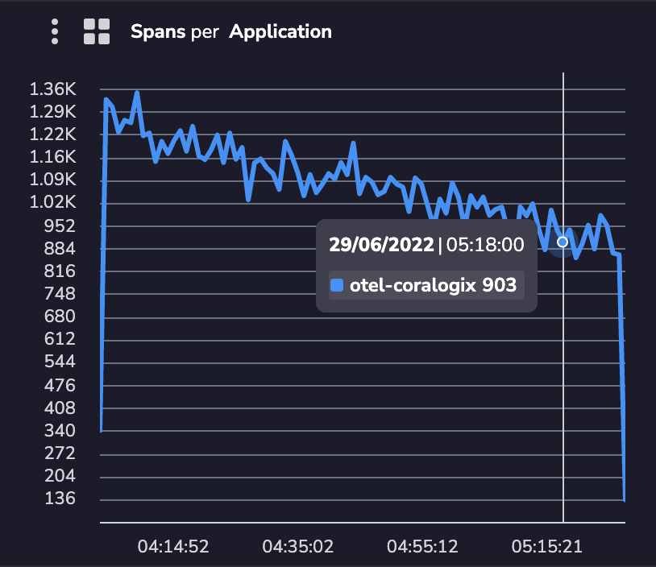

- **Errors** (count) grouped by **Service**:

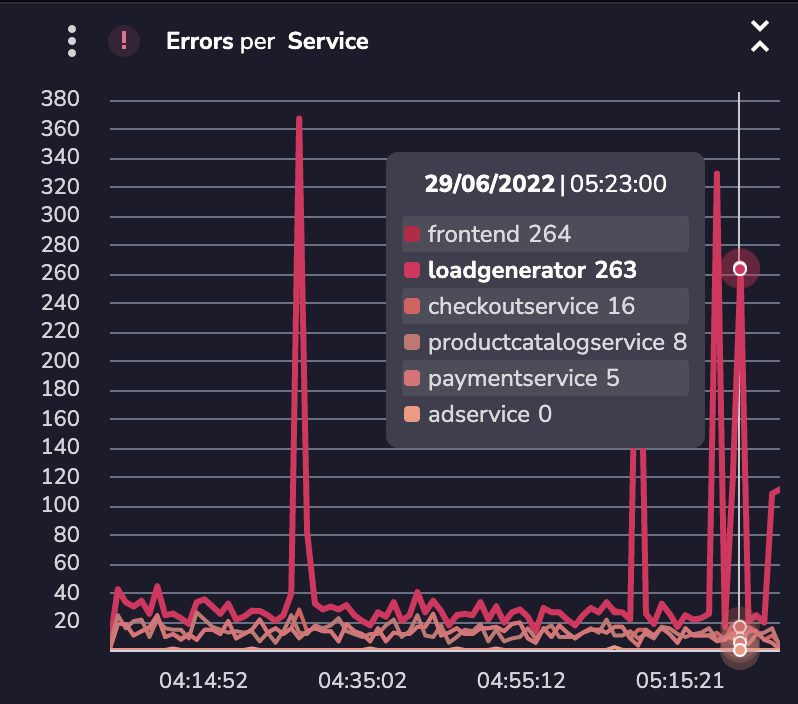

Choosing any aggregation other than Count will change the Y scale units of the graph into milliseconds.

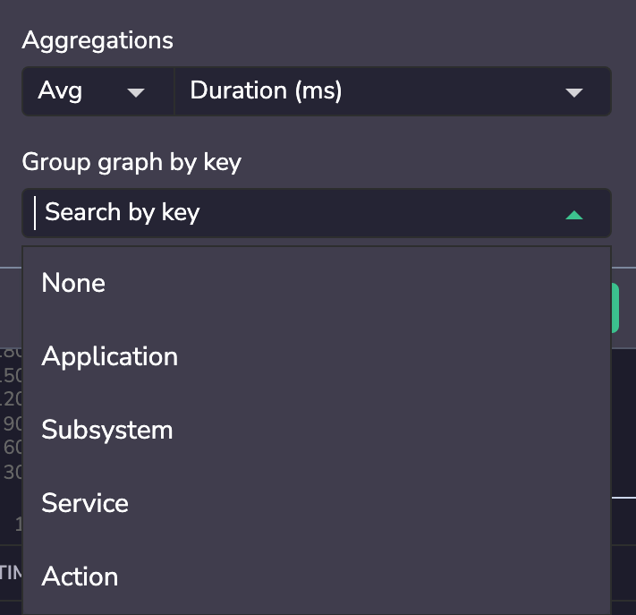

## Visualize Spans

Click on a trace of interest to view its underlying spans.

Select your preferred visualization mode—**Dependencies**, **Flame**, or **Gantt** view—to explore varied views of the span data.

- The top toolbar of the trace shows details of the number of services represented, the span depth, total spans, the number of events that occurred, and the date and total length of the span.

- Hovering over SERVICES shows you the execution time for each service. This lets you see which services are taking up more or less time within the trace.

- The right-hand pane presents:
    - **Span Drill-Down.** Access the span name, operation name, application, service, duration, subsystem, and status in the **Span** pane. If your span contains actions (such as an HTTP request or DB action), an overview of these actions will also appear in this pane.
    
    - **Events.** View all span events in this pane.
    
    - **Resources.** View Kubernetes information here.

### Dependencies View

Choose Dependencies View to view a mapping of span trajectory for your trace.

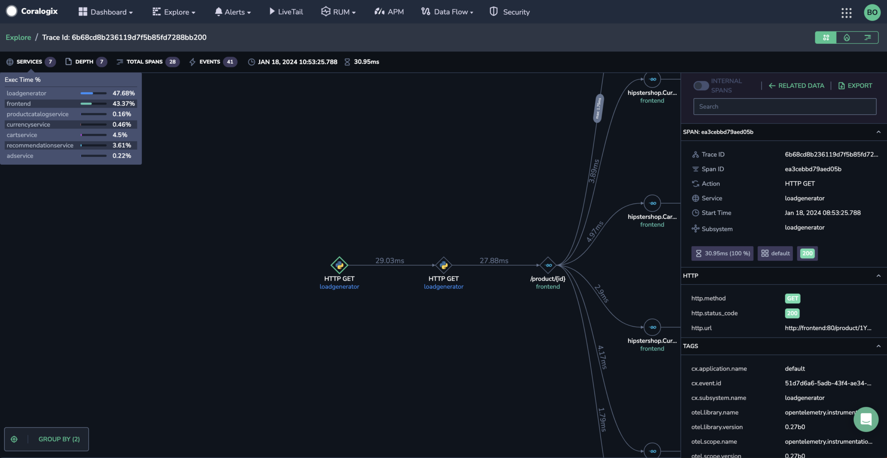

Hover over a span action to view the service name, along with its operation name, application, duration, and subsystem.

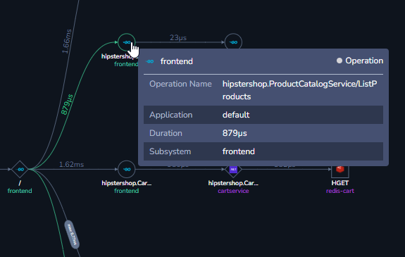

Click on a span link to view all of the occurrences and their respective durations.

Select a tag to group by from the GROUP BY menu in the bottom left-hand corner of the screen. When you select tags to group by, you must also select the aggregation type (min, max, avg, sum).

### Flame View

Flame view displays you trace’s spans as horizontally stacked rectangles, visually representing their duration and relationships within a trace.

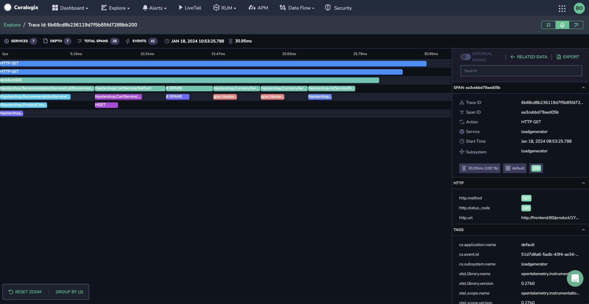

### GANTT View

Gantt view presents spans as horizontal bars along a timeline, visually representing their timing and relationships within a trace.

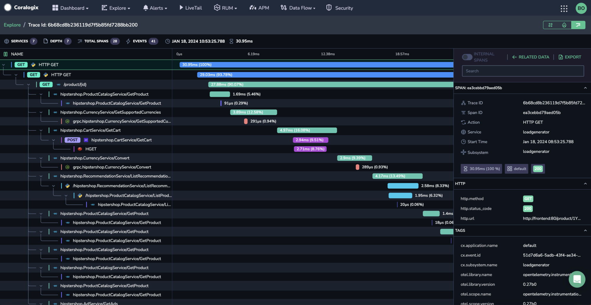

## APM Features

Choose RELATED DATA in your **Overview** Pane to access our [APM](https://coralogixstg.wpengine.com/docs/apm/) features: related logs, events, pod, and host.

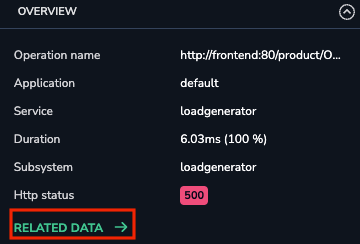

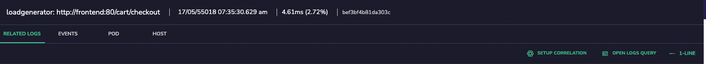

**Pairing Spans with Related Logs**

Define the mapping between the trace spans to the related logs by accessing the RELATED LOGS sub-screen and clicking **Setup Correlation**. This will open a menu where you will be able to add the relevant field containing the span ID.

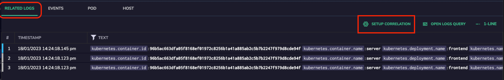

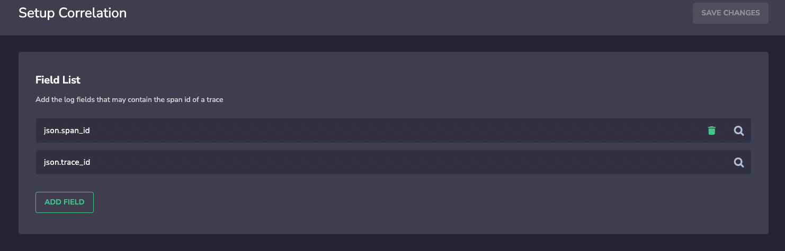

Use the POD feature to enjoy additional visualized information.

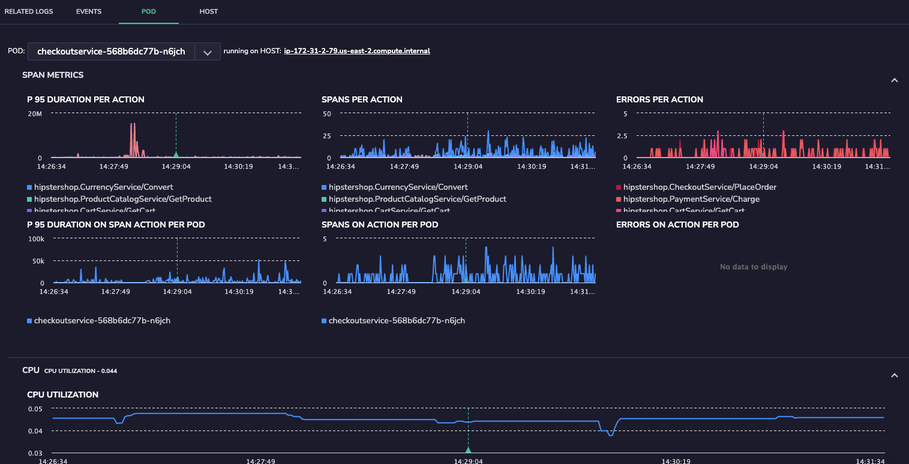

Use the HOST feature to explore host performance.

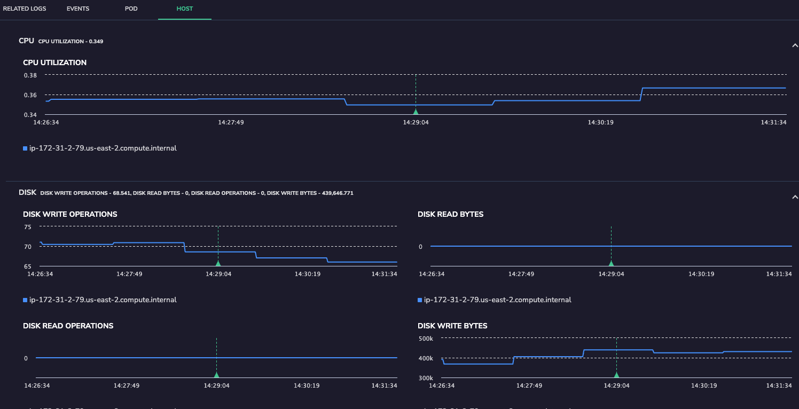

There is also the option to be redirected to the relevant logs by clicking on Open Logs Query. This will direct you to a Logs screen, showing you the log containing the correlated span ID.

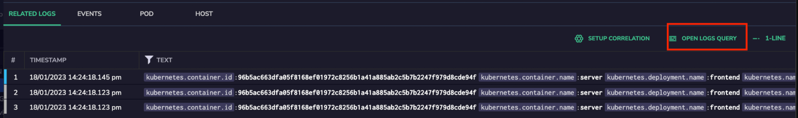

## Additional Resources

<table><tbody><tr><td>Documentation</td><td><strong><a href="https://coralogixstg.wpengine.com/docs/apm/">Application Performance Monitoring (APM)</a></strong> <strong><a href="https://coralogixstg.wpengine.com/docs/opentelemetry-tracing/">OpenTelemetry</a></strong></td></tr></tbody></table>

## Support

**Need help?**

Our world-class customer success team is available 24/7 to walk you through your setup and answer any questions that may come up.

Feel free to reach out to us **via our in-app chat** or by emailing [support@coralogixstg.wpengine.com](mailto:support@coralogixstg.wpengine.com).
